# 정렬

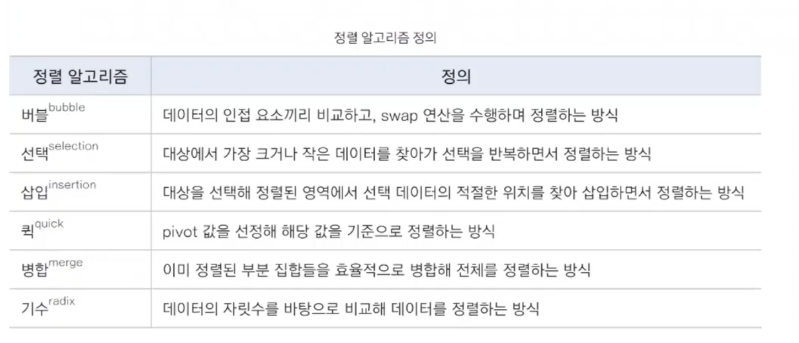

## 버블 정렬

데이터의 인접 요소끼리 비교하고 swap연산으로 정렬

O(n^2)

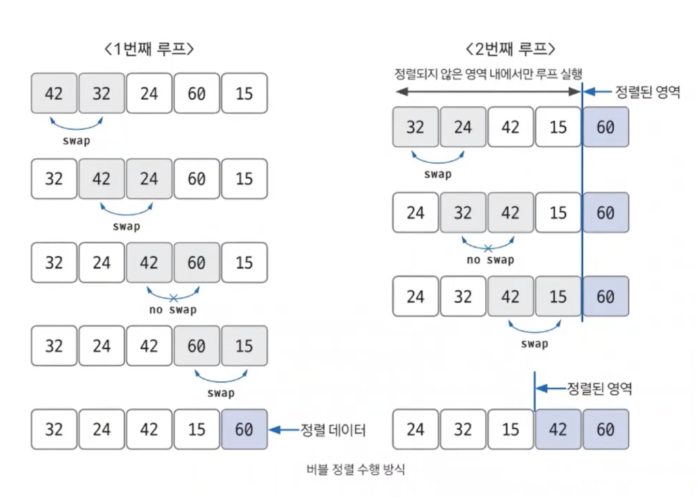

> 루프 하나 돌 때마다 값이 끝에서 픽스된다. 

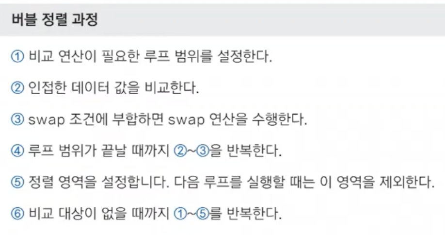

만약 특정 루프의 전체 영역에서 swap이 한번도 발생하지 않았다?
== 데이터가 모두 정렬됐다! == 프로세스 종료해도 된다!

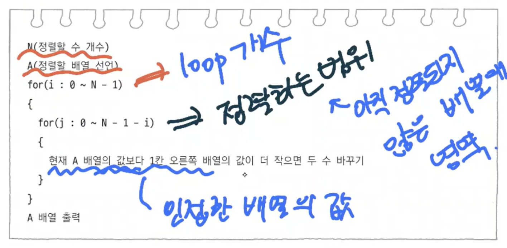› 

# 선택 정렬

대상 데이터에서 최소값 또는 최대값을 찾고, 남은 정렬 부분의 가장 앞에 있는 데이터와 swap

O(n*2)

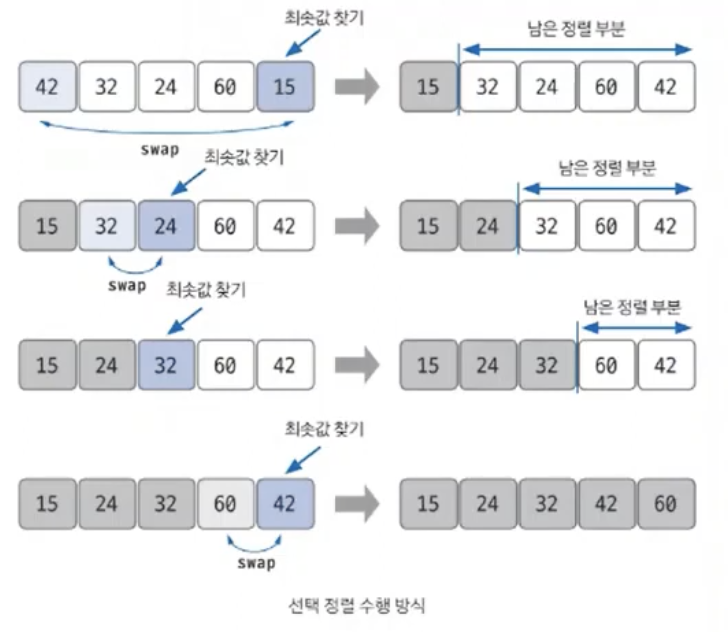

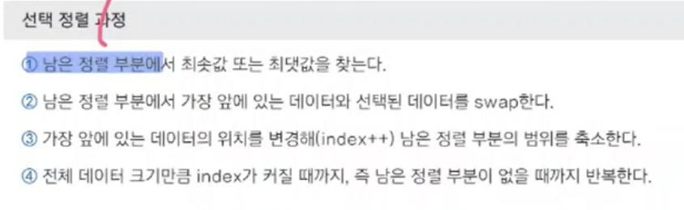

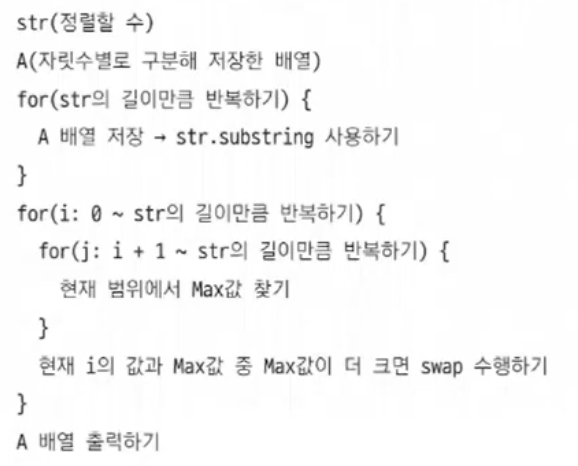

 # 삽입 정렬

정렬된 데이터 범위에 정렬되지 않은 데이터를 적절한 위치에 삽입시켜 정렬하는 방식

O(n^2)

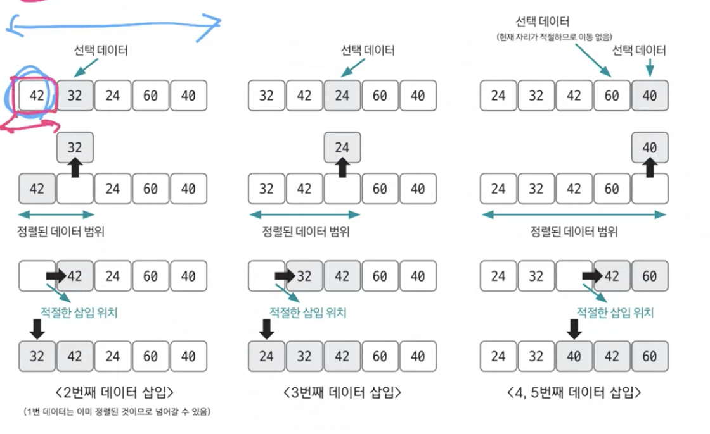

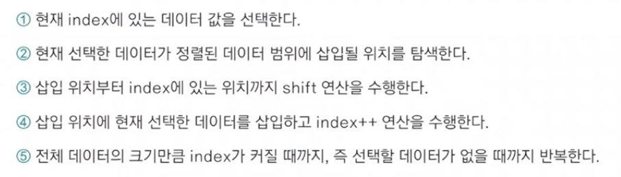

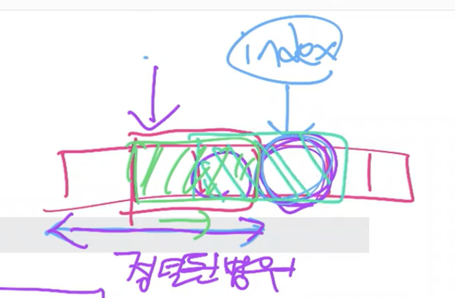

적절한 위치를 탐색하는 부분에서 (정렬된 부분에서 뒤지는 거니까)이진 탐색 - `O(log(n))` 같은 탐색 알고리즘을 사용하면 시간 복잡도를 줄일 수 있다. 

# 퀵정렬

pivot(기준값)을 중심으로 계속 데이터를 2개의 집합으로 나누면서 정렬하는 것

pivot에 따라 시간 복잡도 바뀜

보통 O(nlogn) -> 병합정렬

최악의 경우 O(n^2) -> 버블, 선택, 삽입

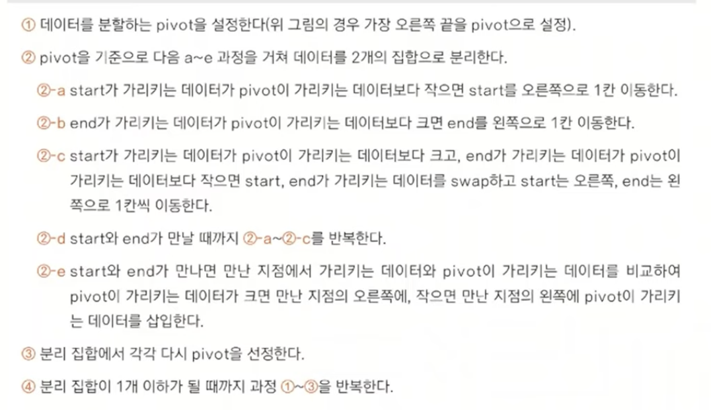

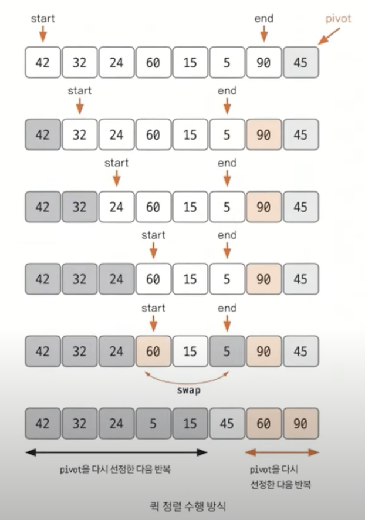

# 병합정렬

분할 정복 방식을 사용해 데이터를 분할하고 분한할 집합을 정렬하며 합치는 알고리즘

O(nlogn) - 사실 nlog2(n)임

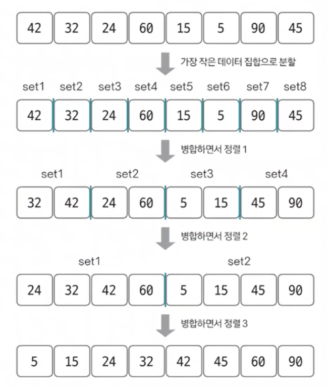

다 쪼사놓고,

합치면서 **정렬**한다. 

2개의 그룹을 병합하는 과정

> 투포인터 개념을 사용해 왼쪽 오른쪽을 병합한다. 
>
> 왼쪽 포인터와 오른쪽 포인터의 값을 비교하여 작은 값을 결과 배열에 추가하고 포인터를 오른쪽으로 1칸 이동시킨다.

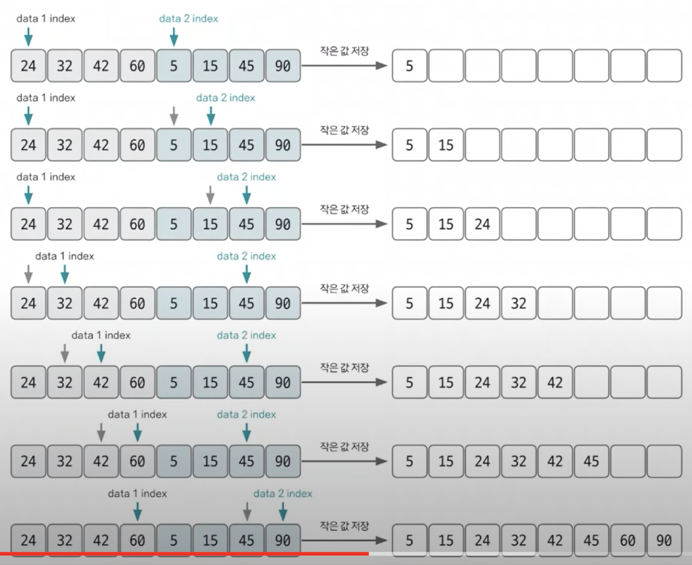

한쪽 그룹 다 쓰면 다른쪽 원소들 그대로 덧붙이면 된다.

앞 그룹에 남아있는 데이터의 개수 만큼 **역전**한다.

* swap
* 역전