# 배열

* 메모리의 연속적인 공간에 값이 채워져 있는 형태의 자료구조

* 인덱스를 통해 값에 바로 접근할 수 있다. 

* 새로운 값을 삽입하거나 삭제하기 어렵다. 
  주변 값을 이동시켜야 하기 때문이다. 

* 크기가 선언할 때 정해지기 때문에, 크기를 늘리거나 줄일 수 없다. 

* 구조가 간단해서 코테에서 가장 많이 사용된다. 

# 리스트

* 값과 포인트를 묶은 **노드**라는 것을 포인터로 연결한 자료구조


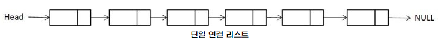

* 인덱스가 없으니까 값에 접근하려면 Head 포인터부터 순서대로 접근해야 한다. 
  접근 속도가 느리다. 

* 데이터를 삽입하거나 삭제하는 연산 속도가 빠르다.
  O(1)

* 크기가 선언시 한정되지 않고, 크기가 변하기 쉬운 데이터를 다룰 때 적절하다. 

* 포인터를 저장할 공간이 필요해서 배열보다 구조가 복잡하다. 

* Java : ✔ArrayList, LinkedList

# 구간 합

* 합 배열을 이용하여 시간 복잡도를 더 줄이기 위해 사용하는 알고리즘

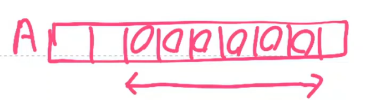

* 저 범위에 있는 값의 합을 조금 더 빨리 구할 수 있게 해 주는 알고리즘

* 요 알고리즘을 만드려면 먼저, 합 배열을 만들어야 한다. 

* 기존의 배열 A[i]
  합 배열 S[i] = sum(A[0:i])➡기존의 배열을 전처리 한 배열
  ➡합 배열을 구해놓으면 기존 배열의 일정 범위의 합을 구하는 시간 복잡도가 O(N)에서 O(1)로 감소한다. 

>  ✨**합 배열 S를 만드는 공식**
>
> S[i] = S[i - 1] + A[i]

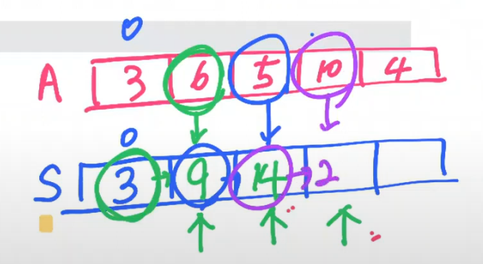

> ✨**i에서 j까지  구간 합을 구하는 공식**
>
> S[j] - S[i - 1]
>
> Ex. A[2] ~ A[5]까지 구간의 합
>
> 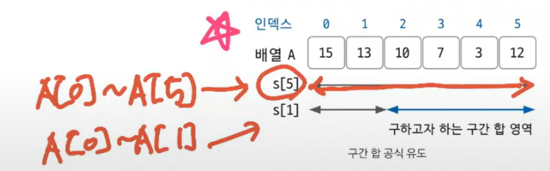

✔배열 고정 + 질의 많음  ➡ 구간 합을 떠올려라. .

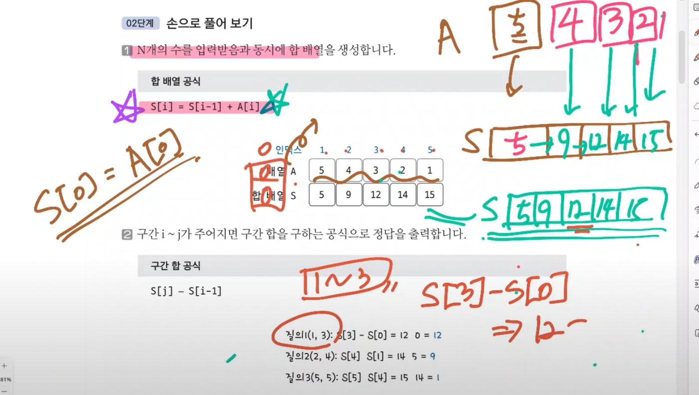

# 투 포인터

2개의 포인터로 알고리즘의 시간 복잡도를 최적화 한다. O(n)의 시간 복잡도를 가진 알고리즘이다. 

* 상황  
  * 합이 n이 될 경우의 수를 구하자.
  * start_idx ~ last_idx 에 해당하는 원소들의 합이 n이어야 한다!!
* 접근 
  * 1 ~ n 까지를 원소로 갖는 배열을 만든다.
  * 초기화 
    start_idx, last_idx가 손님 1을 가리킨다.
    count = 1 숫자 하나만 뽑은 경우 미리 카운트
    sum = 1 처음에는 last_idx, start_idx가 둘 다 1을 가리키니까

✔start_idx를 오른쪽으로 한 칸 이동하는 것은 연속된 자연수에서 왼쪽 값을 삭제하는 효과다. 
end_idx를 오른쪽으로 한칸 이동하는 것은 연속된 자연수의 범위를 한 칸 더 확장하는 효과다. 

**투포인터 이동 원칙**

```python
if sum > n	: sum = sum - start_idx; start_idx++
if sum < n	: end_idx++;sum = sum + end_idx;
if sum == n	: end_idx++;sum = sum + end_idx; count++;
```


_1940_

두 재료 합의 크기를 비교하므로 정렬O(nlogn)하면 더 쉽게 풀 수 있다.

양 끝에 위치를 투포인터로 지정해 문제에 접근해보자. 

**투 포인터 이동 법칙**

```java
A[i] + A[j] > M : j--;
A[i] + A[j] < M : i++;
A[i] + A[j] == M : i++; j--;
```


# 슬라이딩 윈도우

2개의 포인터로 범위( window)를 지정한 다음, 범위를 유지한 채로 이동(sliding) 하며 문제를 해결한다. 

1,000,000은  매우 큰 수이기 때문에 O(n)으로 해해야 한다. 

**12891**

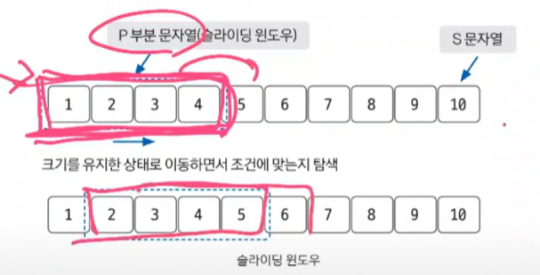

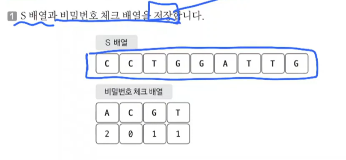


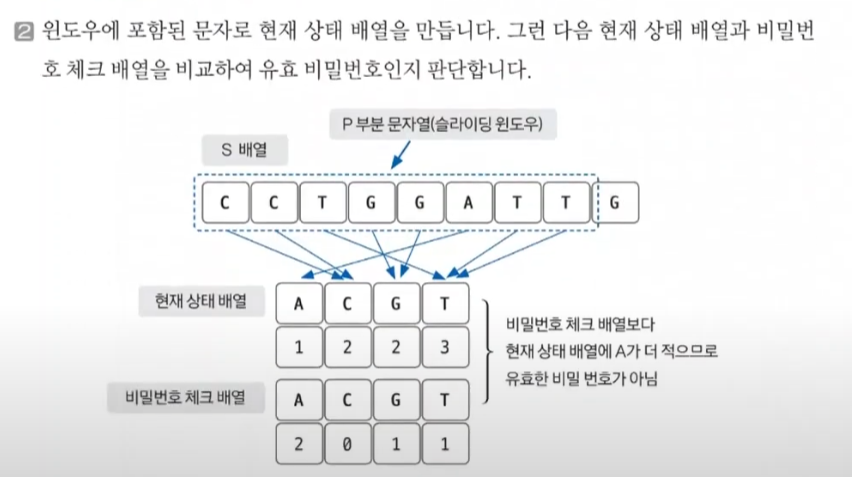

✔현재 상태 배열을 만드는게 제일 중요하다.

3.

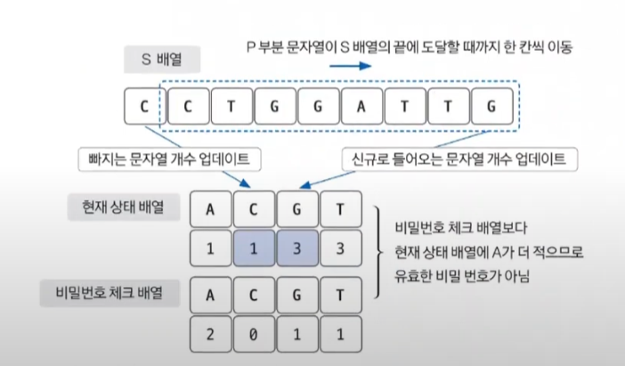


✔새로 들어가고 빠져 나가는 애만 가지고 현태 상태 뱌열을 O(2)의 시간 복잡도로 업데이트 해준다. 

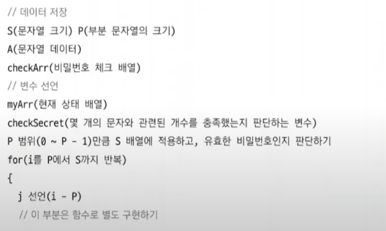


# 스택과 큐

배열에서 발전된 형태의 자료구조.

## 스택

LIFO => 재귀 함수 알고리즘 원리

삽입과 삭제가 한 쪽에서만 일어난다. 

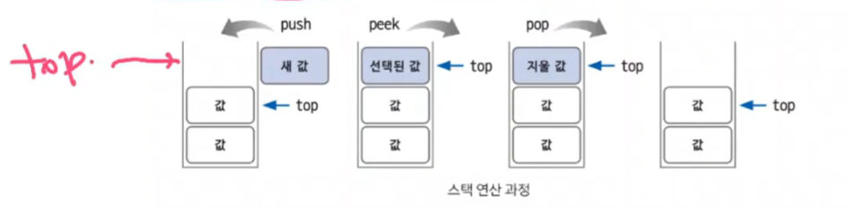

> < 위치 >
>
> * top
>   * 삽입과 삭제가 일어나는 위치
>
> < 연산 >
>
> * push
>   * top 위치에 새로운 데이터를 삽입하는 연산
> * pop
>   * top 위치에 현재 있는 데이터를 삭제하고 확인하는 연산
> *  peek
>   * top 위치에 현재 있는 데이터를 단순 확인하는 연산

(깊이 우선 탐색)DFS, 백트래킹에 효과적


## 큐

FIFO

삽입과 삭제가 양방향에서 이루어짐

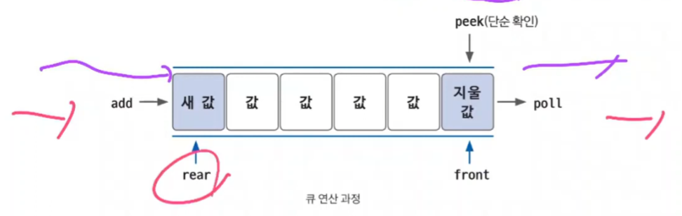

> <위치>
>
> * rear
>   * 가장 마지막에 들어온 데이터. 
>   * 삽입이 일어나는 위치
> * front
>   * 가장 먼저 들어온 데이터
>   * 삭제가 일어나는 위치
>
> < 연산>
>
> * add
>   * rear 부분에 새로운 데이터를 삽입하는 연산
> * poll
>   * front 부분에 있는 데이터를 삭제하고 확인하는 연산
> * peek
>   * front에 있는 데이터를 확인할 때 사용하는 연산

(너비 우선 탐색)BFS 효과적


## 우선순위 큐

들어간 순서와 상관 없이 우선순위가 높은 데이터가 먼저 나오는 자료구조

큐 설정에 따라 front에 항상 min or max 값이 위치

뽀통 heap으로 구현하는데, 이 힙은 트리 종류 중 하나임.


## 스택으로 오름차순 수열 만들기

1874/

* 스택에 오른차순으로밖에 못넣음

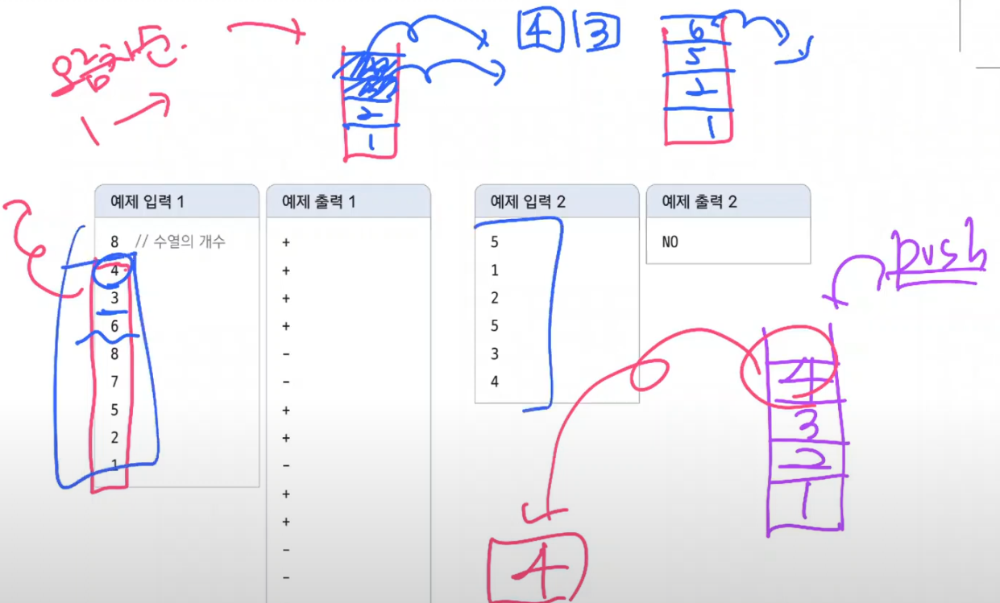

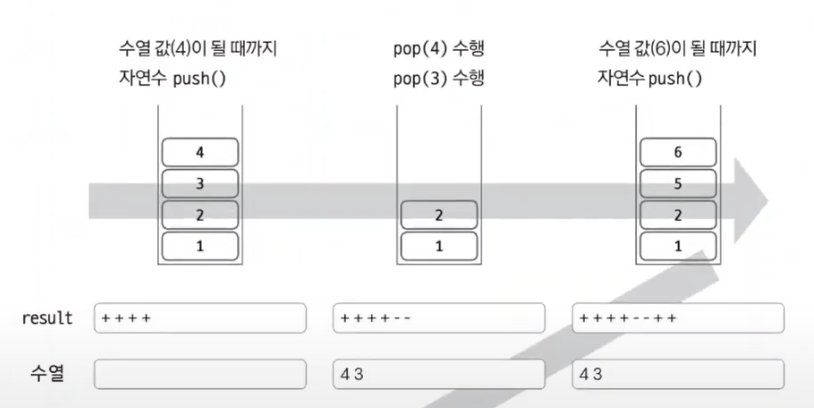


> 스택 연산 수행 방법
>
> 1. 현재 수열 값 >= 자연수
>
> 자연수가 현재 수열 값이랑 같아질 때 까지 자연수를 1씩 증가시키며 자연수를 stack에 push한다. 
>
> push가 끝나면 수열을 출력하기 위해 마지막 1회만 pop한다. 
>
> Ex. 현재 수열 값이 4면 stack엔 1,2,3,4 push ➡ 마지막 1회만 pop해서 4 출력.자연수는 5, 현재 수열 값은 3이 된다. 
>
> 2. 현재 수열 값 < 자연수
>
> pop으로 스택을 터는데, 이 때 나온 값이 수열값이 아닐수도 있다. 
> 만약 아니면 후입선출 원리에 따라 수열을 표현할 수 없으므로 NO출력하고 쫑내면 됨.

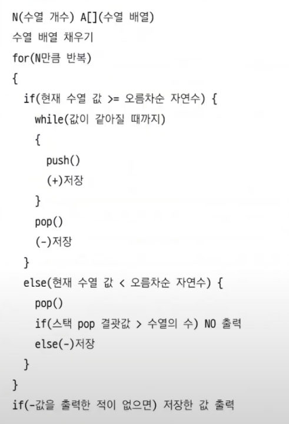

 ## 카드게임

_2164

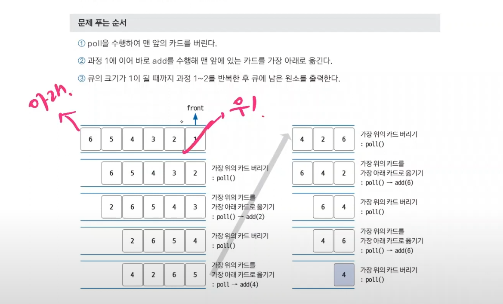

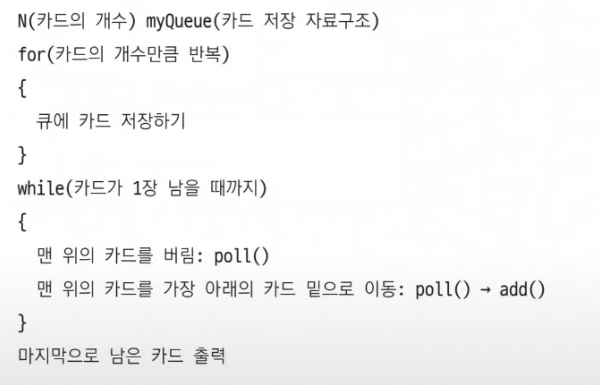

## 절대값 힙 구현하기

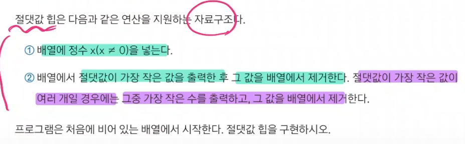

N의 최대 범위가 100, 000이므로 O(nlogn)으로 풀 수 있다. 

데이터가 새로 삽입될 때 마다 절대값과 관련된 정렬이 필요하므로 우선순위 큐로 문제 해결 가능

단, 절대값 정렬이 필요하니까 우선순위 정렬 기준을 직접 만들어 줘야 한다. 

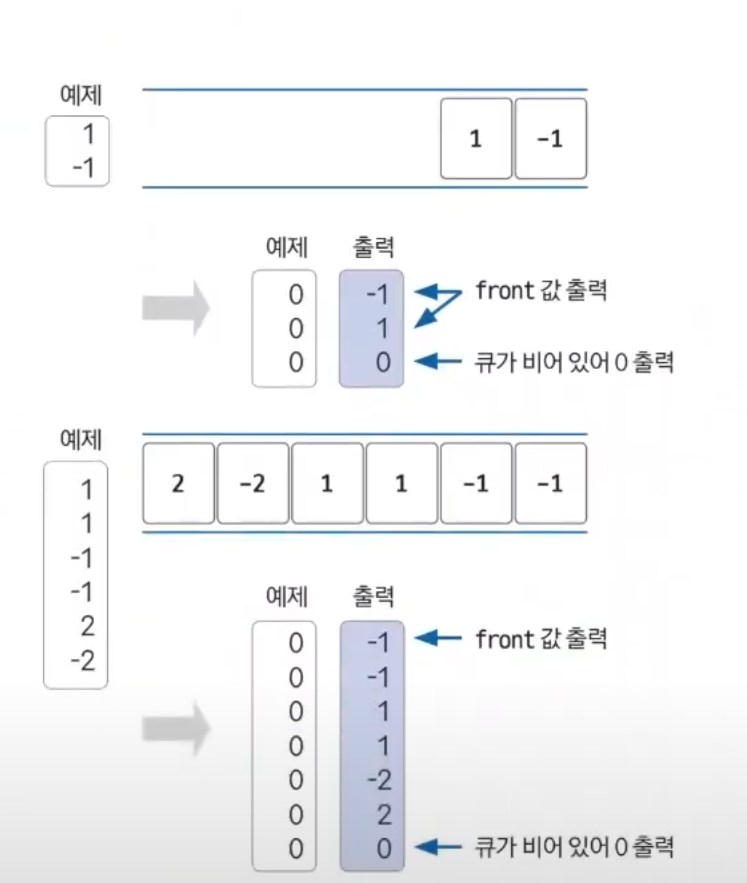

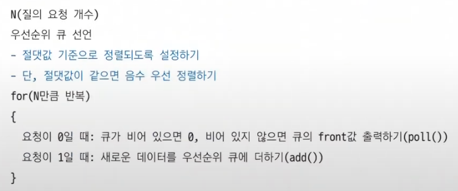


# Hashmap

# Graph

# Tree

