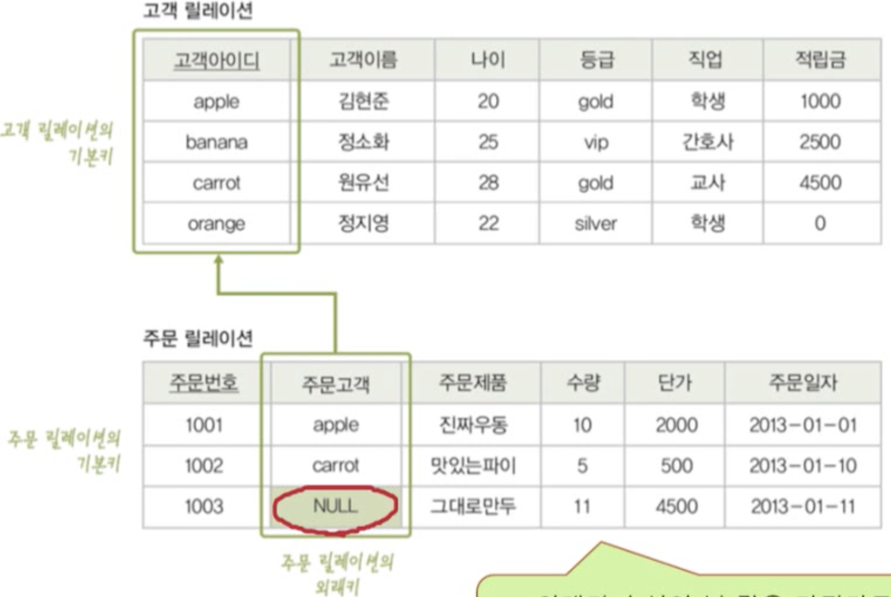
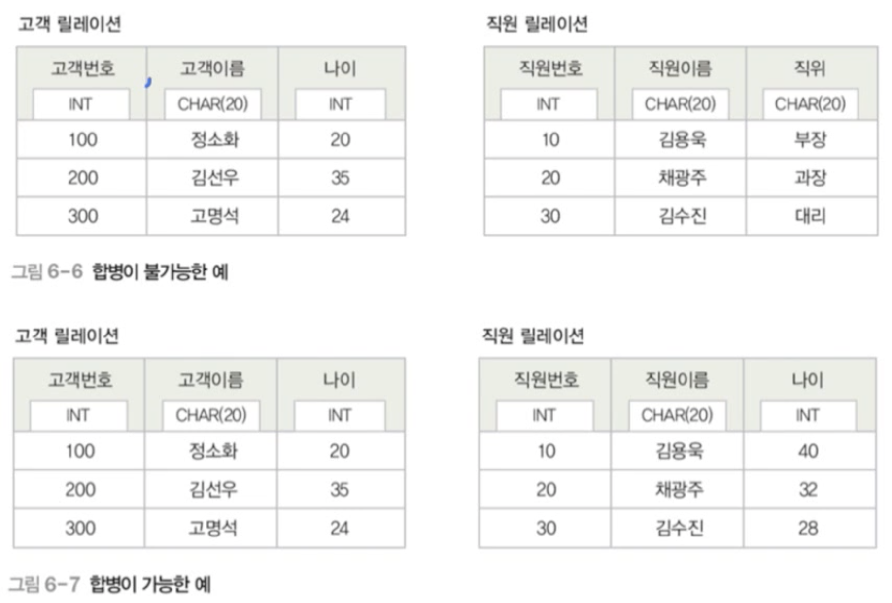
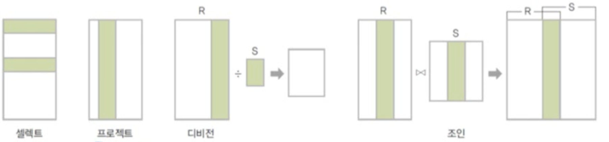
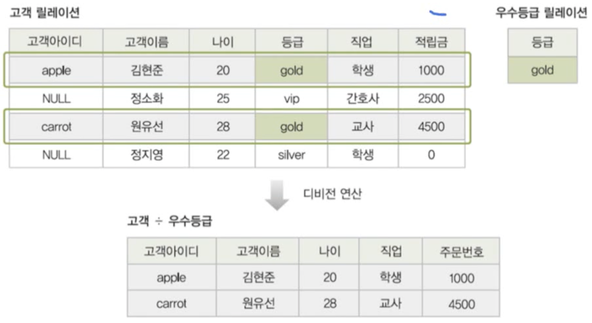

# 데이터베이스

데이터들의 집합. 

* 데이터 vs 정보
  * 데이터
    * 현식 세계에서 관찰된 값
    * 의미부여 X
  * 정보
    * 의사 결정에 유용하게 쓰려고 데이터를 처리한 결과물
    * 의미 부여 O

* 정보 처리(information processing)
  * 데이터에서 정보를 추출하는 과정
  * Ex. 주문 내역 `-정보 처리->` 제품별 총 판매액
* 정보 시스템 (information system)
  * 조직 운영에 필요한 데이터를 수집하여 저장해 두었다가 필요할 때 유용한 정보를 만들어주는 수단
  * 일명 DBMS
* 데이터 베이스
  * 정보 시스템 안에서 데이터를 저장하고 있다가 필요할 때 제공하는 역할을 담당


* 데이터베이스
  * 특정 조직의 여러 사용자가 **공유**하여 사용할 수 있도록 **통합**해서 **저장**한 **운영**데이터의 집합
    * 공유 데이터
      * 특정 조직의 여러 사용자가 함께 소유하고 이용할 수 있는 공용 데이터
    * 통합 데이터
      * 최소의 중복과 통제 가능한 중복만 허용하는 데이터
    * 저장 데이터
      * 컴퓨터가 접근할 수 있는 매체에 저장된 데이터
    * 운영 데이터
      * 조직의 주요 기능을 수행하기 위해 지속적으로 유지해야 하는 데이터
  * 특성
    * 실시간 접근
      * 사용자의 데이터 요구에 실시간으로 응답
    * 계속 변화
      * 데이터의 계속적인 삽입, 삭제, 수정을 통해 현재의 정확한 데이터를 유지
      * Ex. 사원의 입사 퇴사에 따른 변화를 반영
    * 동시 공유
      * 서로 다른 데이터의 동시 사용 뿐 아니라 같은 데이터의 동시 사용도 지원
    * 내용 기반 참조
      * 데이터가 저장된 주소나 위치가 아닌 내용으로 참조
      * Ex. 연봉이 500 이상이고 과장 이상인 사원을 셀랙해라. 

# 데이터베이스 관리 시스템

* 파일 시스템
  * 데이터를 파일로 관리하기 위해 파일을 생성, 삭제, 수정, 검색 기능을 제공하는 SW
  * 응용 프로그램마다 필요한 데이터를 별도의 파일로 관리한다.
  * 문제점
    * 같은 내용의 데이터가 여러 파일에 중복 저장된다.→ 데이터 중복성
      * 저장 공간의 낭비
      * 데이터의 일관성 깨짐
      * 데이터의 무결성 깨짐
    * 응용 프로그램이 데이터 파일에 종속적이다.→데이터 종속성
      * 사용하는 파일의 구조를 변경하면 응용 프로그램도 함께 변경해야 함.
    * 데이터 파일에 대한 동시 공유, 보안, 회복 기능이 부족하다. 
    * 응용 프로그램 개발이 쉽지 않다. 
  
  > 파일 시스템의 주요 문제점
  >
  > * 같은 내용의 데이터가 여러 파일에 중복되어 존재한다.
  
* 데이터베이스 관리 시스템 ( DBMS)
  * 파일 시스템의 문제 (데이터 종속성, 데이터 중복성)를 해결하기 위해 제시된 소프트웨어
  * 조직에 필요한 데이터를 데이터베이스에 통합하여 저장하고 관리한다. 
  * 기능
    * 정의 기능
      * 데이터베이스의 구조를 정의하거나 수정할 수 있다. 
    * 조작 기능
      * 데이터를 삽입, 삭제, 수정, 검색하는 연산 가능하다. 
    * 제어 기능
      * 데이터를 정확하고 안전하게 유지할 수 있다. 
  * 장단점
    * 장점
      * 데이터 중복 통제 가능
      * 데이터 독립성 확보
      * 데이터를 동시에 공유 가능
      * 데이터 보안이 향상
      * 데이터 무결성 유지 가능
      * 표준화 가능
      * 장애 발생  시 회복이 가능
      * 응용 프로그램 개발 비용이 줄어든다. 
    * 단점
      * 비싸다
      * 백업과 회복 방법이 복잡
      * 중앙 집중 관리로 인한 취약점


* DBMS  발전 과정

  * 1세대

    * 네트워크 DBMS

      * 구조가 복잡하고 변경이 어렵다. 
      * Ex. IDS

    * 계층 DBMS

      *  구조 변경이 어렵다. 
      * Ex. IMS

      

  * 2세대

    * 관계 DBMS
    * 테이블 형태
      * Ex. Oracle, MySQL Server

  * 3세대

    * 객체지향 DBMS
      * Ex. O2, ONTOS
    * 객체관계 DBMS


# 데이터베이스 시스템


* 데이터베이스 시스템(DBS)

  * 데이터베이스에 데이터를 저장하고, 이를 관리하여 조직에 필요한 정보를 생성 해주는 시스템
  * 구조
    * 스키마(shema)
      * 데이터베이스에 저장되는 데이터 구조와 제약 조건을 정의한 것
      * 뼈대
    * 인스턴스(instance)
      * 스키마에 따라 데이터베이스에 실제로 저장된 값
      * 살

* 3단계 데이터베이스 구조

  * 데이터베이스를 바라보는 관점 3 가지

    * 외부 단계

      * 개별 사용자 관점

      * 데이터베이스 하나에 외부 스키마가 여러 개 존재할 수 있다.

        > 외부 스키마 (서브 스키마)
        >
        > * 외부 단계에서 사용자에게 필요한 데이터베이스를 정의한 것
        > * 각 사용자가 생각하는 데이터베이스의 모습은 사용자마다 다르다.

    * 개념 단계

      * 조직 전체의 관점

      * 데이터베이스 하나에 개념 스키마가 하나만 존재한다.

        > 개념 스키마
        >
        > * 개념 단계에서 데이터베이스 전체의 논리적 구조를 정의한 것
        > * 전체 데이터베이스에 어떤 데이터가 저장되는지, 데이터들 간에는 어떤 관계가 존재하고 어떤 제약조건이 존제하는지 정의 뿐 아니라, 데이터에 대한 보안 정책이나 접근 권한에 대한 정의도 포함한다.

    * 내부 단계

      * 물리적인 저장 장치의 관점

      * 데이터베이스 하나에 내부 스키마가 하나만 존재한다.

        > 내부 스키마
        >
        > * 전체 데이터베이스가 저장 장치에 실제로 저장되는 방법을 정의한 것
        > * 레코드 구조, 필드 크기, 레코드 접근 경로 등 물리적인 저장구조를 정의

  * 각 단계 별로 다른 abstraction 제공

    * 내부 단계에서 외부 단계로 갈수록 더 abstract됨

  


* 외부/개념 사상 (application interface) → 논리적 데이터 독립성

* 개념/내부 사상 (storage interface) → 물리적 데이터 독립성

* 데이터 독립성
  * 하위 스키마를 변경하더라도 상위 스키마는 영향을 받지 않는 특성
    * 논리적 데이터 독립성
      * 개념 스키마가 변경되어도 외부 스키마는 영향을 받지 않는 특성
      * 개념 스키마가 변경되면 관련 외부/개념 사상만 정확하게 수정해주면 됨.
    * 물리적 데이터 독립성
      * 내부 스키마가 변경되어도 개념 스키마는 영향을 받지 않는 특성
      * 내부 스키마가 변경되면 관련된 개념/내부 사상만 정확하게 수정해주면 됨

* 데이터 사전
  * system catalog

  * 메타 데이터를 유지하는 시스템 데이터베이스

    > 메타 데이터: 데이터에 대한 데이터

  * 스키마, 사상 정보, 다양한 제약 조건 등을 저장
  * 데이터베이스 관리 시스템이 스스로 생성하고 유지
  * 일반 사용자도 접근이 가능하지만 저장된 내용을 검색만 할 수 있다.

* 데이터 디렉토리

  * 데이터 사전에 있는 데이터에 실제로 접근하는데 필요한 위치 정보를 저장하는 시스템 데이터베이스
  * 일반 사용자의 접근은 불가능

* 사용자 데이터베이스

  * 사용자가 실제로 이용하는 데이터가 저장되어 있는 일반 데이터베이스

* 데이터베이스 사용자

  * 데이터베이스 관리자(DBA)
    * 데이터 베이스 시스템을 운영하고 관리
    * 주로 데이터 정의어, 제어어 사용

  * 최종 사용자
    * 일반 사용자
    * 데이터베이스에 접근하여 데이터를 조작(crud)
    * 주로 데이터 조작어 사용

  * 응용 프로그래머
    * 데이터 언어를 삽입하여 응용 프로그램을 작성
    * 주로 데이터 조작어 사용

* 데이터 언어

  * 데이터 정의어 (DDL)
    * 스키마 정의, 수정, 삭제

  * 데이터 조작어 (DML)
    * 데이터 CRUD 처리

  * 데이터 제어어 (DCL)
    * 내부적으로 필요한 규칙이나 기법을 정의하기 위해 사용
    * 목적
      * 무결성 : 정확하고 유효한 데이터만 유지
      * 보안 : 허가 받지 않은 사용자의 데이터 접근 차단, 허가된 사용자에 권한 부여
      * 회복: 장애가 발생해도 데이터 일관성 유지
      * 동시성 제어: 동시 공유 지원


* 데이터베이스 관리 시스템
  * 데이터베이스 관리와 사용자의 데이터 처리 요구 수행
  * 구성요소
    * query processor
      * 사용자의 데이터 처리 요구를 해석하여 처리
      * Ex.DDL compiler, DML pre compiler, DML compiler, runtime database processor, transaction manager
    * stored data manager
      * 디스크에 저장된 사용자 데이터베이스와 데이터 사전을 관리하고 여기에 실제로 접근하는 역할을 담당


# 데이터 모델링

* 데이터 베이스 설계

  


* 데이터 모델링

  * 현실 세계에 존재하는 데이터를 컴퓨터 세계의 데이터베이스로 옮기는 변환 과정

  * 종류

    * 개념적 데이터 모델링

      * 현실 세계의 중요 데이터를 추출하여 개념 세계로 옮기는 과정

    * 논리적 데이터 모델링

      * 개념 세계의 데이터를 데이터베이스에 저장하는 구조로 표현하는 작업

      

* 데이터 모델
  * 데이터 모델링의 결과물
  * 종류
    * 개념적 데이터 모델
      * 현실 세계를 데이터베이스의 개념적 구조로 표현
      * 개체 관계 모델
    * 논리적 데이터 모델
      * 개념적 구조를 논리적 구조로 표현
      * 관계 데이터 모델

* 개체 관계 모델
  * E-R Model or  Entity-Relationship model
  * 개체와 개체 간의 관계를 이용해 현실 세계를 개념적 구조로 표현
  * 개체 + 속성 + 관계
* 개체 관계 다이어그램 (ERD)
  * 개체 관계 모델의 결과물


* 개체

  * 현실 세계에서 조직을 운영하는데 꼭 필요한 
  * 구별되는
  * 저장할 가치가 있는 중요 데이터를 가지고 있는 
  * 다른 개체와 구별되는 이름을 가지고 있고, 각 개체만의 고유한 특성이나 상태(속성)울 하나 이상 가리고 있는
  * 모든 것
  * Ex. 학교에 필요한 개체: 학과, 과목
  * ERD에서 사각형으로 표현하고 사각형 안에 이름을 표기
  * 

* 속성

  * 개체나 관계가 가지고 있는 고유의 특성

  * 의미 있는 데이터의 가장 작은 논리적 단위

  * ERD에서 타원으로 표현하고 타원 안에 이름을 표기

  * 

  * 개체 타입

    * entity type
    * 개체 고유의 이름과 속성들로 정의한 것

  * 개체 인스턴스

    * entity instance
    * 개체를 구성하고 있는 속성이 실제 값을 가지게 돼 하나의 어엿한 개체가 된 것

  * 개체 집합

    * entity set
    * 특정 개체 타입에 대한 개체 인스턴스들을 모아놓은 것

    

  * 

  * 단일 값 속성

    * single valued attribute
    * 값을 하나만 가질 수 있는 속성
    * Ex. 고객 개체의 이름, 적립금 속성

  * 다중 값 속성

    * multi valued attribute
    * 값을 여러 개 가질 수 있는 속성
    * Ex. 고객 개체의 연락처 속성, 책 개체의 저자 속성
    * ERD에서 이중 타원으로 표현

    

  * 단순 속성

    * simple attribute
    * 의미를 더는 분해할 수 없는 속성
    * Ex. 책 개체의 이름, 가격, ISBN
  
  * 복합 속성
  
    * composite attribute
    * 의미를 분해할 수 있는 속성
    * Ex. 고객 개체의 주소, 생년월일 속성
  
    
  
  * 유도 속성
  
    * derived attribute
  
      * 기존의 다른 속성의 값에서 유도되어 결정되는 속성
      * 값이 별도로 저장되지 않음.
      * Ex. 책 개체의 가격과 할인율 속성으로 계산되는 판매 가격 속성
  
      
  
      * ERD에서 점선 타원으로 표현
  
  *  널 속성
  
    * null attribute
    * 널 값이 허용되는 속성
  
    > 널 값
    >
    > * null
    > * 아직 결정되지 않거나 모르는 값. 또는 존재하지 않는 값.
    > * 공백이나 0과는 의미가 다름
    > * Ex. 등급 속성이 null => 등급이 아직 결정되지 않음
  
  * key attribute
  
    * 각 개체 인스턴스를 식별하는 데 사용되는 속성
    * 모든 개체 인스턴스의 키 속성 값이 다름
    * 둘 이상의 속성들로 구성되기도 함.
    * Ex. 고객 개체의 고객 아이디 속성
    * ERD에서 밑줄로 표현
  
    
  
  * 관계
  
    * 개체와 개체가 맺고 있는 의미 있는 연관성
  
    * 개체 집합들 사이의 대응 관계, 즉 mapping
  
    * Ex. 고객 개체와 책 개체 간의 **구매** 관계
  
    * ERD에서 마름모로 표현
  
      
  
    * 유형
  
      * 관계에 참여하는 개체 타입의 수 기준
  
        * 이항 관계
          * 개체 타입 두 개가 맺는 관계
        * 삼항 관계
          * 개체 타입 세 개가 맺는 관계
        * 순환 관계
          * 개체 타입 하나가 자기 자신과 맺는 관계
  
      * mapping cardinality기준
  
        * 1:1
  
        * 1:n
  
        * n:m
  
          > mapping cardinality
          >
          > * 관계를 맺는 두 개체 집합에서, 각 개체 인스턴스가 연관성을 맺고 있는 상대 개체 집합의 인스턴스 개수

* 관계의 참여 특성

  * 전체 참여

    * 모든 개체 인스턴스가 관계에 반드시 참여
    * Ex. 고객 개체가 음료 개체와의 구매 관계에 필수적으로 참여
      * 모든 고객은 반드시 음료를 구매해야 함
      
    * ERD에서 이중 선으로 표현

  * 선택적 참여

    * 개체 인스턴스 중 일부만 관계에 참여해도 되는 것을 의미
    * Ex.  고객 개체가 음료 개체와의 구매 관계에 필수적으로 참여
      * 고객이 구매하지 않은 음료가 존재할 수 있음.

    

* 관계의 종속성
  * weak entity
    * 다른 개체의 존재 여부에 목숨이 달린 개체
  * owner entity
    * 다른 개체의 존재 여부를 결정하는 개체
  * 일반적으로 owner entity : weak entity = 1 : n
  * weak entity는 owber entity와의 관계에 필수적으로 참여
  * weak entity는 owner entity의  key를 포함하여 키를 구성하는 특징이 있음.
  * ERD에서 weak entity - 이중 사각형, owner entity 와 owner entity의 관계 - 이중 마름모
  * Ex. 

# 관계 데이터 모델링


*  관계 데이터 모델의 기본 개념
  * 개념적 구조를 논리적 구조로 표현하는 논리적 데이터 모델
  * 하나의 개체에 대한 데이터를 하나의 릴레이션에 저장


고객 릴레이션

* 관계 데이터 모델의 기본 용어
  * relation
    * 하나의 개체에 관한 데이터를 2차원 테이블의 구조로 저장한 것.
    * 파일 관리 시스템 관점에서 file에 대응
  * attribute
    * relation의 열.
    * 파일 관리 시스템 관점에서 field에 대응
  * tuple
    * relation의 행
    * 파일 관리 시스템 관점에서 record에 대응
  * domain
    * 하나의 속성이 가질 수 있는 모든 값의 집합
    * 속성 값을 입력 및 수정 할 때 적합성의 판단 기준이 됨.
    * 일반적으로 속성의 특성을 고려한 데이터 타입으로 정의
  * null
    * 속성 값을 아직 모르거나 해당되는 값이 없음을 표현
  * degree
    * 하니의 relation에서 속성의 전체 개수
  * cardinality
    * 하나의 relation에서 tuple의 전체 개수
* relation의 구성
  * relation schema
    * relation의 논리적 구조
    * relation의 이름과 relation에 포함된 모든 속성 이름으로 정의
      * Ex. 고객(고객 아이디, 고객 이름, 나이, 등급)
    * relation intension
    * 정적임
  * relation instance
    * 어느 한 시점에 relation이 존재하는 tuple들의 집합
    * relation extension
    * 동적임
* 데이터베이스의 구성
  * database schema
    * database의 전체 구조
    * database를 구성하는 relation schema의 모음
  * database instance
    * database를 구성하는 relatio instance의 모음

* relation의 특성

  * tuple의 유일성

    * 하나의 relation에는 동일한 tuple이 존재할 수 없다. 

  * tuple의 무순서

    * 하나의 relation에서 tuple 사이의 순서는 무의미하다.

  * 속성의 무순서

    * 하나의 relation에서 속성 사이의 순서는 무의미하다.

  * 속성의 원자성

    * 속성 값으로 원자 값만 사용할 수 있다. 

      

* key

  * relation에서 tuple들을 유일하게 구별하는 속성 || 속성들의 집합

    

* 키의 특성

  * uniquness
    * 하나의 relation에서 모든 tuple은 서로 다른 키 값을 가져야 함.
  * minimality
    * 꼭 필요한 최소한의 속성들로만 키를 구성

* 키의 종류

  * super key
    * 유일성을 만족하는 속성 또는 속성들의 집합
    * Ex. 고객 relation의 super key 예제
      * 고객 아이디
      * 고객 아이디 + 고객 이름
      * 고객 이름 + 주소
  * candidate key
    * 유일성 + 최소성을 만족하는 속성 || 속성들의 집합
    * Ex. 고객 relation의 candidate key 예제
      * 고객 아이디
      * 고객 이름 + 주소
  * primary key
    * candidate key 중에서 최종적으로 선택한 키
    * 걸러야 할 후보키
      * null을 가질 수 있는 속성이 포함
      * 값이 자주 변경될 수 있는 속성이 포함
  * alternate key
    * candidate key 중 primary key가 아닌 키
  * foreign key
    * 다른 relation의 primary key를 참조하는 속성  || 속성들의 집합
    * relation들 간의 관계를 표헌
      * 참조하는 relation
        * foreign keyf를 가진 relation
      * 참조 당하는 relation
        * foreign key가 참조하는 Primary key를 가진 relation
    * relation간의 관계를 맺어 각각의 relation에 있는 tuple을 연결할 수 있다.
    * attribute of foreign key and attribute of primary key referenced 이름은 달라도 도메인은 같아야 한다.
    * 하나의 relation에 foreign key가 여러개 있을 수 있다.
    * foreign key를 primary key로 사용할 수 있다.
    * 같은 relation의 primary key를 참조하는 foreign key를 정의할 수 있다.
    * foreigh key는 null을 가질 수 있다.

* 관계 데이터 모델의 제약

  * integrity constraint

    * 데이터의 무결성을 보장하고 일관된 상태로 유지하기 위한 규칙

    > 무결성
    >
    > 데이터의 결함이 없는 상태. 
    >
    > 정확하고 유효하게 유지하는 것.

  * 개체 무결성 제약조건

    * 기본키를 구성하는 모든 속성은 null을 가질 수 없다.
      

  * 참조 무결성 제약조건

    * 외래키는 참조할 수 없는 값을 가질 수 없다.
      

    * 외래키는 Null 가능

      

* ERD를 relation schema로 변환하는 규칙

  1. 모든 entity는 relation으로 변환한다.

  2. n:m관계는 relation으로 변환한다.

     규칙 1에 따라 관계에 참여하는 개체를 relation으로 변환한 후 이 relation의 primary key를 관계 relation에 포함시켜 foreign key로 지정하고 foreign key들을 좋바하여 관계 relation의 primary key로 지정
     

  3. 1:n관계는 foreign key로 표현한다.

     * 일반적인 1:n관계는 foreign key로 표현한다.

       * 1측 개체의 relation의 primary key를 n측 개체의 relation에 foreign key로 지정한다.
       * 관계의 속성들도 n측 개체의 relation에 포함시킨다.

       

     * 약한 개체가 참여하는 1:n관계는 기본키에 foreign key를 포함시킨다. 

       

  4. 1:1관계는 foreign key로 표현한다.

     * 일반적인 1:1관계는 foreign key를 서로 주고 받는다.

       * 관계의 속성들도 모든 개체의 relation애 포함시킨다.
         * 불필요한 데이터 중복이 발생할 수 있다.
           

     * 1:1관계에 필수적으로 참여하는 개체의 relation만 foreign key를 받는다.

       * 관계의 속성들은 관계에 필수적으로 참여하는 개체 relation에 포함시킨다.

       

     * 모든 개체가 1:1관계에 필수적으로 참여하면 reltion을 하나로 합친다.

       * 관계의 이름을 relation의 이름으로 사용한다.

       * 두 개체의 relation의 키 속성을 조합하여 관계 relation의 primary key로 지정한다.

         

       

  5. 다중값 속성은 독립적인 relaiton으로 변환하다.

     * 다중값 속성과 함께 그 속성을 가지고 있던 entity relation의 primary key를 foreign key로 가져와 새로운 relation에 포함시킨다.

     * 새로운 relation의 primary key는 다중 값 속성과 foreign key를 조합하여 지정한다.

       

* 기타 고려사항

  * 모든 관계는 relation으로 변환할 수 있다.

    * 속성이 많은 관계는 유형에 상관없이 relation으로의 변환 가능하다.

      

  * 개체가 자기 자신과 관계를 맺는 순환 관계도 기본 규칙을 그대로 적용한다.

    

    

# 정규화


* 이상 현상

  * anomaly 현상

  * 불필요한 데이터 중복으로 relation에 대한 데이터 삽입&수정&삭제 연산을 수행할 때 발생할 수 있는 부작용

  * 예시 - 이벤트 참여 relation

    

  * 종류

    * 삽입 이상
      * 새 데이터를 삽입하기 위해 불필요한 데이터도 함께 삽입해야 하는 문제
      * Ex. 아직 이벤트에 참여하지 않은 아이디가 "melon"이고, 이름이 "민경탁", 등급이 gold인 신규 고객의 데이터는 이벤트 참여 relation에 삽입할 수 없다. 넣고 싶으면 실제로 참여하지 않은 임시 이벤트 번호를 삽입해야 한다.
        
    * 갱신 이상
      * 중복 tuple 중 일부만 변경하여 데이터가 불일치하게 되는 모순의 문제
      * Ex. 아이디가 apple인 고객의 등급이 gold에서 vip로 바뀌었는데 일부 tuple에 대해서만 등급이 수정된다면 apple고객이 서로 다른 등급을 가지는 모순이 발생한다.
        
    * 삭제 이상
      * tuple을 삭제하면 꼭 필요한 데이터까지 함께 삭제되는 데이터 손실의 문제
      * Ex. 아이디가 orange인 고객이 이벤트 참여를 취소해 관련 tuple을 삭제하게 되면 이벤트 참여와 관계없는 고객 아이디, 고객 이름, 등급 데이터까지 손실된다.
        

* 정규화

  * 이상현상이 발생하지 않도록 relation을 관련 있는 속성들로만 구성하기 위해 relation decomposition하는 과정
  * **함수의 종속성**을 판단하여 정규화를 수행함

* 함수의 종속성 (functional dependecy)

  * 속성들 간의 관련성
  * relation을 연관성 있는 속성들로만 구성되도록 분해하여 이상 현상이 발생하지 않는 relation으로 만들어 나가는 과정이 **정규화**

* 함수의 종속

  * X가 Y를 결정한다.

    * relation 내의 모든 tuple을 대상으로 하나의 X값에 대한 Y값이 항상 하나임.

    * X, Y는 하나의 relation을 구성하는 속성들의 부분집합

      

  * 종류

    * 완전 함수 종속 
      * full functional dependency
      * relation에서 속성 집합 Y가 속성 집합 X에 함수적으로 종속되어 있지만, 속성 집합 X의 전체가 아닌 일부분에는 종속되지 않는다.
      * Ex. 당첨 여부는 {고객 아이디, 이벤트 번호}에 완정 함수 종속 됨
    * 부분 함수 종속
      * partial functional dependency
        * relation에서 속성 집합 Y가 속성 집합 X가 아닌 일부분에도 함수적으로 종속됨을 의미
        * Ex. 고객 이름은 {고객 아이디, 이벤트 번호}부분 함수 종속 됨.
    * 이행적 함수 종속
      * transitive FD
      * relation을 구성하는 세 개의 속성 집합 X,Y, Z에 대해 함수 종속 관계 X->Y, Y->Z가 존재하면 논리적으로 X->Z가 성립된다. 이것을 Z가 X에 이행적으로 함수 종속 되었다고 한다.

  * Ex
    * 고객 relation

  

  

* 함수 종속 다이어그램
  * 함수의 종속 관계를 도식화하여 표현한 것
    
* 함수 종속 관계 판단에서 주의할 점
  * 속성 자체의 특성과 의미를 기반으로 함수 종속성을 판단해야 한다.
    * 속성 값은 계속 변할 수 있으므로 현재 relation에 포함된 속성 값 만으로 판단하면 안된다.
  * 일반적으로 primary key and candidate key는 relation의 다른 모든 속성들을 함수적으로 결정한다.
  * primary key and candidate key가 아니어도 다른 속성 값을 유일하게 결정하는 속성은 함수 종속 관계에서 결정자가 될 수 있다.

* 정규형(Normal Form - NF)

  * relation이 정규화된 정도

    

    * 밑으로 갈수록 더 엄격해진다.

      

* 제 1 정규형 (1NF)

  * relation에 속한 모든 속성의 domain이 atomic value로만 구성되어 있으면 제 1정규형에 속한다.

  * db의 relation이 되기 위한 최소 조건이다.
    

  * 
    

     제 1 정규형을 만족하지만 이상 현상이 발생한다.→ 기본키에 완전 함수 종속되지 못한 등급, 할인율 때문이다.
    😎부분 함수 종속이 제거되도록 이벤트 참여 relation을 분해한다. (그럼 제 2 정규형에 속하겠다)

* 제 2 정규형

  * relation이 제 1정규형에 속하고, 기본키가 아닌 모든 속성이 기본키에 완전함수 종속 되면 제 2정규형에 속한다.

  * 

  * 

    제 2정규형을 만족해도 이상 현상이 발생한다. → 이행적 함수 종속이 존재하기 때문이다.

    😎이행적 함수 종속이 제거되도록 고객 relation을 분해한다.(그러면 제 3 정규형에 속한다.)

* 제 3 정규형
  * relation이 제 2정규형에 속하고, 기본키가 아닌 모든 속성이 기본키에 이행적 함수 종속이 되지 않으면 제 3정규형을 만족한다.
  * 

# 관계 데이터 연산


* 데이터 모델 = 연산 + 데이터 구조 + 제약 조건

* 관계 데이터 연산

  * 원하는 데이터를 얻기 위해 relation에 필요한 질의를 수행하는 것.
  * 종류
    * 관계 대수
      * 원하는 결과를 얻기 위해 데이터의 처리 과정을 순서대로 기술
    * 관계 해석
      * 원하는 결과를 얻기 위해 원하는 데이터가 무엇인지만 기술

* 관계 대수

  * 절차 언어

    * 원하는 결과를 얻기 위해 데이터의 처리 과정을 순서대로 기술하는 언어

  * relation을 처리하는 연산자들의 모임

    * 대표 연산자 8개
    * 일반 집합 연산자와 순수 관계 연산자로 분류됨

  * 폐쇄 특성이 있음

    * 피연산자도 relation이고 연산의 결과도 relation임.

  * 종류

    * 일반 집합 연산자

      * relation이 tuple의 집합이라는 개념을 이용하는 연산자

        

        * cartesian product

          

      * 두 rodml relation으로 연산을 수행

      * X를 제외한 연산자들은 두 relation이 합병 가능해야 함.

        > 합병 가능(union-compatible)
        >
        > * 두 relation의 차수가 같아야 함.
        > * 두 relation에서 서로 대응되는 속성의 도메인이 같아야 함.
        >    

    * 순수 관계 연산자

      * relation의 구조와 특성을 이용하는 연산자

        

        

        * select

          * 하나의 relation을 대상으로 연산을 수행

          * 데이터 언어적 표현법 : relation where 조건식

          * 산출 relation은 연산 대상 relation의 수평적인 부분집합
            

            > 조건식
            >
            > * 비교식, predicate
            > * 속성과 상수 혹은 속성들 간의 비교로 표현
            > * 비교연산자와 논리 연산자로 작성

        * project

          * 하나의 relation을 대상으로 연산을 수행

          * relation에서 선택한 속성의 값으로 결과 relation을 구성

          * 데이터 언어적 표현법 : relation [속성 리스트]

            

          * 속성 값 중복 제거됨.

        * join

          * 조인 속성의 값이 같은 tuple만 연결하여 생성된 tuple을 결과  relation에 포함한다.

            > 조인 속성
            >
            > * 두 relation이 공통으로 가지고 있는 속성

            

            

      * division

        * relation B 의 모든 tuple과 관련이 있는 relation A의  tuple로 결과 relation을 구성

          * relation A가 relation B의 모든 속성을 포함하고 있어야 연산이 가능함.

            

            

            

# 데이터베이스 언어 SQL

* sql

  * 관계 데이터베이스를 위한 표준 질의어

* 종류

  * 데이터 조작어

    * DML

    * 테이블에 새 데이터를 삽입하거나, 테이블에 저장된 데이터를 수정, 삭제, 검색하는 기능을 제공

      | cmd    | 테이터 |
      | ------ | ------ |
      | select | 검색   |
      | insert | 입력   |
      | update | 수정   |
      | delete | 삭제   |

      * `SELECT`

        * SELECT 키워드와 함께 검색하고 싶은 속성의 이름 나열

        * FROM 키워드와 함께 검색하고 싶은 속성이 있는 테이블의 이름 나열

        * 검색 결과는 테이블 형태로 반환됨

          ```sql
          SELECT [ALL|DISTINCT] (속성_이름)
          	FROM 테이블_리스트
          	[WHERE 조건];
          ```

          * ALL

            * 결과 테이블이  tuple의 중복을 허용하도록 지정. 생략 가능

          * DISTINCT

            * 결과 테이블이 tuple의 중복을 허용하지 않도록 지정

          * `*`

            * 모든 속성을 검색할 때는 모든 속성의 이름을 나열하지 않고 * 사용 가능
            * SELECT * FROM SCHOOL;

          * AS

            * 결과 테이블에서 속성의 이름을 바꾸어 출력 가능
            * Ex. 제품 테이블에서 제품명과 단가를 검색하되, 단가는 가격이라는 새 이름으로 출력
              * SELECT 제품명, 단가 AS 가격 FROM 제품;

          * 산술 연산식을 이용한 검색

            > 산술식
            >
            > 속성의 이름과 +-*/ 등의 산술 연ㄴ산자와 상수로 구성

            * 속성의 값이 실제로 변경되는 것은 아니고 결과 테이블에서만 계산된 결과 값이 출력됨
            * Ex. SELECT price + 500 as final_price from product ;

          * 조건 검색

            * 조건을 만족하는 데이터만 검색
            * WHERE 키워드와 함께 비교 연산자와 논리 연산자를 이용한 검색 조건 제시
            * 숫자 뿐 아니라 문자나 날짜 값을 비교하는 것도 가능
              * 'A' < 'C'
              * '2024-01-02' < '2024-01-03'
              * 조건에서 문자나 날짜 값은 작은 따옴표로 묶어서 표현

          * LIKE를 이용한 검색

            * Like키워드를 이용해 부분적으로 일치하는 데이터를 검색

            * 문자열을 이용하는 조건에만  Like키워드 사용 가능

              

            *  Ex.고객 테이블에서 성이 김씨인 고객의 고객이름, 나이, 등급, 적립금을 검색
              * SELECT 고객이름, 나이, 등급, 적립금 FROM 고객  WHERE 고객_이름 LIKE '김*'

          * NULL을 이용한 검색

            * IS NULL 키워드를 이용해 검색 조건에서 특정 속성의 값이 널 값인지를 비교
            * IS NOT NULL 키워드를 이용하면 특정 속성의 값이 널 값이 아닌지를 비교
            * Ex.SELECT 고객의_이름 FROM 고객 WHERE 나이 IS NULL;

          * 정렬 검색

            * ORDER BY 키워드를 이용해 결과 테이블 내용을 사용자가 원하는 순서로 출력

            * ORDER BY 키워드와 함께 정렬 기준이 되는 속성과 정렬 방식을 지정

            * 오름차순(ASC) 내림차순(DESC)

            * 여러 기준에 따라 정렬하려면 정렬 기준이 되는 속성을 차례대로 제시

              ```sql
              SELECT [ALL|DISTINCT] 속성_리스트
              	FROM 테이블_리스트
              	[WHERE 조건]
              	[ORDER BY 속성_리스트 [ASC|DESC]],
              ```

            * Ex. 주문 테이블에서 수량이 10개 이상인 주문의 주문 고객을 검색하자. 단, 주문 제품 기준으로 오름차순 정렬, 동일 제품은 수량을 기준으로 내림차순 정렬
              * SELECT 주문 고객 FROM 주문 WHERE 수량 >= 10  ORDER BY 주문제품 ASC, 수량 DESC;

          * 집계 함수를 이용한 검색

            * 특정 속성 값을 통계적으로 계산한 결과를 검색하기 위해 집계 함수를 이용

              > 집계 함수
              >
              > * 개수, 함계, 평균, 최대 값, 최소 값의 계산 기능을 제공

            * 주의사항
              * 집계 함수는 NULL 값은 제외하고 계산함
              * 집계함수는  WHERE절에서는 사용할 수 없고 SELECT 절이나 HAVING 절에서만 사용 가능

            | 함수 이름 | 속성 값의 | 사용 가능한 속성의 타입 |
            | --------- | --------- | ----------------------- |
            | COUNT     | 개수      | 모든 데이터             |
            | MAX       | 최대값    | 모든 데이터             |
            | MIN       | 최소 값   | 모든 데이터             |
            | SUM       | 합계      | 숫자 데이터             |
            | AVG       | 평균      | 숫자 데이터             |

            * Ex. SELECT COUNT(DISTINCT 제조업체) AS '제조업체 수' FROM '제품';

          * 그룹별 검색

            * GROUP BY 키워드를 이용해 특정 속성의 값이 같은 tuple을 모아 그룹을 만들고, 그룹별로 검색

            * GROUP BY키워드와 함께 그룹을 나누는 기준이 되는 속성을 지정

            * HAVING 키워드를 함께 이용해 그룹에 대한 조건을 작성

            * 그룹을 나누는 기준이 되는 속성을 SELECT 절에도 작성하는 것이 좋음.

            * 집ㅖㄱgkatnsk GROUP BY 절에 명시된 속성 이외의 속성은 SELECT절에 작성 불가

            * 

              ```sql
              SELECT [ALL|DISTINCT] 속성_리스트
              	FROM 테이블_리스트
              	[WHERE 조건]
              	[GROUP BY 속성_리스크 [HAVING 조건]]
              	[ORDER BY 속성_리스트 [ASC|DESC]],
              ```

            * Ex.주문 테이블에서 주문제품별 수량의 합계를 검색

              즉,동일한 제품을 주문한 tuple을 모아 그룹으로 만들고, 그룹별로 수량의 합계를 계산

              

              SELECT 주문제품, SUM(수량) AS 총주문수량 FROM 주문 GROUP BY 주문제품;

            * Ex. 주문 테이블에서 각 주문 고객이 주문한 제품의 총 주문 수량을 주문 제품 별로 검색

              SELECT 주문제품, 주문고객 SUM(수량) AS 총주문수량 FROM 주문 GROUP BY 주문제품, 주문고객;

          * 여러 테이블에 대한 조인 검색
            * 조인 검색
              * 여러개의 테이블을 연결하여 데이터를 검색하는 것
            * 조인 속성
              * 조인 검색을 위해 테이블을 연결해주는 속성
              * 연결하려는 테이블 간에 조인 속성의 이름은 달라도 되지만 도메은 같아야 함
              * 일반적으로 외래키가 조인 속성으로 이용됨
            * FROM 절에 검색에 필요한 모든 테이블을 나열
            * WHERE 절에 조인 속성의 값이 같아야 함을 의미하는 조인 조건을 제시
            * 깉은 이름의 속성이 서로 다른 테이블에 존재할 수 있기 때문에 속성 이름 앞에 해당 속성이 소속된 테이블의 이름을 표시
              * Ex. 주문.주문고객
            * Ex.판매 데이터베이스 banana고객이 주문한 제품의 이름을 검색
          
          
          
          SELECT 제품명 FROM 주문, 제품 WHERE 주문고객='banana' AND 주문제품=제품번호;
          
          * 여러 테이블에 대한 조인 검색 :INNER JOIN .. ON 
          
            ```sql
            SELECT * 
            	FROM 고객, 주문
            	WHERE 고객.고객아이디=주문.주문고객
            	
            SELECT *
            	FROM 고객 INNER JOIN 주문 ON 고객.고객아이디=주문.주문고객
            ```
      
        * 서브 질의문을 이용한 검색
      
          * SELECT문 안에 또 다른  SELECT 문을 포함하는 질의
      
          * 주 질의문: 다른 SELECT 문을 포함하는 SELECT문
      
          * 서브 질의문: 다른 SELECT문 안에 내포된 SELECT문
      
            * `()`로 묶어서 작성. 
            * ORDER BY를 사용할 수 없음.
            * 종류
              * 단일 행 서브 질의문: 하나의 행을 결과로 반환
              * 다중 행 서브 질의문: 하나 이상의 행을 결과로 반환
      
          * 서브 질의문을 먼저 수행하고 그 결과를 주 질의문을 수행하는데 이용
      
          * 서브 질의문과 주 질의문을 연결하는 연산자가 필요
      
            * 단일 행 부속 질의문은 **비교 연산자** 사용 가능
      
              * Ex. 판매 데이터베이스에서 달콤 비스켓과 같은 제조업체에서 제조한 제푸므이 제품명과 단가를 검색
                * SELECT 제품명, 단가 FROM 제품 WHERE 제조업체=(SELECT 제조업체 FROM 제품 WHERE 제품명='달콤비스켓');
      
            * 다중 행 부속 질의문은 비교 연산자 사용 불가
      
              * 다중행 부속 질의문에 사용 가능한 연산자
      
                | cmd           | desc                                                         |
                | ------------- | ------------------------------------------------------------ |
                | IN            | 부속 질의문의 결과 값 중 일치하는 것이 있으면 검색 조건이 참 |
                | NOT IN        | 부속 질의문의 결과 값 중 일치하는 것이 없으면 검색 조건이 참 |
                | EXISTS        | 부속 질의문의 결과 값이 하나라도 존재하면 검색 조건이 참     |
                | NOT EXISTS    | 부속 질의문의 결과 값이 하나도 존재하지 않으면 검색 조건이 참 |
                | ALL           | 부속 질의문의 결과 값 모두와 비교한 결과가 참이면 검색 조건이 참 |
                | ANY \|\| SOME | 부속 질의문의 결과 값 중 하나라도 비교한 결과가 참이면 검색 조건이 참 |
      
              * Ex. 고객 테이블에서  banana고객이 주문한 제품의 제품명과 제조 업체를 검색해보자
      
                * SELECT 제품명, 제조업체 FROM 제품 WHERE 주문제품 IN (SELECT 주문제품 FROM 주문 WHERE 주문고객='banana');
      
              * Ex.제품 테이블에서 대한 식품이 제조한 모든 제품의 단가보다 비싼 제품의 제품명, 단가, 제조업체를 검색
      
                * SELECT 제품명,단가, 제조업체 FROM 제품 WHERE 단가 > ALL (SELECT 단가 FROM 제품 WHERE 제조업체='대한식품')
      
      * INSERT
      
        * 데이터 직접 삽입
      
          ```sql
          INSERT 
          	INTO 테이블_이름[(속성_리스트)]
          	VALUES (속성값_리스트);
          ```
      
        * INTO 키워드와 함께 tuple을 삽입할 테이블의 이름과 속성의 이름을 나열
      
          * 속성 리스트를 생략하면 테이블을 저으이할 떄 지정한 속성의 순서대로 값이 삽입됨
      
        * VALUES 키워드와 함께 삽입할 속성 값들을 나열
      
        * INTO 절의 속성 이름과 VALUES 절의 속성 값은 순서대로 일대일 대응되어야 함.
      
        * Ex.
      
          * INSERT INTO 고객(아이디, 이름, 나이) VALUES ('tomato', '민경', NULL);
          * INSERT INTO 고객 VALUES ('tomato', '민경', NULL);
      
        * 서브 질의문을 이용한 데이터 삽입
      
          * SELECT문을 이용해 다른 테이블에서 검색한 데이터를 삽입
      
            ```sql
            INSERT
            	INTO 테이블_이름[(속성_리스트)]
            	SELECT 문;
            ```
      
          * Ex. INSERT INTO 제품(제품명, 재고량,단가) SELECT 제품명,재고량, 단가 FROM 제품 WHERE 제조업체='홈플러스'; 
      
      
      * UPDATE
      
        * 테이블에 저장된 tuple에서 특정 속성의 값을 수정
      
          ```sql
          UPDATE 테이블_이름
          	SET 속성_이름1=값1, 속성_이름2=값2 ...
          	[WHERE 조건];
          ```
      
        * SET 키워드 다음에 속성 값을 어떻게 수정할 것인지를 지정
        * WHERE 절에 제시된 조건을 만족하는 tuple에 대해서만 속성 값을 수정
          * WHERE 절을 생량하면 테이블에 존재하는 모든 tuple을 대상으로 수정
        * Ex. 민경 고객이 주문한 제품의 주문 수량을 5개로 수정
          * UPDATE 주문 SET 주문수량=5 WHERE 고객아이디=(SELECT 고객아이디 FROM 고객 WHERE 고객이름='민경');
      
      * DELETE
      
        * 테이블에 저장된 데이터를 삭제
      
          ```sql 
          DELETE
          	FROM 테이블_이름
          	[WHERE 조건];
          ```
      
        * WHERE 절에 제시한 조건을 만족하는 tuple만 삭제
      
          * WHERE절을 생략하면 테이블에 존재하는 모든 tuple을 삭제해 빈 테이블이 됨. 
      
        * Ex. 민경 고객이 주문한 내역을 주문 테이블에서 삭제
      
          * DELETE FROM 주문 WHERE 주문고객 IN (SELECT 고객아이디 FROM 고객 WHERE 고객이름='민경');
      
      
  
  * 데이터 정의어
  
    * DDL
  
    * 테이블을 생성하고 변경, 제거하는 기능
  
      | cmd    | 테이블을 |
      | ------ | -------- |
      | create | 생성     |
      | alter  | 변경     |
      | drop   | 삭제     |
  
      ```sql
      CREATE TABLE 테이블_이름 (
        1. 속성_이름 데이터 타입 [NOT NULL] [DEFAULT 기본_값]
        2. [PRIMARY KEY (속성_리스트)]
        3. [UNIQUE (속성_리스트)]
        4. [FOREIGN KEY (속성_리스트) REFERENCES 테이블_이름(속성_리스트)] [ON DELETE 옵션] [ON UPDATE 옵션]
        5. [CONSTRAINT 이름] [CHECK(조건)]
      );
      ```
  
      * `[ ]` 의 내용은 생략이 가능
      * SQL 질의문은 `;`으로 문장의 끝을 표시
      * SQL 질의문은 대소문자를 구분하지 않음.
        1. 테이블을 구성하는 각 속성의 이름, 데이터 타입, 기본 제약 사항 정의
           * NOT NULL
             * 속성이 널 값을 허룔하지 않음
           * DEFAULT
             * 속성의 기본 값을 지정하는 키워드
        2. 기본 키 정의
           * PRIMARY KEY
             * 기본 키를 지정하는 키워드
             * Ex. PRIMARY KEY(주문고객, 주문제품)
        3. 대체 키 정의
           * UNIQUE
             * 대체 키를 지정하는 키워드
             * 대체 키로 지정되는 속성의 값은 유일성을 가지며 기본 키와 달리 널 값이 가능함.
             * Ex. UNIQUE(고객이름)
        4. 외래 키 정의
           * FOREIGN KEY
             * 외래 키를 지정하는 키워드
             * 외래키가 어떤 테이블의 무슨 속성을 참조하는지 REFERENCES 키워드 다음에 제시
             * Ex. FOREIGN KEY(소속 부서) REFERENCES 부서(부서 번호)
        5. 데이터 무결성을 위한 제약조건 정의
           * CHECK
             * 테이블에 정확하고 유효한 데이터를 유지하기 위해 특정 속성에 대한 제약 조건을 지정
             * CONSTRAINT 키워드와 함께 고유의 이름을 부여할 수도 있음.
             * Ex. CHECK (재고량 >= 0 AND 재고량 <= 10000)
             * CONSTRAINT CHK_CPY CHECK(제조업체='한빛')
  
      ```sql
      ALTER TABLE 테이블_이름
      	ADD 속성_이름 데이터_타입 [NOT NULL] [DEFAULT 기본_값];
      
      ALTER TABLE 테이블_이름 
      	DROP 속성_이름 CASCADE|RESTRICT;
      ```
  
      * CASCADE
        * 삭제할 속성과 관련된 제약 조건이나 참조하는 다른 속성을 함게 삭제
      * RESTRICT
        * 삭제할 속성과 관련된 제약 조건이나 참조하는 다른 속성이 존재하면 삭제 거부
  
      ```sql
      DROP TABLE 테이블_이름 CASCADE | RESTRICT;
      ```
  
      * CASCADE
        * 제거할 테이블을 참조하는 다른 테이블도 함께 제거
      * RESTRICT
        * 제거할 테이블을 참조하는 다른 테이블이 존재하면 제거 거부
  
  * 데이터 제어어
  
    * DCL
    * 보안을 위해 데이터에 대한 접근 및 사용 권한을 사용자별로 부여하거나 취소하는 기능
