# 과목 및 내용

* 데이터 모델링의 이해
  * 데이터 모델링의 이해
    * 데이터 모델의 이해
    * entity
    * attribute
    * identifier
  * 데이터 모델과 성능
    * 정규화와 성능
    * 반정규화와 성능
    * 대용량 데이터에 대한 성능
    * DB구조와 성능
    * 분산 DB에 따른 성능
* sql 기본 및 활용
  * 정보 요구사항
  * DDL
  * DML
  * TCL
  * Where 절
  * FUNCTION
  * GROUP BY
  * HAVING 절
  * ORDER BY 절
  * 조인
  * 표준 조인
  * 집합 연산자
  * 계층형 질의
  * 서브 쿼리
  * 그룹 함수
  * 윈도우 함수
  * DCL
  * 절차형 SQL
  * 옵티마이저와 실행 계획
  * 인덱스 기본
  * 조인 수행 원리

# Chap1. 데이터 모델링의 이해

## 01.데이터 모델의 이해

### 모델링(Modeling)?

현실 세계를 **단순화**하여 **약속된 방식대로 표기**하는 기법


### 모델링의 특징

1. 추상화 Abstraction
   * 현실 세계를 일정한 형식으로 표현
2. 단순화 Simplification
   * 복잡한 현실 세계를 정해진 표기법으로 단순하고 쉽게 표현
3. 명확화 Clarity
   * 불분명함을 제거하고 명확하게 해석할 수 있게 표현

> 데이터 베이스의 모델링?
>
> 현실 세계를 추상화, 단순화, 명확하하기 위해 일정한 표기법으로 표현하는 기법


### 모델링의 세 가지 관점

1. 데이터 관점
   * 어떤 데이터들이 어떤 업무와 얽혀 있는지
   * 그 데이터들 간에는 어떤 관계가 있는지
2. 프로세스 관점
   * 이 업무가 실제로 처리하고 있는 일이 무엇인지
   * 앞으로 처리해야 하는 일이 무엇인지
3. 데이터와 프로세스의 상관 관점
   * 프로세스의 흐름에 따라 데이터가 어떤 영향을 받는지


### 모델링의 세 가지 단계

1. <span style="color:#9195F6">**개념**</span>적 모델링
   * 전사적 데이터 모델링 수행 시 이루어짐
   * 추상화 레벨이 가장 높다
   * 업무 중심적이고 포괄적
2. <span style="color:#9195F6">**논리**</span>적 데이터 모델링
   * 재사용성이 가장 높다
   * 데이터 베이스 모델에 대한 Key, 속성, 관계 등을 모두 표현
3. <span style="color:#9195F6">**물리**</span>적 데이터 모델링
   * 실제 데이터베이스로 구현될 수 있게 성능, 가용성 들의 물리적인 성격 표현


### 데이터 독립성

<p align=center>
    
    ANSI-SPARC
</p>

> ANSI-SPARC
>
> * 1975에 제안된 DBMS 추상적인 설계 표준
>
> * 데이터베이스에 대한 <span style="color:#9195F6">사용자들의 관점</span>과 데이터베이스가 <span style="color:#9195F6">실제로 표현되는 방식</span>을 분리하기 위해 <span style="color:#F9F07A">스키마를 3 단계 구조</span>로 나눈다.
>
>   🤷‍♂️사용자:  "필요한 데이터<span style="color:#9195F6">만</span> 보면 되는데요?"
>
>   🤷‍♀️DBA: "Application에 영향을 주지 않고 DB의 구조를 바꿔도 되는 <span style="color:#9195F6">독립성</span>을 보장해주세요"
>
>   

#### 3 단계 스키마 구조

1. <span style="color:#9195F6">외부</span> 스키마
   * 사용자의 관점 Multiple User's View
   * 각 사용자가 보는 데이터베이스의 스키마를 정의한다.
2. <span style="color:#9195F6">개념</span> 스키마
   * 통합된 관점 Community View 
   * 모든 사용자가 보는 데이터베이스의 스키마를 통합하여 전체 데이터베이스를 나타내는 것.
   * DB에 저장되는 데이터들을 표현하고 데이터들 간의 관계를 나타낸다.
3. <span style="color:#9195F6">내부</span> 스키마
   * 물리적인 관점 Physical Representation
   * 물리적인 저장 구조
   * 실질적인 데이터의 저장 구조나 컬럼 정의, 인덱스 etc


#### 3단계 스키마 구조가 보장하는 독립성

1. <span style="color:#9195F6">논리적</span> 독립성
   * 개념 스키마가 변경되어도 외부 스키마는 변경되지 않는다.
2. <span style="color:#9195F6">물리적</span> 독립성
   * 내부 스키마가 변경되어도 외부/개념 스키마는 변경되지 않는다.

### Entity Relationship Diagram (ERD)

system에 어떤 entity들이 존재하며, 그들 간에는 어떤 관계가 있는지를 나타내는 다이어그램

#### ERD 표기 방식

* Peter Chen 

  * 대학 교재용. 실무에서는 안씀

    

* IDENFIX

  * 실무에서 씀

    

* IE/Crow's Foot

  * 가장 많이 씀

    

    

* Min-Max/ISO

  *  각 entity의 참여도를 좀 더 상세하기 나타내는 표기

    

* UML

  * 소프트웨어 공학에서 주로 사용

    

* Case*Method/Barker

  * Oracle에서 사용

  * 위에 있는 IE/Crow's Foot랑 비슷

    

#### ERD 작성 순서

1. entity 도출 후 그린다.
2. entity를 적절히 배치
3. entity 간의 relationship을 설정
4. name of relationship 설정
5. relationship의 참여도 설정
6. relationship의 필수/선택 여부 설정


## 02.Entity
### entity?
* 식별 가능한 객체
* 업무에서 쓰이는 데이터를 용도별로 분류하는 그룹


> entity → Table
>
> instance → Row
>
> attribute → Column
>
> 
### entity의 특징

* 업무에서 쓰이는 정보여야 한다.
* 유니크함을 보장할 수 있는 식별자가 있어야 한다.
* 2개 이상의 인스턴스를 가지고 있어야 한다.
* 2개 이상의 속성을 가지고 있어야 한다.
* 다른 entity와 1개 이상의 관계를 가지고 있어야 한다.


### entity의 분류

#### 유형 vs 무형

<table>
    <tr>
        <td><span style="color:#9195F6">유형</span> 엔티티</td>
        <td>물리적 형태 존재, 안정적, 지속적<br>Ex. 상품, 회원</td>
        </tr>
<tr>
    <td><span style="color:#9195F6">개념</span> 엔티티</td>
    <td>개념적<br>Ex. 부서, 학과</td>
</tr>
<tr>
    <td><span style="color:#9195F6">사건</span> 엔티티</td>
    <td>행위를 하면 발생, 빈번함, 통계 자료로 이용 가능 <br>Ex. 주문, 이벤트 응모</td>
</tr>
    </table>


#### 발생 시점

<table>
    <tr>
        <td><span style="color:#9195F6">기본</span> 엔티티</td>
        <td>독립적으로 생성됨. 자식 entity를 가질 수 있음.<br>Ex. 상품, 회원</td>
    </tr>
    <tr>
        <td><span style="color:#9195F6">중심</span> 엔티티</td>
        <td>기본 엔티티로부터 파생. 행위 엔티티 생성<br>Ex. 주문</td>
    </tr>
    <tr>
        <td><span style="color:#9195F6">행위</span> 엔티티</td>
        <td>2개 이상의 엔티티로부터 파생<br>Ex.주문 내역, 이벤트 응모 이력</td>
    </tr>
</table>


> 엔티티 명명 주의사항
>
> * 업무에 실제로 쓰이는 용어 사용
>
> * 한글은 약어 사용 금지. 영문은 모두 **대문자**
>
> * **단수** 명사로 표현. **띄어쓰기 금지**
>
> * 다른 엔터티와 의미상으로 중복될 수 없음 (Ex. 주문, 결제 안됨)
>
> * 해당 엔터티가 갖고 있는 데이터가 무엇인지 명확하게 표현
>
>   

## 03.Attribute

## 속성?

* 사물이나 개념의 특징을 설명해줄 수 있는 항목들
* 의미가 **더 이상 쪼개지지 않아야 한다.**
* 프로세스에 필요한 항목이어야 한다.


## 속성값

* 엔터티에 속한 하나의 인스턴스를 구체적으로 나타내어주는 데이터

* 각각의 속성은 속성 값을 가진다.

  

* 하나의 속성은 하나의 속성 값만 가질 수 있다. 여러개를 가지려 한다면 별도의 엔터티로 분리해야한다.

  

## 엔터티 인스턴스 속성 속성값의 관계


> * 한 개의 엔터티는 두 개 이상의 인스턴스를 갖는다.
> * 한 개의 인스턴스는 두 개 이상의 속성을 갖는다.
> * 한 개의 속성은 하나의 속성값을 갖는다.


## 속성의 분류

### <span style="color:#9195F6">특성</span>에 따른 분류

* <span style="color:#F9F07A">**기본**</span> 속성
  * 업무 프로세스 분석을 통해 바로 정의가 가능
  * 대부분이 해당
* <span style="color:#F9F07A">설계</span> 속성
  * 업무에 존재하지 않지만 설계하다 보니 필요하다고 판단되어 도출해낸 속성
  * Ex. 고유 번호
* <span style="color:#F9F07A">파생</span> 속성
  * 다른 속성의 속성 값을 계산하거나 특정한 규칙으로 변형하여 생성한 속성
  * 불가피하게 필요한 경우에만 
  * Ex. 물건 구매에서 재고가 있는지 사용자에게 바로 알려주려면 주문 이력을 스캔해 주문 상품의 개수를 합산해야 하는데 이는 느리다.
     고로 재고를 속성으로 가지고 있는다.


### <span style="color:#9195F6">구성 방식</span>에 따른 분류

* <span style="color:#F9F07A">**PK**</span> 속성
  * 엔터티에 속한 각 인스턴스들을 식별할 수 있는 속성
* <span style="color:#F9F07A">**FK**</span> 속성
  * 다른 엔터티의 속성에서 가져온 속성
* <span style="color:#F9F07A">**일반**</span> 속성
  * PK, FK를 제외한 나머지 속성


### 도메인 domain

* 속성이 가질 수 있는 속성 값의 범위
* Ex. 우편번호는 다섯 자리의 숫자라는 범위를 가진다.


## 04.Relationship

### 관계?

* 엔터티와 엔터티의 관계
* 연관성이 생기는 시점에 따라 존재 관계와 행위 관계로 분류할 수 있다. 
  * 표기는 똑같다.


### 존재 관계

* 존재 자체로 연관성이 있는 관계


### 행위 관계

* 특정한 관계를 함으로써 연관성이 생기는 관계


### 표기법

* 관계명 Membership

  * 관계의 이름
  * 엔터티와 엔터티가 어떠한 관계를 맺고 있는지
  * 모든 관계는 각 엔터티의 관점에서 관계명을 하나씩 나눠 가진다.

  

  * 명확한 문장과 **현재형** 사용

    

* **관계의 차수 Cardinality**

  * 관계에 참여하는 수

  * 각 엔터티에서 관계에 참여하는 수

    * 1:1, 1:N, N:M

      

* 관계 선택 사양 Optionality

  * 필수인지 선택인지의 여부

    

  

## 05. Identifiers

## 식별자?

엔티티의 인스턴스는 속성으로 자신의 특성을 나타내는데, 
이 속성 중에 각각의 인스턴스를 구분 가능하게 만들어주는 속성


## 주식별자

* 기본키 (Primary Key - PK)에 해당하는 속성
* 하나의 속성이거나 여러개의 속성이 주식별자가 될 수 있다.

### 특성

* 유일성
  * 각 인스턴스에 유니크함을 부여하여 식별 가능하도록 한다.
* 최소성
  * 유일성을 보장하는 최소 개수의 속성이어야 한다.
* 불변성
  * 속성값이 되도록 변하지 않아야 한다.
* 존재성
  * 속성값이 NULL 일 수 없다. 


### 분류

* 대표성 여부
  * <span style="color:#F9F07A">주</span>식별자 
    * 유일성, 최소성, 불변성, 존재성을 가진 대표 식별자
    * 다른 엔터티와 **참조 관계로 연결**
  * <span style="color:#F9F07A">보조</span> 식별자
    * 인스턴스를 식별할 수는 있지만 대표 식별자가 아님
    * 다른 엔터티와 참조 관계로 연결되지 않음
* 스스로 생성되었는지 여부
  * <span style="color:#F9F07A">내부</span> 식별자
    * 엔터티 내부에서 스스로 생성된 식별자
  * <span style="color:#F9F07A">외부</span> 식별자
    * 다른 엔터티에서 온 식별자. 
    * 다른 엔터티와 연결고리 역할
* 단일 속성의 여부
  * <span style="color:#F9F07A">단일</span> 식별자
    * 하나의 속성으로 구성된 식별자
  * <span style="color:#F9F07A">복합</span> 식별자
    * 두 개 이상의 속성으로 구성된 식별자
* 대체 여부
  * <span style="color:#F9F07A">원조</span> 식별자
    * 업무 프로세스에 존재하는 식별자
    * 가공되지 않은 원래의 식별자
  * <span style="color:#F9F07A">대리</span> 식별자
    * 주식별자의 속성이 두 개 이상의 경우 하나로 묶어서 사용하는 식별자


### 식별자 관계 vs 비식별자 관계

#### 식별자 관계

* 부모 엔터티의 식별자가 자식 엔터티의 주식별자가 되는 관계

* 주 식별자는 있어야 한다 → 부모 엔터티가 있어야 생성 가능

* 단일 식별자인지 복합 식별자인지에 따라 1:1, 1:N

* 실선 표현

  

#### 비식별자 관계

* 부모 엔터티의 식별자가 자식 엔터티의 주식별자가 아닌 일반 속성이 되는 관계

* 일반 속성 값은  Nullable → 부모 없는 자식 엔터티 생성 가능, 자식 엔터티가 존재하는 상태에서 부모 엔터티 삭제 가능

* 점선 표현

  


# 문제


4


3


2


4


1


4


2


3


4


1


2


4


3


1


1

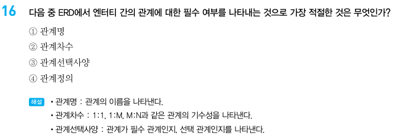

3


2


3


1


2

# Chap2. 데이터 모델과 SQL

## 1.정규화 Normalization

* 데이터 정합성을 위해 엔터티를 작은 단위로 분리하는 과정
* 입력, 수정, 삭제 성능은 보통 증가하지만 조회 성능은 케바케

> 📗데이터 정합성
>
> 데이터의 정확성과 일관성을 유지하고 보장

### 제 1 정규형

* 모든 속성은 반드시 하나의 값만 가진다.

> 🤔하나의 속성이 다중 값을 가져버린다면?
>
> application에서 데이터를 꺼내 쓸 때 불필요한 split을 사용해야한다.
>
> Ex. `select * from entertainer;`
>
> 
>
> `select * from entertainer where '가수' in job;`


* 유사한 속성이 반복되는 경우도 1차 정규화 시킨다.

> 🤔 한 엔터티 내에 유사한 속성이 반복되어버린다면?
>
> 데이터가 늘어날 때 계속해서 속성을 추가해야하고 반대로 모든 인스턴스가 추가된 속성의 개수만큼 속성 값을 가지고 있지 않을 수 있으니까 공간 낭비가 발생할 수 있다.
>
> 


### 제2 정규형

* 엔터티의 모든 일반 속성은 반드시 모든 주식별자에 종속되어야 한다.

> 🤔주식별자가 단일 식별자가 아닌 복합 식별자라면 일반 속성이 주식별자의 일부에만 종속될 수 있는데?


### 제3 정규형

* 주식별자가 아닌 모든 속성 간에는 서로 종속될 수 없다.


### 주의사항

* 지나친 정규화는 성능 저하를 일으킨다.

1. 회원의 배송 상태를 조회하려면 여러 번의 join을 해야 한다.
   

2. 회원 엔터티와 배송 엔터티 간의 관계를 생성하여 성능 개선

   


## 2.역정규화 De-Normalization

* 데이터의 조회 성능을 향상시키기 위해 데이터의 중복을 허용하거나 데이터를 grouping 하는 과정
* 조회 성능을 향상될 수 있지만 입력, 수정, 삭제 성능은 떨어지고 데이터 정합성 이슈가 생길 수 있다. 


### 테이블 역정규화


#### 테이블 병합

* 업무 프로세스에서 join이 필요한 경우가 많을 때 한다.

* 1:M관계 테이블의 병합의 경우 1 side에 해당하는 엔터티의 속성 개수가 많으면 병합했을 때 중복 데이터 수가 많아지므로 테이블 병합에 적절하지 못하다.

* 1:1 관계 테이블 병합

  

* 1:M 관계 테이블 병합

  


#### 테이블 분할

* 테이블 수직 분할

  * 엔터티 일부 속성을 별도의 엔터티로 분할 (1:1 관계 성립)

    

* 테이블 수평 분할

  * 엔터티의 인스턴스를 특정 기준으로 별도의 엔터티로 분할(partitioning)

    


#### 테이블 추가

* 중복 테이블 추가

  * 데이터의 중복을 감안하더라도 성능상 반드시 필요하다고 판단되는 경우 별도의 엔터티를 추가한다.

* 통계 테이블 추가

  

* 이력 테이블 추가

  

* 부분 테이블 추가

  


### 칼럼 역정규화

#### 중복 컬럼 추가

* 업무 프로세스 상 join이 필요한 경우가 많을 경우

#### 파생 칼럼 추가

* 프로세스 수행 시 부하가 염려되는 계산값을 미리 칼럼으로 추가하여 보관
* Ex. 상품의 재고, 프로모션 적용 할인가

#### 이력 테이블 칼럼 추가

* 대량의 이력 테이블을 조회할 때 속도가 느려질 것을 대비하여 조회 기준이 될 것으로 판단되는 컬럼을 미리 추가해 놓는 방식
* Ex. 최신 데이터 여부

### 관계 역정규화 ( = 중복 관계 추가 )

* 업무 프로세스 상 join이 필요한 경우가 많아 중복 관계를 추가하는 것이 성능 측면에서 유리할 경우


## 3. Transaction

* 데이터를 조작하기 위한 하나의 논리적인 작업 단위

  * Ex. 온라인에서 퀴즈의 정답을 맞히면 쿠폰을 즉시 발행해주는 이벤트를 하고 있을 때, 쿠폰은 선착순 100명에게만 지급된다. 

    이 경우 다음 작업들은 논리적으로 하나의 단위로 묶여야 한다.

    > * 이벤트 응모 이력을 저장한다.
    > * 쿠폰을 발행한다.

    퀴즈의 정답을 맞혀서 이벤트 응모 이력을 정상적으로 저장했는데 그 순간 선착순 100개의 쿠폰이 동나면 쿠폰 발행은 실패하게 되고, 이벤트 응모 이력 또한 롤백 되어야 한다.

    

## 4. NULL

* 존재하지 않음을 의미
* 값이 없음
* Ex. 강산은 수입이 0원인 것이고, 로운은 수입이 어떤 사유로 기재되지 않은 것이다. 

* `select 수입 - 지출 from 테이블`

  가로 연산: NULL이 포함되어 있으면 결과값은 NULL.

  

* `select sum(수입) from 테이블`

  세로 연산: 다른 인스턴스의 데이터와 연산할 때는 NULL값을 제외한다.

  


성능 데이터 모델링


4


2


3


4

1


2


4


3


4


1


3


2


4


3


1


2


3


4


중복 관계 추가

# Chap3. SQL 기본

## 1. 관계형 데이터베이스 개요

### 데이터베이스

* 데이터를 저장하는 공간

 ### 관계형 데이터베이스 Relational Datbase (RDB)

* 관계형 데이터 모델에 기초를 둔 데이터베이스

> 📗관계형 데이터 모델에서의 설계
>
> * 모든 데이터를 2차원 테이블 형태로 표현한 뒤 각 테이블 간의 관계를 정의
>
> 📗RDBMS (Relational Database Management System)
>
> * RDB를 관리 , 감독하기 위한 시스템
> * Ex. Oracle, SQL Server(MSSQL) MySQL, PostgreSQL

### TABLE

* 관계형 데이터베이스의 기본 단위


### SQL (Structured Query Language)

* 관계형 데이터베이스에서 데이터를 다루기 위해 사용하는 언어

## 2.SELECT 문

### SELECT

* 저장되어 있는 데이터를 조회하고자 할 때 사용하는 명령어

```sql
SELECT COL1, COL2, ... FROM 테이블 WHERE COL1='mtak';
```

* 칼럼을 따로 명시하지 않고 asterisk(*)를 쓰면 전체 칼럼이 조회된다.
* 별도의 WHERE 절이 없으면 테이블의 전체 ROW가 조회된다.

```sql
SELECT * FROM 테이블;
```

* 테이블명이나 칼럼명에 별도의 애칭 alias를 붙일 수 있다. 
  * alias 있는데 테이블명 쓰면 SQL ERR


```sql
SELECT BAND, BAND_NAME, BAND_MEMBER, MEMBER_NAME 
FROM BAND, BANDMEMBER 
WHERE BAND.BAND_CODE=BAND_NAME_MEMBER.BAND_CODE;

#shortened
SELECT BAND, BAND_NAME, BAND_MEMBER, MEMBER_NAME 
FROM BAND, BANDMEMBER 
WHERE BAND.BAND_CODE=BAND_NAME_MEMBER.BAND_CODE;

```


### 산술 연산자

* NUMBER DATE 유형의 데이터와 같이 사용할 사칙연산자

<table style="text-align:center;">
    <tr>
        <th>연산자</th>
        <th>우선 순위</th>
    </tr>
    <tr>
    	<td>()</td>
        <td>1</td>
    </tr>
    <tr>
        <td>*</td>
        <td rowspan='2'>2</td>
    </tr>
    <tr>
        <td>/</td>
    </tr>
    <tr>
        <td>+</td>
        <td rowspan='2'>3</td>
    </tr>
    <tr>
    	<td>-</td>
    </tr>
</table>

```sql
SELECT 10+5, 10-5, 10*5, 10/5 from DUAL;

select col1+col2 as plus,
col1-col2 as minus,
col1*col2 as multi,
col1/col2 as divi
from sample;

select (col1+col2)*col1 from sample;
```


### 합성 연산자

* 문자와 문자를 연결할 때 사용하는 연산자

```sql
select 'm'||'t'||'a'||'k' as name from sample; # colname: name, value:"mtak"
```

## 3. 함수

### 문자 함수

#### CHR(ASCII 코드)

* ASCII 코드를 인수로 입력했을 대 매핑되는 문자가 무엇인지 알려주는 함수

  > 📗ASCII 코드
  >
  > * 총 128개의 문자를 숫자로 표현할 수 있도록 정의해 놓은 코드

  ```sql
  SELECT CHR(65) FROM dual;
  ```

  

#### LOWER(문자열)

* 문자열을 소문자로 변환해주는 함수

  ```sql
  SELECT lower('Mtak') FROM dual;
  ```

  

#### UPPER(문자열)

* 문자열을 대문자로 변환해주는 함수

  ```sql
  SELECT UPPER('Mtak') FROM dual;
  ```

  

#### LTRIM(문자열 [,특정 문자])

* 특정 문자를 명시해주지 않으면 문자열의 왼쪽 공백을 제거

  ```sql
  SELECT LTRIM('  bts') FROM dual; 
  ```

  

* 특정 문자를 명시하면 문자열을 왼쪽부터 한 글자씩 특정 문자와 비교하여 특정 문자에 포함되어 있으면 제거하고 포함되지 않았으면 멈춘다.

  ```sql
  SELECT LTRIM('블랙핑크블랙', '블랙') FROM dual;
  ```

  

#### RTRIM(문자열 [,특정문자])

* 특정 문자를 명시해주지 않으면 문자열의 오른쪽 공백을 제거

  ```sql
  SELECT RTRIM('bts   ') FROM dual; 
  ```

  

* 특정 문자를 명시하면 문자열을 오른쪽부터 한 글자씩 특정 문자와 비교하여 특정 문자에 포함되어 있으면 제거하고 포함되지 않았으면 멈춘다.

  ```sql
  SELECT RTRIM('핑크블랙핑크', '핑크') FROM dual;
  ```

  

#### TRIM([<span style="color:#FB88B4">위치</span>] [<span style="color:#B7C9F2">특정 문자</span>] [FROM] 문자열)

* 옵션이 하나도 없을 경우 문자열의 양쪽 공백을 제거

  ```sql
  SELECT trim('  blackpink   ') FROM dual;
  ```

  

* 옵션이 있을 경우 문자열을 <span style="color:#FB88B4">**위치**</span>로 지정된 곳부터 한 글자씩 <span style="color:#B7C9F2">**특정 문자**</span>와 비교하여 같으면 제거하고 같지 않으면 멈춘다.

  * 특정 문자는 한 글자만 지정 가능

  > <span style="color:#FB88B4">위치</span>
  >
  > * LEADING
  > * TRAILING
  > * BOTH

  ```sql
  SELECT TRIM(LEADING 'b' FROM 'blackpink') FROM dual; 
  ```

  

#### SUBSTR(문자열, 시작점 [,길이])

* 문자열의 원하는 부분만 잘라서 반환해주는 함수

* 길이를 명시하지 않은 경우 문자열의 시작점부터 문자열의 끝까지 반환

  ```sql
  SELECT SUBSTR('블랙핑크제니',3,2) FROM dual;
  ```

  

#### LENGTH(문자열)

* 문자열의 길이를 반환

```sql
SELECT LENGTH ('mtak') FROM dual;
```

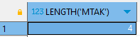

#### REPLACE(문자열, 변경 전 문자열 [,변경 후 문자열])

* 문자열에서 변경 전 문자열을 찾아 변경 후 문자열로 바꿔주는 함수

* 변경 후 문자열을 명시하지 않으면 변경 전 문자열을 제거

  ```sql
  SELECT REPLACE('지수블랙핑크지수', '지수', '제니') FROM dual;
  ```

  

  ```sql
  SELECT REPLACE('지수블랙핑크지수', '지수') FROM dual;
  ```

  


### 숫자 함수

#### ABS(수)

* 수의 절대값을 반환해주는 함수

  ```sql
  SELECT ABS(-1)  FROM dual;
  ```


#### SIGN(수)

* 수의 부호를 반환해주는 함수

  <table>
      <tr>
          <td>양수</td>
          <td>1</td>
      </tr>
      <tr>
          <td>음수</td>
          <td>-1</td>
      </tr>
      <tr>
          <td>0</td>
          <td>0</td>
      </tr>
  </table>

  ```sql
  SELECT SIGN(-9) FROM dual; 
  ```

  

#### ROUND(수 [,자릿수])

* 수를 지정된 소수점 자릿수 까지 반올림하여 반환해주는 함수

* 자릿수를 명시하지 않은 경우 기본값은 0 (정수 반환)

* 자릿수가 음수일 경우 지정된 정수부를 반올림하여 반환

  ```sql
  SELECT ROUND(0.1234, 1)  FROM dual;
  ```

  

  ```sql
  SELECT ROUND(321.123, -2) FROM dual;
  ```

  

#### TRUNC(수 [,자릿수])

* 수를 지정된 소수점 자릿수 까지 버림하여 반환해주는 함수

* 자릿수를 명시하지 않았을 경우 기본값은 0 (정수로 반환)

* 자릿수가 음수인 경우 지정된 정수부에서 버림하여 반환

  ```sql
  SELECT TRUNC(54.29, 1)  FROM dual;
  ```

  

  ```sql
  SELECT TRUNC(54.29, -1)  FROM dual;
  ```

  

#### CEIL(수 [,자릿수])

* 소수점 이하의 수를 올림한 정수를 반환해주는 함수

  ```sql
  SELECT CEIL(321.123) FROM dual;
  ```

  

  ```sql
  SELECT CEIL (-33.4) FROM dual;
  ```

  

#### FLOOR(수)

* 소수점 이하의 수를 버림한 정수를 반환해주는 함수

  ```sql
  SELECT FLOOR(22.3) FROM dual;
  ```

  

  ```sql
  SELECT FLOOR(-22.3) FROM dual;
  ```

  

#### MOD(수1, 수2)

* 수1 % 수2

  ```sql
  SELECT MOD (15,7) FROM dual;
  ```

  


### 날짜 함수

#### SYSDATE

* 현재의 연, 월, 일, 시, 분, 초를 반환해주는 함수

  ```sql
  SELECT SYSDATE FROM dual;
  ```

  

#### EXTRACT

* 날짜 데이터에서 특정 단위(YEAR, MONTH, DAY, HOUR, MINUTE, SECOND)만을 출력해서 반환해주는 함수

  ```sql
  SELECT EXTRACT (YEAR FROM SYSDATE) AS YEAR, EXTRACT (MONTH FROM SYSDATE) AS MONTH FROM dual;
  ```

  

#### ADD_MONTHS

* 날자 데이터에서 특정 개월 수를 더한 날짜를 반환해주는 함수

* 날짜의 이전 달이나 다음 달에 기분 날짜의 일자가 존재하지 않으면 해당 월의 마지막 일자가 반환된다.

  ```sql
  SELECT ADD_MONTHS(TO_DATE('2024-02-24', 'yyyy-mm-dd'), -1) FROM dual;
  ```

  

  


### 변환 함수

#### 명시적 변환과 암시적 형변환

* DB에서 데이터 유형에 대한 형변환을 할 수 있는 방법은 두 가지가 있다.

  > 1. 명시적 형변환
  >    * 변환 함수를 사용해 데이터 유형 변환을 명시적으로 나타냄
  > 2. 암시적 형변환
  >    * DB가 내부적으로 알아서 데이터 유형을 변환

  

#### 명시적 형변환에 쓰이는 함수

* **TO_NUMBER(문자열)**

  * 문자열을 숫자형으로 변환해주는 함수

    ```sql
    SELECT TO_NUMBER('1234')  FROM dual;
    ```

    

  * 'abc' 이딴거 넣으면 에러

* **TO_CHAR(수 || 날짜 [,포맷] )**

  * 수나 날짜 형의 데이터를 포맷 형식의 문자형으로 변환해주는 함수

    ```sql
    SELECT TO_CHAR(1234) FROM dual;
    ```

    

    ```sql
    SELECT TO_CHAR(SYSDATE, 'yymmdd hh24miss')  FROM dual;
    ```

    

* **TO_DATE(문자열, 포맷)**

  * 포맷 형식의 문자형의 데이터를 날짜형으로 변환해주는 함수

  <table>
      <tr>
          <th>포맷 표현</th>
          <th>의미</th>
      </tr>
      <tr>
          <td>yyyy</td>
          <td>year</td>
      </tr>
      <tr>
          <td>mm</td>
          <td>month</td>
      </tr>
      <tr>
          <td>dd</td>
          <td>day</td>
      </tr>
      <tr>
          <td>hh</td>
          <td>hour(12)</td>
      </tr>
      <tr>
          <td>hh24</td>
          <td>hour(24)</td>
      </tr>
      <tr>
          <td>mi</td>
          <td>minute</td>
      </tr>
      <tr>
          <td>ss</td>
          <td>second</td>
  </table>

  ```sql
  SELECT TO_DATE('2024/2/24/', 'yyyy/mm/dd/') FROM dual;
  ```

  

### NULL 관련 함수

#### NVL( 인수1, 인수2 )

* 인수 1의 값이 NULL인 경우 인수 2를 반환하고 NULL이 아닌 경우 인수 1을 반환해주는 함수

  ```sql
  SELECT * FROM REVIEW;
  SELECT MEMBER_NO, NVL(REVIEW_SCORE, 0) AS REVIEW_SCORE FROM REVIEW;
  ```

  <div style="display:flex;justify-content:space-between">
      
      
  </div>

#### NULLIF(인수1, 인수2)

* 인수 1과 인수 2가 같으면 NULL 반환

* 같지 않으면 인수1 반환

  ```sql
  SELECT * FROM REVIEW;
  SELECT MEMBER_NO,
  NULLIF(REVIEW_SCORE, 0) AS REVIEW_SCORE,
  REVIEW
  FROM REVIEW
  WHERE PRODUCT_ID = '100001';
  ```

  <div style="display:flex;justify-content:space-between">
      
      
  </div>

#### COALESCE(인수1, 인수2, …)

* NULL이 아닌 최초의 인수를 반환해주는 함수

  ```sql
  SELECT * FROM MEMBERINFO;
  SELECT NAME, COALESCE(PHONE, EMAIL, FAX) AS CONTACT
  FROM MEMBERINFO;
  ```

  <div style="display:flex;justify-content:space-between">
      
      
  </div>

### CASE

* ~ 이면 ~ 이고, ~ 이면 ~ 이다.

* 함수는 아니고 구문이다.

  * 함수 버전으로 DECODE가 있다.

  ```sql
  SELECT * FROM subway_info;
  
  #sol1
  SELECT subway_line,
  CASE 
  	WHEN subway_line = '1' THEN 'BLUE'
  	WHEN subway_line = '2' THEN 'GREEN'
  	WHEN subway_line = '3' THEN 'ORANGE'
  	ELSE 'GRAY'
  END AS line_color
  FROM subway_info;
  
  #sol2
  SELECT subway_line,
  CASE subway_line
      WHEN 1 THEN 'BLUE'
      WHEN 2 THEN 'GREEN'
      WHEN 3 THEN 'ORANGE'
      ELSE 'GRAY'
  END AS line_color
  FROM subway_info;
  
  #sol3
  SELECT subway_line,
  DECODE(subway_line, 1, 'BLUE', 2, 'GREEN', 3, 'ORANGE','GRAY')
  FROM subway_info;
  ```

  <div style="display:flex;justify-content:space-between">
      
      
  </div>

  

  

## 4. WHERE 절

* INSERT 를 제외한 DML을 수행할 때 원하는 데이터만 골라 수행할 수 있도록 해주는 구문

  >```sql
  >SELECT 칼럼명1, 칼럼명2 … FROM 테이블명 WHERE 조건절;
  >
  >#Ex. 
  >SELECT * FROM ENTERTAINER WHERE NAME = '이지은'; #왼쪽
  >SELECT * FROM ENTERTAINER WHERE NAME <> '이지은'; #오른쪽
  >```
  >
  >
  >
  ><div style="display:flex;justify-content:space-between">
  >    
  >    
  ></div>
  >
  >
  

### 비교 연산자


```sql
SELECT * FROM MEMBER WHERE city = 'busan';
SELECT * FOR MEMBER WHERE member_no < 10;
```

<div style="display:flex">
    
    
</div>


### 부정 비교 연산자


```sql
SELECT * play_list WHERE favorites<>'Y';
```


### SQL 연산자


```sql
#Sol1
SELECT * FROM play_list WHERE play_id BETWEEN 1 AND 5;
#Sol2
SELECT * FROM play_list WHERE play_id >= 1 AND play_id <= 5;
```


```sql
#Classical로 시작되는 행 찾기
SELECT * FROM play_list WHERE name LIKE 'Classical%';
#Music으로 끝나는 행 찾기
SELECT * FROM play_list WHERE name LIKE '%Music';
```

<div style="display:flex">
    
    
</div>

```sql
#NAME이 M으로 시작하고 S로 끝나는 행 찾기
SELECT * FROM play_list WHERE name LIKE 'M%s';
#Name에 101이 포함되는 행 찾기
SELECT * FROM play_list WHERE name LIKE '%101%';
```

<div style="display:flex">
    
    
</div>   

```sql
#TITLE이 IT Staff or IT Manager인 행 조회
#Sol1
SELECT * FROM enployee WHERE title IN ('IT Staff', 'IT Manager');
#Sol2
SELECT * FROM employee WHERE title='IT Staaff' OR title='IT Manager';
```


```sql
SELECT * FROM MEMBER WHERE company IS NULL ;
```

### 부정 SQL 연산자

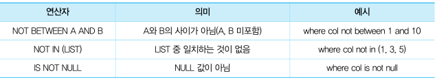

```sql
#sol1
SELECT * FROM play_list WHERE play_id NOT BETWEEN 1 AND 5;
#sol2
SELECT * FROM play_list WHERE NOT (play_id BETWEEN 1 AND 5);
#sol3
SELECT * FROM play_list WHERE NOT (1 <= play_id AND play_id <= 5);
#sol4
SELECT * FROM play_list WHERE play_id < 1 OR 5 < play_id ;
```


```sql
SELECT * FROM employee WHERE title NOT it ('IT STAFF', 'IT MANAGER');
```


```sql
#so1l
SELECT * FROM employee WHERE title NOT IN  ('IT STAFF', 'IT MANAGER');
#sol2
SELECT * FROM employee WHERE NOT (title IN ('IT STAFF', 'IT MANAGER'));
#sol3
SELECT * FROM employee WHERE NOT (title='IT STAFF' OR title='IT MANAGER');
#sol4
SELECT * FROM employee WHERE title<>'IT STAFF' AND  title <> 'IT MANAGER';
```


```sql
SELECT * FROM MEMBER WHERE company IS NOT NULL;
```


### 논리 연산자

* `()` → `NOT` → `AND` → `OR` 순서로 처리


```sql
SELECT * FROM employee WHERE title='Sales*' AND city='Calgary';
```


```sql
SELECT * FROM employee WHERE title='Sales*' OR city='Calgary';
```


```sql
#sol1
SELECT * FROM employee WHERE title <> 'Sales*' AND city <>'Calgary';

#sol2
SELECT * FROM employee WHERE NOT (title <> 'Sales*' OR  city <>'Calgary')
```


## 5. GROUP BY, HAVING 절

### GROUP BY

* GROUP BY + 그룹핑의 기준이 되는 칼럼(들)
* 데이터를 그룹 별로 묶을 수 있도록 해주는 절

### 집계 함수

* 데이터를 그룹별로 나누면 그룹 별로 집계 데이터를 도출하는 것이 가능해진다.

  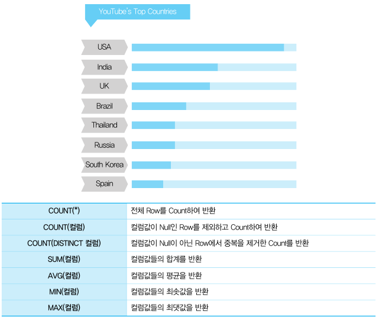


### HAVING

* GROUP BY 절을 사용할 때 WHERE 절처럼 사용하는 조건절
* 데이터를 그룹핑한 후 특정 그룹을 골라낼 때 사용
* GROUP BY 절 이후에 수행되기 때문에 그룹핑 후에 가능한 집계 함수로 조건을 부여할 수 있다.

  ```sql
  SELECT product_code
  FROM order_product
  WHERE order_date BETWEEN '20240131' AND '20240301'
  GROUP BY product_code
  HAVING COUNT(order_cnt) >= 1000;
  ```

* GROUP BY 는 WHERE 절 보다 비용이 드는 작업이니까 WHERE절로 최대한 데이터를 걸러내야 한다.

* GROUP BY 절이 없을 때 HAVING절은 테이블을 한개의 그룹으로 처리

> ### SELECT 문의 논리적인 수행 순서
>
> ```sql
> SELECT	#5
> FROM	#1
> WHERE	#2
> GROUP BY#3
> HAVING	#4
> ORDER BY#6
> ```


## 6. ORDER BY 절

### ORDER BY + 정렬의 기준이 되는 칼럼(들) + [옵션]

* SELECT 문에서 논리적으로 가장 마지막에 수행

* SELECT한 데이터를 정렬

* 없으면 임의의 순서대로 출력

* 옵션

  * ASC(ascending) - 기본 값
  * DESC(descending)

  ```sql
  SELECT * FROM member_info ORDER BY NAME;
  SELECT * FROM member_info ORDER BY NAME DESC;
  ```

  <div style="display:flex">
      
      
  </div>

  ```sql
  SELECT * FROM member_info ORDER BY grade, name;
  SELECT * FROM member_info ORDER BY grade DESC, name;
  SELECT * FROM member_info ORDER BY grade DESC, name DESC;
  ```

  <div style="display:flex">
      
      
      
  </div>

* 정렬의 기준이 되는 칼럼에서 NULL 데이터가 포함된 경우 데이터 베이스에 따라 정렬의 위치가 달라진다.

  * ORDER BY 절에 NULLS FIRST, NULLS LAST 옵션을 써서 NULL의 정렬상 순서를 변경할 수 있다. 
  * Oracle에서는 NULL이 최댓값


## 7.  JOIN 절

### JOIN?

* 각기 다른 테이블을 한 번에 보여줄 때 쓰는 쿼리

  

### EQUI JOIN

* Equal(=) 조건으로 JOIN하는 것

* Ex. sqlchild라는 아이디를 가진 사람이 온라인으로 마우스를 구매하고 리뷰를 작성했다.

  마우스는 상품 테이블의 데이터, 리뷰는 리뷰 테이블에 저장될 것이다.

  ```sql
  SELECT * FROM product;
  
  SELECT * FROM product_review;
  
  SELECT a.product_code, a.product_name, b.member_id, b.content, b.reg_date
  FROM product a, product_review b
  WHERE a.product_code = b.product_code;
  
  SELECT a.product_code, a.product_name, b.member_id, b.content, b.reg_date
  FROM product a, product_review b
  WHERE a.product_name = b.product_code AND a.product_name '무소음 무선 마우스';
  ```

  <div style="display:flex;flex-wrap:wrap;justify-content:space-around;align-content:space-around">
      
      
      
      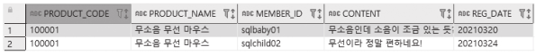
  </div>

### NON EQUI JOIN

* Equal(=) 조건이 아닌 다른 조건 (BETWEEN, >,<,>=, <=)으로 JOIN하는 방식

* Ex. 이벤트 기간 동안 리뷰를 작성한 고객에게 사은품을 주는 행사를 하고 있다.

  ```sql
  SELECT * FROM product_review;
  
  SELECT * FROM event;
  
  SELECT a.event_name, b.member_id, b.content, b.reg_date 
  FROM event a, product_review b 
  WHERE b.reg_date BETWEEN a.start_date AND a.end_date;
  ```

  <div style="display:flex;flex-wrap:wrap;justify-content:space-around;align-content:space-around">
      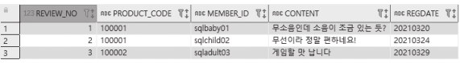
      
      
  </div>

  ### 3개 이상 TABLE JOIN

  ```sql
  SELECT a.product_name, b.member_id, b.content, c.event_name
  FROM product a, product_review b, event c
  WHERE a.product_code = b.product_code
  AND b.reg_date BETWEEN c.start_date AND c.end_date;
  ```
  
  


### OUTER JOIN

* JOIN 조건에 만족하지 않는 행들도 출력

  

  * LEFT OUTER JOIN

    * left table과 right table의 데이터 중 join에 성공한 데이터와

      join에 성공하지 못한 나머지 left table의 데이터가 함께 출력

  * Oracle에서는 모든 행이 출력되는 테이블의 반대편 테이블 옆에 (+) 호를 불여 작성하면 된다.

    ```sql
    SELECT * FROM product;
    SELECT * FROM product_review;
    SELECT a.product_code, a.product_name, b.member_id, b.content, b.reg_date
    FROM product a, product_review b
    WHERE a.product_code=b.product_code(+);
    ```

    <div style="display:flex;flex-wrap:wrap">
        
        
        
    </div>

## 8. STANDARD JOIN

* 모든 DBMS 에서 돌아가는 join

### INNER JOIN

* JOIN 조건에 충족하는 데이터만 출력되는 방식

  

* JOIN 조건을 ON 절을 사용하여 작성해야 한다.

  ```sql
  SELECT a.product_code, a.product_name, b.member_id, b.content, b.reg_date
  FROM product a INNER JOIN product_review b
  ON a.product_code=b.product_code;
  ```

  


### OUTER JOIN

* join 조건에 충족되지 않아도 출력

#### LEFT OUTER JOIN

* SQL 에서 왼쪽에 표기된 테이블의 데이터는 무조건 출력되는 JOIN

* 오른쪽 테이블에 JOIN되는 데이터가 없는 row들은 오른쪽 테이블 칼럼의 값이 NULL로 출력

  

  ```sql
  SELECT a.product_code, a.product_name, b.member_id, b.content, b.reg_date
  FROM product a LEFT OUTER JOIN product_review b
  ON a.product_code=b.product_code;
  ```

  

#### RIGHT OUTER JOIN

* SQL 에서 오른쪽에 표기된 테이블의 데이터는 무조건 출력되는 JOIN

* dhls쪽 테이블에 JOIN되는 데이터가 없는 row들은 왼쪽 테이블 칼럼의 값이 NULL로 출력

  

  ```sql
  SELECT a.product_code, a.product_name, b.member_id, b.content, b.reg_date
  FROM product a RIGHT OUTER JOIN product_review b
  ON a.product_code=b.product_code;
  ```

  


#### FULL OUTER JOIN

* 왼쪽 오른쪽 테이블의 데이터가 모두 출력되는 방식
* 단, 중복 값은 제거됨.


```sql
SELECT * FROM running_man;
SELECT * FROM infinite_challenge;

SELECT a.cast as r_cast, b.cast as i_cast
FROM running_man a FULL OUTER JOIN infinite_challenge b
on a.cast=b.cast;
```

<div style='display:flex;flex-wrap:wrap'>
    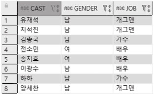
    
    
</div>


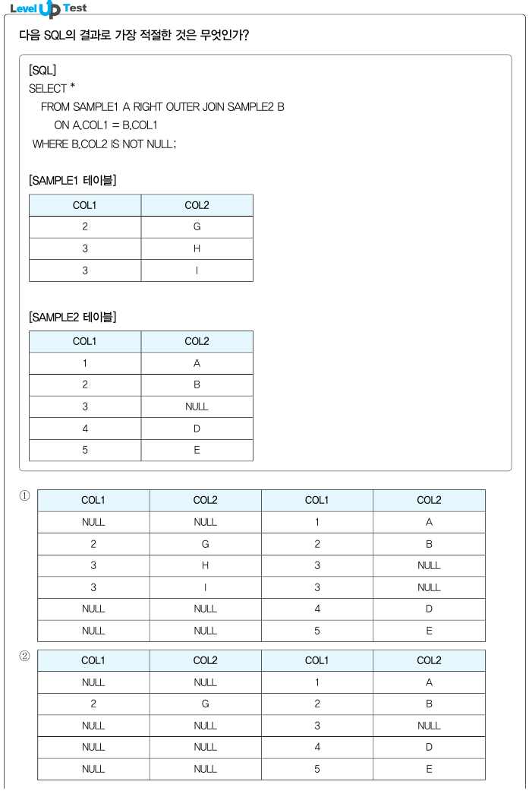


### NATURAL JOIN

* 테이블 A와 테이블 B에서 같은 이름을 가진 칼럼들이 모두 동일한 데이터를 가지고 있을 경우 JOIN되는 방식

  * ON 사용 못함

  ```sql
  SELECT * FROM running_man;
  SELECT * FROM infinite_challenge;
  SELECT * FROM running_man a NATURAL JOIN infinite_challenge b;
  ```

  <div styl="display:flex;flex-wrap:wrap">
      
      
      
  </div>

  ```sql
  #infinite_challenge 테이블의 유재석의 job을 MC로 바꾼다면
  SELECT * FROM infinite_challenge;
  #유재석 row는 같은 이름의 칼럼 중 job 칼럼이 동일하지 않은 데이터를 가지고 있어서 join 시 출력되지 않는다. 
  SELECT * FROM running_man a NATURAL JOIN infinite_challenge b;
  ```

  <div style="display:flex;flex-wrap:wrap">
      
      
  </div>

* 같은 이름을 가진 칼럼 중 원하는 칼럼만 join에 이용하고 싶다면 USING

  * 공통 칼럼 ( + USING 절 안에 정의된 칼럼의 이름)은 어디에서 쓰이든 테이블 이름이나 alias를 포함하면 안된다.

    ```sql
    SELECT cast, gender, a.job AS r_job, b.job AS l_job
    FROM running_man a JOIN inginite_challenge b
    USING (cast, gender);
    ```

      


### CROSS JOIN

* A테이블과 B테이블 사이에 JOIN 조건이 없는 경우, 조합할 수 있는 모든 경우를 출력

  

  ```sql
  SELECT * FROM entertainer;
  SELECT * FROM drink;
  SELECT * FROM ENTERTAINER CROSS JOIN drink;
  ```

  <div style="display:flex;flex-wrap:wrap">
    
    
    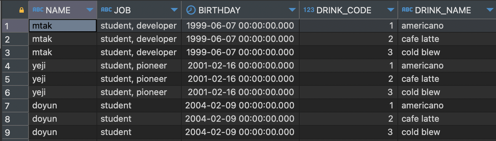
  </div>


# 문제


1


3


1


3


4


1


2


4


2


4


3


distinct


1

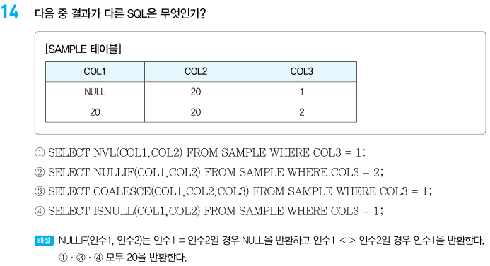

2


3


4


2


1


1


1


4


3


4


2


4


1


3


3


4


2

# Chap 4. SQL 활용

## 1. SubQuery

* 하나의 쿼리 안에 존재하는 또 다른 쿼리

  

* 위치에 따라 분류하면 다음과 같다.

  * SELECT 절
    * scalar subquery
  * FROM 절
    * inline view
  * WHERE절, HAVING 절
    * nested query


### scalar subquery

* 주로 select 절에 위치하지만, 컬럼이 올 수 있는 대부분의 위치에 사용할 수 있다. 

* 칼럼 대신 사용되기 때문에 반드시 하나의 값만을 반환해야 하며 그렇지 않은 경우 에러 발생

  ```sql
  SELECT m.product_code,
  (SELECT s.product_code
  FROM product s
  WHERE s.product_code = m.product_code) AS product_name,
  m.member_id,m.content
  FROM product_review m;
  
  SELECT m.product_code,
  (SELECT s.product_name, s.price
  FROM product s
  WHERE s.product_code=m.product_code) AS product_name,
  m.member_id,m.content,
  (SELECT s.price 
  FROM product s 
  WHERE s.product_code=m.product_code) AS price
  FROM product_review m;
  ```

  

  

  ```sql
  SELECT m.product_code,
  (SELECT s.product_name, s.price
  FROM product s
  WHERE s.product_code=m.product_code
  ) AS product_info,
  m.member_id, m.content
  FROM product_review m;
  ```

  


### inline view

* FROM 절 등 테이블명이 올 수 있는 위치에 사용 가능

  ```sql
  SELECT m.product_code, m.product_name,s.price, m.member_id, m.content
  FROM product_review m,
  (SELECT product_code, product_name, price FROM product) s 
  WHERE m.product_code=s.product_code;
  ```

  


### nested subquery

* where절과 having절에 사용할 수 있다. 
* 메인 쿼리와의 관계에 따라 2가지로 나눈다.
  * uncorreleated subquery
    * 메인 쿼리와 관계를 맺고 있지 않음
  * correlated subquery
    * 메인 쿼리와 관계를 맺고 있음
* 반환하는 데이터의 형태에 따라 다음과 같이 나눌 수 있다.
  * single row subquery
    * 서브 쿼리가 1건 이하의 데이터를 반환
    * 단일 행 비교 연산자와 함께 사용
    * =, <, >, <=, >=, <>
  * multi row subquery
    * 서브 쿼리가 여러 건의 데이터를 반환
    * 다중 행 비교 연산자와 함께 사용
    * IN, ALL, ANY, SOME, EXISTS
  * multi column subquery
    * 서브 쿼리가 여러 칼럼의 데이터를 반환

#### uncorrelated subquery

* 서브 쿼리 내에 메인 쿼리의 칼럼이 존재하지 않음

  ```sql
  SELECT * FROM agency;
  
  SELECT * FROM entertainer;
  
  SELECT name, job, birthday, agency_code FROM entertainer
  WHERE agency_code=(SELECT agency_code FROM agency WHERE agency_name="EDAM엔터테인먼트");
  ```

  <div style="display:flex;flex-wrap:wrap">
      
      
      
  </div>

#### correlated subquery

* 서브 쿼리 내에 메인 쿼리의 칼럼이 존재

```sql
SELECT * FROM cafe_order;

SELECT order_no, drink_code,order_cnt FROM cafe_order a
WHERE order_cnt=(SELECT max(order_cnt) FROM cafe_order b WHERE b.drink_code=a.drink_code);
```

<div style="display:flex;flex-wrap:flex">
    
    
</div>

#### single row subquery

* 항상 1건 이하의 결과만 반환

  ```sql
  SELECT * FROM PRODUCT;
  SELECT * FROM PRODUCT WHERE price=(SELECT max(price) FROM PRODUCT);
  ```

  <div style="display:flex;flex-wrap:wrap">
      
      
  </div>

#### multi row subquery

* 2건 이상의 행을 반환

  ```sql
  SELECT * FROM PRODUCT;
  SELECT * FROM product_review;
  SELECT * FROM PRODUCT WHERE PRODUCT_CODE IN (SELECT PRODUCT_CODE FROM PRODUCT_REVIEW);
  ```

  <div style="display:flex;flex-wrap:wrap">
      
      
      
  </div>

#### multi column subquery

```sql
SELECT * FROM jobs;
SELECT * FROM employees;
SELECT * FROM employees WHERE (job_id, salary)
IN (SELECT job_id, max_salary FROM jobs WHERE max_salary=10000);
```

<div style="display:flex;flex-wrap:wrap">
    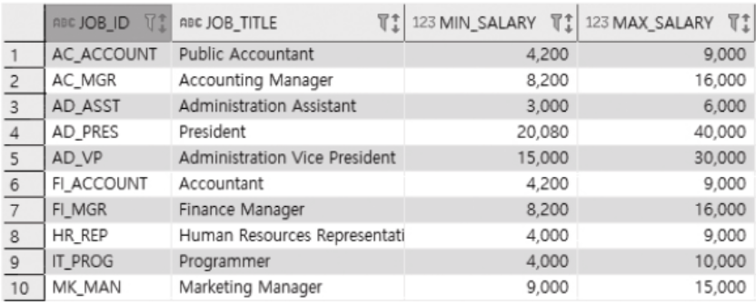
    
    
</div>


## 2. View

* 특정 SELECT 문에 이름을 붙여서 재사용이 가능하도록 저장해 놓은 오브젝트

  * 가상 테이블

* SQL에서 테이블처럼 사용 가능

  ```sql
  #view 생성
  CREATE OR REPLACE VIEW dept_member AS 
  SELECT a.department_id, a.department_name, b.first_name, b.last_name
  FROM department a LEFT OUTER JOIN employees b ON a.department_id=b.department_id;
  
  SELECT * FROM dept_member WHERE department_name='IT';
  
  SELECT department_name, count(*) 
  FROM dept_member
  GROUP BY department_name
  ORDER BY count(*) DESC;
  
  #view 삭제
  DROP VIEW dept_member;
  ```

  <div style="display:flex;flex-wrap:wrap">
      
      
  </div>


## 3. 집합 연산자

* 각 쿼리의 결과 집합을 가지고 연산을 하는 명령어

  <table>
      <tr>
          <td>UNION ALL</td>
          <td>
              <ul>
                  <li>각 쿼리의 결과 집합의 합집합.</li>
                  <li>중복된 행도 그대로 출력</li>
              </ul>
          </td>
      </tr>
      <tr>
          <td>UNION</td>
          <td>
          	<ul>
                  <li>각 쿼리의 결과 집합의 합집합.</li>
                  <li>중복된 행은 한 줄로 출력</li>
              </ul>
          </td>
      </tr>
      <tr>
          <td>INTERSECT</td>
          <td>
  	        <ul>
                  <li>각 쿼리의 결과 집합의 교집합.</li>
                  <li>중복된 행은 한 줄로 출력</li>
              </ul>
          </td>
      </tr>
      <tr>
          <td>MINUS/EXCEPT</td>
          <td>
              <ul>
                  <li>앞에 있는 쿼리의 결과 집합에서 뒤에 있는 쿼리의 결과 집합을 뺀 차집합</li>
                  <li>중복된 행은 한 줄로 출력</li>
              </ul>
          </td>
      </tr>
  </table>

### UNION ALL

* query1의 결과와 query2의 결과를 그대로 합하는 것.
* 중복된 행도 그대로 출력


```sql
SELECT * FROM running_man;
SELECT * FROM infinite_challenge;
SELECT * FROM running_man UNION ALL SELECT * FROM infinite_challenge
```

<div style="display:flex;flex-wrap:wrap">
    
    
    
</div>

### UNION

* query1의 결과와 query 2의 결과를 합한 후 중복을 제거하여 출력


```sql
SELECT * FROM running_man UNION SELECT * FROM infinite_challenge;
```


> 🤔각 쿼리의 결과 집합의 합집합에 중복된 행이 없을 때틑 union all과 union 모두 같은 결과를 얻지만, 
>
> union을 사용할 때 데이터베이스 내부적으로 중복된 행을 제거하는 과정을 거쳐야 돼서 성능상 불리할 수 있다. 

### INTERSECT

* query1의 결과와 query2의 결과에서 공통된 부분만 중복을 제거하여 출력


```sql
SELECT * FROM running_man INTERSECT SELECT * FROM infinite_challenge;
```


### MINUS/EXCEPT

* query1의 결과에서 query2의 결과를 제거하고 출력


```sql
SELECT * FROM running_man MINUS  SELECT * FROM infinite_challenge;
```


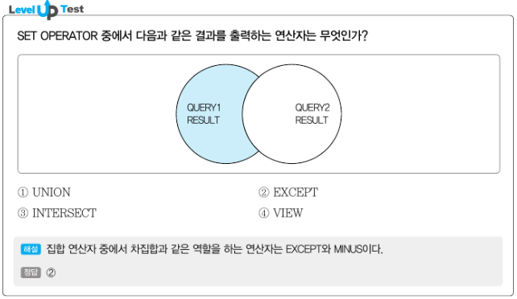

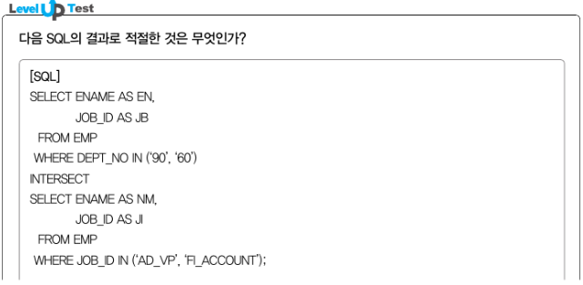


## 4. 그룹 함수

* 데이터를 group by 하여 나타낼 수 있는 데이터를 구하는 함수
* 역할에 따라 2가지로 분류된다.
  * 집계 함수
    * COUNT, SUM, AVG, MAX etc..

  * 소계(총계) 함수
    * ROLLUP,CUBE,GROUPING SETS etc..


### ROLLUP

* 소그룹 간의 소계 및 총계를 계산하는 함수

<table>
    <tr>
	    <td>ROLLUP(A)</td>
        <td>
       		<ul>
                <li>A로 그룹핑</li>                
                <li>총합계</li>
            </ul>
        </td>
    </tr>
    <tr>
	    <td>ROLLUP(A,B)</td>
        <td>
       		<ul>
                <li>A,B로 그룹핑</li></li>                
                <li>A로 그룹핑</li>
            	<li>총합계</li>
            </ul>
        </td>
    </tr>
    <tr>
	    <td>ROLLUP(A,B,C)</td>
        <td>
       		<ul>
                 <li>A,B,C로 그룹핑</li></li>                
                <li>A,B로 그룹핑</li>
	            <li>A로 그룹핑</li>
            	<li>총합계</li>
            </ul>
        </td>
    </tr>
</table>

```sql
SELECT * FROM starbucks_order;

SELECT order_dt, couont(*)
FROM starbucks_order
GROUP BY ORDER_dt
ORDER BY order_dt;

SELECT order_dt, count(*)
FROM starbucks_order
GROUP BY ROLLUP (order_dt) #날짜 별로 grouping && 합계
ORDER BY order_dt;
```

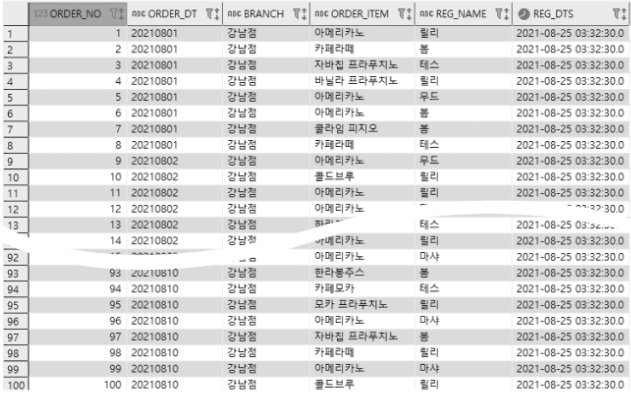

<div style="display:flex;">
    
    </div>

```sql
SELECT order_dt, order_item, count(*)
FROM starbucks_order
GROUP BY order_dt, order_item
ORDER BY order_dt;

# 날짜별 음료별로 그룹핑 && 날짜별 그룹핑 && 총합계
SELECT order_dt, order_item,count(*)
FROM starbucks_order
GROUP BY ROLLUP(order_dt, order_item)
ORDER BY order_dt;
```

<div style="display:flex">
    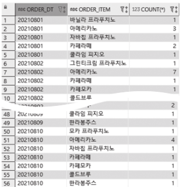
    
</div>

```sql
SELECT order_dt, order_item, reg_name, count(*)
FROM starbucks_order
GROUP BY order_dt, order_item, reg_name
GROUP BY order_dt;

# 날짜별 주문음료별 판매사원별 그룹핑 && 날짜별 주문음료별 그룹핑 && 날짜별 그룹핑 && 총합계
SELECT order_dt, order_item, reg_name, count(*)
FROM starbucks_order
GROUP BY ROLLUP (order_dt, order_item, reg_name)
GROUP BY order_dt;


```

<div style="display:flex">
    
    
</div>

```sql
# 날짜별 주문음료별 판매사원별 그룹핑 && 날짜별 주문음료별 그룹핑 && 총합계
# ROLLUP (order_dt, order_item, reg_name)에서 날짜별 그룹핑이 빠짐
SELECT order_dt, order_item, reg_name, count(*)
FROM starbucks_order
GROUP BY ROLLUP ((order_dt, order_item), reg_name) 
GROUP BY order_dt;

# 날짜별 주문음료별 판매사원별 그룹핑 && 날짜별 그룹핑 && 총합계
# ROLLUP (order_dt, order_item, reg_name)에서 && 날짜별 주문음료별 그룹핑이 빠짐
SELECT order_dt, order_item, reg_name, count(*)
FROM starbucks_order
GROUP BY ROLLUP (order_dt, (order_item, reg_name))
GROUP BY order_dt;
```

<div style="display:flex;">
    
    
</div>


### CUBE

* 소그룹 간의 소계 및 총계를 다차원적으로 계산할 수 있는 함수
* GROUP BY가 일방향으로 그룹핑하며 소계를 구했다면 CUBE는 <span style="color:#9195F6">**조합할 수 있는 모든**</span> 그룹에 대한 소계를 집계

<table>
    <tr>
        <td>CUBE(A)</td>
        <td>
       		<ul>
                <li>A로 그룹핑</li>
                <li>총합계</li>
            </ul>
        </td>
    </tr>
    <tr>
        <td>CUBE(A,B)</td>
        <td>
       		<ul>
                <li>A,B로 그룹핑</li>
                <li>A로 그룹핑</li>
                <li>B로 그룹핑</li>
                <li>총합계</li>
            </ul>
        </td>
    </tr>
    <tr>
        <td>CUBE(A,B,C)</td>
        <td>
       		<ul>
                <li>A,B,C로 그룹핑</li>
                <li>A,B로 그룹핑</li>
                <li>A,C로 그룹핑</li>
                <li>B,C로 그룹핑</li>
                <li>A로 그룹핑</li>
                <li>B로 그룹핑</li>
                <li>C로 그룹핑</li>
                <li>총합계</li>
            </ul>
        </td>
    </tr>
</table>

```sql
SELECT order_dt, COUNT(*)
FROM starbucks_order
GROUP BY order_dt
ORDER BY order_dt;

#날짜별 그룹핑 && 총합계
# rollup(order_dt)와 결과 같음
SELECT order_dt, order_item, COUNT(*)
FROM starbucks_order
GROUP BY CUBE(order_dt)
ORDER BY order_dt;
```


```sql
SELECT order_dt, order_item, COUNT(*)
FROM starbucks_order
GROUP BY order_dt, order_item
ORDER BY order_dt;

#날짜별 주문음료별 그룹핑 && 날짜별 그룹핑 && 주문음료별 그룹핑 && 총합계
SELECT order_dt, order_item, COUNT(*) 
FROM starbucks_order
GROUP BY CUBE(order_dt, order_item)
ORDER BY order_dt;

#위 쿼리를 풀어쓰면
SELECT order_dt, order_item, COUNT(*) 
FROM starbucks_order
GROUP BY order_dt, order_item
UNION ALL 
SELECT order_dt, NULL , COUNT(*)
FROM starbucks_order
GROUP BY order_dt
UNION ALL
SELECT NULL , NULL , COUNT(*) 
FROM starbucks_order
ORDER BY 1,2;
```

<div style="display:flex">
    
    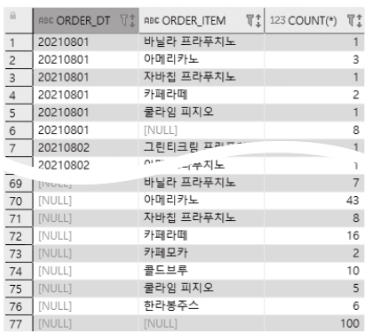
</div>

```sql
SELECT order_dt, order_item, reg_name, COUNT(*) 
FROM starbucks_order
GROUP BY order_dt, order_item, reg_name
ORDER BY order_dt;

#날짜별 주문음료별 판매사원별 그룸핑 && 날짜별 주문음료별 그룹핑 && 날짜별 판매사원별 그룸핑 
# && 날짜별 그룹핑 && 주문음료별 그룹핑 && 판매사원별 그룹핑 && 총합계
SELECT order_dt, order_item, reg_name, COUNT(*) 
FROM starbucks_order
GROUP BY CUBE (order_dt, order_item, reg_name)
ORDER BY order_dt;
```

<div style="display:flex">
    
    
</div>

```sql
# 날짜별 주문음료별 판매사원별 그룹핑 && 날짜별 주문음료별 그룹핑 && 판매사원별 그룹핑 && 총합계
SELECT order_dt, order_item, reg_name, COUNT(*) 
FROM starbucks_order
GROUP BY CUBE ((order_dt, order_item), reg_name)
ORDER BY order_dt;

# 날짜별 주문음료별 판매사원별 그룹핑 && 날짜별 그룹핑 && 주문음료별 판매사원별 그룹핑 && 총합계
SELECT order_dt, order_item, reg_name, COUNT(*) 
FROM starbucks_order
GROUP BY CUBE (order_dt, (order_item, reg_name))
ORDER BY order_dt;
```

<div style="display:flex">
    
    
</div>


### GROUPING SETS

* 특정 항목에 대한 소계를 계산하는 함수
* 인자 값으로 ROLLUP이나 CUBE를 사용할 수 있다.

<table>
    <tr>
        <td>GROUPING SETS(A, B)</td>
        <td>
            <or>
            	<li>A로 그룹핑</li>
                <li>B로 그룹핑</li>
            </or>
        </td>
    </tr>
    <tr>
        <td>GROUPING SETS(A, B, ())</td>
        <td>
            <or>
            	<li>A로 그룹핑</li>
                <li>B로 그룹핑</li>
                <li>총합계</li>
            </or>
        </td>
    </tr>
    <tr>
        <td>GROUPING SETS(A, ROLLUP(B))</td>
        <td>
            <or>
            	<li>A로 그룹핑</li>
                <li>B로 그룹핑</li>
                <li>총합계</li>
            </or>
        </td>
    </tr>
    <tr>
       <td>GROUPING SETS(A, ROLLUP(B, C))</td>
        <td>
            <or>
            	<li>A로 그룹핑</li>
                <li>B,C로 그룹핑</li>
                 <li>B로 그룹핑</li>
                <li>총합계</li>
            </or>
        </td>
    </tr>
    <tr>
        <td>GROUPING SETS(A, B, ROLLUP(C))</td>
        <td>
            <or>
            	<li>A로 그룹핑</li>
                <li>B로 그룹핑</li>
                 <li>C로 그룹핑</li>
                <li>총합계</li>
            </or>
        </td>
    </tr>
</table>

```sql
SELECT order_dt, order_item, COUNT(*) 
FROM starbucks_order
GROUP BY order_dt, order_item
ORDER BY order_dt;

#날짜별 그룹핑 && 주문음료별 그룹핑
SELECT order_dt, order_item, COUNT(*) 
FROM starbucks_order
GROUP BY GROUPING SETS (order_dt, order_item)
ORDER BY order_dt;

#날짜별 그룹핑 && 주문음료별 그룹핑 && 총계
#sol1
SELECT order_dt, order_item, COUNT(*) 
FROM starbucks_order
GROUP BY GROUPING SETS (order_dt, order_item, ())
ORDER BY order_dt;
#sol2
SELECT order_dt, order_item, COUNT(*) 
FROM starbucks_order
GROUP BY GROUPING SETS (order_dt, ROLLUP(order_item))
ORDER BY order_dt;
```

<div style="display:flex;flex-wrap:wrap">
    
    
    
</div>

```sql
SELECT order_dt, order_item, COUNT(*) 
FROM starbucks_order
GROUP BY order_dt, order_item
ORDER BY order_dt;

SELECT order_dt, order_item, COUNT(*) 
FROM starbucks_order
GROUP BY GROUPING SETS (order_dt, order_item)
ORDER BY order_dt;
```

<div style="display:flex">
    
    
</div>

```sql
SELECT order_dt, order_item, COUNT(*) 
FROM starbucks_order
GROUP BY GROUPING SETS (order_dt, order_item, ROLLUP(reg_name))
ORDER BY order_dt;

SELECT order_dt, order_item, COUNT(*) 
FROM starbucks_order
GROUP BY GROUPING SETS (order_dt, ROLLUP(order_item, reg_name))
ORDER BY order_dt;
```

<div style="display:flex">
    
    
</div>

```sql
#날짜별 주문 아이템별 그룹핑 && 판매자별 그룹핑 && 총합계
SELECT order_dt, order_item, reg_name,COUNT(*)
FROM starbucks_order
GROUP BY GROUPING SETS (ROLLUP(order_dt, order_item), reg_name)
ORDER BY order_dt, order_item, reg_name;
```


> 🤔ROLLUP 함수는 인수 순서가 중요한데, 
>
> CUBE와 GROUPING SETS 함수는 인수 순서 마음대로 해도 된다.


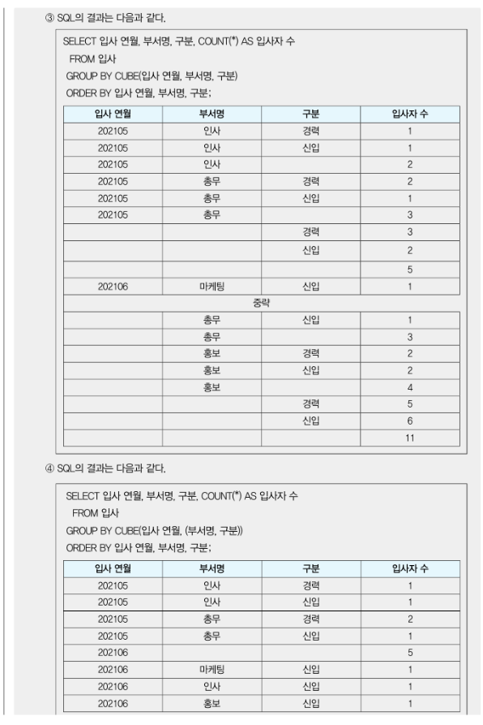


### GROUPING

* ROLLUP, CUBE, GROUPING SETS 등과 함께 사용됨
* 소계를 나타내는 ROW에 1을 넣어 다른 row들과 구분할 수 있게 해준다.

```sql
# 결과 데이터에서 소계가 계산된 ROW에서는 GROUPING 함수의 결과값이 1, 나머지 ROw에서는 0
SELECT order_dt, GROUPING(order_dt), COUNT(*) 
FROM starbucks_order
GROUP BY ROLLUP(order_dt)
ORDER BY order_dt;

#결과 값을 가지고 원하는 텍스트 출력
#sol1
SELECT CASE GROUPING(order_dt) WHEN 1 THEN 'TOTAL' ELSE order_dt END AS order_dt, COUNT(*)
FROM starbucks_order
GROUP BY ROLLUP(order_dt)
ORDER BY order_dt;
#sol2
SELECT DECODE(GROUPING(order_dt), 1, 'TOTAL', order_dt) AS order_dt, COUNT(*)
FROM starbucks_order
GROUP BY ROLLUP(order_dt)
ORDER BY order_dt;
```

<div style="display:flex">
    
    
</div>

```sql
SELECT order_dt, GROUPING(order_dt), order_item, GROUPING(order_item), COUNT(*)
FROM starbucks_order
GROUP BY ROLLUP (order_dt, order_item)
ORDER BY order_dt;

SELECT 
CASE GROUPING(order_dt) WHEN 1 them 'ALL DATES' ELSE order_dt END AS order_dt,
CASE GROUPING(order_item) WHEN 1 THEN 'ALL ITEMS' ELSE order_item END AS order_item,
COUNT(*)
FROM stsarbucks_order
GROUP BY ROLLUP(order_dt, order_item)
ORDER BY order_dt;
```

<div style="display:flex">
    
    
</div>


## 5. 윈도우 함수

* 행과 행 간의 관계를 정의하는 함수

* OVER 키워드와 함께 사용

* 역할에 따라 다음과 같이 분류됨

  <table>
      <tr>
          <td>순위 함수</td>
          <td>RANK, DENSES_RANK, ROW_NUMBER</td>
      </tr>
        <tr>
          <td>집계 함수</td>
          <td>SUM, MAX, MIN, AVG, COUNT</td>
      </tr>
        <tr>
          <td>행 순서 함수</td>
          <td>FIRST_VALUE, LAST_VALUE, LAG, LEAD</td>
      </tr>
        <tr>
          <td>비율 함수</td>
          <td>CUME_DIST, PERCENT_RANK, NTILE, RATIO_TO_REPORT</td>
      </tr>
  </table>

  > ### **OVER**(행 집합을 정의하는 기준)
  >
  > * 각 행별로 
  > * 특정 기준에 따라 필요한 집합을 구해
  > * 함수를 적용하고 싶을 때 쓰는 구문
  >   * 인자로 `ORDER_BY`나 `PARTITION BY` 사용할 수 있다.
  >
  > <창고 테이블>
  >
  > <table>
  >     <tr>
  >         <td>칼럼명</td>
  >         <td>데이터 타입</td>
  >     </tr>
  >     <tr>
  >         <td>번호(PK)</td>
  >         <td>LONG</td>
  >     </tr>
  >     <tr>
  >         <td>날짜</td>
  >         <td>DATE</td>
  >     </tr>
  >     <tr>
  >         <td>수량</td>
  >         <td>INT</td>
  >     </tr>
  > </table>
  >
  > 
  >
  > 🤔각 날짜별로 창고의 재고가 궁금해
  >
  > ```sql
  > #날짜로 정렬한 후 자기 자신과 상위에 위치한 행들을 집합에 포함
  > SELECT 번호, 날짜, 수량, SUM(수량) OVER(ORDER BY 날짜) AS 재고
  > FROM 창고
  > ```
  >
  > 
  >
  > 😎1번 행은 10/1 까지의 합 `sum(1)`, 2번 행은 10/2 까지의 합 `sum(1,2)`, 3번 행은 10/3 까지의 합`sum(1,2,3)`
  >
  > <span style="color:#9195F6">각 행별로 SUM함수에 사용된 레코드의 집합이 다 다르다.</span>
  >
  > 🤷‍♀️GROUP BY vs OVER
  >
  > * GROUP BY는 결과 행 개수에 영향을 주지만 OVER는 안준다.
  >
  > ### **PARTITION BY**
  >
  > * 어떤 칼럼의 값을 기준으로 행 집합을 나눌지 정의
  >
  > <div style="display:flex">
  >     
  >     
  > </div>
  >
  > 🤔물품 A,B 각각에 대해 날짜별로 누적 합을 구하고 싶다
  >
  > ```sql
  > SELECT 번호, 날짜, 수량, SUM(수량) OVER(PARTITION BY 물품 ORDER BY 날짜) AS 재고
  > FROM 창고
  > ORDER BY 날짜;
  > ```
  >
  > 
  >
  > 
  >
  > 

### 순위 함수

<table>
    <tr>
        <td>RANK</td>
        <td>1,2,2,4,5,5,7...</td>
    </tr>
     <tr>
        <td>DENSE_RANK</td>
        <td>1,2,2,3,4,4,5...</td>
    </tr>
     <tr>
        <td>ROW_NUMBER</td>
        <td>1,2,3,4,5,6,7</td>
    </tr>
</table>

#### RANK

* 순위를 매기면서 같은 순위가 존재하면 존재하는 수 만큼 다음 순위를 건너뛴다.

  ```sql
  SELECT order_dt, count(*), RANK () OVER (ORDER BY COUNT(*) DESC ) AS RANK 
  FROM starbucks_order
  GROUP BY order_dt;
  ```

  

  ```sql
  #부서별로 급여가 높은 사원들부터 랭킹
  SELECT first_name, last_name, department_id, salary,
  RANK() OVER (PARTITION BY department_id ORDER BY salary DESC) AS RANK 
  FROM employees;
  ```

  

#### DENSE_RANK

* 순위를 매기면서 같은 순위존재하더라도 다음 순위를 건너뛰지 않고 이어서 매긴다.

  ```sql
  # 날짜별로 주문건수를 카운트해 순위를 매긴 것
  SELECT order_dt, COUNT(*), DENSE_RANK() OVER(ORDER BY COUNT(*) DESC ) AS DENSE_RANK
  FROM starbucks_order
  GROUP BY order_dt;
  ```

  

  ```sql
  SELECT first_name, last_name, department_id, salary, DENSE_RANK() OVER(PARTITION BY department_id ORDER BY salary DESC) AS DENSE_RANK 
  FROM employees;
  ```

  

#### ROW_NUMBER

* 순위를 매기면서 동일한 값이라도 각기 다른 순위를 부여

  ```sql
  SELECT order_dt, COUNT(*), ROW_NUMBER () OVER(ORDER BY count(*) DESC ) AS ROW_NUMBER 
  FROM starbucks_order
  GROUP BY order_dt;
  ```

  

  ```sql
  SELECT first_name, last_name, department_id, salary,
  ROW_NUMBER() OVER (PARTITION BY department_id ORDER BY salary DESC) AS ROW_NUMBER
  FROM employees;
  ```

  


### 집계 함수

#### SUM

* 데이터의 합계를 구하는 함수

* 인자 값으로는 숫자형만 올 수 있다.

  ```sql
  SELECT * FROM sqld;
  
  SELECT SUM(score) AS total_score FROM sqld;
  
  #개인별 총 점수
  SELECT student_name, subject, score, SUM(score) OVER(PARTITION BY student_name) AS total_score 
  FROM sqld;
  
  #order by 로 데이터 누적값 구할 수 있다.
  SELECT student_name, subject, score,
  SUM(score) OVER(PARTITION BY student_name ORDER BY subject DESC RANGE UNBOUNDED PRECEDING) AS total_score
  FROM sqld
  
  #sum하는 칼럼을 over 절에서 order by 절에 명시해주게 되면 range unbounded preceding 구문 없어도 누적합 집계
  SELECT student_name, subject, score, SUM(score) OVER(ORDER BY score DESC) AS sum_score
  FROM sqld
  WHERE subject='SQL 기본 및 활용';
  ```

  <div style="display:flex;flex-wrap:wrap">
      
  	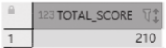
      
      
      
  </div>


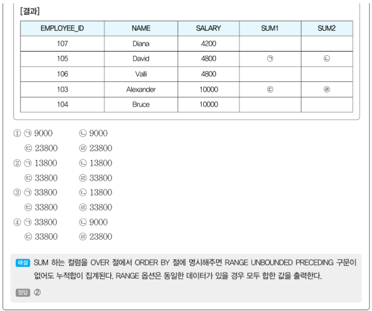

#### MAX

* 데이터의 최댓값을 구하는 함수

```sql
SELECT * FROM sqld;

SELECT MAX(score) AS max_scorel FROM sqld;

SELECT student_name, subject, score, MAX(score) OVER(PARTITION BY subject) AS max_score
FROM sqld;

SELECT student_name, subject, score
FROM (SELECT student_name, subject, score, MAX(score) OVER(PARTITION BY subject) AS max_score FROM sqld)
WHERE score=max_score;
```

<div style="display:flex;flex-wrap:wrap">
    
    
    
    
</div>


####  MIN

* 데이터의 최솟값을 구하는 함수

  ```sql
  SELECT * FROM sqld;
  SELECT MIN(score) AS min_score FROM sqld;
  SELECT student_name, subject, score, MIN(score) OVER(PARTITION BY subject) AS min_score
  FROM sqld;
  SELECT student_name, subject, score
  FROM (SELECT student_name, subject, score, MIN(score) OVER(PARTITION BY subject) AS min_score FROM sqld)
  WHERE score=min_score;
  ```

  <div style="display:flex;flex-wrap:wrap">
      
      
      
      </div>


#### AVG

* 데이터의 평균값

  ```sql
  SELECT * FROM sqld;
  
  SELECT AVG(score) AS avg_score FROM sqld;
  
  SELECT student_name, subject, score, ROUND(AVG(score) OVER(PARTITION BY subject)) AS avg_score 
  FROM sqld;
  
  SELECT student_name, subject, score FROM (SELECT student_name, subject, score, ROUND(AVG(score) OVER(PARTITION BY subject)) AS avg_score FROM sqld)
  WHERE score>= avg_score;
  ```

  <div style="display:flex;flex-wrap:wrap">
      
      
      
      </div>

> 📗윈도우 함수 사용 옵션
>
> * 집계 하려는 데이터의 범위를 지정
>
> 
>
> 
>
> <Ex>
>
> **RANGE** **BETWEEN** **UNBOUNDED** **PRECEDING** **AND** **CURRENT** **ROW** 
>
> * 처음부터 현재 행 까지
> * **RANGE** **UNBOUNDED** **PRECEDING** 와 같음
>
> **RANGE** **BETWEEN** 10 **PRECEDING** **AND** **CURRENT** **ROW** 
>
> * 현재 행이 가지고 있는 값보다 값의 차이가 10이하인 행부터 현재 행 까지
> * **RANGE** 10 **PRECEDING** 과 같음
>
> **ROWS** **BETWEEN** **CURRENT** **ROW** **AND** **UNBOUNDED** **FOLLOWING** 
>
> * 현재 행부터 끝까지
>
> **ROWS** **BETWEEN** **CURRENT** **ROW** **AND** 5 **FOLLOWING**
>
> * 현재 행부터 아래로 5만큼 이동한 행 까지

#### COUNT

* 데이터의 건수를 구하는 함수

  ```sql
  SELECT * FROM sqld;
  
  SELECT COUNT(*) AS score_count FROM sqld;
  
  SELECT student_name, subject, score, COUNT(*) OVER(PARTITION BY subject) AS pass_count
  FROM sqld
  WHERE RESULT='PASS';
  
  SELECT student_name, subject, score, COUNT(*) OVER(PARTITION BY subject ORDER BY score DESC RANGE UNBOUNDED PRECEDING) AS higher_count
  FROM sqld;
  
  SELECT student_name, subject, score, COUNT(*) OVER(PARTITION BY subject ORDER BY score DESC RANGE BETWEEN 5 PRECEDING AND 5 FOLLOWING) AS similar_count
  FROM sqld;
  ```

  <div style="display:flex;flex-wrap:wrap">
      
    
  
  
  
  </div>


### 행 순서 함수

#### FIRST_VALUE

* 파티션 별 가장 선두에 위치한 데이터를 구하는 함수

```sql
SELECT * FROM sqld;

SELECT student_name, subject, score, FIRST_VALUE(score) OVER(ORDER BY score) AS first_value FROM sqld;

SELECT student_name, subject, score, FIRST_VALUE(score) OVER(PARTIAL BY subject ORDER BY score DESC) AS first_value FROM sqld;
```

<div style="display:flex;flex-wrap:wrap">
    
    
    
</div>


#### LAST_VALUE

* 파티션 가장 끝에 위치한 데이터를 구하는 함수

  ```sql
  SELECT * FROM sqld;
  
  #오름차순으로 정렬한 후 마지막 점수는 모두 77이 출력되어야 할 것 같은데 실제로는 row의 score값과 동일한 값이 출력된다?
  #windowing절의 default가 range unbounded preceding이라 파티션의 범위가 맨 위 끝 행부터 현재 행까지로 지정되서 그렇다
  SELECT student_name, subject, score, LAST_VALUE(score) OVER(ORDER BY score) AS last_value FROM sqld;
  #파티션 범위가 맨 마지막 끝행까지로수정!
  SELECT student_name, subject, score, LAST_VALUE(score) OVER(ORDER BY score RANGE BETWEEN UNBOUNDED PRECEDING AND UNBOUNDED FOLLOWING) AS last_value FROM sqld;
  #이제 과목별 가장 높은 점수 구하기
  SELECT student_name, subject, score, LAST_VALUE(score) OVER(PARTITION BY subject ORDER BY score RANGE BETWEEN UNBOUNDED PRECEDING AND UNBOUNDED FOLLOWING) AS last_value FROM sqld;
  
  ```

  <div style="display:flex;flex-wrap:wrap">
  
  
  
      
  </div>


#### LAG

* 


## 6. Top-N 쿼리


## 7. Self Join


## 8. 계층 쿼리


# 문제


3


4


1


1


1


3


4

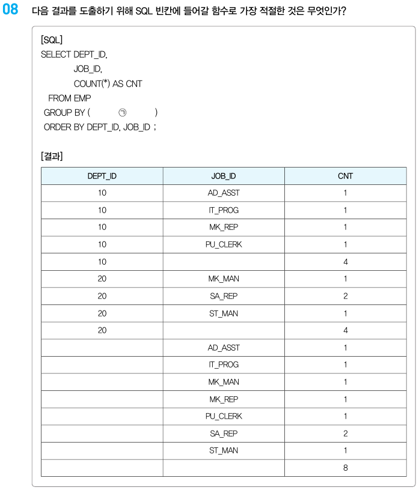


4


3


2


3


2


1


2


4


3


4


2


1


3


3


1


2


4


ROWNUM <= 5  or ROWNUM < 6


1,4


3


3


2


1


# Chap 5. 관리 구문

## 1. DML


## 2. TCL


## 3. DDL


## 4. DCL


# 문제


3


4


3


2


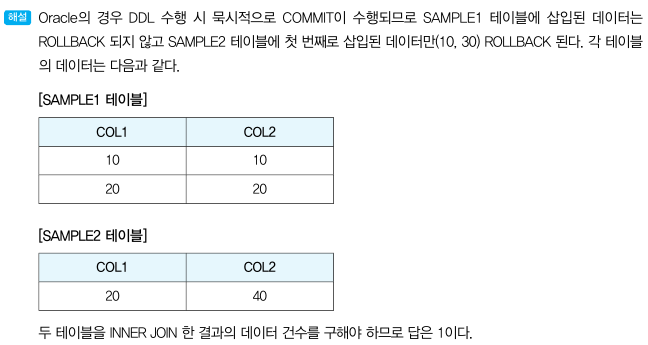

2


1


2


4

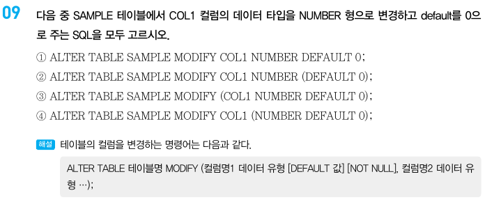

1,3


3,4

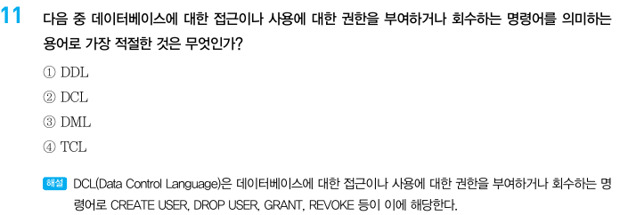

2


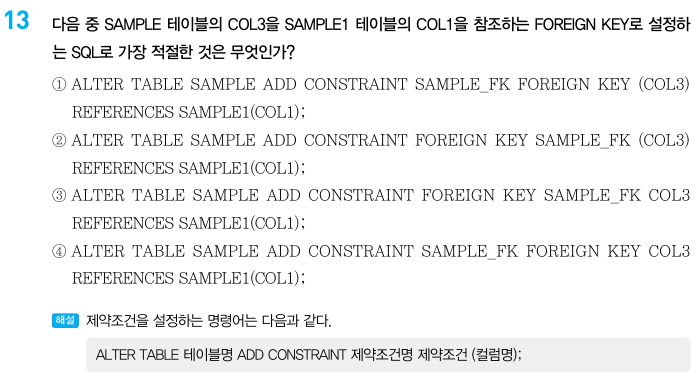

1


3


4


3


1

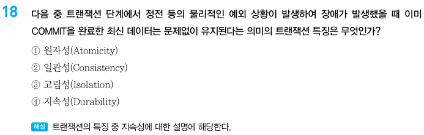

4


ALL


3

