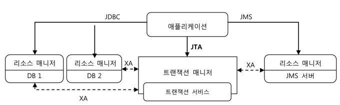
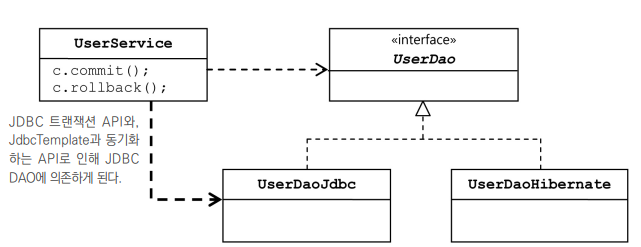
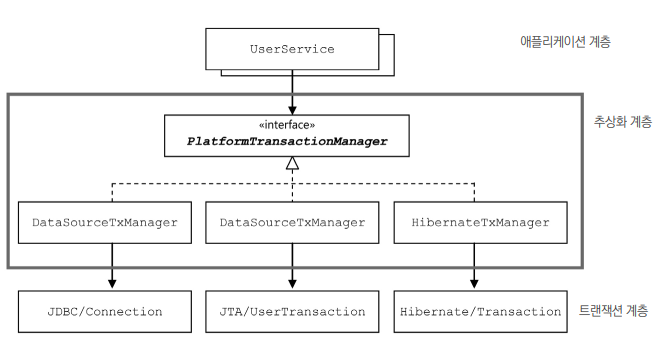
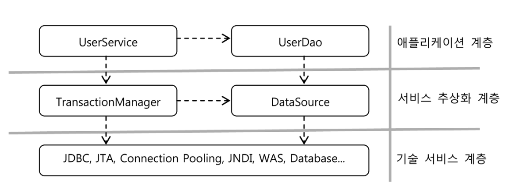

지금까지 만든 DAO 에 transaction 을 적용하면서 스프링이 어떻게 성격이 비슷한 여러 종류의 기술을 추상화하고 이를 일관된 방법으로 사용할 수 있도록 지원하는지를 살펴보자.  

# 1. 사용자 레벨 관리 기능 추가

현재 UserDao는 CRUD만 가능하다. 여기에 사용자 관리 기능을 추가해보자
만들 비즈니스 로직

* 사용자의 레벨은 BASIC, SILVER, GOLD 세 가지 중 하나다.
*  사용자가 처음 가입하면 BASIC 레벨이 되며, 이후 활동에 따라서 한 단계씩 업그레이드될 수  있다. 
* 가입 후 50회 이상 로그인을 하면 BASIC에서 SILVER 레벨이 된다. 
* SILVER 레벨이면서 30번 이상 추천을 받으면 GOLD 레벨이 된다. 
* 사용자 레벨의 변경 작업은 일정한 주기를 가지고 일괄적으로 진행된다
  변경 작업 전에는 조 건을 충족하더라도 레벨의 변경이 일어나지 않는다

😎조건에 따라 사용자의 레벨을 주기적으로 변경한다는 내용이로군

## 1.1 필드 추가

### Level enum

User class에 사용자의 레벨을 저장할 필드를 추가하자 . 

🤔varchar 타입으로 할까? 별론데.. 각 레벨을 코드화 해서 숫자로 넣을까?

```java
class User {
private static final int BASIC = 1;
private static final int SILVER = 2;
private static final int GOLD = 3;
int level;
public void setLevel(int level) {
 this.level = level;
}
```

```java
if (user1.getLevel() = = User.BASIC) {
user1.setLevel(User.SILVER);
}
```

🤔level의 타입이 int라서 다른 종류의 정보를 넣거나 없는 번호를 넣어도 컴파일러가 모를 것 같다. 

``` java
user1.setLevel(other.getSum());
user1.setLevel(1000);
```

😎java5 ~ 의  enum을 사용하자

```java
package com.example.tobby.user.dao;

public enum Level {
    BASIC(1), SILVER(2), GOLD(3);
    private final int value;

    public int getValue() {
        return value;
    }

    Level(int value) {
        this.value = value;
    }

    public static Level valueOf(int value) {
        return switch (value) {
            case 1 -> BASIC;
            case 2 -> SILVER;
            case 3 -> GOLD;
            default -> throw new AssertionError("Unknown value: " + value);
        };
    }
}

```

### User 필드 추가

Level typed 변수, 로그인 횟수, 추천수까지 User class에 추가하자. 

### UserDaoTest 수정

```java
    @BeforeEach
    private void setUp() {
        SingleConnectionDataSource dataSource = new SingleConnectionDataSource("jdbc:mysql://localhost/tobby", "tobaby", "0000", true);
//        dao.setDataSource(dataSource);
//        dao = context.getBean("userDao", UserDao.class);
        user3 = new User("mtak", "탁민경", "0000", Level.BASIC, 1, 0);
        user1 = new User("yeji", "탁예지", "0000", Level.SILVER, 55, 10);
        user2 = new User("doyun", "탁도윤", "000", Level.GOLD, 100, 40);
        
    }

```

​	

```java
    private void checkSameUser(User user, User user1) {
        assertThat(user.getId()).isEqualTo(user1.getId());
        assertThat(user.getPassword()).isEqualTo(user1.getPassword());
        assertThat(user.getName()).isEqualTo(user1.getName());
        assertThat(user.getLevel()).isEqualTo(user1.getLevel());
        assertThat(user.getLogin()).isEqualTo(user1.getLogin());
        assertThat(user.getRecommend()).isEqualTo(user1.getRecommend());
    }
```

###  UserDaoJdbc 수정

```java
    public void add(User user) {
        this.jdbcTemplate.update("insert into users (id, name, password, level, login, recommend) values(?,?,?, ?, ?, ?)", user.getId(), user.getName(), user.getPassword(), user.getLevel().intValue(), user.getLogin(), user.getRecommend());

    }
```

```java
public class UserDaoJdbc implements UserDao {

    private final RowMapper<User> userMapper = new RowMapper<>() {
        @Override
        public User mapRow(ResultSet rs, int rowNum) throws SQLException {
            User user = new User();
            user.setId(rs.getString("id"));
            user.setName(rs.getString("name"));
            user.setPassword(rs.getString("password"));
            user.setLevel(Level.valueOf(rs.getString("level")));
            user.setLogin(rs.getInt("login"));
            user.setRecommend(rs.getInt("recommend"));
            return user;
        }
    };
    ...
}
```

## 1.2 사용자 수정 기능 추가

수정할 정보가 담긴 User 오 브젝트를 전달하면 id를 참고해서 사용자를 찾아 필드 정보를 UPDATE 문을 이용해 모두  변경해주는 메소드를 하나 만들겠다. 

### 수정 가능 테스트 추가

```java
    @Test
    public void update() {
        dao.deleteAll();
        dao.add(user1);
        user1.setName("루삥뽕");
        user1.setPassword("0000");
        user1.setLevel(Level.GOLD);
        user1.setLogin(1000);
        user1.setRecommend(999);
        dao.update(user1);
        User user1update = dao.get(user1.getId());
        checkSameUser(user1, user1update);
    }
```

### UserDao와 UserDaoJdbc 수정

```java
@Override
    public void update(User user) {
        this.jdbcTemplate.update("update users set name=?, password=?, level=?, login=?, recomment=? where id=?", user.getName(), user.getPassword(), user.getLevel().intValue(), user.getLogin(), user.getRecommend(), user.getId());
    }
```

### 수정 테스트 보완

만약, 쿼리에서 where문이 빠지면 지금 Test문으론 못 잡는다. 수정한 레코드는 변경사항이 잘 반영 되었는지 확인을 하는데, 다른 레코드는 여전히 바뀌지 않았는지 확인하지 않기 때문이다.  어카노?

1. jdbcTemplate의 update()가 돌려주는 리턴 값을 확인한다. 
   * jdbcTemplate의  update()는 update, delete같이 테이블에 영향을 주는 SQL을 실행하면서 몇개의 row가 영향을 받았는지 리턴한다. 
2. 테스트를 보강해서 원하는 사용자 외의 정보가 그대로가 맞는지 확인한다. 

## 1.3 UserService.upgradeLevels()

 UserDao의 getAll() 메소드로 사용자를 다 가져와서 사용 자별로 레벨 업그레이드 작업을 진행하면서 UserDao의 update()를 호출해 DB에 결과를  넣어주면 된다.

### UserService 클래스와 빈 등록

```java
package com.example.tobby.user;

import com.example.tobby.user.dao.UserDao;

public class UserService {
    UserDao userDao;

    public void setUserDao(UserDao userDao) {
        this.userDao = userDao;
    }
}

```

```xml
    <bean id="userService" class="com.example.tobby.user.UserService">
        <property name="userDao" ref="userDao"/>
    </bean>
```

### UserServiceTest class

```java
package com.example.tobby.user;

import org.junit.jupiter.api.Test;
import org.junit.jupiter.api.extension.ExtendWith;
import org.springframework.beans.factory.annotation.Autowired;
import org.springframework.boot.test.context.SpringBootTest;
import org.springframework.test.context.ContextConfiguration;
import org.springframework.test.context.junit.jupiter.SpringExtension;

import static org.assertj.core.api.Assertions.assertThat;
import static org.junit.jupiter.api.Assertions.*;

@SpringBootTest
@ExtendWith(SpringExtension.class)
@ContextConfiguration(locations = "/test.xml")
class UserServiceTest {

    @Autowired
    UserService userService;

    @Test
    void bean() {
        assertThat(this.userService).isNotNull();
    }
}
```

### upgradeLevels()

```java
package com.example.tobby.user;

import com.example.tobby.user.dao.UserDao;
import com.example.tobby.user.domain.Level;
import com.example.tobby.user.domain.User;

import java.util.List;

public class UserService {
    UserDao userDao;

    public void setUserDao(UserDao userDao) {
        this.userDao = userDao;
    }

    public void upgradeLevels() {
        List<User> users = userDao.getAll();
        for (User user : users) {
            Boolean changed = null;
            if (user.getLevel() == Level.BASIC && user.getLogin() >= 50) {
                user.setLevel(Level.SILVER);
                changed = true;
            } else if (user.getLevel() == Level.SILVER && user.getRecommend() >= 30) {
                user.setLevel(Level.GOLD);
                changed = true;
            } else if (user.getLevel() == Level.GOLD) {
                changed = false;
            } else {
                changed = false;
            }

            if (changed) {
                userDao.update(user);
            }
        }
    }
}

```

### upgradeLevels() test

레벨 basic, silver, gold 중 변경이 일어나는 basic, silver 고려해서 총 5가지 케이스틑 테스트 해야 한다. 

```java
package com.example.tobby.user;

import com.example.tobby.user.dao.UserDao;
import com.example.tobby.user.domain.Level;
import com.example.tobby.user.domain.User;
import org.junit.jupiter.api.BeforeEach;
import org.junit.jupiter.api.Test;
import org.junit.jupiter.api.extension.ExtendWith;
import org.springframework.beans.factory.annotation.Autowired;
import org.springframework.boot.test.context.SpringBootTest;
import org.springframework.test.context.ContextConfiguration;
import org.springframework.test.context.junit.jupiter.SpringExtension;

import java.util.Arrays;
import java.util.List;

import static org.assertj.core.api.Assertions.assertThat;

@SpringBootTest
@ExtendWith(SpringExtension.class)
@ContextConfiguration(locations = "/test.xml")
class UserServiceTest {

    @Autowired
    UserService userService;
    @Autowired
    UserDao userDao;
    List<User> users;

    @BeforeEach
    public void setUp() {
        users = Arrays.asList(
                new User("bumjin", "박범진", "p1", Level.BASIC, 49, 0),
                new User("joytouch", "강명성", "p2", Level.BASIC, 50, 0),
                new User("erwins", "신승한", "p3", Level.SILVER, 60, 29),
                new User("madnite1", "이상호", "p4", Level.SILVER, 60, 30),
                new User("green", "오민규", "p5", Level.GOLD, 100, 100)
        );
    }

    @Test
    void bean() {
        assertThat(this.userService).isNotNull();
    }

    @Test
    public void upgradeLevels() {
        userDao.deleteAll();
        for (User user : users) userDao.add(user);
        userService.upgradeLevels();
        checkLevel(users.get(0), Level.BASIC);
        checkLevel(users.get(1), Level.SILVER);
        checkLevel(users.get(2), Level.SILVER);
        checkLevel(users.get(3), Level.GOLD);
        checkLevel(users.get(4), Level.GOLD);
    }

    private void checkLevel(User user, Level expectedLevel) {
        User userUpdate = userDao.get(user.getId());
        assertThat(userUpdate.getLevel()).isEqualTo(expectedLevel);
    }
}
```

## 1.4 UserService.add()

 처음 가입하 는 사용자는 기본적으로 BASIC 레벨이어야 한다는 부분이 필요하다. 

🤔User 클래스에서 아예 level 필드를 Level.BASIC으로 초기화하는 것은 어 떨까?
처음 가입할 때를 빼고는 필요 없는 정보인데 굳이?

😎UserService 에 add()하나 파서 넣자!

```java
 @Test
    public void add() {
        userDao.deleteAll();
        User userWithLevel = users.get(4);	 // GOLD 레벨
        User userWithoutLevel = users.get(0);
        userWithoutLevel.setLevel(null);
        userService.add(userWithLevel);
        userService.add(userWithoutLevel);
        User userWithLevelRead = userDao.get(userWithLevel.getId());
        User userWithoutLevelRead = userDao.get(userWithoutLevel.getId());
        assertThat(userWithLevelRead.getLevel()).isEqualTo(userWithLevel.getLevel());
        assertThat(userWithoutLevelRead.getLevel()).isEqualTo(Level.BASIC);
    }
```

```java
    public void add(User user) {
        if (user.getLevel() == null) user.setLevel(Level.BASIC);
        userDao.add(user);
    }
```

### 1.5 코드 개선

### upgradeLevels( ) 메소드 코드의 문제점

for 루프 속에 들어 있는 if/elseif/else 블록들이 읽기 불편하다
 만약 새로운 레벨이 추가된다면  Level 이늄도 수정해야 하고, upgradeLevels()의 레벨 업그레이드 로직을 담은 코드에  if 조건식과 블록을 추가해줘야 한다.

😎변경이 잦은 내용이 추상적인 로직의 흐름과 함께 섞여 있다. 

### upgradeLevels( ) 리팩토링

레벨을 업그레이드 하는 작업의 기본 흐름만 먼저 만들어보자. 

```java
    public void upgradeLevels() {
        List<User> users = userDao.getAll();
        for (User user : users) {
            if (canUpgradeLevel(user)) upgradeLevel(user);
        }
    }
```

```java
    private void upgradeLevel(User user) {
        if (user.getLevel() == Level.BASIC) user.setLevel(Level.SILVER);
        else if (user.getLevel() == Level.SILVER) user.setLevel(Level.GOLD);
        userDao.update(user);
    }

    private boolean canUpgradeLevel(User user) {
        Level currentLevel = user.getLevel();
        switch (currentLevel) {
            case BASIC:
                return (user.getLogin() >= 50);
            case SILVER:
                return (user.getRecommend() >= 30);
            case GOLD:
                return false;
            default:
                throw new IllegalArgumentException("Unknown Level: " +
                        currentLevel);
        }
    }
```

🤔upgradeLevel() 메소드 코드는 마음에 안 든다. 
사용자 오브젝트의 레벨정보를 다음 단계로 변경하고, 변경된 오브젝트를 DB에 업데이트하는 두 가지 작업을 수행하고 있다..
레벨이 늘어나면 if 문이 점점 길어질 것이고, 레벨 변경 시 사용 자 오브젝트에서 level 필드 외의 값도 같이 변경해야 한다면 if 조건 뒤에 붙는 내용도  점점 길어질 것이다.

😎먼저 레벨의 순서와 다음 단계 레벨이 무엇인지를 결정하는 일은 Level에게 맡기자. 

```java
package com.example.tobby.user.domain;

public enum Level {
    GOLD(3, null), SILVER(2, GOLD), BASIC(1, SILVER);
    private final int value;
    private final Level next;

    public int intValue() {
        return value;
    }

    Level(int value, Level next) {
        this.value = value;
        this.next = next;
    }

    public static Level valueOf(int value) {
        return switch (value) {
            case 1 -> BASIC;
            case 2 -> SILVER;
            case 3 -> GOLD;
            default -> throw new AssertionError("Unknown value: " + value);
        };
    }
}

```

😎사용자 정보가 바뀌는 부분을 UserService 메소드에서 User로 옮겨보자

```java
package com.example.tobby.user.domain;

public class User {
    String id;
    String name;

    Level level;
    int login;
    int recommend;
    String password;

    public User() {
    }

    public User(String id, String name, String password, Level level,
                int login, int recommend) {
        this.id = id;
        this.name = name;
        this.password = password;
        this.level = level;
        this.login = login;
        this.recommend = recommend;
    }

...
    public void upgradeLevel() {
        Level nextLevel = this.level.nextLevel();
        if (nextLevel == null) {
            throw new IllegalStateException(this.level + "은 업그레이드가 불가능합니다");
        } else {
            this.level = nextLevel;
        }
    }
}

```

UserService 의 canUpgradeLevel() 메소드에서 업그레이드 가능 여부를 미리 판단해주기는 하지만,  User 오브젝트를 UserService만 사용하는 건 아니므로 스스로 예외상황에 대한 검증 기 능을 갖고 있는 편이 안전하다.

```java
    private void upgradeLevel(User user) {
        user.upgradeLevel();
        userDao.update(user);
    }
```

간결해졌다!

😎 UserService, User, Level이 내부 정보를  다루는 자신의 책임에 충실한 기능을 갖고 있으면서 필요가 생기면 이런 작업을 수행해 달라고 서로 요청하는 구조다.

처음 구현했던 UserService의 upgradeLevels() 메소드는 User 오브젝트에서 데이 터를 가져와서 그것을 가지고 User 오브젝트나 Level 이늄이 해야 할 작업을 대신 수행 하고 직접 User 오브젝트의 데이터를 변경해버린다. 이보다는 UserService는 User에게  “레벨 업그레이드 작업을 해달라”고 요청하고, 또 User는 Level에게 “다음 레벨이 무엇인 지 알려달라”고 요청하는 방식으로 동작하게 하는 것이 바람직하다.

### User test

upgradeLevel()을 테스트하자. 

```java
package com.example.tobby.user.domain;

import org.junit.jupiter.api.BeforeEach;
import org.junit.jupiter.api.Test;

import static org.assertj.core.api.Assertions.assertThat;
import static org.junit.jupiter.api.Assertions.assertThrows;

class UserTest {
    User user;

    @BeforeEach
    public void setUp() {
        user = new User();
    }

    @Test
    void upgradeLevel() {
        Level[] levels = Level.values();
        for (Level level : levels) {
            if (level.nextLevel() == null) continue;
            user.setLevel(level);
            user.upgradeLevel();
            assertThat(user.getLevel()).isEqualTo(level.nextLevel());
        }
    }

    @Test
    public void cannotUpgradeLevel() {
        Level[] levels = Level.values();
        for (Level level : levels) {
            if (level.nextLevel() != null) continue;
            user.setLevel(level);
            assertThrows(IllegalStateException.class, () -> user.upgradeLevel());
        }
    }
}
```

###  UserServiceTest 개선

Level이 갖고 있어야 할 다음 레벨이 무엇인가 하는 정보를 테스트에  직접 넣어둘 이유가 없다.  리팩토링 ㄱㄱ

```java
    @Test
    public void upgradeLevels() {
        userDao.deleteAll();
        for (User user : users) userDao.add(user);
        userService.upgradeLevels();
        checkLevelUpgraded(users.get(0), false);
        checkLevelUpgraded(users.get(1), true);
        checkLevelUpgraded(users.get(2), false);
        checkLevelUpgraded(users.get(3), true);
        checkLevelUpgraded(users.get(4), false);
    }

    private void checkLevelUpgraded(User user, boolean upgraded) {
        User userUpdate = userDao.get(user.getId());
        if (upgraded) {
            assertThat(userUpdate.getLevel()).isEqualTo(user.getLevel().nextLevel());
        }
        else {
            assertThat(userUpdate.getLevel()).isEqualTo(user.getLevel());
        }
    }
```

🤔코드에 나타난 중복을 제거해보자. 업그레이드 조건인 로그인 횟수와 추천 횟 수가 애플리케이션 코드와 테스트 코드에 중복돼서 나타난다

```java
case BASIC: return (user.getLogin() >= 50); // UserService
new User("joytouch", "강명성", "p2", Level.BASIC, 50, 0) // UserServiceTest
```

상수 값을 중복하는 건 바람직하지 못하다. 기준이 되는 최소 로그인 횟수가 변경될  때도 한 번만 수정할 수 있도록 만들자. 

```java
    public static final int MIN_LOGCOUNT_FOR_SILVER = 50;
    public static final int MIN_RECCOMEND_FOR_GOLD = 30;
    private boolean canUpgradeLevel(User user) {
        Level currentLevel = user.getLevel();
        switch (currentLevel) {
            case BASIC:
                return (user.getLogin() >= MIN_LOGCOUNT_FOR_SILVER);
            case SILVER:
                return (user.getRecommend() >= MIN_RECCOMEND_FOR_GOLD);
            case GOLD:
                return false;
            default:
                throw new IllegalArgumentException("Unknown Level: " +
                        currentLevel);
        }
    }
```

```java
    @BeforeEach
    public void setUp() {
        users = Arrays.asList(
                new User("bumjin", "박범진", "p1", Level.BASIC, MIN_LOGCOUNT_FOR_SILVER-1, 0),
                new User("joytouch", "강명성", "p2", Level.BASIC, MIN_LOGCOUNT_FOR_SILVER, 0),
                new User("erwins", "신승한", "p3", Level.SILVER, 60, MIN_RECCOMEND_FOR_GOLD-1),
                new User("madnite1", "이상호", "p4", Level.SILVER, 60, MIN_RECCOMEND_FOR_GOLD),
                new User("green", "오민규", "p5", Level.GOLD, 100, Integer.MAX_VALUE)
        );
    }
```

레벨을 업그레이드하는 정책을 유연하게 변경할 수 있도록 개선해보자.

사용자 업그레이드 정책을 UserService에서 분리하기 위해 분리된 업그레이드 정책을 담은 오브젝트는 DI를 통해 UserService에 주입한다. 

업그레이드 정책을 담은 인터페이스

```java
package com.example.tobby.user;

import com.example.tobby.user.domain.User;

public interface UserLevelUpgradePolicy {
    boolean canUpgradeLevel(User user);
    void upgradeLevel(User user);
}

```

# 2. 트랜잭션 서비스 추상화

🤔“정기 사용자 레벨 관리 작업을 수행하는 도중에 네트워크가 끊기거나 서버에 장애가  생겨서 작업을 완료할 수 없다면, 
그때까지 변경된 사용자의 레벨은 그대로 둘까요? 아니 면 모두 초기 상태로 되돌려 놓아야 할까요?"

😎그때까지 진행된 변경 작업도 모두 취소 시켜야지 그걸 말이라고 함?

## 2.1 모 아니면 도

지금 코드로 사용자 레벨 업그레이드가 중간에 중단되면 어케될까?

### 테스트용  UserService대역

작업 중간에 예외를 강제로 만들 수 있을까? 
가장 쉬운 방법은 예외를 강제로 발 생시키도록 애플리케이션 코드를 수정하는 것은 다매다요.

보통 UserService를 대신해서 테스트의 목적에  맞게 동작하는 클래스를 만들어 사용한다. 그럼 어떻게 만들까? UserService상속해다가 필요한 메소드만 오버라이딩 하면 되지 뭐.

```java
    static class TestUserService extends UserService {
        private String id;
        private TestUserService(String id) {
            this.id = id;
        }
        protected void upgradeLevel(User user) {
            if (user.getId().equals(this.id)) throw new TestUserServiceException();
            super.upgradeLevel(user);
        }

        
    }
    static class TestUserServiceException extends RuntimeException {
    }
```

### 강제 예외 발생을 통한 테스트

사용자 레벨 업그레이드를 시도하다가 중간 에 예외가 발생했을 경우, 그 전에 업그레이드했던 사용자도 다시 원래 상태로 돌아갔는 지를 확인하는 것이다

```java
    @Test
    public void upgradeAllorNothing() {
        TestUserService testUserService = new TestUserService(users.get(3).getId());
        testUserService.setUserDao(this.userDao);
        userDao.deleteAll();
        for (User user : users) userDao.add(user);
        try {
            testUserService.upgradeLevels();
            fail("err");
        } catch (TestUserServiceException e) {
        }
        checkLevelUpgraded(users.get(1), false);
    }

    static class TestUserService extends UserService {
        private final String id;

        private TestUserService(String id) {
            this.id = id;
        }

        protected void upgradeLevel(User user) {
            if (user.getId().equals(this.id)) throw new TestUserServiceException();
            super.upgradeLevel(user);
        }
    }

    static class TestUserServiceException extends RuntimeException {
    }
```

어림도 없지 롤백 안됐었네!

### 테스트 실패의 원인

트랜잭션이 적용 안된게 문제다. 

> 트랜잭션 
>
> * 더 이상 나눌 수 없는 단위 작업
> * 전체가  다 성공하든지 아니면 전체가 다 실패

## 2.2 트랜잭션 경계 설정

DB는 그 자체로 완벽한 트랜잭션을 지원한다

하나의 SQL 명령을  처리하는 경우는 DB가 트랜잭션을 보장해준다고 믿을 수 있다.

하지만 여러 개의 SQL이 사용되는 작업을 하나의 트랜잭션으로 취급해야 하는 경우 도 있다. 
여기서 트랜잭션 안에서 문제가 생기면 앞에서 진행한 작업을 취소해야 하는데 이응 transaction rollback이라고 한다. 
모든 SQL 수행 작업이 다  성공적으로 마무리됐다고 DB에 알려줘서 작업을 확정시켜야 하는데 이를  트랜잭션 커밋 transaction commit이라고 한다.

> 롤백 : 모든 작업을 무효화
> 커밋: 모든 작업을 다 확정
> 트랜잭션의 경계 : 트랜잭션이 시작하고 끝나는 위치

### JDBC 트랜잭션 경계 설정

모든 트랜잭션은 시작하는 지점과 끝나는 지점이 있다. 
시작하는 방법은 한 가지이지만  끝나는 방법은 두 가지다. 
모든 작업을 무효화하는 롤백과 모든 작업을 다 확정하는 커밋이다. 

JDBC의 트랜잭션은 하나의 Connection을 가져와 사용하다가 닫는 사이에서 일어난다.

JDBC 에서 
트랜잭션을 시작하려면 자동커밋 옵션을 false로 만들어주면 된다.
트랜잭션을 종료하려면 commit() 또는 rollback()을 하면 작업 결과가 DB에 반영 되거나 취소된다.

```java
        Connection c = new SimpleDriverDataSource().getConnection();
        c.setAutoCommit(false); //transaction 시작!
        try {
            PreparedStatement st1 = c.prepareStatement("update users set ..");
            st1.executeUpdate();
            PreparedStatement st2 = c.prepareStatement("delete users ...");
            st2.executeUpdate();
            c.commit(); //transaction commit!
        } catch (Exception e) {
            c.rollback();
        }
        c.close();
```

DB 커넥션 안에서 만들어지는 트랜잭션을 로컬 트랜잭션local transaction이라 한다.

### UserService와 UserDao의 트랜잭션 문제

🤔어째서 userService의 upgradeLevels()에는 트랜잭션이 적용되지 않았나? 
바로 트랜잭션의 경계를 설정하는 코드가 없었기 때문이다.
그래서 Dao method 를 호출할 때 마다 하나의 새로운 트랜잭션이 만들어졌다!
~~그러게 UserDao에서 connection 매번 새로 만들라디?~~

### 비즈니스 로직 내의 트랜잭션 경계 설정

🤔upgradeLevels()... 실행할 쿼리가 많은데 매 쿼리마다 트랜잭션이 만들어지는 이 놈을,  Dao안에  넣어서 위에 코드 처럼 하나의 트랜잭션으로 처리하는건 어떨까?

😎비즈니스 로직이랑 데이터 로직이 한데 섞이잖아.. 안돼.
결국 트랜잭션 경계 설정 작업을 UserService쪽에서 해야겠군. 그렇다면,,, DB 커넥션도 이 문제의 upgradeLevels() 안에서 만들고 종료해야겠군?

```java
//UserService.java
public void upgradeLevels() throws Exception { 
	 (1) DB Connection 생성
	 (2) 트랜잭션 시작
    try {
         (3) DAO 메소드 호출	 	 	
         (4) 트랜잭션 커밋
    }
    catch(Exception e) {
         (5) 트랜잭션 롤백
     	throw e;
    }
    finally {
         (6) DB Connection 종료
    }
}
```

```java
public interface UserDao {
public void add(Connection c, User user);
public User get(Connection c, String id);
...
public void update(Connection c, User user1);
}
```


###  UserService 트랜잭션 경계 설정의 문제점

1.  DB connection을 비롯한 리소스를 깔끔하게 정리할 수 있게 해 준 JDBC Template을 더이상 사용할 수 없다. 
2. DAO의 메소드와 비즈니스 로직을 담고 있는 UserService의 메소드에  Connection parameter가 매번 계속 전달되야 한다. 
   싱글톤으로 만든  UserService에 Connection 을 미리 만들어 둘수도 없는게, 멀티쓰레드 환경에서 정보를 서로 덮어쓰는 일이 발생하기 때문이다. 
3. Connection parameter가 UserDao 인터페이스 메소드에 추가되면 UserDao는 더 이상 데이터 접근 기술에 독립적일 수 없다. 
4. Dao method에 Connectin parameter를 받게 하면 이제는 테스트 코드에서도 직접 Connection obj를 일일이 만들어서 Dao method를 호출하게 모두 변경해야 한다. 

## 2.3 트랜잭션 동기화

### Connection parameter제거

🤔여전히 upgradeLevels()에 transaction 경계 설정을 해야 하는 것은 같다. 
(= 그 안에서  Connection 을 만들고 transaction의 시작과 종료를 해줘야한다.)
 But Connection obj를 계속 메소드의 parameter로 전달하다가 Dao를 호출할 때 사용하게 하는 것만큼은 싫다. 

😎UserService에서 transaction을 시작하기 위해 만든 connection obj를 특별한 저장소에 보관해 두고, 이후에 호출되는 Dao의 method에서는 그렇게 저장된 connection을 가져다 쓰게 할 수 있다. 이를 **transaction synchronization**이라 한다. 
즉, Dao가 쓰는 jdbcTemplate이 transaction sync를 쓰도록 만든다. 


1. UserService가 Connection을 만들어 setAutoCommit(false)하고
2. TransActionSynchronizations 저장소에 저장해두고
3. update()가 실행되면 내부적으로 
4. TransActionSynchronizations 저장소에 좀 전에 저장해 놨던 Connection을 가져와
5. PreparedStatement를 만들어 sql을 executeSql()한다. 
6. update()실행되고
7. TransActionSynchronizations 저장소에서 Connection 가져와
8. 사용한다

9. ~ 반복

12. transaction필요한 작업 다 끝났으면 Connection.commit() 또는 Connection.rollback() 후 Connection.close()

TransActionSynchronizations 저장소는 스레드 마다 독립적으로 생성되기에 다중 사용자를 처리하는 환경에도 충돌이 없다. 

### 트랜잭션 동기화 적용

```java
public class UserService {
    public static final int MIN_LOGCOUNT_FOR_SILVER = 50;
    public static final int MIN_RECCOMEND_FOR_GOLD = 30;
    UserDao userDao;
    private DataSource dataSource;

    public void setUserDao(UserDao userDao) {
        this.userDao = userDao;
    }

    public void setDataSource(DataSource dataSource) {
        this.dataSource = dataSource;
    }

    public void upgradeLevels() throws SQLException {
        TransactionSynchronizationManager.initSynchronization(); //동기화 작업 초기화
        Connection c = DataSourceUtils.getConnection(dataSource); //DB Connection 생성 및 시작
        c.setAutoCommit(false);
        try {
            List<User> users = userDao.getAll();
            for (User user : users) {
                if (canUpgradeLevel(user)) upgradeLevel(user);
            }
            c.commit();
        } catch (Exception e) {
            c.rollback();
            throw e;
        } finally {
            DataSourceUtils.releaseConnection(c, dataSource); //connection 닫기
            TransactionSynchronizationManager.unbindResource(this.dataSource); // 동기화 작업 ~
            TransactionSynchronizationManager.clearSynchronization(); // 종료 빛 정리
        }
    }
    ...
}
```

🤔dataSource에서 connection안가져오고 스프링이 제공하는 DataSourceUtils로 하지?
그놈이 Connection obj를 만들 뿐 아니라, 저장소에 바인딩까지 해주기 때문이지.

```xml
<?xml version="1.0" encoding="UTF-8"?>
<beans xmlns="http://www.springframework.org/schema/beans"
       xmlns:xsi="http://www.w3.org/2001/XMLSchema-instance"
       xsi:schemaLocation="http://www.springframework.org/schema/beans http://www.springframework.org/schema/beans/spring-beans.xsd">
    <bean id="connectionMaker" class="com.example.tobby.user.dao.DConnectionMaker"/>
    <bean id="userDao" class="com.example.tobby.user.dao.UserDaoJdbc">
        <property name="dataSource" ref="dataSource"/>
    </bean>
    <bean id="dataSource" class="org.springframework.jdbc.datasource.SimpleDriverDataSource">
        <property name="driverClass" value="com.mysql.cj.jdbc.Driver"/>
        <property name="url" value="jdbc:mysql://localhost/tobby"/>
        <property name="username" value="tobaby"/>
        <property name="password" value="0000"/>
    </bean>
    <bean id="userService" class="com.example.tobby.user.UserService">
        <property name="dataSource" ref="dataSource"/>
        <property name="userDao" ref="userDao"/>
    </bean>ㅣ
</beans>
```

### 트랜잭션 테스트 보완

```java
    @Autowired
    DataSource dataSource;
    @Test
    public void upgradeAllorNothing() {
        UserService testUserService = new TestUserService(users.get(3).getId());
        testUserService.setUserDao(this.userDao);
        testUserService.setDataSource(this.dataSource);
        
        userDao.deleteAll();
        for (User user : users) userDao.add(user);
        try {
            testUserService.upgradeLevels();
            fail("err");
        } catch (TestUserServiceException | SQLException e) {
        }
        checkLevelUpgraded(users.get(1), false);
    }
```

### JdbcTemplate과 트랜잭션 동기화

 만약 미리 생성돼서 트랜잭 션 동기화 저장소에 등록된 DB 커넥션이나 트랜잭션이 없는 경우에는 
JdbcTemplate 이 직접 DB 커넥션을 만들고 트랜잭션을 시작해서 JDBC 작업을 진행한다. 

반면에  upgradeLevels() 메소드에서처럼 트랜잭션 동기화를 시작해놓았다면 
그때부터 실행되 는 JdbcTemplate의 메소드에서는 직접 DB 커넥션을 만드는 대신 
트랜잭션 동기화 저장 소에 들어 있는 DB 커넥션을 가져와서 사용한다. 
이를 통해 이미 시작된 트랙잭션에 참 여하는 것이다

## 2.4 트랜잭션 서비스 추상화

### 기술과 환경에 종속되는 트랜잭션 경계 설정 코드

지금까지 코드는 DB연결 방법이 바뀌면 xml만 수정하면 된다. 
🤔하지만 내가 만든 사용자 관리 모듈을 사용할 G사에서 하나의 트랜잭션 안에 여러개의 DB에 데이터를 넣는 작업을 할 필요가 발생했다. 
우리가 사용중인 방식인 local transaction은 하나의 DB connection에 종속되기 때문에 이렇게 하나의 transaction으로 여러 개의 DB 에 데이터를 저장 하는건 불.가.능

😎별도의 transaction 관리자를 통해 global transaction 방식으로 전환해보자. 이걸로는 여러개의 DB가 참여하는 작업(그니까 JMS같은 트랜잭션 기능을 지원하는 서비스)을 하나의 트랜잭션으로 만들 수 있다. 

자바는 global transaction 도 되는 transaction manager를 지원하기 위해 JTA(java transaction api)를 제공한다. 

🤔JTA는 어떻게 여러 DB들과 메시징 서버들을 종합적으로 제어할 수 있냐?

resource manager와 XA protocol이 이 transaction manager를 연결해 주기 때문이지 .



```java
InitialContext ctx = new InitialContext(); 
UserTransaction tx = (UserTransaction)ctx.lookup(USER_TX_JNDI_NAME);
//JNDI를 써서 UserTransaction obj를 가져온다. 
tx.begin(); 
Connection c = dataSource.getConnection();//JNDI로 가져온 dataSource써야 함.
try {
	 // 데이터 액세스 코드
tx.commit(); 
} catch (Exception e) { 
tx.rollback(); 
throw e;
} finally {
c.close();
}
```

🤔문제는 말이죠? transaction 을 local to global 하려면 UserService를 수정해야 한다는거야. 로직도 안바뀌었는데 기술 환경에 따라 코드가 바뀌어버린다는거지.

🤔그 뿐 아니야. 한놈이 자기들이 hibernate로 UserDao를 만들어 왔다네? 여기까지는 좋아 잘 대응했는데, 문제는 JDBC 와 hibernate의 transaction 관리 코드는 다르다는거야. 그러니까 또 UserService를 수정해야 한다는 거지.

### 트랜잭션 API의 의존 관계 문제와 해결책



🤔기껏 UserDao로 데이터 기술을 유연하게 바꿔끼울 수 있게 됐는데 transaction 도입하니까 또 특정 데이터 접근 기술에 종속되게 됐네..

트랜잭션 경계 설정 부분을 추상화 시킬까? 그럼 하위 시스템이 바뀌어도 일관적으로 접근할 수 있잖아. 

😎우리가 질리게 써왔던 JDBC도 전혀 다른 DB client와 API를  SQL을 쓴다는 공통점 하나를 추상화 시킨거다. 

JDBC, JTA, hibernate, JPA, JMS 죄다 transaction 을 다루고 있으니 이 공통점을 모아 추상화된 transaction 관리 계층을 만들면 기술 종속적이지 않게 만들 수 있겠다!

### 스프링의 transaction service 추상화

이미 스프링은 transaction 기술의 공통점들을 추상화한 **트랜잭션 추상화 기술**을 제공하고 있다!



스프링이 제공하는 트랜잭션 경계 설정을 위한 추상 인터페이스는 PlatformTransactionManager다. 
JDBC의 local transaction 을 이용한다면 구현체인 DataSourceTransactionManager를 사용하면 된다. 사용할 DB의 dataSource만 매개변수로 잘 넘겨주면 된다 .

```java
    public void upgradeLevels() throws SQLException {
        PlatformTransactionManager transactionManager = new DataSourceTransactionManager(dataSource);
        TransactionStatus status = transactionManager.getTransaction(new DefaultTransactionDefinition());
        try {
            List<User> users = userDao.getAll();
            for (User user : users) {
                if (canUpgradeLevel(user)) upgradeLevel(user);
            }
            transactionManager.commit(status);
        } catch (Exception e) {
         
            transactionManager.rollback(status);
            throw e;
        } 
    }
```

트랜잭션을 시작하는 getTransaction()내부에서 connection 가져와 쓴다. 
이 때 매개변수로 넘기는 DefaultTransactionDefinition은 트랜잭션의 속성을 담고 있다. 

이렇게 시작된 transaction은 TransactionStatus에 저장되는데 이놈은 transaction 에 대한 조작이 필요할 때 PlatformTransactionManager method의 매개변수로 떤져주면 된다.

### 트랜잭션 기술 설정의 분리

자 그럼 transaction  추상화 API를 적용한 UserService코드를 JTA를 이용하는 global transaction 으로 바꾸려면 개쉽다.

PlatformTransactionManager를 DatasourceTransactionManager에서 JTATransactionManager로 바꾸면 된다. 

hibernate로  UserDao만들었다면  HibernateTransactionManager를 
JPA로 만들었으면 JPATransactionManager를 쓰면 된다. 

자 이제 DI원칙을 준수하게 만들어보자. DataSourceTransactionManager를 빈으로 등록하고 UserService에 주입하면 되겠다. 

```java
<?xml version="1.0" encoding="UTF-8"?>
<beans xmlns="http://www.springframework.org/schema/beans"
       xmlns:xsi="http://www.w3.org/2001/XMLSchema-instance"
       xsi:schemaLocation="http://www.springframework.org/schema/beans http://www.springframework.org/schema/beans/spring-beans.xsd">
    <bean id="connectionMaker" class="com.example.tobby.user.dao.DConnectionMaker"/>
    <bean id="userDao" class="com.example.tobby.user.dao.UserDaoJdbc">
        <property name="dataSource" ref="dataSource"/>
    </bean>
    <bean id="dataSource" class="org.springframework.jdbc.datasource.SimpleDriverDataSource">
        <property name="driverClass" value="com.mysql.cj.jdbc.Driver"/>
        <property name="url" value="jdbc:mysql://localhost/tobby"/>
        <property name="username" value="tobaby"/>
        <property name="password" value="0000"/>
    </bean>
    <bean id="userService" class="com.example.tobby.user.UserService">
        <property name="userDao" ref="userDao"/>
        <property name="transactionManager" ref="transactionManager"/>
    </bean>
    <bean id="transactionManager" class="org.springframework.jdbc.datasource.DataSourceTransactionManager">
        <property name="dataSource" ref="dataSource"/>
    </bean>
</beans>
```

```java
    @Autowired
    PlatformTransactionManager transactionManager;

    public void setTransactionManager(PlatformTransactionManager transactionManager) {
        this.transactionManager = transactionManager;
    }
```

# 3. 서비스 추상화와 단일 책임의 원칙

### 수직, 수평 계층구조와 의존 관계

 UserDao, UserService는 둘 다 application logic을 담은 코드이지만, 내용에 따라 수평적으로 분리했다. 

하지만 transaction 의 추상화는 application business logic 과 그 하위에서 동작하는 transaction 기술이라는 아예 다른 계층의 특성을 갖는 코드를 분리했다. 



