서비스 추상화를 통해 많은 근본적인 문제를 해결했던 트랜잭션 경계설정 기능을 AOP를 이용해 더욱 세련되고 깔끔한 방식으로 바꿔보자

# 1. 트랜잭션 코드의 분리

서비스 추상화 기법 ➡ transaction 기술에 독립적으로 만들어줌.

🤔transaction 경계 설정을 위해 넣은 코드가 거슬린다. 그치만, transaction 경계는 분명 비즈니스 로직의 전후에 설정되야 하는게 맞는걸,,

## 1.1 메소드 분리

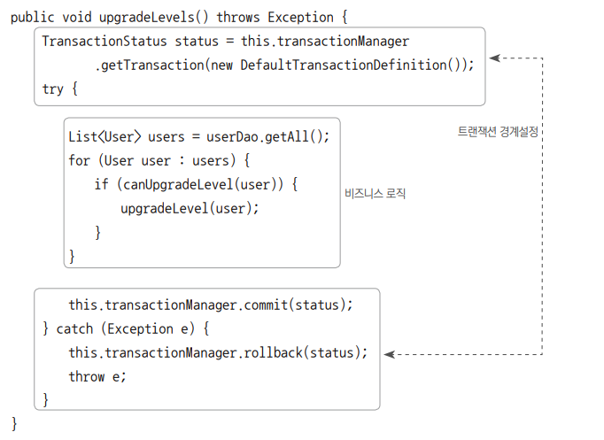

트랜잭션 경계설정의 코드와 비즈니스 로직 코드 간에 서로 주고받는 정보가 없네?

비즈니스 로직 코드에서 직접 DB를 사용하지 않기 때문 에 트랜잭션 준비 과정에서 만들어진 DB 커넥션 정보 등을 직접 참조할 필요가 없기 때문이로군..

비즈니스 로직을 메소드로 추출해볼까?

```java
    public void upgradeLevels() throws SQLException {
//        TransactionSynchronizationManager.initSynchronization(); //동기화 작업 초기화
//        Connection c = DataSourceUtils.getConnection(dataSource); //DB Connection 생성 및 시작
//        c.setAutoCommit(false);
//        transactionManager = new DataSourceTransactionManager(dataSource);
        TransactionStatus status = transactionManager.getTransaction(new DefaultTransactionDefinition());
        try {
            upgradeLevelsInternal();
//            c.commit();
            transactionManager.commit(status);
        } catch (Exception e) {
//            c.rollback();
            transactionManager.rollback(status);
            throw e;
        }
    }

    private void upgradeLevelsInternal() {
        List<User> users = userDao.getAll();
        for (User user : users) {
            if (canUpgradeLevel(user)) upgradeLevel(user);
        }
    }
```

## 1.2 DI를 이용한 클래스의 분리

🤔트랜잭션 코드가 UserService에 있는게 거슬린다.

### DI적용을 이용한 트랜잭션 분리

🤔transaction 코드를 UserService밖으로 빼버리면 client는 transaction없는 UserService를 사용할 것이다...

일단 client와 UserService의 결합을 느슨하게 만들어보자. 그래야 transaction을 끼워 넣든지 말든지 할게 아닌가?

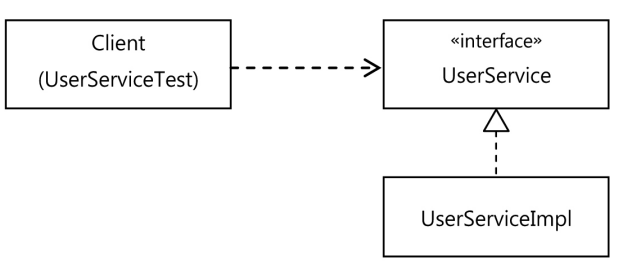

여기서 transaction 의 경계 설정을 담당하는 UserService구현체를 하나 만들어보자. 이 친구는 비즈니스 로직을 담고 있지 않기 때문에 UserService의 다른
구현체의 도움을 받아야 한다.

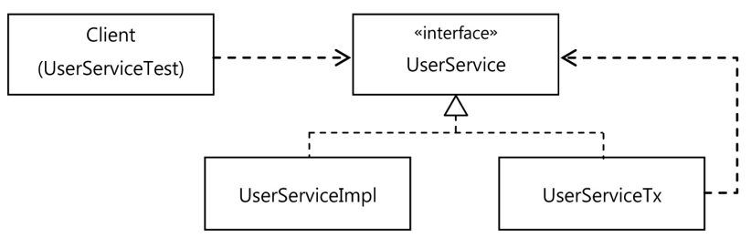

### UserService인터페이스 도입

```java
package com.example.tobby.user.service;

import com.example.tobby.user.domain.User;

import java.sql.SQLException;

public interface UserService {
    void upgradeLevels() throws SQLException;

    void add(User user);
}

```

원래 UserService를 UserServiceImpl로 개명하고 transaction 코드를 모두 제거한다. 즉, User라는 도메인 정보를 가진 비즈니스 로직에만 충실하게
만든다.

### 분리된 트랜잭션 기능

비즈니스 transaction 처리를 담은 UserServiceTx를 만들어보자.

```java
package com.example.tobby.user.service;

import com.example.tobby.user.domain.User;
import org.springframework.transaction.PlatformTransactionManager;
import org.springframework.transaction.TransactionStatus;
import org.springframework.transaction.support.DefaultTransactionDefinition;

import java.sql.SQLException;
import java.util.List;

public class UserServiceTx implements UserService{
    UserService userService;

    PlatformTransactionManager transactionManager;

    public void setTransactionManager(PlatformTransactionManager transactionManager) {
        this.transactionManager = transactionManager;
    }

    public void setUserService(UserService userService) {
        this.userService = userService;
    }

    @Override
    public void upgradeLevels() throws SQLException {
        TransactionStatus status = transactionManager.getTransaction(new DefaultTransactionDefinition());
        try {
            userService.upgradeLevels();
            transactionManager.commit(status);
        } catch (Exception e) {
            transactionManager.rollback(status);
            throw e;
        }
    }

    @Override
    public void add(User user) {
        userService.add(user);
    }
}

```

### 트랜잭션 적용을 위한 DI설정

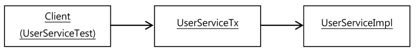

```xml
    <bean id="userService" class="com.example.tobby.user.service.UserServiceTx">
        <property name="transactionManager" ref="transactionManager"/>
        <property name="userService" ref="userServiceImpl"/>
    </bean>
    <bean id="userServiceImpl" class="com.example.tobby.user.service.UserServiceImpl">
        <property name="mailSender" ref="mailSender"/>
        <property name="userDao" ref="userDao"/>
    </bean>
```

### 트랜잭션 분리에 따른 테스트 수정

`@Autowired UserService userService`로 DI받았는데, UserService가 인터페이스로 바뀌면서 UserServiceImpl과
UserServiceTx중 무엇을 DI받아야 할지 모른다.

@Autowired는 **Type**➡ **field name**순으로 빈을 결정하기 때문에 이대로는 id가 userService인 bean이 주입될 것이다!

😎허나, MailSender mock object를 이용해 테스트를 진행하려면 테스트가 누구에게 그걸 DI해야 할지 알고 있어야
하므로 `@Autowired UserServiceImpl userServiceImpl`해야 한다.

```java
    @Autowired
    UserServiceImpl userServiceImpl;
    @Test
    @DirtiesContext
    public void upgradeLevels() throws SQLException {
        userDao.deleteAll();
        for (User user : users) userDao.add(user);
        MockMailSender mockMailSender = new MockMailSender();
        userServiceImpl.setMailSender(mockMailSender);
        ...
    }
```

```java
   @Test
    public void upgradeAllorNothing() {
        TestUserService testUserService = new TestUserService(users.get(3).getId());
        testUserService.setUserDao(this.userDao);
        testUserService.setMailSender(mailSender);

        UserServiceTx userServiceTx = new UserServiceTx();
        userServiceTx.setUserService(testUserService);
        userServiceTx.setTransactionManager(this.transactionManager);
        
        userDao.deleteAll();
        for (User user : users) userDao.add(user);
        try {
            userServiceTx.upgradeLevels();
            fail("err");
        } catch (TestUserServiceException | SQLException e) {
        }
        checkLevelUpgraded(users.get(1), false);
    }

    static class TestUserService extends UserServiceImpl {
        private final String id;

        private TestUserService(String id) {
            this.id = id;
        }

        protected void upgradeLevel(User user) {
            if (user.getId().equals(this.id)) throw new TestUserServiceException();
            super.upgradeLevel(user);
        }
    }

```

### 트랜잭션 경계 설정 코드 분리의 장점

1. 비즈니스 로직 담당 UserServiceImpl이 트랜잭션 같은 기술에 신경안써도 된다. 트랜잭션은 아까만든UserServiceTx같은 트랜잭션 기능을 가진 obj가 먼저
   시행되게 만들며 ㄴ된다!

2. 비즈니스 로직에 대한 테스트를 쉽게 만들 수 있다.

# 2. 고립된 단위 테스트

태스트는 단위가 작을수록 원인을 찾기 쉽다.

## 2.1 복잡한 의존 관계 속의 테스트

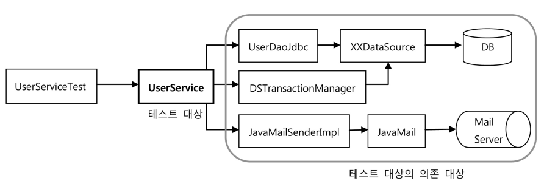

UserService에는 문제가 없는데 누군가 UserDao의 코드를 잘못 수정해서 그 오류 떄문에 UserService가 실패한다면 그 원인을 찾느라 불필요한 시간을 낭비해야
할수도 있다.

## 2.2 테스트 대상 obj고립시키기

테스트를 의존 대상으로부터 분리해 고립시키려면 테스트 대역을 사용하면 된다. MailSender에 DummyMailSender라는 test stub을 적용했지 않은가?!

또 테스트 대역이 테스트 검증에도 참여하게 만드려면 mock obj 사용하면 된다. MockMailSender처럼 말이다.

### 테스트를 위한 UserServiceImpl고립

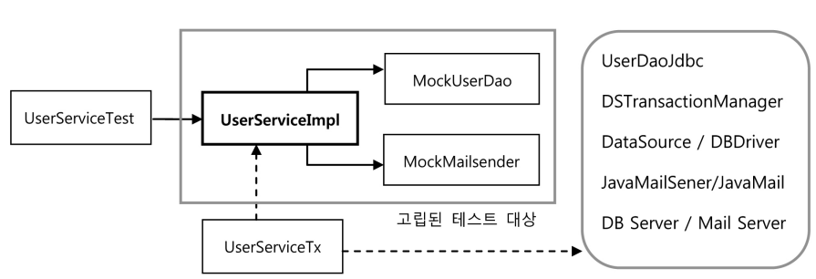

원래라면 UserServiceImpl의 upgradeLevels()를 DB에 들어간 결과를 가져와 검증하는 방식을 뜯어고쳐야 한다. 이렇게 하면 DB에 결과가 안남으니까.

🤔UserService의 협력 obj인 UserDao에게 어떤 요청을 했는지 확인할수만 있다면? 그러니까 UserDao이 update()가 호출되는 것을 확인할 수만 있다면 ?
실제로는 DB에 그 결과가 반영될 것이라고 볼 수 있지 않을까?!

😎UserDao와 같은 역할을 하면서 UserServiceImpl과 주고 받은 정보를 저장해 뒀다가 테스트 검증에서 사용할 수 있는 mock obj가 필요하다.

### 고립된 단위 테스트 적용

```java
  @Test
    @DirtiesContext
    public void upgradeLevels() throws SQLException {
        //1. DB 테스트 데이터 준비
        userDao.deleteAll();
        for (User user : users) userDao.add(user);
        
        //2. 메일 발송 여부 확인을 위한 mock obj di
        MockMailSender mockMailSender = new MockMailSender();
        userServiceImpl.setMailSender(mockMailSender);

        //3. 테스트 대상 실행
        userServiceImpl.upgradeLevels();
        
        // 4. DB에 저장된 결과 확인
        checkLevelUpgraded(users.get(0), false);
        checkLevelUpgraded(users.get(1), true);
        checkLevelUpgraded(users.get(2), false);
        checkLevelUpgraded(users.get(3), true);
        checkLevelUpgraded(users.get(4), false);

        //5. mock obj를 이용한 결과 확인
        List<String> requests = mockMailSender.getRequests();
        assertThat(requests.size()).isEqualTo(2);
        assertThat(requests.get(0)).isEqualTo(users.get(1).getEmail());
        assertThat(requests.get(1)).isEqualTo(users.get(3).getEmail());
    }

```

### UserDao mock obj

1,4 step을 mock obj를 만들어서 적용해보자.

upgradeLevels()에서 userDao를 사용하는 위치는 두 군데다.

```java
    public void upgradeLevels() throws SQLException {
        List<User> users = userDao.getAll();//1.
        for (User user : users) {
            if (canUpgradeLevel(user)) upgradeLevel(user);
        }
    }


    protected void upgradeLevel(User user) {
        user.upgradeLevel();
        userDao.update(user);//2.
        sendUpgradeEmail(user);
    }
```

1. getAll() : DB에서 읽어온 것 처럼 미리 준비된 사용자 목록을 제공해줘야 한다. ➡test stub
2. update() : 리턴값이 없어서 딱히 할건 없다. ➡mock obj

```java
    static class MockUserDao implements UserDao {
        private List<User> users;//래밸 업그레이드 후보 목록
        private List<User> updated = new ArrayList<>();//찐 업그레이드자들 목록
        @Override//mock obj 가능 제공
        public void update(User user) {
            updated.add(user);
        }
        @Override//test stub 기능 제공
        public List<User> getAll() {
            return this.users;
        }
        @Override
        public void add(User user) {
            throw new UnsupportedOperationException();
        }

        @Override
        public User get(String id) {
            throw new UnsupportedOperationException();
        }

        @Override
        public void deleteAll() {
            throw new UnsupportedOperationException();
        }

        @Override
        public int getCount() {
            throw new UnsupportedOperationException();
        }
    }
```

```java
    @Test
    @DirtiesContext
    public void upgradeLevels() throws SQLException {
        //DB 테스트 데이터 준비
        userDao.deleteAll();
        for (User user : users) userDao.add(user);

        //메일 발송 여부 확인을 위한 mock obj di
        MockMailSender mockMailSender = new MockMailSender();
        userServiceImpl.setMailSender(mockMailSender);

        //DB 업데이트 여부 확인을 위한 Mock obj di
        MockUserDao mockUserDao = new MockUserDao();
        userServiceImpl.setUserDao(mockUserDao);

        //테스트 대상 실행
        userServiceImpl.upgradeLevels();

        // DB에 저장된 결과 확인
        checkLevelUpgraded(users.get(0), false);
        checkLevelUpgraded(users.get(1), true);
        checkLevelUpgraded(users.get(2), false);
        checkLevelUpgraded(users.get(3), true);
        checkLevelUpgraded(users.get(4), false);

        //MailSender mock obj를 이용한 결과 확인
        List<String> requests = mockMailSender.getRequests();
        assertThat(requests.size()).isEqualTo(2);
        assertThat(requests.get(0)).isEqualTo(users.get(1).getEmail());
        assertThat(requests.get(1)).isEqualTo(users.get(3).getEmail());

        //UserDao mock obj를 이용한 결과 확인
        List<User> updated = mockUserDao.getUpdated();
        assertThat(updated.size()).isEqualTo(2);
        checkUserAndLevel(updated.get(0), users.get(1).getId(), users.get(1).getLevel());
        checkUserAndLevel(updated.get(0), users.get(3).getId(), users.get(3).getLevel());
        
    }

    void checkUserAndLevel(User updated, String expectedId, Level expectedLevel) {
        assertThat(updated.getId()).isEqualTo(expectedId);
        assertThat(updated.getLevel()).isEqualTo(expectedLevel);
    }
```

### 테스트 수행 성능의 향상

## 2.3 단위 테스트와 통합 테스트

단위 테스트의 단위는 정하기 나름이다.

**단위 테스트** : 테스트 대상 클래스를 mock obj 등의 테스트 대역을 이용해 의존 obj나 외부으 리소스를 사용하지 않도록 고립시켜서 테스트 하는 것

**통합 테스트** : 두 개 이상의, 성격이나 계층이 다른 Obj가 연동하도록 만들어 테스트하거나, 외부의 DB나 파일, 서비스 등의 리소스가 참여하는 테스트하는 것

😎Dao test가 통합 테스트로 분류된다.

테스트는 코드를 작성한 직후에 만들어야 한다. TDD를 하는 경우는 로직을 최대한 빨리 작성하고 테스트를 돌릴 수 있는 텐션으로 짜야 한다.

## 2.4 목 프레임워크

🤔단위 테스트 만들려면 stub, mock obj가 필수다. 그치만 테스트에서는 사용하지 않는 인터페이스도 일일이 구현해줘야 하고, 검증 기능까지 있는 목 객체로 만들려면
메소드의 호출 내용을 저장했다가 다시 불러와야한다. 심지어 테스트 메소드별로 다른 검증 기능이 필요하다면 같은 인터페이스를 구현하는 많은 목 객체를 만들어야 한다.

이 귀찮음을 도와줄 mock obj Fw가 있다.

### Mockito framework

Mock framework는 mock class를 일일이 준비해둘 필요가 없다. 간단한 메소드 호출만으로도 dynamically 특정 인터페이스를 구현한 테스트용 mock obj를
만들 수 있다.

```java
        //DB 업데이트 여부 확인을 위한 Mock obj di
//        MockUserDao mockUserDao = new MockUserDao();
        UserDao mockUserDao = mock(UserDao.class);
```

mock()으로 아무 기능이 없는 mock obj를 만들 수 있다.

여기에 getAll()실행할 때 사용자 목록을 리턴하도록 stub가능을 추가해 줘야 한다.

```java
        //DB 업데이트 여부 확인을 위한 Mock obj di
//        MockUserDao mockUserDao = new MockUserDao();
        UserDao mockUserDao = mock(UserDao.class);
        when(mockUserDao.getAll()).thenReturn(this.users);
        userServiceImpl.setUserDao(mockUserDao);
```

😎테스트 하는 동안 mockUserDao의 update()가 두번 호출되었는지 확인하고 싶다면 ~!

```java
verify(mockUserDao, times(2)).update(any(User.class));
//User타입의 Obj를 parameter로 받으며 update()가 두번 호출되었는지(times(2)) verify하라. 
```

Mockito의 mock obj는 4steps로 사용하면 된다.2nd, 4th는 생략 가능하다.

1. 인터페이스를 이용해 mock obj를 만든다.
2. mock obj가 return할 값이 있으면 이를 지정해 준다. 메소드가 호출되면 예외를 강제로 던지게 만들수도 있다.
3. 테스트 대상 obj에 DI해서 mock obj가 테스트중에 사용되도록 만든다.
4. 테스트 대상 obj를 사용한 후에 mock obj의 특정 메소드가 호출되었는지, 어떤 값을 가지고 몇번 호출됐는지를 검증한다.

✔호출 횟수 검증

times() : 메소드 호출 횟수를 검증

any() : parameter내용은 무시하고 호출 횟수만 확인할 수 있다.

✔호출 됐을때의 parameter를 하나씩 점검

```java
   @Test
    @DirtiesContext
    public void upgradeLevels() throws SQLException {
        //DB 테스트 데이터 준비
        userDao.deleteAll();
        for (User user : users) userDao.add(user);

        //메일 발송 여부 확인을 위한 mock obj di
//        MockMailSender mockMailSender = new MockMailSender();
        MailSender mockMailSender = mock(MailSender.class);
        userServiceImpl.setMailSender(mockMailSender);

        //DB 업데이트 여부 확인을 위한 Mock obj di
//        MockUserDao mockUserDao = new MockUserDao();
        UserDao mockUserDao = mock(UserDao.class);
        when(mockUserDao.getAll()).thenReturn(this.users);
        userServiceImpl.setUserDao(mockUserDao);

        //테스트 대상 실행
        userServiceImpl.upgradeLevels();

        //UserDao mock obj를 이용한 결과 확인
//        List<User> updated = mockUserDao.getUpdated();
//        assertThat(updated.size()).isEqualTo(2);
//        checkUserAndLevel(updated.get(0), users.get(1).getId(), users.get(1).getLevel());
//        checkUserAndLevel(updated.get(0), users.get(3).getId(), users.get(3).getLevel());
        verify(mockUserDao, times(2)).update(any(User.class));
        verify(mockUserDao, times(2)).update(any(User.class));
        verify(mockUserDao).update(users.get(1));
        //users.get(1)을 파라미터로 update()가 호출된 적이 있는지
        assertThat(users.get(1).getLevel()).isEqualTo(Level.SILVER);
        verify(mockUserDao).update(users.get(3));
        assertThat(users.get(3).getLevel()).isEqualTo(Level.GOLD);


        // DB에 저장된 결과 확인
//        checkLevelUpgraded(users.get(0), false);
//        checkLevelUpgraded(users.get(1), true);
//        checkLevelUpgraded(users.get(2), false);
//        checkLevelUpgraded(users.get(3), true);
//        checkLevelUpgraded(users.get(4), false);

        //MailSender mock obj를 이용한 결과 확인
//        List<String> requests = mockMailSender.getRequests();
//        assertThat(requests.size()).isEqualTo(2);
//        assertThat(requests.get(0)).isEqualTo(users.get(1).getEmail());
//        assertThat(requests.get(1)).isEqualTo(users.get(3).getEmail());
        ArgumentCaptor<SimpleMailMessage> mailMessageArg = ArgumentCaptor.forClass(SimpleMailMessage.class);
        verify(mockMailSender, times(2)).send(mailMessageArg.capture());
        List<SimpleMailMessage> mailMessages = mailMessageArg.getAllValues();
        assertThat(mailMessages.get(0).getTo()[0]).isEqualTo(users.get(1).getEmail());
        assertThat(mailMessages.get(1).getTo()[0]).isEqualTo(users.get(3).getEmail());
    }
```

🤔ArgumentCaptor라는 것을 사용해서 실제 MailSender 목 오브 젝트에 전달된 파라미터를 가져와 내용을 검증하는 방법을 사용함.

# 3. 다이나믹 프록시와 팩토리 빈

## 3.1 proxy와 proxy pattern , decorator pattern

🤔트랜잭션 경계 설정 코드에 전략 패턴을 적용하여, 트랜잭션 기능의 구현 내용을 분리는 해냈지만, 여전히 트랜잭션을 사용한다는 사실은 코드에 그대로 남아있다.

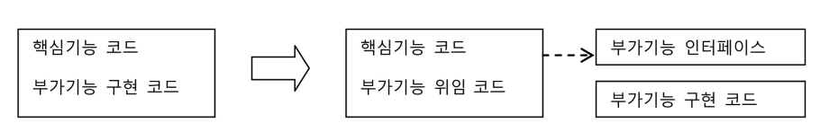

🤔여기서 트랜잭션 사용 사실을 밖으로 분리해낼 수 있었다. 그래서 UserServiceTx를 만들었고, UserServiceImpl에는 트랜잭션 관련 코드가 하나도 없게 됐다.
부가기능 UserServiceTx가 핵심 기능UserServiceImpl를 사용하는 구조다.

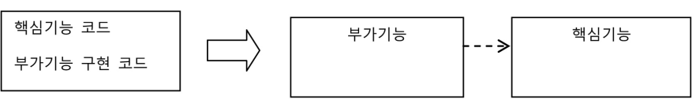

😎이 때 client가 핵심 기능을 바로 사용해버리면 부가 기능이 깍두기가 되버리기 때문에, 부가기능은 마치 자기가 핵심 기능인양 꾸밀 필요가 있다. ➡고로 client는
인터페이스를 통해서만 핵심 기능을 사용하게 하고, 부가기능은 그 사이에 살포시 끼어들어가야 한다.

😆부가기능은 핵심 기능으로 지가 받은 요청을 위임해 줄 뿐 아니라, 지가 가진 부가기능(트랜잭션..)을 client에게 제공해줄 수 있0다.

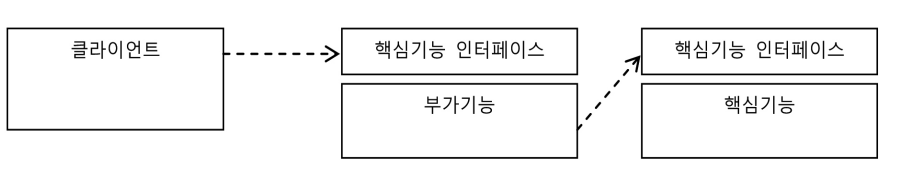

✨마치 지가 client가 원했던 대상이었던 것처럼 위장해서 client의 요청을 받아주는 놈은 proxy라고 한다. proxy를 통해 최종적으로 요청을 외주 받아 처리하는 불쌍한
놈은 target 또는 real subject라고 한다.

😎proxy는 target과 같은 인터페이스를 구현 + target을 제어할 수 있는 점에서 멋지다.

proxy 사용 목적 2가지!

* client가 target에 접근하는 방법을 제어하기 위해
* target에 부가 기능을 얹기 위해

😅그렇지만 목적에 따라 다른 디자인 패턴으로 분류돼

### 데코레이터 패턴(decorator pattern)

target에 부가 기능을 **runtime에 dynamically 부여**하기 위해 proxy를 쓰는 패턴!

🤔dynamiccally 기능 부여? 코드 상에서는(aka compile time) 어떤 방법과 순서로 proxy와 target이 연결되어 사용되는지는 정해져 있지 않다는
의미다. 고로 proxy가 여러 개일 수 있다.

Ex. runtime에 proxy들을 적절한 순서로 조합해서 사용할 수 있다.

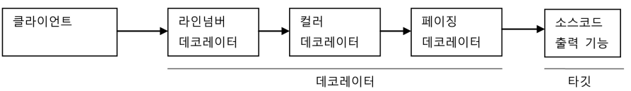

😎 이 때 proxy로 동작하는 decorator들은 위임하는 대상에도 interface로 접근하기 때문에 지가 target에 접근하는지 or 또다른 decorator에
접근하는지도 모른다. ➡decorator의 다음 위임 대상은 인터페이스로 선언 + 생성자나 수정자로 위임 대상을 runtime시에 주입받을 수 있게 해야한다.

😆자바 IO 패키지의 InputStream과 OutputStream 구현 클래스도 데코레이터 패턴이 사용된 대표적인 예다. 다음 코드는 InputStream이라는 인터페이스를
구현한 타깃인 FileInputStream에 버퍼 읽기 기능을 제공해주는 BufferedInputStream이라는 데코레이터를 적용한 예다.

```java
 InputStream is = new BufferedInputStream(new FileInputStream("a.txt"));
```

UserService interface 구현체인, target UserServiceImpl에 트랜잭션 기능을 끼얹은 UserServiceTx를 추가한 것도 decorator
pattern을 적용한 것이다.

### 프록시 패턴 proxy pattern

proxy != proxy pattern

proxy : client - 사용 대상 사이에 대리 역할인 obj를 두는 방법을 총칭

proxy pattern : proxy 사용 방법 중 target에 대한 접근 방법을 제어하려고 proxy를 사용한 경우. 즉 타깃의 기능을 확장하거나 추가하지 않는다. 대신
client가 target에 접근하는 방식을 바꿔준다.

😎target obj가 겁나 복잡하거나 당장 필요한게 아니라면 굳이 섣부르게 만들 필요가 없잖아? 하지만 client에게 target obj에 대한 reference가 미리
필요할 순 있지. 이 때 실제 obj가 아닌 proxy를 넘기는 거다!
실제 obj야 뭐 proxy method로 target을 사용하려고 하면 그때 만들면 되지..

😆원격 obj! 그러니까 다른 서버에 존재하는 obj를 써야 한다면 원격 obj에 대한 proxy를 만들어두고 client는 마치 로컬 obj대하듯 내버려 두면,proxy입장에선
client의 요청을 받았을때 그제서야 네트워크로 원격의 obj를 실행하고 결과를 받아서 client에게 돌려주면 된다!

😎또 특별한 상황에서 target에 대한 접근 권한에 차등을 둘때도 proxy pattern 쓸 수 있다.

Collections의 unmodifidableCollection()은 parameter로 넘어온 놈의 proxy를 만들어서 add()같은 수정 메소드 호출할 경우 예외가 발생하게
해준다.

접근 제어를 위한 proxy pattern + paging 기능을 위한 proxy쓰는 decorator pattern

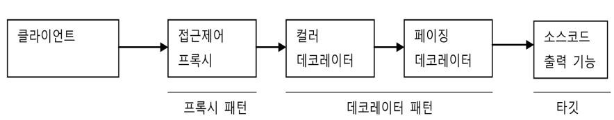

## 3.2 dynamic proxy

프록시도 일일이 모든 인터페이스를 구현해서 클래스를 새로 정의하지 않고 편하게 만들어서 사용할 방법은 없을까? mock obj 만드는 귀찮음도 mock fw써서 편하게 했잖아?

java.lang.reflect pkg안에 일일이 proxy class를 정의하지 않고도 몇가지 api를 이용해 proxy처럼 동작하는 obj를 dynamic하게 생성하는
클래스들이 있다.

### 프록시의 구성과 프록시 작성의 문제점

프록시의 2가지 기능 : **위임 + 부가 작업**

* target과 같은 method를 구현하고 있다가 메소드가 호출되면 target obj로 위임한다. ➡UserServiceTx
* 지정된 요청에 대해서는 부가 기능을 수행한다.

```java
package com.example.tobby.user.service;

import com.example.tobby.user.domain.User;
import org.springframework.transaction.PlatformTransactionManager;
import org.springframework.transaction.TransactionStatus;
import org.springframework.transaction.support.DefaultTransactionDefinition;

import java.sql.SQLException;
import java.util.List;

public class UserServiceTx implements UserService{
    UserService userService; //target obj

    PlatformTransactionManager transactionManager;

    public void setTransactionManager(PlatformTransactionManager transactionManager) {
        this.transactionManager = transactionManager;
    }

    public void setUserService(UserService userService) {
        this.userService = userService;
    }

    @Override
    public void upgradeLevels() throws SQLException {//method 구현
        /// 부가기능 수행
        TransactionStatus status = transactionManager.getTransaction(new DefaultTransactionDefinition());
        try {
            ///위임
            userService.upgradeLevels();
            ///부가기능 수행
            transactionManager.commit(status);
        } catch (Exception e) {
            transactionManager.rollback(status);
            throw e;
        }
    }

    @Override
    public void add(User user) {//method 구현과 위임
        userService.add(user);
    }
}

```

🤔proxy 만들기 귀찮아

1. target의 인터페이스를 구현하고 위임하는 코드를 작성하기 귀찮..

   부가기능 없는 메소드도 오버라이드 해야되잖아?

2. 부가기능 코드가 중복될 가능성이 많아.. transaction 걸어야 하는 메소드가 한두개야? 지금이야 add()만 있지만...

### 리플렉션

dynamic proxy는 reflection 기능을 이용해 proxy를 만들어준다. 🤔reflection : 구체적인 클래스 타입을 몰라도 그 클래스의 메소드, 타입, 변수들에
접근할 수 있도록 해주는 Java API

자바의 모든 class는 그 class 정보를 담은 Class type obj를 하나씩 갖고 있다. 클래스이름.class 또는 getClass()로 class code에 대한
메타정보를 손댈 수 있다.

```java
package com.example.tobby;

import org.junit.jupiter.api.Test;

import java.lang.reflect.Method;

import static org.assertj.core.api.Assertions.assertThat;

public class ReflectionTest {
    @Test
    public void invokeMethod() throws Exception {
        String name = "Spring";
        // length()
        assertThat(name.length()).isEqualTo(6);

        Method lengthMethod = String.class.getMethod("length");
        assertThat((Integer)lengthMethod.invoke(name)).isEqualTo(6);

        // charAt()
        assertThat(name.charAt(0)).isEqualTo('S');

        Method charAtMethod = String.class.getMethod("charAt", int.class);
        assertThat((Character)charAtMethod.invoke(name, 0)).isEqualTo('S');
    }
}

```

### proxy class

dynamic proxy를 이용한 proxy를 만들어보자!

구현할 인터페이스

```java
interface Hello {
    String sayHello(String name);

    String sayHi(String name);

    String sayThankYou(String name);
}
```

구현한 target class

```java
class HelloTarget implements Hello {

    @Override
    public String sayHello(String name) {
        return "Hello" + name;
    }

    @Override
    public String sayHi(String name) {
        return "Hi" + name;
    }

    @Override
    public String sayThankYou(String name) {
        return "Thank You" + name;
    }
}
```

Hello interface를 통해 HelloTarget obj를 사용할 client

```java
    @Test
    public void simpleProxy() {
        Hello hello = new HelloTarget();
        assertThat(hello.sayHello("mtak")).isEqualTo("Hello mtak");
        assertThat(hello.sayHi("mtak")).isEqualTo("Hi mtak");
        assertThat(hello.sayThankYou("mtak")).isEqualTo("Thank You mtak");
    }
```

자 ~! 이제 Hello interface를 구현한 proxy 😆decorator pattern 적용해서 HelloTarget에 부가 기능(upper case) 넣어야지~~

```java
class HelloUppercase implements Hello{
    Hello hello;

    public HelloUppercase(Hello hello) {
        this.hello = hello;
    }

    @Override
    public String sayHello(String name) {
        return hello.sayHello(name).toUpperCase();
    }

    @Override
    public String sayHi(String name) {
        return hello.sayHi(name).toUpperCase();
    }

    @Override
    public String sayThankYou(String name) {
        return hello.sayThankYou(name).toUpperCase();
    }
}
```

```java
    @Test
    public void simpleProxy() {
        Hello hello = new HelloTarget();
        assertThat(hello.sayHello("mtak")).isEqualTo("Hello mtak");
        assertThat(hello.sayHi("mtak")).isEqualTo("Hi mtak");
        assertThat(hello.sayThankYou("mtak")).isEqualTo("Thank You mtak");

        Hello hello1 = new HelloUppercase(new HelloTarget());
        assertThat(hello1.sayHello("mtak")).isEqualTo("HELLO MTAK");
        assertThat(hello1.sayHi("mtak")).isEqualTo("HI MTAK");
        assertThat(hello1.sayThankYou("mtak")).isEqualTo("THANK YOU MTAK");
    }

```

🤔전형적인 proxy문제를 다 가지고 있다. 귀찮게 인터페이스 **모든 메소드** 오버라이드 해야되고, 부가 기능(toUppercase())이 모든 메소드에 **중복되서
나타난다.**

### 다이내믹 프록시 적용

class로 만든 HelloUppercase proxy를 dynamic proxy로 만들어보자!

동작방식


dynamic proxy obj는

* target의 interface와 같은 type으로 만들어진다.
    * client는 dynamic proxy obj를 target interface를 통해 쓸 수 있다.
* proxy factory에 의해 runtime에 dynamically 만들어진다.
    * proxy factory에게 interface정보만 제공해주면 그 구현체를 만들어줌.
    * 물론 proxy로서 필요한 부가기능은 니가 작성해야된다.➡잘 만들어서 InvocationHandler의 구현체에 담으면 된다.
    * InvocationHandler는 메소드 달랑 하나짜리 interface다.
      ➡`public Object invoke(Object proxy, Method method, Object[] args)` 🤔dynamic proxy는 client의
      요청을 reflection 인 Method로 바꿔서 invoke()에 넘긴다.

자! 진짜 dynamic proxy를 만들어보자!

1. InvocationHandler를 구현한다.

```java
class UppercaseHandler implements InvocationHandler {
    Hello target;

    public UppercaseHandler(Hello target) {
        this.target = target;
    }

    @Override
    public Object invoke(Object proxy, Method method, Object[] args) throws Throwable {
        String ret = (String) method.invoke(target, args);
        return ret.toUpperCase();
    }
}
```

2. InvocationHandler를 사용하고 Hello interface를 구현하는 proxy를 만들어보자. ➡ Proxy class, newProxyInstance()

```java
//dynamic proxy obj        
Hello proxyHello = (Hello) Proxy.newProxyInstance(getClass().getClassLoader(),//동적으로 생성되는 dynamic proxy class에 쓸 class loader
                new Class[]{Hello.class},//구현할 interface
                new UppercaseHandler(new HelloTarget())//부가 기능과 위임 코드를 담은 InvocationHandler
        );

        assertThat(proxyHello.sayHello("mtak")).isEqualTo("HELLO MTAK");
        assertThat(proxyHello.sayHi("mtak")).isEqualTo("HI MTAK");
        assertThat(proxyHello.sayThankYou("mtak")).isEqualTo("THANK YOU MTAK");
```

### 다이내믹 프록시의 확장

지금의 UppercaseHandler는 모든 메소드의 리턴이 string이라 상정한다. 🤔만약 다른걸 리턴하는 method가 Hello에 추가된다면? 런타임시 casting
err가 날 것이다.

😎Method 의 method 호출 후 리턴 타입을 **확인해서** string일 경우만 uppercase하게 바꾸자!

```java
class UppercaseHandler implements InvocationHandler {
    Object target;

    public UppercaseHandler(Object target) {
        this.target = target;
    }

    @Override
    public Object invoke(Object proxy, Method method, Object[] args) throws Throwable {
        Object ret = (String) method.invoke(target, args);
        if (ret instanceof String) {
            return ((String) ret).toUpperCase();
        }
        return ret;
    }
}
```

😎메소드 이름이 say로 시작하는 경우에만 대문자로 바꾸는 기능을 적용하고 싶어!

```java
    @Override
    public Object invoke(Object proxy, Method method, Object[] args) throws Throwable {
        Object ret = method.invoke(target, args);
        if (ret instanceof String && method.getName().startsWith("say")) {
            return ((String) ret).toUpperCase();
        }
        return ret;
    }
```

## 3.3 다이내믹 프록시를 이용한 트랜잭션 부가기능

UserServiceTx를 dynamic proxy방식으로 바꿔보자!

```java
package com.example.tobby.user.service;

import org.springframework.transaction.PlatformTransactionManager;
import org.springframework.transaction.TransactionStatus;
import org.springframework.transaction.support.DefaultTransactionDefinition;

import java.lang.reflect.InvocationHandler;
import java.lang.reflect.InvocationTargetException;
import java.lang.reflect.Method;

public class TransactionHandler implements InvocationHandler {

    private Object target;
    private PlatformTransactionManager transactionManager;
    private String pattern;//transaction을 적용할 메소드 이름 패턴

    public void setTarget(Object target) {
        this.target = target;
    }

    public void setTransactionManager(PlatformTransactionManager transactionManager) {
        this.transactionManager = transactionManager;
    }

    public void setPattern(String pattern) {
        this.pattern = pattern;
    }

    public Object invoke(Object proxy, Method method, Object[] args) throws Throwable {
        if (method.getName().startsWith(pattern)) {
            return invokeInTransaction(method, args);
        } else {
            return method.invoke(target, args);
        }
    }

    private Object invokeInTransaction(Method method, Object[] args) throws
            Throwable {
        TransactionStatus status =
                this.transactionManager.getTransaction(new DefaultTransactionDefinition());
        try {
            Object ret = method.invoke(target, args);
            this.transactionManager.commit(status);
            return ret;
        } catch (InvocationTargetException e) {
            this.transactionManager.rollback(status);
            throw e.getTargetException();
        }
    }
}

```

### TransactionHandler와 dynamic proxy를 이용하는 테스트

```java
    @Test
    public void upgradeAllorNothing() {
        TestUserService testUserService = new TestUserService(users.get(3).getId());
        testUserService.setUserDao(this.userDao);
        testUserService.setMailSender(mailSender);

//        UserServiceTx userServiceTx = new UserServiceTx();
//        userServiceTx.setUserService(testUserService);
//        userServiceTx.setTransactionManager(this.transactionManager);
        TransactionHandler transactionHandler = new TransactionHandler();
        transactionHandler.setTransactionManager(transactionManager);
        transactionHandler.setTarget(testUserService);
        transactionHandler.setPattern("upgrade");
        UserService userServiceTx = (UserService) Proxy.newProxyInstance(getClass().getClassLoader(), new Class[]{UserService.class}, transactionHandler);
        
        userDao.deleteAll();
        for (User user : users) userDao.add(user);
        try {
            userServiceTx.upgradeLevels();
            fail("err");
        } catch (TestUserServiceException | SQLException e) {
        }
        checkLevelUpgraded(users.get(1), false);
    }
```

## 3.4 다이내믹 프록시를 위한 팩토리 빈

어떤 target에도 applicable 트랜잭션 부가기능을 담은 TransactionHandler를 만들었다!

이제 TranscationHandler와 dynamic proxy를 스프링의 컨테이너에 등록해보자.

🤷‍♂️그거 가능..? 스프링 빈은 기본적으로 클래스 이름 + 프로퍼티 로 정의되는데, 이 bean은 내부적으로 reflection api를 이용해 빈 정의에 나오는 클래스
이름을 가지고 빈 obj를 생성한다.

`Date now = (Date)Class.forName("java.util.Date").newInstance();`

그치만 dynamic proxy obj의 클래스는 내부적으로 dynamically 새로 정의해서 사용하기에, 실행 전까진 알 수 없다!

고로 사전에 proxy obj의 class 정보를 미리 알아내서 스프링의 빈에 정의할 방법이 없다.

🤷‍♂️dynamic proxy는 Proxy class의 newInstance()로만 만들 수 있는걸..?

> newInstance()는 no args constructor 를 호출하고 그 결과를 리턴

### 팩토리 빈

😎스프링은 클래스 정보 + default constructor로 obj를 만드는 방법 외에도 빈을 만들 수 있는 여러 가지 방법이 있다!
factory bean을 이용한 빈 생성 방법도 그 중 하나다 ㅎㅎ

> factory bean : 스프링을 대신해서 obj의 생성 로직을 담당하도록 만들어진 특별한 bean

😎factory bean을 만드는 방법에는 여러 가지가 있다!
젤 쉬운건 스프링의 FactoryBean이라는 interface를 구현하는 것이다.

```java
package org.springframework.beans.factory;
public interface FactoryBean<T> {
    T getObject() throws Exception; 
    Class<? extends T> getObjectType(); 
    boolean isSingleton(); 
}
```

* getObject()
    * 빈 오브젝트를 생성해서 돌려준다.
* getObjectType()
    * 생성되는 obj의 타입을 알려준다.
* isSingleton()
    * getObject()가 돌려주는 obj가 항상 같은 singleton obj인지 알려준다.

FactoryBean 구현체를 스프링 빈으로 등록하면 FactoryBean으로 동작한다.

```java
package com.example.tobby.user.domain;

public class Message {
    String text;

    private Message(String text) {
        this.text = text;
    }

    public String getText() {
        return text;
    }

    public static Message newMessage(String text) {
        return new Message(text);
    }
}

```

Message를 bean obj로 만들어 보자.

근데 말이죠

```xml
<bean id="message" class="com.example.tobby.user.domain.Message"/>
```

이렇게 설정할 수 없다. Message는 constructor가 아닌 newMessage()로 instalize 해야 하는 걸?

물론 spring은 private constructor인 class도 bean등록만 해주면 reflection 으로 빠꾸 없이 private따위 무시하고 constructor로
obj를 만들어주긴 하지만, 이건 개발자의 의도에 벗어난다.

😎Message obj를 생성할 factory bean class를 만들어보자!

> factory bean: factory method를 가진 Obj

```java
package com.example.tobby.user.domain;

import org.springframework.beans.factory.FactoryBean;

public class MessageFactoryBean implements FactoryBean<Message> {

    String text;

    public void setText(String text) {
        this.text = text;
    }
    

    @Override
    public Message getObject() throws Exception {
        return Message.newMessage(this.text);
    }

    @Override
    public Class<?> getObjectType() {
        return Message.class;
    }

    @Override
    public boolean isSingleton() {
        return false;
    }
}

```

스프링은 FactoryBean 구현체가 빈으로 등록되면 그 놈의 getObject()로 obj를 가져오고, 이를 bean obj로 사용한다.

### 팩토리 빈의 설정 방법

```java
    <bean id="message" class="com.example.tobby.user.domain.MessageFactoryBean">
        <property name="text" value="Factory bean"/>
    </bean>
```

특이한 점은 실제 만들어지는 bean obj type이 bean의 class에 적힌 것 처럼 MessageBeanFactoryBean이 아니라 getObject()가 말아주는
Message이다.

```java
package com.example.tobby.user.domain;

import org.junit.jupiter.api.Test;
import org.junit.jupiter.api.extension.ExtendWith;
import org.springframework.beans.factory.annotation.Autowired;
import org.springframework.context.ApplicationContext;
import org.springframework.test.context.ContextConfiguration;
import org.springframework.test.context.junit.jupiter.SpringExtension;

import static org.assertj.core.api.Assertions.assertThat;
import static org.junit.jupiter.api.Assertions.*;

@ExtendWith(SpringExtension.class)
@ContextConfiguration(locations = "/FactoryBeanTest-context.xml") 
class MessageFactoryBeanTest {
    @Autowired
    ApplicationContext context;

    @Test
    public void getMessageFromFactoryBean() {
        Object message = context.getBean("message");
        assertThat(message).isInstanceOf(Message.class);
        assertThat(((Message) message).getText()).isEqualTo("Factory bean");
    }
}
```

🤔factory bean 자체를 가지고 오고 싶다면?

```java
    @Test
    public void getFactoryBean() {
        Object factory = context.getBean("&message");
        assertThat(factory).isInstanceOf(MessageFactoryBean.class);
    }
```

### dynamic proxy를 만들어주는 factory bean

😎Proxy의 newProxyInstance()를 통해서만 생성 가능한 dynamic proxy도 factory bean을 사용하면 스프링 빈으로 만들어 줄 수 있다!
getObject()에 넣어주면 되지 않은가?

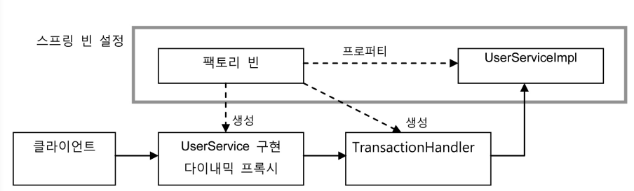

* UserServiceImpl, Factory bean만 spring bean으로 등록

* FactoryBean은 target obj인 UserServiceImpl를 DI받아야한다.

    * 🤷‍♂️dynamic proxy생성에 필요한 TransactionHandler에게 target obj를 전달해야 하잖아?

    * 그 외 TransactionHandler생성에 필요한 정보도 factory bean prop으로 설정해 놨다가 dynamic proxy 만들떄 전달해야지~

### 트랜잭션 프록시 팩토리 빈

TransactionHandler를 이용하는 generating dynamic proxy , factory bean만들어보자!

```java
package com.example.tobby.user.service;

import org.springframework.beans.factory.FactoryBean;
import org.springframework.transaction.PlatformTransactionManager;
import org.springframework.transaction.TransactionManager;

import java.lang.reflect.Proxy;

public class TxProxyFactoryBean implements FactoryBean<Object> {
    Object target;
    PlatformTransactionManager transactionManager;
    String pattern;
    Class<?> serviceInterface;

    public void setTarget(Object target) {
        this.target = target;
    }

    public void setTransactionManager(PlatformTransactionManager transactionManager) {
        this.transactionManager = transactionManager;
    }

    public void setPattern(String pattern) {
        this.pattern = pattern;
    }

    public void setServiceInterface(Class<?> serviceInterface) {
        this.serviceInterface = serviceInterface;
    }

    @Override
    public Object getObject() throws Exception {
        TransactionHandler transactionHandler = new TransactionHandler();
        transactionHandler.setTarget(target);
        transactionHandler.setPattern(pattern);
        transactionHandler.setTransactionManager(transactionManager);
        return Proxy.newProxyInstance(getClass().getClassLoader(), new Class[]{serviceInterface}, transactionHandler); 
    }
    
    @Override
    public Class<?> getObjectType() {
        return serviceInterface;
    }

    @Override
    public boolean isSingleton() {
        return false;
    }
}

```

이놈이 만든 dynamic proxy는 구현 인터페이스나 타깃의 종류에 제한이 없네!

```xml
    <bean id="userService" class="com.example.tobby.user.service.TxProxyFactoryBean">
        <property name="target" ref="userServiceImpl"/>
        <property name="pattern" value="upgradeLevels"/>
        <property name="serviceInterface" value="com.example.tobby.user.service.UserService"/>
        <property name="transactionManager" ref="transactionManager"/>
    </bean>
```

serviceInterface는 literal이 아닌 Class type이니까 value에다 class name 넣으면 된다.

스프링은 setter의 param type을 확인해서 Class인 경우는 value로 설정한 이름을 가진 Class obj로 자동 변환해 준다.

### 트랜잭션 프록시 팩토리 빈 테스트

target obj를 변경하기 위해 factory bean 을 사용해 proxy를 다시 생성한다.

TxProxyBean은 계속 재사용 할수 있다! 트랜잭션 기능이 필요한 빈이 생기면 빈 설정만 위처럼 해주면 된다 ㅎㅎ

이것이 바로 자마의 dynamic proxy + spring's factory bean

```java
    @Autowired
    ApplicationContext context;
    @Test
    @DirtiesContext
    public void upgradeAllorNothing() throws Exception {
        TestUserService testUserService = new TestUserService(users.get(3).getId());
        testUserService.setUserDao(this.userDao);
        testUserService.setMailSender(mailSender);

//        UserServiceTx userServiceTx = new UserServiceTx();
//        userServiceTx.setUserService(testUserService);
//        userServiceTx.setTransactionManager(this.transactionManager);
//        TransactionHandler transactionHandler = new TransactionHandler();
//        transactionHandler.setTransactionManager(transactionManager);
//        transactionHandler.setTarget(testUserService);
//        transactionHandler.setPattern("upgrade");
//        UserService txUserService = (UserService) Proxy.newProxyInstance(getClass().getClassLoader(), new Class[]{UserService.class}, transactionHandler);

        TxProxyFactoryBean txProxyFactoryBean = context.getBean("&userService", TxProxyFactoryBean.class);
        txProxyFactoryBean.setTarget(testUserService);
        UserService txUserService = (UserService) txProxyFactoryBean.getObject();
        userDao.deleteAll();
        for (User user : users) userDao.add(user);
        try {
            txUserService.upgradeLevels();
            fail("err");
        } catch (TestUserServiceException | SQLException e) {
        }
        checkLevelUpgraded(users.get(1), false);
    }
```

## 3.5 프록시 팩토리 빈 방식의 장점과 한계

### 프록시 팩토리 빈의 재사용

TransactionHandler를 이용해 dynamic proxy를 생성하는 TxProxyFactoryBean은 코드 수정 없이도 경계 설정 기능이 필요한 다른 서비스
UserService, CoreService에도 적용할 수 있다!

* 트랜잭션 없는 coreservice에

```xml
<bean id="coreService" class="complex.module.CoreServiceImpl">
<property name="coreDao" ref="coreDao" />
</bean>
```

* 적용!

```xml
<bean id="coreServ iceTarget" class="complex.module.CoreServiceImpl">
<property name="coreDao" ref="coreDao" />
</bean>

```

```xml
<bean id="coreService" class="springbook.service.TxProxyFactoryBean">
<property name="target" ref="coreServiceTarget" />
<property name="transactionManager" ref="transactionManager" />
<property name="pattern" value="" />
<property name="serviceInterface" value="complex.module.CoreService" />
</bean>

```

### 프록시 팩토리 빈 방식의 장점

이~~전에 decorator pattern이 적용된 proxy를 적용하면 두가지 문제가 있다고 했다.

1. Target obj의 interface를 구현한 proxy class 를 일일이 만들어야 한다.
2. 그 과정에서 부가 기능을 여러 메소드에 반복해서 적어야 한다.

😎proxy factory bean은 이 문제들을 싹 해결!.

1. dynamic proxy로 proxy class 일일이 안만들어도 되지롱 또 factory bean으로 DI까지 더해주면 dynamic proxy 코드도 제거할 수
   있지롱!``0
2. handler method만 구현하면 부가 기능 여러번 쓸 필요 없이 메소드들에게 기능 얹기 가능

### 프록시 팩토리 빈의 한계

🤔프록시로 target에 부가 기능을 얹는 것은 **메소드 단위**로 일어난다. 즉, 하나의 클래스 안에 있는 여러개의 method에 부가기능을 한번에 제공하는건 쉽다. 하지만
한번에 **여러개의 클래스**에 부가 기능을 제공하는건 불가능하다.. 비슷 비슷한 proxy factory bean 설정 해야될걸?

🤔하나의 Target에 여러 부가 기능을 얹으려 해도 마찬가지다. 트랜잭션, 보안, 기능검사용 프록시들을 target에 적용하려면, 이런 target이 200개라면

```xml
    <bean id="userService" class="com.example.tobby.user.service.TxProxyFactoryBean">
        <property name="target" ref="userServiceImpl"/>
        <property name="pattern" value="upgradeLevels"/>
        <property name="serviceInterface" value="com.example.tobby.user.service.UserService"/>
        <property name="transactionManager" ref="transactionManager"/>
    </bean>
```

이딴게 target하나당 부가기능 개수 만큼 있어야 한다.

🤔 TransactionHandler obj는 target obj를 property로 referencing하고 있을 뿐인데 proxy factory 개수만큼 생겨야 한다는
것이다. 아니 target이 달라지면 똑같이 transaction 기능 제공해도 new TransactionHandler만들어야 한다니까?

# 4. 스프링의 프록시 팩토리 빈

## 4.1 ProxyFactoryBean

스프링은 transaction 기술과 메일 발송 기술에 적용한 서비스 추상화를 프록시 기술에도 동일하게 적용하고 있다.

자바에선 dynamic proxy외에도 proxy를 만드는 다양한 기술이 있는데, 스프링은 한가지 방법으로 프록시를 만들 수 있게 추상 layer(ProxyFactoryBean)를
제공한다. 다만 만들어진 proxy를 bean으로 등록되야 하지만 말이다.

처음에 만든 TxProxyFactoryBean과 달리, ProxyFactoryBean은 proxy를 만드는 작업만 하고 Proxy를 통해 제공해줄 부가 기능은 별도의 빈에 둘 수
있다. 부가 기능은 MethodInterceptor interface 구현해서 만든다.

**InvocationHandler vs MethodInterceptor**

* InvocationHandler의 invoke()
    * target obj에 대한 정보를 제공하지 않는다. 고로 InvocationHandler구현체가 알고 있어야 한다.
* MethodInterceptor의 invoke()
    * ProxyFactoryBean이 Target obj 알려줘서 target obj에 상관없이 독립적으로 만들 수 있다. ➡싱글톤 쌉가능

```java
package com.example.tobby;

import org.aopalliance.intercept.MethodInterceptor;
import org.aopalliance.intercept.MethodInvocation;
import org.junit.jupiter.api.Test;
import org.springframework.aop.framework.ProxyFactoryBean;

import java.lang.reflect.Proxy;

import static org.assertj.core.api.Assertions.assertThat;

//@ExtendWith(SpringExtension.class)
public class DynamicProxyTest {

    @Test
    public void simpleProxy() {
        Helloo proxiedHello = (Helloo) Proxy.newProxyInstance(getClass().getClassLoader(), new Class[]{Helloo.class}, new UppercaseHandler(new
                HelloTarget()));
    }

    @Test
    public void proxyFactoryBean() {
        ProxyFactoryBean proxyFactoryBean = new ProxyFactoryBean();
        proxyFactoryBean.setTarget(new HelloTarget());
        proxyFactoryBean.addAdvice(new UppercaseAdvice());
        Helloo proxiedHello = (Helloo) proxyFactoryBean.getObject();
        assertThat(proxiedHello.sayHello("mtak")).isEqualTo("HELLO MTAK");
        assertThat(proxiedHello.sayHi("mtak")).isEqualTo("HI MTAK");
        assertThat(proxiedHello.sayThankYou("mtak")).isEqualTo("THANK YOU MTAK");

    }

    interface Helloo {
        String sayHello(String name);

        String sayHi(String name);

        String sayThankYou(String name);
    }

    static class UppercaseAdvice implements MethodInterceptor {
        @Override
        public Object invoke(MethodInvocation invocation) throws Throwable {
            String ret = (String) invocation.proceed();
            return ret.toUpperCase();
        }
    }

    static class HelloTarget implements Helloo {

        @Override
        public String sayHello(String name) {
            return "Hello " + name;
        }

        @Override
        public String sayHi(String name) {
            return "Hi " + name;
        }

        @Override
        public String sayThankYou(String name) {
            return "Thank You " + name;
        }
    }

}

```

### advice : target이 필요 없는 순수한 부가기능

JDK의 dynamic proxy를 직접 사용하는 코드보다 ➡InvocationHandler 구현

스프링이 제공해주는 proxy 추상화 기능 ProxyFactoryBean이 나은 점은 ➡MethodInterceptor 구현. target obj가 없고
MethodInvocation이 proceed()로 target을 내부적으로 실행해 준다.

템플릿 역할을 하는 MethodInvocation을 singleton으로 공유할 수 있다는 점이다.

😎addAdvice()로 ProxyFactoryBean은 여러개의 MethodInterceptor를 추가할 수 있다.(부가가기능 여러개 얹을 수 있다.)

🤔근데 이름이 왜 addMethodInterceptor가 아니고 addAdvice임? MethodInterceptor가 Advice interface의
subinterface라서.

✨MethodInterceptor처럼 target obj에 적용하는 부가기능을 담은 obj를 스프링에선  **advice**라고 부른다.

뿐만 아니라 jdk의 dynamic proxy만들 때 필요했던 interface가

```java
        Hello proxyHello = (Hello) Proxy.newProxyInstance(getClass().getClassLoader(),//동적으로 생성되는 dynamic proxy class에 쓸 class loader
                new Class[]{Hello.class},//구현할 interface
                new UppercaseHandler(new HelloTarget())//부가 기능과 위임 코드를 담은 InvocationHandler
        );
```

ProxyFactory에선 필요 없어졌다. 이놈이 가진 인터페이스 자동 검출 기능으로 target obj가 구현하고 있는 interface를 지정할 수 있기 때문이다. 물론,
target obj가 구현하고 있는 인터페이스 중 일부만 proxy에 적용하고 싶으면 setInterfaces()로 인터페이스 지정하면 된다.

### point cut: 부가기능 적용 대상 메소드 선정 방법

기존 InvocationHandler에서는 부가 기능을 적용할 함수를 "pattern"으로 선정할 수 있었다.

슬프게도 MethodInterceptor에서 부가기능 제공할 때 같이 판별하면 될 것 같지만 MethodInterceptor는 여러 proxy들에게 공유당하기 때문에
target정보를 갖고 있지 않게 만드는건 병신짓이다.

그럼 어떻게 부가기능 얹을 메소드를 구분할까? proxy에 구분 로직을 넣어보자!
🤔proxy는 target을 대신해 client요청을 받아 처리하는 용도인걸? 그럼 proxy에서도 분리해 전략 패턴을 적용해보자.

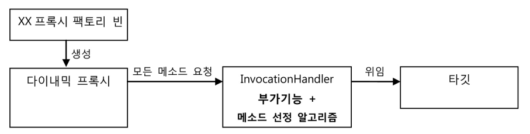

🤔기존 코드는 InvocationHandler가 target과 method선정 알고리즘에 의존하고 있다..고로 target이 바뀌거나 method선정 알고리즘이 바뀌면
factory bean 안의 proxy 생성 코드를 직접 변경해야 했다.

반면

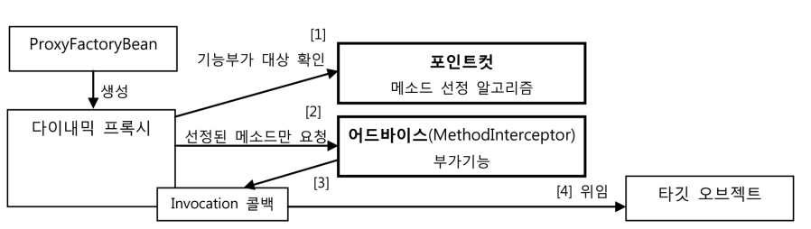

스프링의 ProxyFactoryBean 방식은 두가지 확장 기능인 advice(부가기능) + pointcut(메소드 선정 알고리즘) 을 찢어발겨 프록시에 DI되어 사용한다.

proxy는 client요청 받으면 먼저 pointcut에게 부가기능 얹을 필요가 있는 놈인지 물어본다. pointcut은 Pointcut interface를 구현하면 된다.

부가기능 얹을 놈이면 MethodInterceptor 인 advice를 호출한다.

😎이 때 advice는 InvocationHandler와 달리 Target obj를 직접 호출하지 않는다. 부가기능 얹는 중에 target obj호출 필요하면 proxy한테 받은
MethodInvocation에서 proceed()하면 된다.

> 재사용 가능한 기능을 만들어두고 바뀌는 부분(콜백 obj와 method 호출 정보)만 외부에서 주입해 이를 작업 흐름(부가기능 얹기)중에 사용하도록 하는 typical 템플릿/콜백 구조다.
>
> template➡Advice : 싱글톤 빈으로 등록해서 여러 프록시가 돌려쓸 수 있다.
>
> callback ➡MethodInvocation

proxy로부터 Advice, pointcut독립시키고 DI하게 한 것 ➡전략 패턴 구조

```java
    @Test
    public void pointcutAdvison() {
        ProxyFactoryBean proxyFactoryBean = new ProxyFactoryBean();
        proxyFactoryBean.setTarget(new HelloTarget());
        NameMatchMethodPointcut pointcut = new NameMatchMethodPointcut();//메소드 이름을 비교해서 대상을 선정하는 
알고리즘을 제공하는 포인트컷 생성
        pointcut.setMappedName("sayH*");
        proxyFactoryBean.addAdvisor(new DefaultPointcutAdvisor(pointcut, new UppercaseAdvice()));
        Helloo proxiedHello = (Helloo) proxyFactoryBean.getObject();
        assertThat(proxiedHello.sayHello("mtak")).isEqualTo("HELLO MTAK");
        assertThat(proxiedHello.sayHi("mtak")).isEqualTo("HI MTAK");
        assertThat(proxiedHello.sayThankYou("mtak")).isEqualTo("Thank You mtak");
    }
```

포인트컷 필요 없을떄는 addAdvice()로 advice만 등록하면 되지만, 필요할때는 addAdvisor()로 aivice + pointcut 등록해야한다. 저 둘이 같이
등록하는 이유는 어떤 부가기능(Advice)에 어떤 메소드 선정(pointcut)을 적용할지 정해줘야 하기 때문이다.

## 4.2 ProxyFactoryBean 적용

jdk dynamic proxy구조를 그대로 이용해 만든 TxProxyFactoryBean을!
스프링의 ProxyFactoryBean쓰는걸로 바꿔보자!

### TransactionAdvice

```java
package com.example.tobby.user.service;

import org.aopalliance.intercept.MethodInterceptor;
import org.aopalliance.intercept.MethodInvocation;
import org.springframework.transaction.PlatformTransactionManager;
import org.springframework.transaction.TransactionStatus;
import org.springframework.transaction.support.DefaultTransactionDefinition;

public class TransactionAdvice implements MethodInterceptor {

    PlatformTransactionManager transactionManager;

    public void setTransactionManager(PlatformTransactionManager transactionManager) {
        this.transactionManager = transactionManager;
    }

    @Override
    public Object invoke(MethodInvocation invocation) throws Throwable {
        TransactionStatus status = this.transactionManager.getTransaction(new DefaultTransactionDefinition());
        try {
            Object ret = invocation.proceed();
            this.transactionManager.commit(status);
            return ret;
        } catch (RuntimeException e) {
            this.transactionManager.rollback(status);
            throw e;
        }
    }
}
```

target method가 던지는 예외도 InvocationTargetException으로 포장되는게 아니라서 그대로 잡아 처리한다.

### 스프링 XML설정 파일

```xml
    <bean id="transactionAdvice" class="com.example.tobby.user.service.TransactionAdvice">
        <property name="transactionManager" ref="transactionManager"/>
    </bean>
    <bean id="transactionPointcut" class="org.springframework.aop.support.NameMatchMethodPointcut">
        <property name="mappedName" value="upgrade*"/>
    </bean>
    <bean id="transactionAdvisor" class="org.springframework.aop.support.DefaultPointcutAdvisor">
        <property name="advice" ref="transactionAdvice"/>
        <property name="pointcut" ref="transactionPointcut"/>
    </bean>
    <bean id="userService" class="org.springframework.aop.framework.ProxyFactoryBean">
        <property name="target" ref="userServiceImpl"/>
        <property name="interceptorNames">
            <list>
                <value>transactionAdvisor</value>
            </list>
        </property>
    </bean>
```

interceptorNames : advice와 advisor를 동시에 설정해 줄 수 있으며 그놈들의 빈 아이디를 list안 value로 넣어주면 된다.

### 테스트

```java
    @Test
    @DirtiesContext
    public void upgradeAllorNothing() throws Exception {
        TestUserService testUserService = new TestUserService(users.get(3).getId());
        testUserService.setUserDao(this.userDao);
        testUserService.setMailSender(mailSender);

//        TxProxyFactoryBean txProxyFactoryBean = context.getBean("&userService", TxProxyFactoryBean.class);
        ProxyFactoryBean txProxyFactoryBean = context.getBean("&userService", ProxyFactoryBean.class);
        txProxyFactoryBean.setTarget(testUserService);
        UserService txUserService = (UserService) txProxyFactoryBean.getObject();
        userDao.deleteAll();
        for (User user : users) userDao.add(user);
        try {
            txUserService.upgradeLevels();
            fail("err");
        } catch (TestUserServiceException | SQLException e) {
        }
        checkLevelUpgraded(users.get(1), false);
    }
```

### 어드바이스와 포인트컷의 재사용

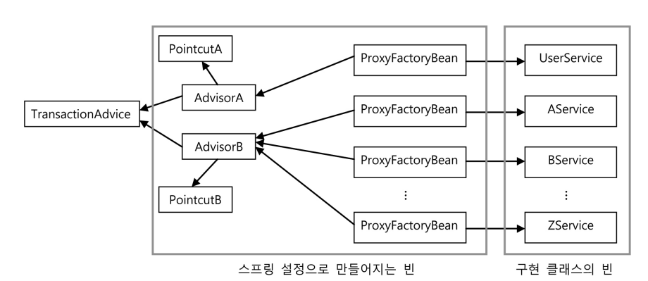

# 5.스프링 AOP

지금까지 비즈니스 로직에 반복적으로 나타난 트랜잭션 코드를 깔끔하게 분리해내 적용 될 때 주변에 민폐를 끼치지 않게 제공된다.

## 5.1 자동 프록시 생성

🤔부가기능의 적용이 필요한 target obj마다 거의 비슷한 내용의 ProxyFactoryBean설정 정보를 추가해줘야 한다.. 서비스 개수만큼..
(설정 복붙 + target prop수정) * inf

### 중복 문제의 접근 방법

반복되는 코드를 해결한 역사

1. JdbcAPI쓰는 DAO에서 메소드마다 try/catch/finally 쓰는거 템플릿 - 콜백 - client로 찢어발겨 전략 패턴 + DI를 적용했다.

2. 반복적인 위임 코드가 필요했던 proxy class 에서, target obj갖다 쓰는 코드 + 부가기능 코드가 proxy가 구현해야 했던 모든 interface
   method마다 반복되서... dynamic proxy로 proxy 기능 하는 클래스를 런타임 시 내부적으로 자동으로 만들어지게 하여, 중요한 부가기능 로직은 손으로 짜고,
   target interface구현과 위임 + 부가기능 연동은 기계적으로 자동생성 시킨거다.

🤔target bean list를 제공하면 자동으로 각각 proxy를 만들어주는 방법은 없을까?

### 빈 후처리기를 이용한 자동 프록시 생성기

✔빈 후처리기

* BeanPostProcessor interface 구현체

* 스프링 빈 obj로 만들어지고 난 후에 빈 obj를 다시 가공할 수 있게 해준다.

* Ex. DefaultAdvisorAutoProxyCreator : advisor를 사용한 자동 proxy 생성기

* 스프링은 빈 후처리기가 컨테이너에 등록되어 있으면 빈 Obj가 생성될 때 마다 빈 후처리기에 보내서 후처리 작업을 요청한다.
* 빈 obj의 prop을 강제 수정하거나 초기화 떄림.심지어 빈 Obj바꿔치기 가능
    * 빈 obj일부를 proxy로 바꿔치기 할 수 있지 않을까?➡자동 프록시 생성 빈 후처리기

✔ 빈 후처리기로 프록시 자동생성

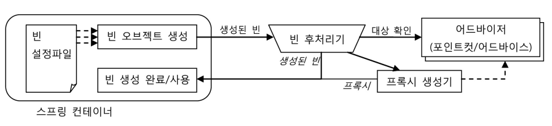

빈후처리기는 빈으로 등록된 모든 Advisor 내의 pointcut으로 전달받은 빈이 프록시 적용 대상인지 확인해 맞으면 내장된 프록시 생성기에게 현재 빈에 대한 프록시를 만들게
하고, 만들어진 프록시에 advisor를 연결해준 후 컨테이너에게 돌려준다.

### 확장된 포인트컷

✨pointcut은 두가지 기능이 있다 클래스 필터와 메소드 매처 두 가지를 돌려주는 메소드를 가지고 있다.

```java
public interface Pointcut {
ClassFilter getClassFilter();
MethodMatcher getMethodMatcher();
}
```

getClassFilter() : 프록시를 적용할 클래스인지 확인해준다. (new)
getMethodMatcher() : 어드바이스를 적용할 메소드인지 확인해준다.

지금까지 사용한 NameMatchPointcut은 메소드 선별 기능만 가진 pointcut이다. 즉, 이 때 클래스 필터는 모든 클래스를 다 받아준다.

🤔ProxyFactoryBean에서는 굳이 클래스 레벨의 필터는 필요 없었는데, 모든 빈에 대해 프록시 자동 적용 대상을 선별해야 하는 빈 후처리기는 클래스와 메소드 선정
알고리즘을 모두 가진 포인트컷이 필요하다.

### 포인트컷 테스트

NameMatchiMethodPointcut을 확장해서 클래스 필터 기능을 활성화하고, 프록시 적용 후보 클래스를 여러개 만들어두고 이 포인트컷을 적용한
ProxyFactoryBean으로 프록시를 만들도록 해보자.

```java
@Test
    public void classNamePointcut() {
        //포인트컷 준비
        NameMatchMethodPointcut classMethodPointcut = new NameMatchMethodPointcut() {
            public ClassFilter getClassFilter() {
                return new ClassFilter() {
                    public boolean matches(Class<?> clas) {
                        return clas.getSimpleName().startsWith("HelloT");
                    }
                };
            }
        };
        classMethodPointcut.setMappedName("sayH*");

        //test
        checkAdviced(new HelloTarget(), classMethodPointcut, true);
        class HelloWorld extends HelloTarget{};
        checkAdviced(new HelloWorld(), classMethodPointcut, false);

        class HelloTonight extends HelloTarget{};
        checkAdviced(new HelloTonight(), classMethodPointcut, true);
    }

    private void checkAdviced(Object target, Pointcut pointcut, boolean adviced) {
        ProxyFactoryBean proxyFactoryBean = new ProxyFactoryBean();
        proxyFactoryBean.setTarget(target);
        proxyFactoryBean.addAdvisor(new DefaultPointcutAdvisor(pointcut, new UppercaseAdvice()));
        Helloo proxiedHello = (Helloo) proxyFactoryBean.getObject();

        if (adviced) {
            assertThat(proxiedHello.sayHello("mtak")).isEqualTo("HELLO MTAK");
            assertThat(proxiedHello.sayHi("mtak")).isEqualTo("HI MTAK");
            assertThat(proxiedHello.sayThankYou("mtak")).isEqualTo("Thank You mtak");
        } else {
            assertThat(proxiedHello.sayHello("mtak")).isEqualTo("Hello mtak");
            assertThat(proxiedHello.sayHi("mtak")).isEqualTo("Hi mtak");
            assertThat(proxiedHello.sayThankYou("mtak")).isEqualTo("Thank You mtak");
        }      
    }
```

## 5.2 DefaultAdvisorAutoProxyCreator사용

### 클래스 필터를 적용한 포인트컷 작성

method 이름만 비교하던 pointcut인 NameMatchiMethodPointcut을 상속해 클래스 이름을 비교하는 ClassFilter를 추가하자.

```java
package com.example.tobby.user.service;

import org.springframework.aop.ClassFilter;
import org.springframework.aop.support.NameMatchMethodPointcut;
import org.springframework.util.PatternMatchUtils;

public class NameMatchClassMethodPointcut extends NameMatchMethodPointcut {
    public void setMappedClassName(String mappedClassName) {
        this.setClassFilter(new SimpleClassFilter(mappedClassName));
    }

    static class SimpleClassFilter implements ClassFilter {
        String mappedName;

        public SimpleClassFilter(String mappedName) {
            this.mappedName = mappedName;
        }

        public boolean matches(Class<?> clazz) {
            return PatternMatchUtils.simpleMatch(mappedName, clazz.getSimpleName());
        }
    }   
}
```

### 어드바이저를 이용하는 자동 프록시 생성기 등록

우리가 쓸 자동 프록시 생성기 DefaultAdvisorProxyCreator는 등록된 빈 중 Advisor interface구현체를 탈탈 털어 생성되는 모든 빈에 대해
Advisor를 적용해 proxy적용 대상을 색출한다. 걸리면 proxy로 바꿔치기 당한다. 물론 원래 빈은 proxy뒤에 연결되어 proxy를 통해서만 접근가능하게 바뀐다.

```xml
    <bean class="org.springframework.aop.framework.autoproxy.DefaultAdvisorAutoProxyCreator"/>
```

### 포인트컷 등록

```xml
    <bean id="transactionPointcut" class="com.example.tobby.user.service.NameMatchClassMethodPointcut">
        <property name="mappedName" value="upgrade*"/>
        <property name="mappedClassName" value="*ServiceImpl"/>
    </bean>
```

### 어드바이스와 어드바이저

```xml
    <bean id="transactionAdvisor" class="org.springframework.aop.support.DefaultPointcutAdvisor">
        <property name="advice" ref="transactionAdvice"/>
        <property name="pointcut" ref="transactionPointcut"/>
    </bean>
    <bean id="transactionAdvice" class="com.example.tobby.user.service.TransactionAdvice">
        <property name="transactionManager" ref="transactionManager"/>
    </bean>
```

이제 빈 안에 transactionAdvisor를 명시적으로 DI해줄필요 없어!
DefaultAdvisorAutoProxyCreator가 자동으로 수집해서 proxy대상을 선정해 만든 proxy에 DI서비스까지 하니까!

### ProxyFactoryBean제거와 서비스 빈의 원상복구

Proxy를 도입할 때 부터 id를 바꾸고 proxy에 DI당한 userServiceImpl는 이제는 당당하게 id를 userService로 바꿀 수 있다.

이제 ProxyFactoryBean은 필요없어!

```xml
<!--    <bean id="userService" class="org.springframework.aop.framework.ProxyFactoryBean">-->
<!--        <property name="target" ref="userServiceImpl"/>-->
<!--        <property name="interceptorNames">-->
<!--            <list>-->
<!--                <value>transactionAdvisor</value>-->
<!--            </list>-->
<!--        </property>-->
<!--    </bean>-->
    <bean id="userService" class="com.example.tobby.user.service.UserServiceImpl">
        <property name="userDao" ref="userDao"/>
        <property name="mailSender" ref="mailSender"/>
    </bean>
```

### 자동 프록시 생성기를 사용하는 테스트

테스트에서 @Autowired로 가져오는건 UserServiceImpl가 아닌 transaction이 적용된 Proxy여야 하고, 지금까지는 빈으로 등록된
ProxyFactoryBean으로 target을 test용 클래스로 바꿔치기해서 사용해왔지만, 자동 프록시 생성기를 적용한 후는 더이상 ProxyFactoryBean이 없고 자동
프록시기가 알아서 프록시를 만들기 때문에 그들이 지나간 자리엔 proxy obj들만 남아있다.

🤔롤백중 생기는 예외에 대한 테스트는 테스트코드에서 빈을 가져다 수동 DI를 때렸는데 이젠 이놈도 설정 파일에다 빈으로 등록을 해야되네?

에라이 이제 TestUserService를 빈으로 등록해보자. 근데 문제가 있다..?

1. 이놈은 내부 static class다..
2. pointcut이 transaction 적용해주는 클래스는 *ServiceImpl인데 이놈은 이름에서 입구컷..

개명하고 예외 발생시켜야 할 3index id는 바로 때려 넣자.

```java
    static class TestUserServiceImpl extends UserServiceImpl {
        private String id="madnite1";

        protected void upgradeLevel(User user) {
            if (user.getId().equals(this.id)) throw new TestUserServiceException();
            super.upgradeLevel(user);
        }
    }
```

```xml
<bean id="testUserService" class="com.example.tobby.user.UserServiceTest$TestUserServiceImpl" parent="userService"/>
```

* static member class지정할 땐 앞에 $붙여야 한다.
* parent prop으로 다른 빈 설정의 내용을 상속받을 수 있다.

### 자동 생성 프록시 확인

포인트컷 빈의 클래스 이름 패턴을 변경해서 이번엔 testUserService 빈에 트랜잭션이 적용되지 않게 해보자.

이를 확인할 수 있다면 클래스 필터가 제대로 동작하고 있다는 최소한의 확신을 얻을 수 있다

```xml
<bean id="transactionPointcut" 
 class="springbook.user.service.NameMatchClassMethodPointcut">
<property name="mappedClassName" value="*NotServiceImpl" />
<property name="mappedName" value="upgrade*" />
</bean>
```

다행히 에러가 난다.

🤔또 자동생성된 프록시를 확인할 방법이 없을까?

getBean("userService")로 가져온 obj가 TestUserService타입이 아닌 proxy타입이어야하지!

```java
    @Test
    public void advisorAutoProxyCreator() {
        assertThat(testUserService).isInstanceOf(java.lang.reflect.Proxy.class);
    }
```

## 5.3 포인트컷 표현식을 이용한 포인트컷

pointcut expression : 스프링이 제공하는 쉽게 포인트컷의 클래스와 메소드를 선정하는 알고리즘을 작성하는 방법

### 포인트컷 표현식

pointcut expression을 쓰려면 AspectJExpressionPointcut을 사용하면 된다.

🤦‍♂️Pointcut interface를 구현해야 하는 스프링의 포인트컷은 ClassFilter, matches()를 구현해야 했다.
➡NameMatchClassMethodPointcut

😎AspectJExpressionPointcut은 class, method선정 알고리즘을 pointcut expression으로 한번에 지정할 수 있게 해준다!

```java
package com.example.tobby.user.pointcut;

public class Target implements TargetInterface {
    public void hello() {}
    public void hello(String a) {}
    public int minus(int a, int b) throws RuntimeException { return 0; }
    public int plus(int a, int b) { return 0; }
    public void method() {}
}
```

```java
package com.example.tobby.user.pointcut;

public interface TargetInterface {
        public void hello();
        public void hello(String a);
        public int minus(int a, int b) throws RuntimeException;
        public int plus(int a, int b);
}

```

```java
package com.example.tobby.user.pointcut;

public class Bean {
    public void method() throws RuntimeException{}

}

```

### 포인트컷 표현식 문법

AspectJ 포인트컷 표현식은 포인트컷 지시자를 이용해 작성한다. 포인트컷 지시자 중 에서 가장 대표적으로 사용되는 것은 execution()이다

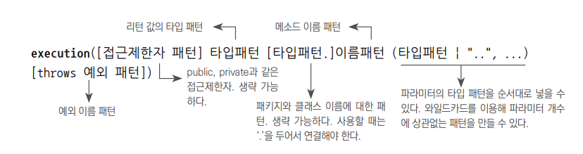

reflection으로 Target클래스의 minus()라는 메소드의 풀 시그니쳐를 가져와보자.

```java
class PointcutTest {
    @Test
    public void test() throws NoSuchMethodException {
        System.out.println(Target.class.getMethod("minus", int.class, int.class));
    }
}
```

출력물 : [full signature]
`public int com.example.tobby.user.pointcut.Target.minus(int,int) throws java.lang.RuntimeException`

* public : 이 항목에 조건을 부여하지 않겠다.
* int : 리턴 타입 (`*`가능)
* com.example.tobby.user.pointcut.Target : 클래스의 타입 패턴. 생략시 모든 타입이 허용됨. 중간 중간 `*`사용 가능.`..`사용시 한번에 여러
  패키지 사용 가능
* minus : 메소드 이름 패턴. `*`시 모든 메소드.
* (int ,int) : 메소드 파라미터의 타입 패턴. `..`시 타입 개수 무관 모두 허용.`...`시 뒷부분의 param 조건만 생략할 수 있다.
* throws java.lang.RuntimeException : 예외 패턴

### 포인트컷 표현식 테스트

```java
package com.example.tobby.user.pointcut;

import org.junit.jupiter.api.Test;
import org.springframework.aop.aspectj.AspectJExpressionPointcut;

import static org.assertj.core.api.Assertions.assertThat;

class PointcutTest {
    @Test
    public void test() throws NoSuchMethodException {
        System.out.println(Bean.Target.class.getMethod("minus", int.class, int.class));
    }


    @Test
    public void methodSignaturePointcut() throws NoSuchMethodException {
        AspectJExpressionPointcut pointcut = new AspectJExpressionPointcut();

        pointcut.setExpression("execution(public int com.example.tobby.user.pointcut.Bean$Target.minus(int,int) throws java.lang.RuntimeException)");

        assertThat(pointcut.getClassFilter().matches(Bean.Target.class)).isEqualTo(true);
        assertThat(pointcut.getMethodMatcher().matches(Bean.Target.class.getMethod("minus", int.class, int.class), null)).isEqualTo(true);
        assertThat(pointcut.getMethodMatcher().matches(Bean.Target.class.getMethod("plus", int.class, int.class), null)).isEqualTo(false);
    }

    public static interface TargetInterface {
            public void hello();
            public void hello(String a);
            public int minus(int a, int b);
            public int plus(int a, int b);
    }
}
```

```java
package com.example.tobby.user.pointcut;

public class Bean {
    public void method() throws RuntimeException{}

    public static class Target implements PointcutTest.TargetInterface {
        public void hello() {}
        public void hello(String a) {}
        public int minus(int a, int b) throws RuntimeException { return 0; }
        public int plus(int a, int b) { return 0; }
        public void method() {}
    }
}

```

이렇게 했는데 두번째 assertThat에서 matches()통과 안되던데 시발아

표현식 파라미터는 뒤져도 인식 안되네

```java
package com.example.tobby.user.pointcut;

import org.junit.jupiter.api.Test;
import org.springframework.aop.aspectj.AspectJExpressionPointcut;

import java.lang.reflect.InvocationTargetException;
import java.lang.reflect.Method;

import static org.assertj.core.api.Assertions.assertThat;

class PointcutTest {
    @Test
    public void test() throws NoSuchMethodException {
        System.out.println(Target.class.getMethod("minus", int.class, int.class));
    }


    @Test
    public void methodSignaturePointcut() throws NoSuchMethodException, InvocationTargetException, IllegalAccessException {
        AspectJExpressionPointcut pointcut = new AspectJExpressionPointcut();

        pointcut.setExpression("execution(public int com.example.tobby.user.pointcut.Target.minus(..))");

        assertThat(pointcut.getClassFilter().matches(Target.class)).isEqualTo(true);
        Method minus = Target.class.getMethod("minus", int.class, int.class);
        assertThat(pointcut.getMethodMatcher().matches(minus, null)).isEqualTo(true);
//        System.out.println("시발롬아 " + (int) minus.invoke(new Target(),1, 2));
        assertThat(pointcut.getMethodMatcher().matches(Target.class.getMethod("plus", int.class, int.class), null)).isEqualTo(false);
    }
    @Test
    public void pointcut() throws Exception {
        tagetClassPointcutMatches("execution(* *(..))", true, true, true, true, true, true);
    }
    public void tagetClassPointcutMatches(String expression, boolean... expected)
            throws Exception {
        pointcutMatches(expression, expected[0], Target.class, "hello");
        pointcutMatches(expression, expected[1], Target.class, "hello", String.class);
        pointcutMatches(expression, expected[2], Target.class, "plus", int.class, int.class);
        pointcutMatches(expression, expected[3], Target.class, "minus", int.class, int.class);
        pointcutMatches(expression, expected[4], Target.class, "method");
        pointcutMatches(expression, expected[5], Bean.class, "method");
    }

    public void pointcutMatches(String expression, Boolean expected, Class<?> clazz,
                                String methodName, Class<?>... args) throws Exception {
        AspectJExpressionPointcut pointcut = new AspectJExpressionPointcut();
        pointcut.setExpression(expression);
        assertThat(pointcut.getClassFilter().matches(clazz)
                && pointcut.getMethodMatcher().matches(clazz.getMethod(methodName,
                args), null)).isEqualTo(expected);
    }
}
```

이새끼는 됨.

### 포인트컷 표현식 테스트

안해요

### 포인트컷 표현식을 이용하는 포인트컷 적용

