# spring modules

```
spring-aop      spring-context-indexer  spring-instrument  spring-orm    spring-web
spring-aspects  spring-context-support  spring-jcl         spring-oxm    spring-webflux
spring-beans    spring-core             spring-jdbc        spring-r2dbc  spring-webmvc
spring-context  spring-expression       spring-jms         spring-test   spring-websocket
                                        spring-messaging   spring-tx  
```

20개가 넘는 spring의 모듈이 있다. 이를 크게 6 가지로 분류하면 다음과 같다.

1. **core**

    * 빈의 생명 주기와 설정 & 처리 방법을 관리하는 스프링 컨테이너

2. testing

    * 테스트 할 때 test context fw, mock obj 등을 제공

3. data access

    * jdbc, orm, transaction 등 서비스 추상화를 통해 쉽게 데이터에 접근하는 방법 제공

4. web & remoting

    * spring mvc & spring webflux

    * remoting 기술인 RMI, Hessian, Burlap, JAX-WS, HTTP 호출자, REST API 제공

5. instrumentation

    * JVM에 weaving agent 를 제공

6. aop (aspect oriented programming)

    * 객체 간의 결합을 낮추는 관점 지향 프로그래밍을 지원

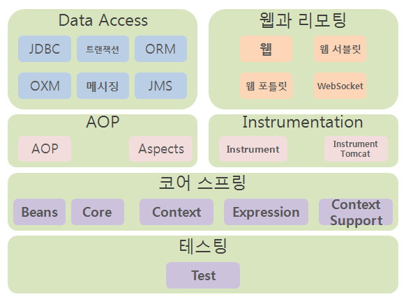

# Dependency of Spring modules


**ASM**

엄밀히 말해 스프링 모듈이 아니지만, 클래스 바이트코드 조작 및 분석 프레임워크인 ASM을 재 패키징한 모듈이다. ASM 프레임워크는 스프링 뿐 아니라 여러 프레임워크에서 및
라이브러리에서 사용되는데, 이때 스프링 프레임워크와 ASM을 사용하는 다른 프레임워크와의 충돌을 방지하기 위해 org.springframework.asm 패키지로 재패키징해
독립적인 모듈로 제공한다.

**Core**

거의 대부분의 다른 스프링 모듈에서 필요로 하는 공통 기능을 갖는 핵심 모듈이다. 스프링에서 사용하는 주요 어노테이션, 컨버터, 상수, 유틸리티 클래스 등을 제공한다.

> 필수 라이브러리 - 없음
> 선택적 의존 - ASM

**Beans**

Beans는 스프링 DI 기능의 핵심인 빈 팩토리와 DI 기능을 제공하는 모듈이다. 빈 메타 정보, 빈 리더, 빈 팩토리의 구현과 프로퍼티 에디터가 포함되어 있다. 애플릿이나
모바일같은 제한된 환경에서 스프링의 DI 기능만 적용하고 싶으면 Beans 모듈까지만 적용하면 된다.

> 필수 라이브러리 - ASM, Core

**AOP**

AOP는 스프링의 프록시 AOP 기능을 제공하는 모듈이다. 프록시 기반 AOP를 만들 때 필요한 advice, pointcut, 프록시 팩토리빈, 자동 프록시 생성기 등을
제공한다.

> 필수 라이브러리 - Beans

**Expression**

Expression은 스프링 표현식 언어(SpEL) 기능을 지원한다.

> 필수 라이브러리 - Core

**Cotext**

Cotext는 어플리케이션 컨텍스트 기능을 제공한다. 어플리케이션 컨텍스트를 만드는 데 필요한 대부분의 기능과 빈 스캐너, 자바코드 설정 기능, EJB 지원, 포메터, 로드타임
위빙, 표현식, JMX JNDI, 리모팅, 스케줄링, 스크립트 언어 지원, 검증기 등의 컨테이너로서의 주요한 기능을 담고 있다. 단순한 빈팩토리가 아닌 엔터프라이즈 어플리케이션
프레임워크로 사용하기 위해 반드시 필요하다.

> 필수 라이브러리 - AOP, Expression
> 선택적 의존 - 로드 타임 위빙을 사용하는 경우 Instrument 모듈 필요

**Context.Support**

Context.Support의 경우 어플리케이션 컨텍스트에서 필요로 하는 부가기능을 지원한다. EhCache, 메일 추상화 서비스, CommonJ와 Quartz 스케줄링,
FreeMarker, JasperReports, Velocity 팩토리 기능을 제공한다. 해당 기능을 사용하지 않는다면 Context.Support은 필요 없다. 단 스프링
MVC가 Context.Support에 의존하므로 스프링 MVC를 사용한다면 필수로 추가해야 한다.

> 필수 라이브러리 - Context
> 선택적 의존 - Quartz의 JobStore 기능을 활용하는 경우 JDBC, Transaction 모듈 필요

**트랜잭션(Transaction)**

트랜잭션은 스프링의 데이터 액세스 추상화의 공통 기능을 담고 있다. DataAcssessException 예외 계층구조와 트랜잭션 추상화 기능, 트랜잭션 동기화 저장소 그리고
JCA 기능을 포함한다.

> 필수 라이브러리 - Context

**JDBC**

JDBC는 JDBC 템플릿을 포함한 JDBC 지원 기능을 제공한다. JdbcTemplate 등의 JDBC 지원 오브젝트 외에도 스프링이 직접 제공하는 DataSource 구현
클래스들이 제공됩니다.

> 필수 라이브러리 - 트랜잭션

**ORM**

ORM은 하이버네이트, JPA, JDO, iBatis와 같은 ORM에 대한 스프링의 지원 기능을 포함한다. ORM은 내부적으로 JDBC를 사용한다.

> 필수 라이브러리 - JDBC
> 선택적 의존 - OpenSessionInViewFilter 같은 일부 기능은 Web 모듈에 선택적으로 의존

**Web**

Web은 스프링 웹 기술의 공통적인 기능을 정의한 모듈이다. spring MVC 외에도 스프링이 지원하는 스트럿츠, JSF 등을 적용할 때 필요하다. 또한 Caucho,
HttpInvoker, JAX-RPC, JAX-WS 등의 리모팅 기능도 포함한다. 기본적으로 바인딩, 컨텍스트 로더, 필터, 멀티파트, 메세지 컨버터 기능도 제공한다.

> 필수 라이브러리 - Context
> 선택적 의존 - XML을 사용하는 메세지 컨버터 기능에는 OXM 모듈이 필요

**웹 서블릿(Web.Servlet)**

웹 서블릿은 spring MVC 기능을 제공하는 모듈이다. 전통적인 MVC와 최신 @MVC 기능이 모두 포함되어 있다.

> 필수 라이브러리 - Web, Context.Support
> 선택적 의존 - XML을 사용하는 뷰나 메세지컨버터 등을 사용할 때에는 OXM 모듈이 필요

**웹 포틀릿(Web.Portlet)**

웹 포틀릿은 Portlet 개발에 사용하는 스프링 모듈이다.

> 필수 라이브러리 - Web.Servlet

**웹 스트럿츠(Web.Struts)**

웹 스트럿츠는 스트럿츠 1.x를 지원하는 모듈이다.

> 필수 라이브러리 - Web

**JMS**

JMS는 스프링의 JMS 지원 기능을 사용할 때 필요한 모듈이다.

> 필수 라이브러리 - Transaction

**Aspects**

Aspects는 스프링이 제공하는 AspectJ AOP를 사용할 때 필요한 모듈이다. AspectJ는 스프링의 @Configurable을 이용한 도메인 오브젝트 DI 기능, JPA
예외 변환기, AspectJ 트랜잭션을 만들 때도 사용된 기술이다.

> 선택적 의존 - JPA 지원 기능 사용시 ORM, 트랜잭션 기능 지원시 Transaction 필요

**Instrument**

Instrument는 스프링의 로드타임위버(LTW) 기능을 적용할 때 필요하다. JVM의 -javaagent 옵션을 사용해 자바에이전트로도 사용된다.

**Instrument.Tomcat**

Instrument.Tomcat은 어플리케이션이 아닌 톰캣 서버의 클래스 로더로 사용하는 모듈이다.

**Test**

Test는 스프링의 테스트 지원 기능을 가진 모듈이다. 테스트 컨텍스트 프레임워크나 목 오브젝트 등을 이용해 테스트 할 때 사용된다. 테스트용 모듈이기 때문에 운영 중에는 사용되지
않아야 된다.

# 스프링의 주요 기술

- IoC container
- events
- resources
- i18n
- validation
- data binding
- type conversion
- SpEL
- AOP

##  

## 1)IoC container

### Spring IoC Container and Beans

#### IoC(inversion of control)란

코드의 흐름을 제어하는 주체가 바뀌는 것

🤔**코드의 흐름을 제어한다?**

* component의 생성과 관계 설정, 사용, 생명 주기 관리
* 메소드를 수행하는 것
* etc

💡**IoC를 적용한다?**

* 흐름 제어를 제 3자가 수행한다!

```java
@Service
public class CouponService {
	public void updateCoupon(){...};
    public void addCoupon(){...};
}
```

Service 로직을 작성할 때 **생명주기 메소드가 호출되었을 때의 동작**만 정의하지, 언제 생명주기 메소드를 호출할지는 신경쓰지 않는다. 즉, Service의 실행 제어권은
spring framework에서 쥐고 있다.

✔ DI는 DIP를 구현하는 기법 중 하나이다. ✔IOC를 적용한 결과 중 하나가 DI이다.

> #### DIP
>
> Dependency Inversion principle의 줄임말.
> SOLID 원칙 중 하나로, 핵심은 추상화에 의존하라는 것이다.
>
> > a. High-level modules should not depend on low-level modules. Both should depend on abstractions (e.g. interfaces).
> > b. Abstractions should not depend on details. Details (concrete implementations) should depend on abstractions.
>
> 예를 들어 다음과 같은 상황일 때,
> 
>
> 추상화가 아닌 구체 클래스에 의존한 경우

```java
public class DaoFactory {
	private ConnectionMaker connectionMaker;
    public DaoFactory(NaverConnectionMaker connectionMaker) {
         this.connectionMaker = connectionMaker;
        ...
    }
}
```

ConnectionMaker가 NaverConnectionMaker에서 DaumConnectionMaker로 바뀌어야 할 때 DaoFactory class까지 변경이 발생해버린다!
즉, 변경에 유연하지 못한 구조이다.

> 추상화에 의존한 경우

```java
public class DaoFactory {
	private ConnectionMaker connectionMaker;
    public DaoFactory(ConnectionMaker connectionMaker) {
         this.connectionMaker = connectionMaker;
        ...
    }
}
```

DaoFactory는 ConnectionMaker interface에 의존하기 때문에 구현체인 NaverConnectionMaker이 변경하여도 DaoFactory는 영향을 받지
않는다. 즉, 변경에 유연한 구조가 된다.

#### DI

dependency injection의 줄임말 필요로 하는 오브젝트를 스스로 생성하는 것이 아닌, 외부로부터 주입받는 기법을 말한다. DI를 적용하는 2가지 기법이 있다.

1. Constructor injection 생성자를 통해 주입하는 방식

```java
public class DaoFactory {
	private ConnectionMaker connectionMaker;
    public DaoFactory(ConnectionMaker connectionMaker) {
         this.connectionMaker = connectionMaker;
        ...
    }
}
```

2. Setter injection setter를 통해 주입하는 방식

```java
public class DaoFactory {
	private ConnectionMaker connectionMaker;
    public void setConnectionMaker(ConnectionMaker connectionMaker) {
         this.connectionMaker = connectionMaker;
        ...
    }
}
```

3. method injection 일반 메소드를 통해 주입하는 방식

```java
public class DaoFactory {
	private ConnectionMaker connectionMaker;
    public void putConnectionMaker(ConnectionMaker connectionMaker) {
         this.connectionMaker = connectionMaker;
        ...
    }
}
```

### spring IoC container란?

bean의 생성과 관계 설정 같은 제어를 담당하는 IoC 오브젝트를 의미한다.

#### BeanFactory

**BeanFactory**는 빈을 생성하고 관계를 설정하는 IoC의 핵심 기능에 초점을 둔 interface다.

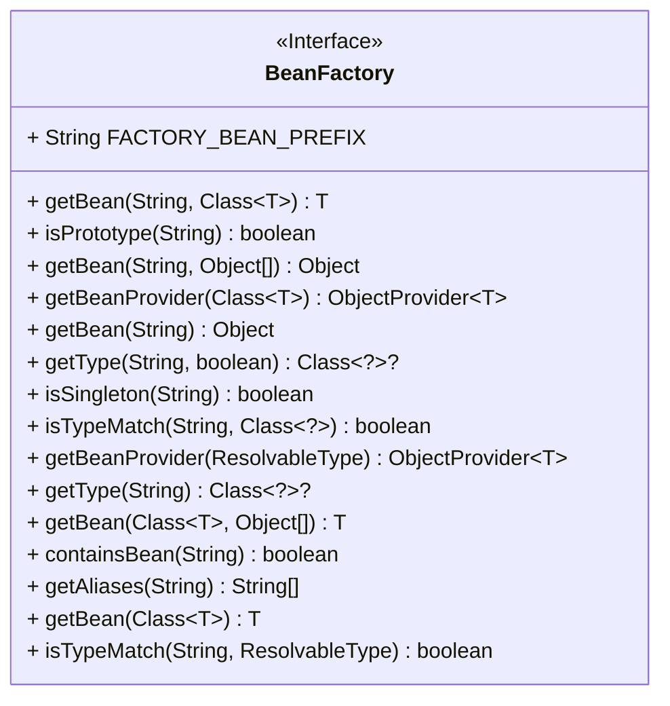

#### ApplicationContext

**ApplicationContext**는 BeanFactory에 다음 기능을 추가한 하위 interface다.

* spring의 AOP기능을 쉽게 통합
* message resource 핸들링 (국제화에 이용)
* event 발생
* Application 계층을 위한 context(ex. WebApplicationContext..)

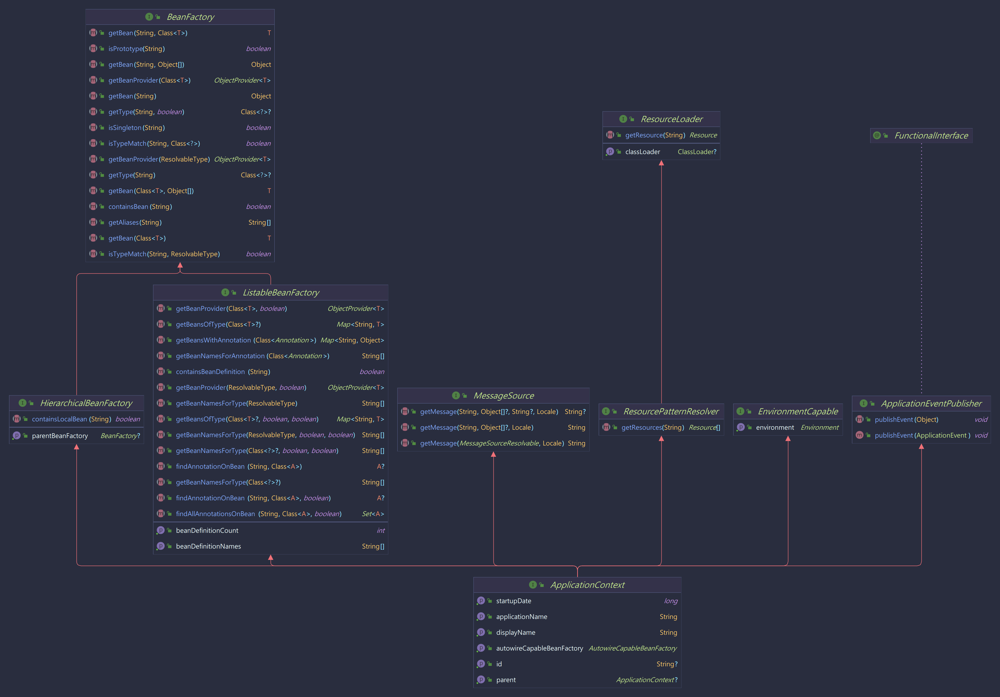

**ApplicationContext의 구현체**

* ClassPathXmlApplicationContext
* FileSystemXmlApplicationContext
* AnnotationConfigApplicationContext

### Bean이란?

spring IoC container가 제어권을 가지고 직접 만들고 관계를 부여하는 오브젝트를 의미한다.

✔Spring IoC container는 bean정보와 연관 관계 정보가 담긴 metadata를 사용해 bean들을 조립한다.


> **configuration metadata**
>
> * 어떤 형태일까?
    > XML
    > Java annotation
> * 어떤 정보를 포함하고 있을까?
    > 빈을 식별할 id
    > 빈의 class type
    > 의존하는 빈(optional)

**BeanDefinition**
Spring IoC container가 갖고 있는 bean metadata를 포함한 interface다.

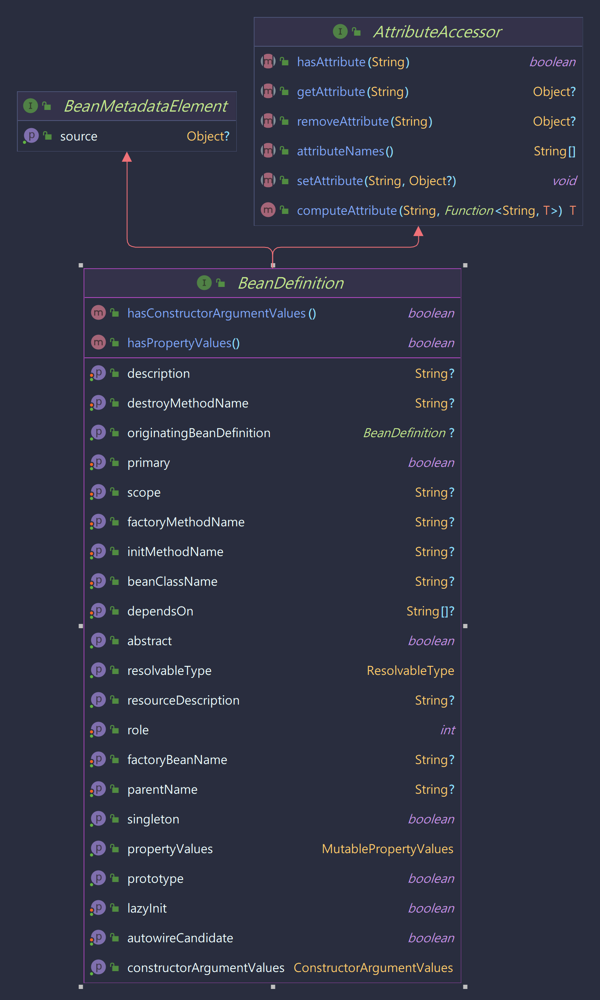

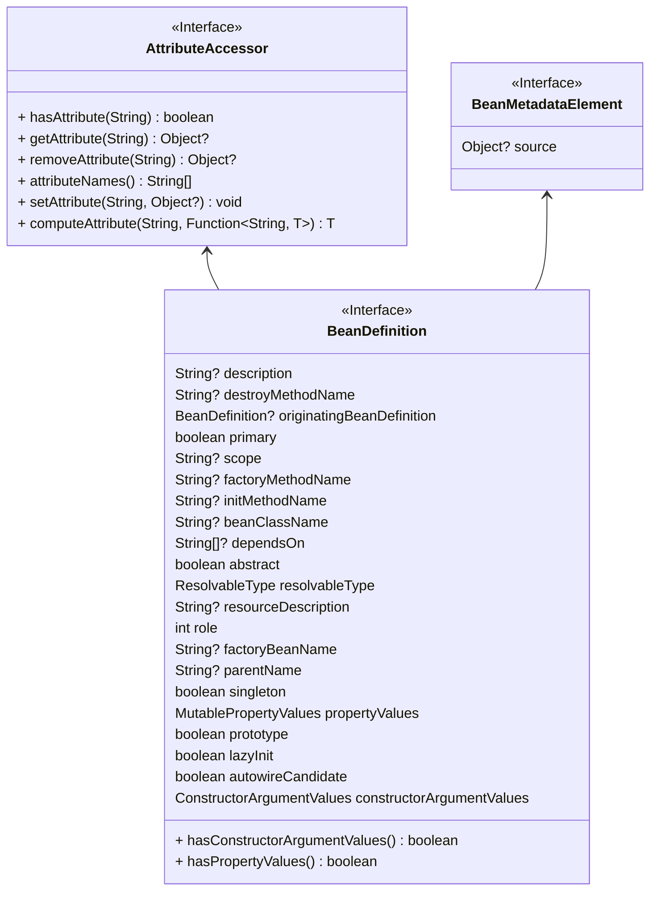

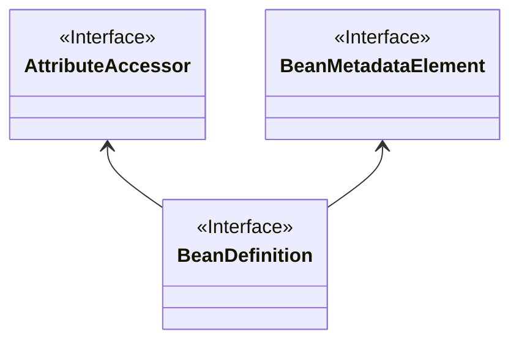

**Bean을 정의하는 정보**

* 패키지를 포함한 클래스 이름
* scope, life cycle callbacks같은 container안에서 bean이 어떻게 행동할 것인지에 대한 정보
* 의존하는 다른 빈의 reference
* connection pool을 관리할 때 필요한 풀 크기 제한, 풀의 수 등 새로 생성된 객체에 설정할 기타 구성 설정

🤔**스프링에 등록된 빈은 어떻게 사용하나?**
`T getBean(String name, Class<T> requiredType)`로 원하는 빈을 spring IoC container에서 꺼내올 수 있다.

```java
// create and configure beans
ApplicationContext context = new ClassPathXmlApplicationContext("services.xml", "daos.xml");

// retrieve configured instance
PetStoreService service = context.getBean("petStore", PetStoreService.class);

// use configured instance
List<String> userList = service.getUsernameList();
```

## 2)Aspect Oriented Programming with Spring

#### AOP?

* 애플리케이션에 산재해서 나타나는 부가 기능을 모듈화

  즉, 여러 type의 instance에 나타나는 기능(ex. transaction)를 모듈로 분리해낼 수 있다.

#### AOP 용어 정리

* 타깃
    * 타깃은 부가기능을 부여할 대상이다.
    * 핵심기능을 담은 클래스일 수도 있지만 경우에 따라서는 다른 부가기능을 제공하는 프록시 오브젝트일 수도 있다.
* advice
* 타깃에게 제공할 부가기능을 담은 모듈이다.
* 오브젝트로 정의하기도 하지만 메소드 레벨에서 정의할 수도 있다.
* 여러 가지 종류가 있다.
    * MethodInterceptor처럼 메소드 호출 과정에 전반적으로 참여하는 것도 있지만, 예외가 발생했을 때만 동작하는 advice처럼 메소드 호출 과정의 일부에서만
      동작하는 advice도 있다.
* join point
* advice가 적용될 수 있는 위치를 말한다.
* 스프링의 프록시 AOP에서 join point는 메소드의 실행 단계뿐이다.
* 타깃 오브 젝트가 구현한 인터페이스의 모든 메소드는 join point가 된다.
* pointcut
    * advice를 적용할 join point를 선별하는 작업 또는 그 기능을 정의한 모듈을 말한다.
    * 스프링 AOP의 join point는 메소드의 실행이므로 스프링의 pointcut은 메소드를 선정하는 기능을 갖고 있다. 그래서 pointcut 표현식은 메소드의
      실행이라는 의미인 execution으로 시작하고, 메소드의 시그니처를 비교하는 방법을 주로 이용한다.
        * 메소드는 클래스 안에 존재하는 것이기 때문에 메소드 선정이란 결국 클래스를 선정하고 그 안의 메소드를 선정하는 과정을 거치게 된다.
* 프록시
    * 클라이언트와 타깃 사이에 투명하게 존재하면서 부가기능을 제공하는 오브 젝트다.
    * DI를 통해 타깃 대신 클라이언트에게 주입되며, 클라이언트의 메소드 호출을 대신 받아서 타깃에 위임해주면서, 그 과정에서 부가기능을 부여한다.
    * 스프링은 프록시를 이용해 AOP를 지원한다.
* advisor
    * pointcut과 advice를 하나씩 갖고 있는 오브젝트다.
    * advisor는 어떤 부가기능(advice)을 어디에(pointcut) 전달할 것인가를 알고 있는 AOP의 가장 기본이 되는 모듈이다.
    * 스프링은 자동 프록시 생성기가 advisor를 AOP 작업의 정보 로 활용한다.
    * advisor는 스프링 AOP에서만 사용되는 특별한 용어이고, 일반적인 AOP에서는 사용되지 않는다.
* aspect
* OOP의 클래스와 마찬가지로 aspect는 AOP의 기본 단위이다.
* 한 개 또는 그 이상 의 pointcut과 advice의 조합으로 만들어지며 보통 싱글톤 형태의 오브젝트로 존재한다. 따라서 클래스와 같은 모듈 정의와 오브젝트와 같은 실체(
  인스턴스)의 구분이 특별히 없다. 두 가지 모두 aspect라고 불린다.
* 스프링의 advisor는 아주 단순한 aspect라고 볼 수도 있다
* introuduction
    * Type과 더불어 추가적인 method, fields를 정의하는 것이다.
    * 스프링은

# 사용된 주요 디자인 패턴

## 싱글톤 패턴

싱글톤 패턴은 GoF가 소개한 디자인 패턴 중의 하나다. 디자인 패턴 중에서 가장 자주 활용되는 패턴 이기도 하지만 가장 많은 비판을 받는 패턴이기도 하다. 심지어 디자인 책을 쓴
GoF 멤버조차도 싱글 톤 패턴은 매우 조심해서 사용해야 하거나 피해야 할 패턴이라고 말하기도 한다. 싱글톤 패턴은 어떤 클래스를 애플리케이션 내에서 제한된 인스턴스 개수,
이름처럼 주로 하나만 존 재하도록 강제하는 패턴이다. 이렇게 하나만 만들어지는 클래스의 오브젝트는 애플리케이션 내에서 전역적으로 접근이 가능하다. 단일 오브젝트만 존재해야 하고,
이를 애플리케이션의 여러 곳에서 공 유하는 경우에 주로 사용한다.

## 전략패턴

자신의 기능 맥락context에서, 필요에 따라 변경이 필요 한 알고리즘을 인터페이스를 통해 통째로 외부로 분리시키고, 이를 구현한 구체적인 알고리즘 클래스를 필요에 따라 바꿔서
사용할 수 있게 하는 디자인 패턴

여기서 알고리즘이란, 독립적인 책임으로 분리가 가능한 기능을 말한다.

바뀔 수 있는 쪽의 클래스는 인터페이스를 구현하도록 하고, 다른 클래스에서 인터 페이스를 통해서만 접근하도록 만들었다. 이렇게 해서 인터페이스를 정의한 쪽의 구현 방법 이 달라져
클래스가 바뀌더라도, 그 기능을 사용하는 클래스의 코드는 같이 수정할 필요가 없도록 만들면 된다.

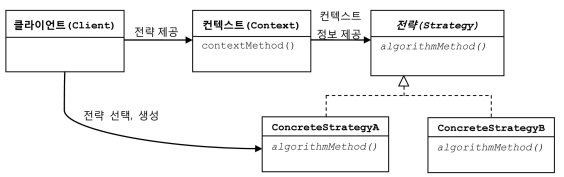

## 템플릿 메소드 패턴

* 상속을 통해 슈퍼클래스의 기능을 확장할 때 사용하는 가장 대표적인 방법이다.

* 변하지 않는 기능은 슈퍼클래스에 만들어두고 자주 변경되며 확장할 기능은 서브클래스에서 만들도록 한다.

* 슈퍼클래스 에서는 미리 추상 메소드 또는 오버라이드 가능한 메소드를 정의해두고 이를 활용해 코드의 기본 알고리즘을 담고 있는 템플릿 메소드를 만든다.

* 슈퍼클래스에서 디폴트 기능을 정의해두거나 비워뒀다 가 서브클래스에서 선택적으로 오버라이드할 수 있도록 만들어둔 메소드를 훅(hook) 메소드라고 한 다.

* 서브클래스에서는 추상 메소드를 구현하거나, 훅 메소드를 오버라이드하는 방법을 이용해 기능의 일부를 확장한다.

  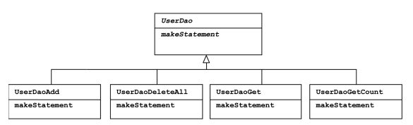

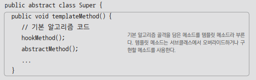

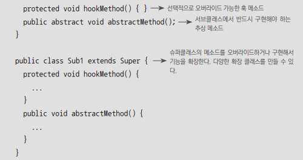

## 팩토리 메소드 패턴

팩토리 메소드 패턴도 템플릿 메소드 패턴과 마찬가지로 상속을 통해 기능을 확장하게 하는 패턴이 다. 그래서 구조도 비슷하다. 슈퍼클래스 코드에서는 서브클래스에서 구현할 메소드를
호출해서 필요 한 타입의 오브젝트를 가져와 사용한다. 이 메소드는 주로 인터페이스 타입으로 오브젝트를 리턴하므 로 서브클래스에서 정확히 어떤 클래스의 오브젝트를 만들어 리턴할지는
슈퍼클래스에서는 알지 못 한다. 사실 관심도 없다. 서브클래스는 다양한 방법으로 오브젝트를 생성하는 메소드를 재정의할 수 있다. 이렇게 서브클래스에서 오브젝트 생성 방법과 클래스를
결정할 수 있도록 미리 정의해둔 메소 드를 팩토리 메소드라고 하고, 이 방식을 통해 오브젝트 생성 방법을 나머지 로직, 즉 슈퍼클래스의 기본 코드에서 독립시키는 방법을 팩토리
메소드 패턴이라고 한다.
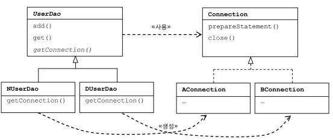
자바에서는 종종 오브젝트를 생성하는 기능을 가진 메소드를 일반적으 로 팩토리 메소드라고 부르기도 한다. 이때 말하는 팩토리 메소드와 팩토리 메소드 패턴의 팩토리 메 소드는 의미가
다르므로 혼동하지 않도록 주의해야 한다

## 템플릿/콜백 패턴

전략 패턴의 기본 구조에 익명 내부 클래스를 활용한 방식의 디자인 패턴이다.

템플릿(template)은 어떤 목적을 위해 미리 만들어둔 모양이 있는 틀을 가리킨다. 프로그래밍에서는 고정된 틀 안에 바꿀 수 있는 부분을 넣어서 사용하는 경우에 템플릿이라고
부른다. JSP는 HTML이라는 고정된 부분에 EL 과 스크립릿이라는 변하는 부분을 넣은 일종의 템플릿 파일이다. 템플릿 메소드 패턴은 고정된 틀의 로직을 가진 템플릿 메소드를
슈퍼클래스에 두고, 바뀌는 부분을 서브클래스의 메소드에 두는 구조로 이뤄진다

콜백(callback)은 실행되는 것을 목적으로 다른 오브젝트의 메소드에 전달되는 오브젝트를 말한다.  
파라미터로 전달되지만 값을 참조하기 위한 것이 아니라 특정 로직을 담은 메소드를 실행시키기 위해 사용한다. 자바에선 메소드 자체를 파라미터로 전달할 방법은 없기 때문에 메소드가
담긴 오브젝트를 전달해야 한다. 그래서 펑셔널 오브젝트(functional object)라고도 한다.

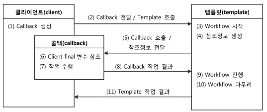

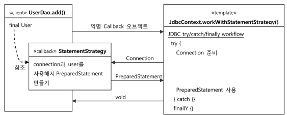

## Proxy


마치 자기가 client가 원했던 대상이었던 것처럼 위장해서 client의 요청을 받아주는 것을 proxy라고 한다. proxy를 통해 최종적으로 요청을 외주 받아 처리하는 것은
target 또는 real subject라고 한다.

proxy는 target과 같은 인터페이스를 구현 + target을 제어할 수 있는 점에서 멋지다.

proxy 사용 목적 2가지!

* client가 target에 접근하는 방법을 제어하기 위해
* target에 부가 기능을 얹기 위해

### decorator 패턴

타깃에 부가적인 기능을 런타임 시 다이내믹하게 부여해주기 위해 프록시를 사용하는 패턴이다.

🤔dynamiccally 기능 부여? 코드 상에서는(aka compile time) 어떤 방법과 순서로 proxy와 target이 연결되어 사용되는지는 정해져 있지 않다는
의미다. 고로 proxy가 여러 개일 수 있다.

Ex. runtime에 proxy들을 적절한 순서로 조합해서 사용할 수 있다.

이 때 proxy로 동작하는 decorator들은 위임하는 대상에도 interface로 접근하기 때문에 지가 target에 접근하는지 or 또다른 decorator에 접근하는지도
모른다. ➡decorator의 다음 위임 대상은 인터페이스로 선언 + 생성자나 수정자로 위임 대상을 runtime시에 주입받을 수 있게 해야한다.

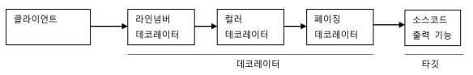

### 프록시 패턴

proxy != proxy pattern

proxy : client - 사용 대상 사이에 대리 역할인 obj를 두는 방법을 총칭

proxy pattern : proxy 사용 방법 중 target에 대한 접근 방법을 제어하려고 proxy를 사용한 경우. 즉 타깃의 기능을 확장하거나 추가하지 않는다. 대신
client가 target에 접근하는 방식을 바꿔준다.

target obj가 겁나 복잡하거나 당장 필요한게 아니라면 굳이 섣부르게 만들 필요가 없다. 하지만 client에게 target obj에 대한 reference가 미리 필요할 순
있다. 이 때 실제 obj가 아닌 proxy를 넘기는 거다!
실제 obj야 뭐 proxy method로 target을 사용하려고 하면 그때 만들면 된다.

원격 obj! 그러니까 다른 서버에 존재하는 obj를 써야 한다면 원격 obj에 대한 proxy를 만들어두고 client는 마치 로컬 obj대하듯 내버려 두면,proxy입장에선
client의 요청을 받았을때 그제서야 네트워크로 원격의 obj를 실행하고 결과를 받아서 client에게 돌려주면 된다!

또 특별한 상황에서 target에 대한 접근 권한에 차등을 둘때도 proxy pattern 쓸 수 있다.

Collections의 unmodifidableCollection()은 parameter로 넘어온 놈의 proxy를 만들어서 add()같은 수정 메소드 호출할 경우 예외가 발생하게
해준다.

접근 제어를 위한 proxy pattern + paging 기능을 위한 proxy쓰는 decorator pattern


### dynamic proxy pattern

dynamic proxy는 reflection 기능을 이용해 proxy를 만들어준다. 🤔reflection : 구체적인 클래스 타입을 몰라도 그 클래스의 메소드, 타입, 변수들에
접근할 수 있도록 해주는 Java API


**문제 상황**

구현할 인터페이스

```java
interface Hello {
    String sayHello(String name);

    String sayHi(String name);

    String sayThankYou(String name);
}
```

구현한 target class

```java
class HelloTarget implements Hello {

    @Override
    public String sayHello(String name) {
        return "Hello" + name;
    }

    @Override
    public String sayHi(String name) {
        return "Hi" + name;
    }

    @Override
    public String sayThankYou(String name) {
        return "Thank You" + name;
    }
}
```

Hello interface를 통해 HelloTarget obj를 사용할 client

```java
    @Test
    public void simpleProxy() {
        Hello hello = new HelloTarget();
        assertThat(hello.sayHello("mtak")).isEqualTo("Hello mtak");
        assertThat(hello.sayHi("mtak")).isEqualTo("Hi mtak");
        assertThat(hello.sayThankYou("mtak")).isEqualTo("Thank You mtak");
    }
```

자 ~! 이제 Hello interface를 구현한 proxy 😆decorator pattern 적용해서 HelloTarget에 부가 기능(upper case) 넣는다.

```java
class HelloUppercase implements Hello{
    Hello hello;

    public HelloUppercase(Hello hello) {
        this.hello = hello;
    }

    @Override
    public String sayHello(String name) {
        return hello.sayHello(name).toUpperCase();
    }

    @Override
    public String sayHi(String name) {
        return hello.sayHi(name).toUpperCase();
    }

    @Override
    public String sayThankYou(String name) {
        return hello.sayThankYou(name).toUpperCase();
    }
}
```

```java
    @Test
    public void simpleProxy() {
        Hello hello = new HelloTarget();
        assertThat(hello.sayHello("mtak")).isEqualTo("Hello mtak");
        assertThat(hello.sayHi("mtak")).isEqualTo("Hi mtak");
        assertThat(hello.sayThankYou("mtak")).isEqualTo("Thank You mtak");

        Hello hello1 = new HelloUppercase(new HelloTarget());
        assertThat(hello1.sayHello("mtak")).isEqualTo("HELLO MTAK");
        assertThat(hello1.sayHi("mtak")).isEqualTo("HI MTAK");
        assertThat(hello1.sayThankYou("mtak")).isEqualTo("THANK YOU MTAK");
    }

```

🤔전형적인 proxy문제를 다 가지고 있다. 귀찮게 인터페이스 **모든 메소드** 오버라이드 해야되고, 부가 기능(toUppercase())이 모든 메소드에 **중복되서
나타난다.**

dynamic proxy를 만들어보자!

1. InvocationHandler를 구현한다.

```java
class UppercaseHandler implements InvocationHandler {
    Hello target;

    public UppercaseHandler(Hello target) {
        this.target = target;
    }

    @Override
    public Object invoke(Object proxy, Method method, Object[] args) throws Throwable {
        String ret = (String) method.invoke(target, args);
        return ret.toUpperCase();
    }
}
```

2. InvocationHandler를 사용하고 Hello interface를 구현하는 proxy를 만들어보자. ➡ Proxy class, newProxyInstance()

```java
//dynamic proxy obj        
Hello proxyHello = (Hello) Proxy.newProxyInstance(getClass().getClassLoader(),//동적으로 생성되는 dynamic proxy class에 쓸 class loader
                new Class[]{Hello.class},//구현할 interface
                new UppercaseHandler(new HelloTarget())//부가 기능과 위임 코드를 담은 InvocationHandler
        );

        assertThat(proxyHello.sayHello("mtak")).isEqualTo("HELLO MTAK");
        assertThat(proxyHello.sayHi("mtak")).isEqualTo("HI MTAK");
        assertThat(proxyHello.sayThankYou("mtak")).isEqualTo("THANK YOU MTAK");
```

# core

> core API: https://docs.spring.io/spring-framework/docs/current/javadoc-api/org/springframework/core/package-summary.html

예외 처리 및 버전 검색을 위한 기본 클래스와 프레임워크의 특정 부분이 아닌 기타 핵심 도우미를 제공

```mermaid
classDiagram
direction BT
class AbstractClassTestingTypeFilter
class AbstractConditionalEnumConverter
class AbstractDataBufferDecoder~T~
class AbstractDecoder~T~
class AbstractEncoder~T~
class AbstractEnvironment
class AbstractFileResolvingResource
class AbstractMergedAnnotation~A~
class AbstractPropertyResolver
class AbstractResource
class AbstractSingleValueEncoder~T~
class AbstractTypeHierarchyTraversingFilter
class AliasFor
class AliasRegistry {
<<Interface>>

}
class AnnotatedElementUtils
class AnnotatedMethod
class AnnotatedTypeMetadata {
<<Interface>>

}
class AnnotationAttributes
class AnnotationAwareOrderComparator
class AnnotationConfigurationException
class AnnotationFilter {
<<Interface>>

}
class AnnotationMetadata {
<<Interface>>

}
class AnnotationTypeFilter
class AnnotationTypeMapping
class AnnotationTypeMappings
class AnnotationUtils
class AnnotationsProcessor~C, R~ {
<<Interface>>

}
class AnnotationsScanner
class ApplicationStartup {
<<Interface>>

}
class ArrayToArrayConverter
class ArrayToCollectionConverter
class ArrayToObjectConverter
class ArrayToStringConverter
class AspectJTypeFilter
class AssignableTypeFilter
class AsyncListenableTaskExecutor {
<<Interface>>

}
class AsyncTaskExecutor {
<<Interface>>

}
class AttributeAccessor {
<<Interface>>

}
class AttributeAccessorSupport
class AttributeMethods
class BridgeMethodResolver
class ByteArrayDecoder
class ByteArrayEncoder
class ByteArrayResource
class ByteBufferConverter
class ByteBufferDecoder
class ByteBufferEncoder
class CachingMetadataReaderFactory
class CharSequenceEncoder
class CharacterToNumberFactory
class ClassMetadata {
<<Interface>>

}
class ClassPathResource
class ClassRelativeResourceLoader
class CloseableDataBuffer {
<<Interface>>

}
class CodecException
class CollectionFactory
class CollectionToArrayConverter
class CollectionToCollectionConverter
class CollectionToObjectConverter
class CollectionToStringConverter
class CommandLineArgs
class CommandLinePropertySource~T~
class CompositeLog
class CompositePropertySource
class ConditionalConverter {
<<Interface>>

}
class ConditionalGenericConverter {
<<Interface>>

}
class ConfigurableConversionService {
<<Interface>>

}
class ConfigurableEnvironment {
<<Interface>>

}
class ConfigurableObjectInputStream
class ConfigurablePropertyResolver {
<<Interface>>

}
class Constants
class ContextResource {
<<Interface>>

}
class Conventions
class ConversionException
class ConversionFailedException
class ConversionService {
<<Interface>>

}
class ConversionServiceFactory
class ConversionUtils
class Converter~S, T~ {
<<Interface>>

}
class ConverterFactory~S, R~ {
<<Interface>>

}
class ConverterNotFoundException
class ConverterRegistry {
<<Interface>>

}
class ConvertingComparator~S, T~
class ConvertingPropertyEditorAdapter
class CoroutinesUtils
class DataBuffer {
<<Interface>>

}
class DataBufferDecoder
class DataBufferEncoder
class DataBufferFactory {
<<Interface>>

}
class DataBufferInputStream
class DataBufferLimitException
class DataBufferOutputStream
class DataBufferUtils
class DataBufferWrapper
class Decoder~T~ {
<<Interface>>

}
class DecodingException
class DecoratingClassLoader
class DecoratingProxy {
<<Interface>>

}
class DefaultApplicationStartup
class DefaultConversionService
class DefaultDataBuffer
class DefaultDataBufferFactory
class DefaultDeserializer
class DefaultParameterNameDiscoverer
class DefaultPropertySourceFactory
class DefaultResourceLoader
class DefaultSerializer
class DefaultToStringStyler
class DefaultValueStyler
class DescriptiveResource
class Deserializer~T~ {
<<Interface>>

}
class DeserializingConverter
class EncodedResource
class Encoder~T~ {
<<Interface>>

}
class EncodingException
class EnumToIntegerConverter
class EnumToStringConverter
class EnumerablePropertySource~T~
class Environment {
<<Interface>>

}
class EnvironmentCapable {
<<Interface>>

}
class ExceptionDepthComparator
class ExecutorServiceAdapter
class FallbackObjectToStringConverter
class FileSystemResource
class FileSystemResourceLoader
class FileUrlResource
class FlightRecorderApplicationStartup
class FlightRecorderStartupEvent
class FlightRecorderStartupStep
class GenericConversionService
class GenericConverter {
<<Interface>>

}
class GenericTypeResolver
class Hints
class IdToEntityConverter
class InfrastructureProxy {
<<Interface>>

}
class InputStreamResource
class InputStreamSource {
<<Interface>>

}
class IntegerToEnumConverterFactory
class IntrospectionFailureLogger {
<<enumeration>>

}
class JOptCommandLinePropertySource
class KotlinDetector
class KotlinReflectionParameterNameDiscoverer
class LimitedDataBufferList
class LocalizedResourceHelper
class LogAccessor
class LogDelegateFactory
class LogFormatUtils
class LogMessage
class MapPropertySource
class MapToMapConverter
class MergedAnnotation~A~ {
<<Interface>>

}
class MergedAnnotationCollectors
class MergedAnnotationPredicates
class MergedAnnotationReadingVisitor~A~
class MergedAnnotationSelector~A~ {
<<Interface>>

}
class MergedAnnotationSelectors
class MergedAnnotations {
<<Interface>>

}
class MergedAnnotationsCollection
class MetadataReader {
<<Interface>>

}
class MetadataReaderFactory {
<<Interface>>

}
class MethodClassKey
class MethodIntrospector
class MethodMetadata {
<<Interface>>

}
class MethodParameter
class MissingMergedAnnotation~A~
class MissingRequiredPropertiesException
class ModuleResource
class MutablePropertySources
class NamedInheritableThreadLocal~T~
class NamedThreadLocal~T~
class NativeDetector
class NestedCheckedException
class NestedExceptionUtils
class NestedRuntimeException
class Netty5BufferDecoder
class Netty5BufferEncoder
class Netty5DataBuffer
class Netty5DataBufferFactory
class NettyByteBufDecoder
class NettyByteBufEncoder
class NettyDataBuffer
class NettyDataBufferFactory
class NumberToCharacterConverter
class NumberToNumberConverterFactory
class ObjectToArrayConverter
class ObjectToCollectionConverter
class ObjectToObjectConverter
class ObjectToOptionalConverter
class ObjectToStringConverter
class Order
class OrderComparator
class OrderUtils
class Ordered {
<<Interface>>

}
class OverridingClassLoader
class PackagesAnnotationFilter
class ParameterNameDiscoverer {
<<Interface>>

}
class ParameterizedTypeReference~T~
class PathMatchingResourcePatternResolver
class PathResource
class PooledDataBuffer {
<<Interface>>

}
class PrioritizedParameterNameDiscoverer
class PriorityOrdered {
<<Interface>>

}
class Profiles {
<<Interface>>

}
class ProfilesParser
class PropertiesLoaderSupport
class PropertiesLoaderUtils
class PropertiesPropertySource
class PropertiesToStringConverter
class Property
class PropertyResolver {
<<Interface>>

}
class PropertySource~T~
class PropertySourceDescriptor
class PropertySourceFactory {
<<Interface>>

}
class PropertySourceProcessor
class PropertySources {
<<Interface>>

}
class PropertySourcesPropertyResolver
class ProtocolResolver {
<<Interface>>

}
class ReactiveAdapter
class ReactiveAdapterRegistry
class ReactiveTypeDescriptor
class RegexPatternTypeFilter
class RepeatableContainers
class ResolvableType
class ResolvableTypeProvider {
<<Interface>>

}
class Resource {
<<Interface>>

}
class ResourceArrayPropertyEditor
class ResourceDecoder
class ResourceEditor
class ResourceEncoder
class ResourceLoader {
<<Interface>>

}
class ResourcePatternResolver {
<<Interface>>

}
class ResourcePatternUtils
class ResourcePropertySource
class ResourceRegion
class ResourceRegionEncoder
class SerializableTypeWrapper
class SerializationDelegate
class SerializationFailedException
class Serializer~T~ {
<<Interface>>

}
class SerializingConverter
class SimpleAliasRegistry
class SimpleAnnotationMetadata
class SimpleAnnotationMetadataReadingVisitor
class SimpleAsyncTaskExecutor
class SimpleCommandLineArgsParser
class SimpleCommandLinePropertySource
class SimpleMetadataReader
class SimpleMetadataReaderFactory
class SimpleMethodMetadata
class SimpleMethodMetadataReadingVisitor
class SimpleValueStyler
class SmartClassLoader {
<<Interface>>

}
class SortedProperties
class SpringFactoriesLoader
class SpringProperties
class SpringVersion
class StandardAnnotationMetadata
class StandardClassMetadata
class StandardEnvironment
class StandardMethodMetadata
class StandardReflectionParameterNameDiscoverer
class StartupStep {
<<Interface>>

}
class StreamConverter
class StringDecoder
class StringToArrayConverter
class StringToBooleanConverter
class StringToCharacterConverter
class StringToCharsetConverter
class StringToCollectionConverter
class StringToCurrencyConverter
class StringToEnumConverterFactory
class StringToLocaleConverter
class StringToNumberConverterFactory
class StringToPropertiesConverter
class StringToTimeZoneConverter
class StringToUUIDConverter
class StylerUtils
class SyncTaskExecutor
class SynthesizedMergedAnnotationInvocationHandler~A~
class SynthesizingMethodParameter
class SystemEnvironmentPropertySource
class TaskDecorator {
<<Interface>>

}
class TaskExecutor {
<<Interface>>

}
class TaskExecutorAdapter
class TaskRejectedException
class TaskTimeoutException
class ToStringCreator
class ToStringStyler {
<<Interface>>

}
class TouchableDataBuffer {
<<Interface>>

}
class TypeDescriptor
class TypeFilter {
<<Interface>>

}
class TypeMappedAnnotation~A~
class TypeMappedAnnotations
class UrlResource
class ValueExtractor {
<<Interface>>

}
class ValueStyler {
<<Interface>>

}
class VfsPatternUtils
class VfsResource
class VfsUtils
class VirtualThreadDelegate
class VirtualThreadTaskExecutor
class WritableResource {
<<Interface>>

}
class ZoneIdToTimeZoneConverter
class ZonedDateTimeToCalendarConverter

AbstractClassTestingTypeFilter  ..>  TypeFilter 
AbstractConditionalEnumConverter  ..>  ConditionalConverter 
AbstractDataBufferDecoder~T~  -->  AbstractDecoder~T~ 
AbstractDecoder~T~  ..>  Decoder~T~ 
AbstractEncoder~T~  ..>  Encoder~T~ 
AbstractEnvironment  ..>  ConfigurableEnvironment 
AbstractFileResolvingResource  -->  AbstractResource 
AbstractMergedAnnotation~A~  ..>  MergedAnnotation~A~ 
AbstractPropertyResolver  ..>  ConfigurablePropertyResolver 
AbstractResource  ..>  Resource 
AbstractSingleValueEncoder~T~  -->  AbstractEncoder~T~ 
AbstractTypeHierarchyTraversingFilter  ..>  TypeFilter 
AnnotationAwareOrderComparator  -->  OrderComparator 
AnnotationConfigurationException  -->  NestedRuntimeException 
AnnotationMetadata  -->  AnnotatedTypeMetadata 
AnnotationMetadata  -->  ClassMetadata 
AnnotationTypeFilter  -->  AbstractTypeHierarchyTraversingFilter 
ArrayToArrayConverter  ..>  ConditionalGenericConverter 
ArrayToCollectionConverter  ..>  ConditionalGenericConverter 
ArrayToObjectConverter  ..>  ConditionalGenericConverter 
ArrayToStringConverter  ..>  ConditionalGenericConverter 
AspectJTypeFilter  ..>  TypeFilter 
AssignableTypeFilter  -->  AbstractTypeHierarchyTraversingFilter 
AsyncListenableTaskExecutor  -->  AsyncTaskExecutor 
AsyncTaskExecutor  -->  TaskExecutor 
AttributeAccessorSupport  ..>  AttributeAccessor 
ByteArrayDecoder  -->  AbstractDataBufferDecoder~T~ 
ByteArrayEncoder  -->  AbstractEncoder~T~ 
ByteArrayResource  -->  AbstractResource 
ByteBufferConverter  ..>  ConditionalGenericConverter 
ByteBufferDecoder  -->  AbstractDataBufferDecoder~T~ 
ByteBufferEncoder  -->  AbstractEncoder~T~ 
CachingMetadataReaderFactory  -->  SimpleMetadataReaderFactory 
CharSequenceEncoder  -->  AbstractEncoder~T~ 
CharacterToNumberFactory  ..>  ConverterFactory~S, R~ 
ClassPathResource  -->  AbstractFileResolvingResource 
ClassRelativeResourceLoader  -->  DefaultResourceLoader 
CloseableDataBuffer  -->  DataBuffer 
CodecException  -->  NestedRuntimeException 
CollectionToArrayConverter  ..>  ConditionalGenericConverter 
CollectionToCollectionConverter  ..>  ConditionalGenericConverter 
CollectionToObjectConverter  ..>  ConditionalGenericConverter 
CollectionToStringConverter  ..>  ConditionalGenericConverter 
CommandLinePropertySource~T~  -->  EnumerablePropertySource~T~ 
CompositePropertySource  -->  EnumerablePropertySource~T~ 
ConditionalGenericConverter  -->  ConditionalConverter 
ConditionalGenericConverter  -->  GenericConverter 
ConfigurableConversionService  -->  ConversionService 
ConfigurableConversionService  -->  ConverterRegistry 
ConfigurableEnvironment  -->  ConfigurablePropertyResolver 
ConfigurableEnvironment  -->  Environment 
ConfigurablePropertyResolver  -->  PropertyResolver 
ContextResource  -->  Resource 
ConversionException  -->  NestedRuntimeException 
ConversionFailedException  -->  ConversionException 
ConverterNotFoundException  -->  ConversionException 
DataBufferDecoder  -->  AbstractDataBufferDecoder~T~ 
DataBufferEncoder  -->  AbstractEncoder~T~ 
DataBufferWrapper  ..>  DataBuffer 
DecodingException  -->  CodecException 
DefaultApplicationStartup  ..>  ApplicationStartup 
DefaultConversionService  -->  GenericConversionService 
DefaultDataBuffer  ..>  DataBuffer 
DefaultDataBufferFactory  ..>  DataBufferFactory 
DefaultDeserializer  ..>  Deserializer~T~ 
DefaultParameterNameDiscoverer  -->  PrioritizedParameterNameDiscoverer 
DefaultPropertySourceFactory  ..>  PropertySourceFactory 
DefaultResourceLoader  ..>  ResourceLoader 
DefaultSerializer  ..>  Serializer~T~ 
DefaultToStringStyler  ..>  ToStringStyler 
DefaultValueStyler  ..>  ValueStyler 
DescriptiveResource  -->  AbstractResource 
DeserializingConverter  ..>  Converter~S, T~ 
EncodedResource  ..>  InputStreamSource 
EncodingException  -->  CodecException 
EnumToIntegerConverter  -->  AbstractConditionalEnumConverter 
EnumToIntegerConverter  ..>  Converter~S, T~ 
EnumToStringConverter  -->  AbstractConditionalEnumConverter 
EnumToStringConverter  ..>  Converter~S, T~ 
EnumerablePropertySource~T~  -->  PropertySource~T~ 
Environment  -->  PropertyResolver 
FallbackObjectToStringConverter  ..>  ConditionalGenericConverter 
FileSystemResource  -->  AbstractResource 
FileSystemResource  ..>  WritableResource 
FileSystemResourceLoader  -->  DefaultResourceLoader 
FileUrlResource  -->  UrlResource 
FileUrlResource  ..>  WritableResource 
FlightRecorderApplicationStartup  ..>  ApplicationStartup 
FlightRecorderStartupStep  ..>  StartupStep 
GenericConversionService  ..>  ConfigurableConversionService 
IdToEntityConverter  ..>  ConditionalGenericConverter 
InputStreamResource  -->  AbstractResource 
IntegerToEnumConverterFactory  ..>  ConverterFactory~S, R~ 
JOptCommandLinePropertySource  -->  CommandLinePropertySource~T~ 
KotlinReflectionParameterNameDiscoverer  ..>  ParameterNameDiscoverer 
MapPropertySource  -->  EnumerablePropertySource~T~ 
MapToMapConverter  ..>  ConditionalGenericConverter 
MergedAnnotationsCollection  ..>  MergedAnnotations 
MethodMetadata  -->  AnnotatedTypeMetadata 
MissingMergedAnnotation~A~  -->  AbstractMergedAnnotation~A~ 
ModuleResource  -->  AbstractResource 
MutablePropertySources  ..>  PropertySources 
Netty5BufferDecoder  -->  AbstractDataBufferDecoder~T~ 
Netty5BufferEncoder  -->  AbstractEncoder~T~ 
Netty5DataBuffer  ..>  CloseableDataBuffer 
Netty5DataBuffer  ..>  TouchableDataBuffer 
Netty5DataBufferFactory  ..>  DataBufferFactory 
NettyByteBufDecoder  -->  AbstractDataBufferDecoder~T~ 
NettyByteBufEncoder  -->  AbstractEncoder~T~ 
NettyDataBuffer  ..>  PooledDataBuffer 
NettyDataBufferFactory  ..>  DataBufferFactory 
NumberToCharacterConverter  ..>  Converter~S, T~ 
NumberToNumberConverterFactory  ..>  ConditionalConverter 
NumberToNumberConverterFactory  ..>  ConverterFactory~S, R~ 
ObjectToArrayConverter  ..>  ConditionalGenericConverter 
ObjectToCollectionConverter  ..>  ConditionalGenericConverter 
ObjectToObjectConverter  ..>  ConditionalGenericConverter 
ObjectToOptionalConverter  ..>  ConditionalGenericConverter 
ObjectToStringConverter  ..>  Converter~S, T~ 
OverridingClassLoader  -->  DecoratingClassLoader 
PackagesAnnotationFilter  ..>  AnnotationFilter 
PathMatchingResourcePatternResolver  ..>  ResourcePatternResolver 
PathResource  -->  AbstractResource 
PathResource  ..>  WritableResource 
PooledDataBuffer  -->  TouchableDataBuffer 
PrioritizedParameterNameDiscoverer  ..>  ParameterNameDiscoverer 
PriorityOrdered  -->  Ordered 
PropertiesPropertySource  -->  MapPropertySource 
PropertiesToStringConverter  ..>  Converter~S, T~ 
PropertySourcesPropertyResolver  -->  AbstractPropertyResolver 
RegexPatternTypeFilter  -->  AbstractClassTestingTypeFilter 
Resource  -->  InputStreamSource 
ResourceDecoder  -->  AbstractDataBufferDecoder~T~ 
ResourceEncoder  -->  AbstractSingleValueEncoder~T~ 
ResourcePatternResolver  -->  ResourceLoader 
ResourcePropertySource  -->  PropertiesPropertySource 
ResourceRegionEncoder  -->  AbstractEncoder~T~ 
SerializationDelegate  ..>  Deserializer~T~ 
SerializationDelegate  ..>  Serializer~T~ 
SerializationFailedException  -->  NestedRuntimeException 
SerializingConverter  ..>  Converter~S, T~ 
SimpleAliasRegistry  ..>  AliasRegistry 
SimpleAnnotationMetadata  ..>  AnnotationMetadata 
SimpleAsyncTaskExecutor  ..>  AsyncListenableTaskExecutor 
SimpleCommandLinePropertySource  -->  CommandLinePropertySource~T~ 
SimpleMetadataReader  ..>  MetadataReader 
SimpleMetadataReaderFactory  ..>  MetadataReaderFactory 
SimpleMethodMetadata  ..>  MethodMetadata 
SimpleValueStyler  -->  DefaultValueStyler 
StandardAnnotationMetadata  ..>  AnnotationMetadata 
StandardAnnotationMetadata  -->  StandardClassMetadata 
StandardClassMetadata  ..>  ClassMetadata 
StandardEnvironment  -->  AbstractEnvironment 
StandardMethodMetadata  ..>  MethodMetadata 
StandardReflectionParameterNameDiscoverer  ..>  ParameterNameDiscoverer 
StreamConverter  ..>  ConditionalGenericConverter 
StringDecoder  -->  AbstractDataBufferDecoder~T~ 
StringToArrayConverter  ..>  ConditionalGenericConverter 
StringToBooleanConverter  ..>  Converter~S, T~ 
StringToCharacterConverter  ..>  Converter~S, T~ 
StringToCharsetConverter  ..>  Converter~S, T~ 
StringToCollectionConverter  ..>  ConditionalGenericConverter 
StringToCurrencyConverter  ..>  Converter~S, T~ 
StringToEnumConverterFactory  ..>  ConverterFactory~S, R~ 
StringToLocaleConverter  ..>  Converter~S, T~ 
StringToNumberConverterFactory  ..>  ConverterFactory~S, R~ 
StringToPropertiesConverter  ..>  Converter~S, T~ 
StringToTimeZoneConverter  ..>  Converter~S, T~ 
StringToUUIDConverter  ..>  Converter~S, T~ 
SyncTaskExecutor  ..>  TaskExecutor 
SynthesizingMethodParameter  -->  MethodParameter 
SystemEnvironmentPropertySource  -->  MapPropertySource 
TaskExecutorAdapter  ..>  AsyncListenableTaskExecutor 
TaskTimeoutException  -->  TaskRejectedException 
TouchableDataBuffer  -->  DataBuffer 
TypeMappedAnnotation~A~  -->  AbstractMergedAnnotation~A~ 
TypeMappedAnnotations  ..>  MergedAnnotations 
UrlResource  -->  AbstractFileResolvingResource 
VfsPatternUtils  -->  VfsUtils 
VfsResource  -->  AbstractResource 
VirtualThreadTaskExecutor  ..>  AsyncTaskExecutor 
WritableResource  -->  Resource 
ZoneIdToTimeZoneConverter  ..>  Converter~S, T~ 
ZonedDateTimeToCalendarConverter  ..>  Converter~S, T~ 

```


# Beans

> beans API : https://docs.spring.io/spring-framework/docs/current/javadoc-api/org/springframework/beans/package-summary.html

Java Bean을 조작하기 위한 인터페이스와 클래스가 포함되어 있다. BeanWrapper 객체는 bean 속성을 단독으로 또는 대량으로 설정하고 가져오는 데 사용할 수
있습니다.

```mermaid
classDiagram
direction BT
class AbstractAutowireCapableBeanFactory
class AbstractBeanDefinition
class AbstractBeanDefinitionParser
class AbstractBeanDefinitionReader
class AbstractBeanFactory
class AbstractComponentDefinition
class AbstractFactoryBean~T~
class AbstractNestablePropertyAccessor
class AbstractPropertyAccessor
class AbstractServiceLoaderBasedFactoryBean
class AbstractSimpleBeanDefinitionParser
class AbstractSingleBeanDefinitionParser
class AliasDefinition
class AnnotatedBeanDefinition {
<<Interface>>

}
class AnnotatedGenericBeanDefinition
class AnnotationBeanWiringInfoResolver
class AotServices~T~
class ArgumentConvertingMethodInvoker
class Autowire {
<<enumeration>>

}
class AutowireCandidateQualifier
class AutowireCandidateResolver {
<<Interface>>

}
class AutowireCapableBeanFactory {
<<Interface>>

}
class AutowireUtils
class Autowired
class AutowiredAnnotationBeanPostProcessor
class AutowiredArguments {
<<Interface>>

}
class AutowiredArgumentsCodeGenerator
class AutowiredElementResolver
class AutowiredFieldValueResolver
class AutowiredMethodArgumentsResolver
class AutowiredPropertyMarker
class Aware {
<<Interface>>

}
class BeanClassLoaderAware {
<<Interface>>

}
class BeanComponentDefinition
class BeanConfigurerSupport
class BeanCreationException
class BeanCreationNotAllowedException
class BeanCurrentlyInCreationException
class BeanDefinition {
<<Interface>>

}
class BeanDefinitionBuilder
class BeanDefinitionCustomizer {
<<Interface>>

}
class BeanDefinitionDecorator {
<<Interface>>

}
class BeanDefinitionDefaults
class BeanDefinitionDocumentReader {
<<Interface>>

}
class BeanDefinitionHolder
class BeanDefinitionMethodGenerator
class BeanDefinitionMethodGeneratorFactory
class BeanDefinitionOverrideException
class BeanDefinitionParser {
<<Interface>>

}
class BeanDefinitionParserDelegate
class BeanDefinitionParsingException
class BeanDefinitionPropertiesCodeGenerator
class BeanDefinitionPropertyValueCodeGenerator
class BeanDefinitionReader {
<<Interface>>

}
class BeanDefinitionReaderUtils
class BeanDefinitionRegistry {
<<Interface>>

}
class BeanDefinitionRegistryPostProcessor {
<<Interface>>

}
class BeanDefinitionResource
class BeanDefinitionStoreException
class BeanDefinitionValidationException
class BeanDefinitionValueResolver
class BeanDefinitionVisitor
class BeanEntry
class BeanExpressionContext
class BeanExpressionException
class BeanExpressionResolver {
<<Interface>>

}
class BeanFactory {
<<Interface>>

}
class BeanFactoryAnnotationUtils
class BeanFactoryAware {
<<Interface>>

}
class BeanFactoryInitializationAotContribution {
<<Interface>>

}
class BeanFactoryInitializationAotProcessor {
<<Interface>>

}
class BeanFactoryInitializationCode {
<<Interface>>

}
class BeanFactoryPostProcessor {
<<Interface>>

}
class BeanFactoryUtils
class BeanInfoFactory {
<<Interface>>

}
class BeanInitializationException
class BeanInstanceSupplier~T~
class BeanInstantiationException
class BeanIsAbstractException
class BeanIsNotAFactoryException
class BeanMetadataAttribute
class BeanMetadataAttributeAccessor
class BeanMetadataElement {
<<Interface>>

}
class BeanNameAware {
<<Interface>>

}
class BeanNameGenerator {
<<Interface>>

}
class BeanNotOfRequiredTypeException
class BeanPostProcessor {
<<Interface>>

}
class BeanReference {
<<Interface>>

}
class BeanRegistrationAotContribution {
<<Interface>>

}
class BeanRegistrationAotProcessor {
<<Interface>>

}
class BeanRegistrationCode {
<<Interface>>

}
class BeanRegistrationCodeFragments {
<<Interface>>

}
class BeanRegistrationCodeFragmentsDecorator
class BeanRegistrationCodeGenerator
class BeanRegistrationExcludeFilter {
<<Interface>>

}
class BeanRegistrationKey
class BeanRegistrationsAotContribution
class BeanRegistrationsAotProcessor
class BeanRegistrationsCode {
<<Interface>>

}
class BeanUtils
class BeanUtilsRuntimeHints
class BeanWiringInfo
class BeanWiringInfoResolver {
<<Interface>>

}
class BeanWrapper {
<<Interface>>

}
class BeanWrapperImpl
class BeansDtdResolver
class BeansException
class ByteArrayPropertyEditor
class CachedIntrospectionResults
class CannotLoadBeanClassException
class CglibSubclassingInstantiationStrategy
class CharArrayPropertyEditor
class CharacterEditor
class CharsetEditor
class ChildBeanDefinition
class ClassArrayEditor
class ClassEditor
class ClassNameBeanWiringInfoResolver
class ComponentDefinition {
<<Interface>>

}
class CompositeComponentDefinition
class Configurable
class ConfigurableBeanFactory {
<<Interface>>

}
class ConfigurableListableBeanFactory {
<<Interface>>

}
class ConfigurablePropertyAccessor {
<<Interface>>

}
class ConstructorArgumentEntry
class ConstructorArgumentValues
class ConstructorResolver
class ConversionNotSupportedException
class CurrencyEditor
class CustomAutowireConfigurer
class CustomBooleanEditor
class CustomCollectionEditor
class CustomDateEditor
class CustomEditorConfigurer
class CustomMapEditor
class CustomNumberEditor
class CustomScopeConfigurer
class DefaultBeanDefinitionDocumentReader
class DefaultBeanNameGenerator
class DefaultBeanRegistrationCodeFragments
class DefaultDocumentLoader
class DefaultListableBeanFactory
class DefaultNamespaceHandlerResolver
class DefaultSingletonBeanRegistry
class DefaultsDefinition {
<<Interface>>

}
class DelegatingEntityResolver
class DependencyDescriptor
class DeprecatedBeanWarner
class DestructionAwareBeanPostProcessor {
<<Interface>>

}
class DirectFieldAccessor
class DisposableBean {
<<Interface>>

}
class DisposableBeanAdapter
class DocumentDefaultsDefinition
class DocumentLoader {
<<Interface>>

}
class EmbeddedValueResolver
class EmptyReaderEventListener
class ExtendedBeanInfo
class ExtendedBeanInfoFactory
class FactoryBean~T~ {
<<Interface>>

}
class FactoryBeanNotInitializedException
class FactoryBeanRegistrySupport
class FailFastProblemReporter
class FatalBeanException
class FieldRetrievingFactoryBean
class FileEditor
class GenericBeanDefinition
class GenericTypeAwareAutowireCandidateResolver
class GenericTypeAwarePropertyDescriptor
class GroovyBeanDefinitionReader
class GroovyBeanDefinitionWrapper
class GroovyDynamicElementReader
class HierarchicalBeanFactory {
<<Interface>>

}
class ImplicitlyAppearedSingletonException
class ImportDefinition
class InitDestroyAnnotationBeanPostProcessor
class InitializingBean {
<<Interface>>

}
class InjectionMetadata
class InjectionPoint
class InputSourceEditor
class InputStreamEditor
class InstanceSupplier~T~ {
<<Interface>>

}
class InstanceSupplierCodeGenerator
class InstantiationAwareBeanPostProcessor {
<<Interface>>

}
class InstantiationStrategy {
<<Interface>>

}
class InvalidPropertyException
class JakartaAnnotationsRuntimeHints
class ListFactoryBean
class ListableBeanFactory {
<<Interface>>

}
class LocaleEditor
class Location
class Lookup
class LookupOverride
class ManagedArray
class ManagedList~E~
class ManagedMap~K, V~
class ManagedProperties
class ManagedSet~E~
class MapFactoryBean
class Mergeable {
<<Interface>>

}
class MergedBeanDefinitionPostProcessor {
<<Interface>>

}
class MethodDescriptor
class MethodInvocationException
class MethodInvokingBean
class MethodInvokingFactoryBean
class MethodOverride
class MethodOverrides
class MethodReplacer {
<<Interface>>

}
class MutablePropertyValues
class MutableSortDefinition
class NamedBean {
<<Interface>>

}
class NamedBeanHolder~T~
class NamespaceHandler {
<<Interface>>

}
class NamespaceHandlerResolver {
<<Interface>>

}
class NamespaceHandlerSupport
class NoSuchBeanDefinitionException
class NoUniqueBeanDefinitionException
class NotReadablePropertyException
class NotWritablePropertyException
class NullBean
class NullSourceExtractor
class NullValueInNestedPathException
class ObjectFactory~T~ {
<<Interface>>

}
class ObjectFactoryCreatingFactoryBean
class ObjectProvider~T~ {
<<Interface>>

}
class PagedListHolder~E~
class ParameterResolutionDelegate
class ParseState
class ParserContext
class PassThroughSourceExtractor
class PathEditor
class PatternEditor
class PlaceholderConfigurerSupport
class PluggableSchemaResolver
class PreferencesPlaceholderConfigurer
class Problem
class ProblemReporter {
<<Interface>>

}
class PropertiesBeanDefinitionReader
class PropertiesEditor
class PropertiesFactoryBean
class PropertyAccessException
class PropertyAccessor {
<<Interface>>

}
class PropertyAccessorFactory
class PropertyAccessorUtils
class PropertyBatchUpdateException
class PropertyComparator~T~
class PropertyDescriptorUtils
class PropertyEditorRegistrar {
<<Interface>>

}
class PropertyEditorRegistry {
<<Interface>>

}
class PropertyEditorRegistrySupport
class PropertyEntry
class PropertyMatches
class PropertyOverrideConfigurer
class PropertyPathFactoryBean
class PropertyPlaceholderConfigurer
class PropertyResourceConfigurer
class PropertyValue
class PropertyValues {
<<Interface>>

}
class PropertyValuesEditor
class ProviderCreatingFactoryBean
class Qualifier
class QualifierAnnotationAutowireCandidateResolver
class QualifierEntry
class ReaderContext
class ReaderEditor
class ReaderEventListener {
<<Interface>>

}
class RegisteredBean
class ReplaceOverride
class ResolvableTypeCodeGenerator
class ResourceBundleEditor
class ResourceEditorRegistrar
class ResourceEntityResolver
class RootBeanDefinition
class RuntimeBeanNameReference
class RuntimeBeanReference
class Scope {
<<Interface>>

}
class ScopeNotActiveException
class ServiceFactoryBean
class ServiceListFactoryBean
class ServiceLoaderFactoryBean
class ServiceLocatorFactoryBean
class SetFactoryBean
class SimpleAutowireCandidateResolver
class SimpleBeanDefinitionRegistry
class SimpleBeanInfoFactory
class SimpleConstructorNamespaceHandler
class SimpleInstantiationStrategy
class SimplePropertyNamespaceHandler
class SimpleTypeConverter
class SingletonBeanRegistry {
<<Interface>>

}
class SmartFactoryBean~T~ {
<<Interface>>

}
class SmartInitializingSingleton {
<<Interface>>

}
class SmartInstantiationAwareBeanPostProcessor {
<<Interface>>

}
class SortDefinition {
<<Interface>>

}
class SourceExtractor {
<<Interface>>

}
class StandardBeanInfoFactory
class StaticListableBeanFactory
class StringArrayPropertyEditor
class StringTrimmerEditor
class TimeZoneEditor
class TypeConverter {
<<Interface>>

}
class TypeConverterDelegate
class TypeConverterSupport
class TypeMismatchException
class TypedStringValue
class URIEditor
class URLEditor
class UUIDEditor
class UnsatisfiedDependencyException
class UtilNamespaceHandler
class Value
class XmlBeanDefinitionReader
class XmlBeanDefinitionStoreException
class XmlReaderContext
class YamlMapFactoryBean
class YamlProcessor
class YamlPropertiesFactoryBean
class ZoneIdEditor

AbstractAutowireCapableBeanFactory  -->  AbstractBeanFactory 
AbstractAutowireCapableBeanFactory  ..>  AutowireCapableBeanFactory 
AbstractBeanDefinition  ..>  BeanDefinition 
AbstractBeanDefinition  -->  BeanMetadataAttributeAccessor 
AbstractBeanDefinitionParser  ..>  BeanDefinitionParser 
AbstractBeanDefinitionReader  ..>  BeanDefinitionReader 
AbstractBeanFactory  ..>  ConfigurableBeanFactory 
AbstractBeanFactory  -->  FactoryBeanRegistrySupport 
AbstractComponentDefinition  ..>  ComponentDefinition 
AbstractFactoryBean~T~  ..>  BeanClassLoaderAware 
AbstractFactoryBean~T~  ..>  BeanFactoryAware 
AbstractFactoryBean~T~  ..>  DisposableBean 
AbstractFactoryBean~T~  ..>  FactoryBean~T~ 
AbstractFactoryBean~T~  ..>  InitializingBean 
AbstractNestablePropertyAccessor  -->  AbstractPropertyAccessor 
AbstractPropertyAccessor  ..>  ConfigurablePropertyAccessor 
AbstractPropertyAccessor  -->  TypeConverterSupport 
AbstractServiceLoaderBasedFactoryBean  -->  AbstractFactoryBean~T~ 
AbstractServiceLoaderBasedFactoryBean  ..>  BeanClassLoaderAware 
AbstractSimpleBeanDefinitionParser  -->  AbstractSingleBeanDefinitionParser 
AbstractSingleBeanDefinitionParser  -->  AbstractBeanDefinitionParser 
AliasDefinition  ..>  BeanMetadataElement 
AnnotatedBeanDefinition  -->  BeanDefinition 
AnnotatedGenericBeanDefinition  ..>  AnnotatedBeanDefinition 
AnnotatedGenericBeanDefinition  -->  GenericBeanDefinition 
AnnotationBeanWiringInfoResolver  ..>  BeanWiringInfoResolver 
AutowireCandidateQualifier  -->  BeanMetadataAttributeAccessor 
AutowireCapableBeanFactory  -->  BeanFactory 
AutowiredAnnotationBeanPostProcessor  ..>  BeanFactoryAware 
AutowiredAnnotationBeanPostProcessor  ..>  BeanRegistrationAotProcessor 
AutowiredAnnotationBeanPostProcessor  ..>  MergedBeanDefinitionPostProcessor 
AutowiredAnnotationBeanPostProcessor  ..>  SmartInstantiationAwareBeanPostProcessor 
AutowiredFieldValueResolver  -->  AutowiredElementResolver 
AutowiredMethodArgumentsResolver  -->  AutowiredElementResolver 
BeanClassLoaderAware  -->  Aware 
BeanComponentDefinition  -->  BeanDefinitionHolder 
BeanComponentDefinition  ..>  ComponentDefinition 
BeanConfigurerSupport  ..>  BeanFactoryAware 
BeanConfigurerSupport  ..>  DisposableBean 
BeanConfigurerSupport  ..>  InitializingBean 
BeanCreationException  -->  FatalBeanException 
BeanCreationNotAllowedException  -->  BeanCreationException 
BeanCurrentlyInCreationException  -->  BeanCreationException 
BeanDefinition  -->  BeanMetadataElement 
BeanDefinitionHolder  ..>  BeanMetadataElement 
BeanDefinitionOverrideException  -->  BeanDefinitionStoreException 
BeanDefinitionParsingException  -->  BeanDefinitionStoreException 
BeanDefinitionRegistryPostProcessor  -->  BeanFactoryPostProcessor 
BeanDefinitionStoreException  -->  FatalBeanException 
BeanDefinitionValidationException  -->  FatalBeanException 
BeanExpressionException  -->  FatalBeanException 
BeanFactoryAware  -->  Aware 
BeanInitializationException  -->  FatalBeanException 
BeanInstanceSupplier~T~  -->  AutowiredElementResolver 
BeanInstanceSupplier~T~  ..>  InstanceSupplier~T~ 
BeanInstantiationException  -->  FatalBeanException 
BeanIsAbstractException  -->  BeanCreationException 
BeanIsNotAFactoryException  -->  BeanNotOfRequiredTypeException 
BeanMetadataAttribute  ..>  BeanMetadataElement 
BeanMetadataAttributeAccessor  ..>  BeanMetadataElement 
BeanNameAware  -->  Aware 
BeanNotOfRequiredTypeException  -->  BeansException 
BeanReference  -->  BeanMetadataElement 
BeanRegistrationCodeFragmentsDecorator  ..>  BeanRegistrationCodeFragments 
BeanRegistrationCodeGenerator  ..>  BeanRegistrationCode 
BeanRegistrationsAotContribution  ..>  BeanFactoryInitializationAotContribution 
BeanRegistrationsAotProcessor  ..>  BeanFactoryInitializationAotProcessor 
BeanWrapper  -->  ConfigurablePropertyAccessor 
BeanWrapperImpl  -->  AbstractNestablePropertyAccessor 
BeanWrapperImpl  ..>  BeanWrapper 
CannotLoadBeanClassException  -->  FatalBeanException 
CglibSubclassingInstantiationStrategy  -->  SimpleInstantiationStrategy 
ChildBeanDefinition  -->  AbstractBeanDefinition 
ClassNameBeanWiringInfoResolver  ..>  BeanWiringInfoResolver 
ComponentDefinition  -->  BeanMetadataElement 
CompositeComponentDefinition  -->  AbstractComponentDefinition 
ConfigurableBeanFactory  -->  HierarchicalBeanFactory 
ConfigurableBeanFactory  -->  SingletonBeanRegistry 
ConfigurableListableBeanFactory  -->  AutowireCapableBeanFactory 
ConfigurableListableBeanFactory  -->  ConfigurableBeanFactory 
ConfigurableListableBeanFactory  -->  ListableBeanFactory 
ConfigurablePropertyAccessor  -->  PropertyAccessor 
ConfigurablePropertyAccessor  -->  PropertyEditorRegistry 
ConfigurablePropertyAccessor  -->  TypeConverter 
ConversionNotSupportedException  -->  TypeMismatchException 
CustomAutowireConfigurer  ..>  BeanClassLoaderAware 
CustomAutowireConfigurer  ..>  BeanFactoryPostProcessor 
CustomEditorConfigurer  ..>  BeanFactoryPostProcessor 
CustomScopeConfigurer  ..>  BeanClassLoaderAware 
CustomScopeConfigurer  ..>  BeanFactoryPostProcessor 
DefaultBeanDefinitionDocumentReader  ..>  BeanDefinitionDocumentReader 
DefaultBeanNameGenerator  ..>  BeanNameGenerator 
DefaultBeanRegistrationCodeFragments  ..>  BeanRegistrationCodeFragments 
DefaultDocumentLoader  ..>  DocumentLoader 
DefaultListableBeanFactory  -->  AbstractAutowireCapableBeanFactory 
DefaultListableBeanFactory  ..>  BeanDefinitionRegistry 
DefaultListableBeanFactory  ..>  ConfigurableListableBeanFactory 
DefaultNamespaceHandlerResolver  ..>  NamespaceHandlerResolver 
DefaultSingletonBeanRegistry  ..>  SingletonBeanRegistry 
DefaultsDefinition  -->  BeanMetadataElement 
DependencyDescriptor  -->  InjectionPoint 
DeprecatedBeanWarner  ..>  BeanFactoryPostProcessor 
DestructionAwareBeanPostProcessor  -->  BeanPostProcessor 
DirectFieldAccessor  -->  AbstractNestablePropertyAccessor 
DisposableBeanAdapter  ..>  DisposableBean 
DocumentDefaultsDefinition  ..>  DefaultsDefinition 
EmptyReaderEventListener  ..>  ReaderEventListener 
ExtendedBeanInfoFactory  -->  StandardBeanInfoFactory 
FactoryBeanNotInitializedException  -->  FatalBeanException 
FactoryBeanRegistrySupport  -->  DefaultSingletonBeanRegistry 
FailFastProblemReporter  ..>  ProblemReporter 
FatalBeanException  -->  BeansException 
FieldRetrievingFactoryBean  ..>  BeanClassLoaderAware 
FieldRetrievingFactoryBean  ..>  BeanNameAware 
FieldRetrievingFactoryBean  ..>  FactoryBean~T~ 
FieldRetrievingFactoryBean  ..>  InitializingBean 
GenericBeanDefinition  -->  AbstractBeanDefinition 
GenericTypeAwareAutowireCandidateResolver  ..>  BeanFactoryAware 
GenericTypeAwareAutowireCandidateResolver  -->  SimpleAutowireCandidateResolver 
GroovyBeanDefinitionReader  -->  AbstractBeanDefinitionReader 
HierarchicalBeanFactory  -->  BeanFactory 
ImportDefinition  ..>  BeanMetadataElement 
InitDestroyAnnotationBeanPostProcessor  ..>  BeanRegistrationAotProcessor 
InitDestroyAnnotationBeanPostProcessor  ..>  DestructionAwareBeanPostProcessor 
InitDestroyAnnotationBeanPostProcessor  ..>  MergedBeanDefinitionPostProcessor 
InstantiationAwareBeanPostProcessor  -->  BeanPostProcessor 
InvalidPropertyException  -->  FatalBeanException 
ListFactoryBean  -->  AbstractFactoryBean~T~ 
ListableBeanFactory  -->  BeanFactory 
LookupOverride  -->  MethodOverride 
ManagedArray  -->  ManagedList~E~ 
ManagedList~E~  ..>  BeanMetadataElement 
ManagedList~E~  ..>  Mergeable 
ManagedMap~K, V~  ..>  BeanMetadataElement 
ManagedMap~K, V~  ..>  Mergeable 
ManagedProperties  ..>  BeanMetadataElement 
ManagedProperties  ..>  Mergeable 
ManagedSet~E~  ..>  BeanMetadataElement 
ManagedSet~E~  ..>  Mergeable 
MapFactoryBean  -->  AbstractFactoryBean~T~ 
MergedBeanDefinitionPostProcessor  -->  BeanPostProcessor 
MethodInvocationException  -->  PropertyAccessException 
MethodInvokingBean  -->  ArgumentConvertingMethodInvoker 
MethodInvokingBean  ..>  BeanClassLoaderAware 
MethodInvokingBean  ..>  BeanFactoryAware 
MethodInvokingBean  ..>  InitializingBean 
MethodInvokingFactoryBean  ..>  FactoryBean~T~ 
MethodInvokingFactoryBean  -->  MethodInvokingBean 
MethodOverride  ..>  BeanMetadataElement 
MutablePropertyValues  ..>  PropertyValues 
MutableSortDefinition  ..>  SortDefinition 
NamedBeanHolder~T~  ..>  NamedBean 
NamespaceHandlerSupport  ..>  NamespaceHandler 
NoSuchBeanDefinitionException  -->  BeansException 
NoUniqueBeanDefinitionException  -->  NoSuchBeanDefinitionException 
NotReadablePropertyException  -->  InvalidPropertyException 
NotWritablePropertyException  -->  InvalidPropertyException 
NullSourceExtractor  ..>  SourceExtractor 
NullValueInNestedPathException  -->  InvalidPropertyException 
ObjectFactoryCreatingFactoryBean  -->  AbstractFactoryBean~T~ 
ObjectProvider~T~  -->  ObjectFactory~T~ 
PassThroughSourceExtractor  ..>  SourceExtractor 
PlaceholderConfigurerSupport  ..>  BeanFactoryAware 
PlaceholderConfigurerSupport  ..>  BeanNameAware 
PlaceholderConfigurerSupport  -->  PropertyResourceConfigurer 
PreferencesPlaceholderConfigurer  ..>  InitializingBean 
PreferencesPlaceholderConfigurer  -->  PropertyPlaceholderConfigurer 
PropertiesBeanDefinitionReader  -->  AbstractBeanDefinitionReader 
PropertiesFactoryBean  ..>  FactoryBean~T~ 
PropertiesFactoryBean  ..>  InitializingBean 
PropertyAccessException  -->  BeansException 
PropertyBatchUpdateException  -->  BeansException 
PropertyEditorRegistrySupport  ..>  PropertyEditorRegistry 
PropertyOverrideConfigurer  -->  PropertyResourceConfigurer 
PropertyPathFactoryBean  ..>  BeanFactoryAware 
PropertyPathFactoryBean  ..>  BeanNameAware 
PropertyPathFactoryBean  ..>  FactoryBean~T~ 
PropertyPlaceholderConfigurer  -->  PlaceholderConfigurerSupport 
PropertyResourceConfigurer  ..>  BeanFactoryPostProcessor 
PropertyValue  -->  BeanMetadataAttributeAccessor 
ProviderCreatingFactoryBean  -->  AbstractFactoryBean~T~ 
QualifierAnnotationAutowireCandidateResolver  -->  GenericTypeAwareAutowireCandidateResolver 
ReplaceOverride  -->  MethodOverride 
ResourceEditorRegistrar  ..>  PropertyEditorRegistrar 
ResourceEntityResolver  -->  DelegatingEntityResolver 
RootBeanDefinition  -->  AbstractBeanDefinition 
RuntimeBeanNameReference  ..>  BeanReference 
RuntimeBeanReference  ..>  BeanReference 
ScopeNotActiveException  -->  BeanCreationException 
ServiceFactoryBean  -->  AbstractServiceLoaderBasedFactoryBean 
ServiceFactoryBean  ..>  BeanClassLoaderAware 
ServiceListFactoryBean  -->  AbstractServiceLoaderBasedFactoryBean 
ServiceListFactoryBean  ..>  BeanClassLoaderAware 
ServiceLoaderFactoryBean  -->  AbstractServiceLoaderBasedFactoryBean 
ServiceLoaderFactoryBean  ..>  BeanClassLoaderAware 
ServiceLocatorFactoryBean  ..>  BeanFactoryAware 
ServiceLocatorFactoryBean  ..>  FactoryBean~T~ 
ServiceLocatorFactoryBean  ..>  InitializingBean 
SetFactoryBean  -->  AbstractFactoryBean~T~ 
SimpleAutowireCandidateResolver  ..>  AutowireCandidateResolver 
SimpleBeanDefinitionRegistry  ..>  BeanDefinitionRegistry 
SimpleBeanInfoFactory  ..>  BeanInfoFactory 
SimpleConstructorNamespaceHandler  ..>  NamespaceHandler 
SimpleInstantiationStrategy  ..>  InstantiationStrategy 
SimplePropertyNamespaceHandler  ..>  NamespaceHandler 
SimpleTypeConverter  -->  TypeConverterSupport 
SmartFactoryBean~T~  -->  FactoryBean~T~ 
SmartInstantiationAwareBeanPostProcessor  -->  InstantiationAwareBeanPostProcessor 
StandardBeanInfoFactory  ..>  BeanInfoFactory 
StaticListableBeanFactory  ..>  ListableBeanFactory 
TypeConverterSupport  -->  PropertyEditorRegistrySupport 
TypeConverterSupport  ..>  TypeConverter 
TypeMismatchException  -->  PropertyAccessException 
TypedStringValue  ..>  BeanMetadataElement 
UnsatisfiedDependencyException  -->  BeanCreationException 
UtilNamespaceHandler  -->  NamespaceHandlerSupport 
XmlBeanDefinitionReader  -->  AbstractBeanDefinitionReader 
XmlBeanDefinitionStoreException  -->  BeanDefinitionStoreException 
XmlReaderContext  -->  ReaderContext 
YamlMapFactoryBean  ..>  FactoryBean~T~ 
YamlMapFactoryBean  ..>  InitializingBean 
YamlMapFactoryBean  -->  YamlProcessor 
YamlPropertiesFactoryBean  ..>  FactoryBean~T~ 
YamlPropertiesFactoryBean  ..>  InitializingBean 
YamlPropertiesFactoryBean  -->  YamlProcessor 

```


# AOP

> aop API : https://docs.spring.io/spring-framework/docs/current/javadoc-api/org/springframework/aop/package-summary.html

AOP Alliance AOP 상호 운용성 인터페이스를 기반으로 하는 코어 Spring AOP 인터페이스.

* 기능
    * 도입 지원
    * pointcut 추상화
        * '정적' pointcut(클래스 및 메소드 기반) 및 '동적' pointcut(메소드 인수도 고려)을 지원
    * advice type
        * around, before, after return 및 throws advice를 포함한 모든 범위의 advice type지원
        * 핵심 프레임워크를 수정하지 않고 임의의 사용자 정의 advice 유형을 플러그인할 수 있는 확장성.

Spring AOP는 프로그래밍 방식으로 사용하거나 (가급적이면) Spring IoC 컨테이너와 통합하여 사용할 수 있다.


# Context

> context API : https://docs.spring.io/spring-framework/docs/current/javadoc-api/org/springframework/context/package-summary.html

* 기능
    * 메시지 소스 및 Observer 디자인 패턴에 대한 지원
    * 애플리케이션 개체가 일관된 API를 사용하여 리소스를 얻을 수 있는 기능

```mermaid
classDiagram
direction BT
class AbstractAotProcessor~T~
class AbstractApplicationContext
class AbstractApplicationEventMulticaster
class AbstractAsyncConfiguration
class AbstractBindingResult
class AbstractCacheInvoker
class AbstractCacheManager
class AbstractCacheResolver
class AbstractCachingConfiguration
class AbstractConfigurableMBeanInfoAssembler
class AbstractErrors
class AbstractFallbackCacheOperationSource
class AbstractJmxAttribute
class AbstractJndiLocatingBeanDefinitionParser
class AbstractMBeanInfoAssembler
class AbstractMessageSource
class AbstractNumberFormatter
class AbstractPropertyBindingResult
class AbstractPropertyLoadingBeanDefinitionParser
class AbstractReflectiveMBeanInfoAssembler
class AbstractRefreshableApplicationContext
class AbstractRefreshableConfigApplicationContext
class AbstractResourceBasedMessageSource
class AbstractValueAdaptingCache
class AbstractXmlApplicationContext
class AdviceMode {
<<enumeration>>

}
class AdviceModeImportSelector~A~
class AnnotatedBeanDefinitionReader
class AnnotatedElementKey
class AnnotationAsyncExecutionInterceptor
class AnnotationBeanNameGenerator
class AnnotationCacheOperationSource
class AnnotationConfigApplicationContext
class AnnotationConfigBeanDefinitionParser
class AnnotationConfigRegistry {
<<Interface>>

}
class AnnotationConfigUtils
class AnnotationDrivenBeanDefinitionParser
class AnnotationDrivenCacheBeanDefinitionParser
class AnnotationFormatterFactory~A~ {
<<Interface>>

}
class AnnotationJmxAttributeSource
class AnnotationMBeanExporter
class AnnotationScopeMetadataResolver
class AotApplicationContextInitializer~C~ {
<<Interface>>

}
class ApplicationContext {
<<Interface>>

}
class ApplicationContextAotGenerator
class ApplicationContextAware {
<<Interface>>

}
class ApplicationContextAwareProcessor
class ApplicationContextEvent
class ApplicationContextException
class ApplicationContextInitializationCodeGenerator
class ApplicationContextInitializer~C~ {
<<Interface>>

}
class ApplicationEvent
class ApplicationEventMulticaster {
<<Interface>>

}
class ApplicationEventPublisher {
<<Interface>>

}
class ApplicationEventPublisherAware {
<<Interface>>

}
class ApplicationListener~E~ {
<<Interface>>

}
class ApplicationListenerDetector
class ApplicationListenerMethodAdapter
class ApplicationObjectSupport
class ApplicationStartupAware {
<<Interface>>

}
class AspectJAutoProxyRegistrar
class AspectJWeavingEnabler
class Async
class AsyncAnnotationAdvisor
class AsyncAnnotationBeanPostProcessor
class AsyncConfigurationSelector
class AsyncConfigurer {
<<Interface>>

}
class AsyncConfigurerSupport
class AsyncResult~V~
class AutoProxyRegistrar
class AutodetectCapableMBeanInfoAssembler {
<<Interface>>

}
class BasicOperation {
<<Interface>>

}
class Bean
class BeanAnnotationHelper
class BeanExpressionContextAccessor
class BeanFactoryAccessor
class BeanFactoryCacheOperationSourceAdvisor
class BeanFactoryInitializationAotContributions
class BeanFactoryResolver
class BeanMethod
class BeanPropertyBindingResult
class BeanValidationBeanRegistrationAotProcessor
class BeanValidationPostProcessor
class BindException
class BindingAwareConcurrentModel
class BindingAwareModelMap
class BindingErrorProcessor {
<<Interface>>

}
class BindingResult {
<<Interface>>

}
class BindingResultUtils
class BitsCronField
class BshScriptEvaluator
class BshScriptFactory
class BshScriptUtils
class Cache {
<<Interface>>

}
class CacheAdviceParser
class CacheAnnotationParser {
<<Interface>>

}
class CacheAspectSupport
class CacheConfig
class CacheErrorHandler {
<<Interface>>

}
class CacheEvaluationContext
class CacheEvict
class CacheEvictOperation
class CacheExpressionRootObject
class CacheInterceptor
class CacheManagementConfigUtils
class CacheManager {
<<Interface>>

}
class CacheNamespaceHandler
class CacheOperation
class CacheOperationExpressionEvaluator
class CacheOperationInvocationContext~O~ {
<<Interface>>

}
class CacheOperationInvoker {
<<Interface>>

}
class CacheOperationSource {
<<Interface>>

}
class CacheOperationSourcePointcut
class CacheProxyFactoryBean
class CachePut
class CachePutOperation
class CacheResolver {
<<Interface>>

}
class Cacheable
class CacheableOperation
class CachedExpressionEvaluator
class Caching
class CachingConfigurationSelector
class CachingConfigurer {
<<Interface>>

}
class CachingConfigurerSupport
class CandidateComponentsIndex
class CandidateComponentsIndexLoader
class CglibClassHandler
class ClassPathBeanDefinitionScanner
class ClassPathScanningCandidateComponentProvider
class ClassPathXmlApplicationContext
class CommonAnnotationBeanPostProcessor
class Component
class ComponentScan
class ComponentScanAnnotationParser
class ComponentScanBeanDefinitionParser
class ComponentScans
class CompositeCacheManager
class CompositeCacheOperationSource
class CompositeCronField
class ConcurrentMapCache
class ConcurrentMapCacheFactoryBean
class ConcurrentMapCacheManager
class ConcurrentModel
class ConcurrentTaskExecutor
class ConcurrentTaskScheduler
class Condition {
<<Interface>>

}
class ConditionContext {
<<Interface>>

}
class ConditionEvaluator
class Conditional
class ConfigurableApplicationContext {
<<Interface>>

}
class Configuration
class ConfigurationClass
class ConfigurationClassBeanDefinitionReader
class ConfigurationClassEnhancer
class ConfigurationClassParser
class ConfigurationClassPostProcessor
class ConfigurationClassUtils
class ConfigurationCondition {
<<Interface>>

}
class ConfigurationMethod
class ConflictingBeanDefinitionException
class ConnectorDelegate
class ConnectorServerFactoryBean
class ContextAnnotationAutowireCandidateResolver
class ContextAotProcessor
class ContextClosedEvent
class ContextLifecycleScheduledTaskRegistrar
class ContextNamespaceHandler
class ContextRefreshedEvent
class ContextStartedEvent
class ContextStoppedEvent
class ContextTypeMatchClassLoader
class Controller
class ConversionServiceFactoryBean
class CronExpression
class CronField
class CronTask
class CronTrigger
class CurrencyStyleFormatter
class CurrencyUnitFormatter
class CustomValidatorBean
class CustomizableThreadFactory
class DataBinder
class DateFormatter
class DateFormatterRegistrar
class DateTimeContext
class DateTimeContextHolder
class DateTimeConverters
class DateTimeFormat
class DateTimeFormatAnnotationFormatterFactory
class DateTimeFormatterFactory
class DateTimeFormatterFactoryBean
class DateTimeFormatterRegistrar
class DateTimeFormatterUtils
class DefaultBindingErrorProcessor
class DefaultContextLoadTimeWeaver
class DefaultEventListenerFactory
class DefaultFormattingConversionService
class DefaultLifecycleProcessor
class DefaultManagedAwareThreadFactory
class DefaultManagedTaskExecutor
class DefaultManagedTaskScheduler
class DefaultMessageCodesResolver
class DefaultMessageSourceResolvable
class DefaultMethodValidationResult
class DefaultScheduledTaskObservationConvention
class DeferredImportSelector {
<<Interface>>

}
class DelegatingErrorHandlingRunnable
class DelegatingMessageSource
class DelegatingThemeSource
class DependsOn
class Description
class DirectFieldBindingResult
class DurationFormatter
class EmbeddedValueResolutionSupport
class EmbeddedValueResolverAware {
<<Interface>>

}
class EmptyMethodValidationResult
class EnableAspectJAutoProxy
class EnableAsync
class EnableCaching
class EnableLoadTimeWeaving
class EnableMBeanExport
class EnableScheduling
class EnvironmentAccessor
class EnvironmentAware {
<<Interface>>

}
class Errors {
<<Interface>>

}
class EventExpressionEvaluator
class EventExpressionRootObject
class EventListener
class EventListenerFactory {
<<Interface>>

}
class EventListenerMethodProcessor
class EventPublicationInterceptor
class ExecutorBeanDefinitionParser
class ExecutorConfigurationSupport
class ExecutorLifecycleDelegate
class ExtendedModelMap
class FieldError
class FileSystemXmlApplicationContext
class FilterType {
<<enumeration>>

}
class FixedDelayTask
class FixedRateTask
class ForkJoinPoolFactoryBean
class Formatter~T~ {
<<Interface>>

}
class FormatterPropertyEditorAdapter
class FormatterRegistrar {
<<Interface>>

}
class FormatterRegistry {
<<Interface>>

}
class FormattingConversionService
class FormattingConversionServiceFactoryBean
class FullyQualifiedAnnotationBeanNameGenerator
class GenericApplicationContext
class GenericApplicationListener {
<<Interface>>

}
class GenericApplicationListenerAdapter
class GenericGroovyApplicationContext
class GenericXmlApplicationContext
class GlassFishLoadTimeWeaver
class GroovyObjectCustomizer {
<<Interface>>

}
class GroovyScriptEvaluator
class GroovyScriptFactory
class HierarchicalMessageSource {
<<Interface>>

}
class HierarchicalThemeSource {
<<Interface>>

}
class IdentityNamingStrategy
class Import
class ImportAware {
<<Interface>>

}
class ImportAwareAotBeanPostProcessor
class ImportBeanDefinitionRegistrar {
<<Interface>>

}
class ImportRegistry {
<<Interface>>

}
class ImportResource
class ImportRuntimeHints
class ImportSelector {
<<Interface>>

}
class Indexed
class InstantFormatter
class InstrumentationLoadTimeWeaver
class InterfaceBasedMBeanInfoAssembler
class IntervalTask
class InvalidInvocationException
class InvalidMetadataException
class InvocationFailureException
class JBossLoadTimeWeaver
class JeeNamespaceHandler
class JmxAttributeSource {
<<Interface>>

}
class JmxException
class JmxMetadataUtils
class JmxUtils
class JndiAccessor
class JndiCallback~T~ {
<<Interface>>

}
class JndiLocatorDelegate
class JndiLocatorSupport
class JndiLookupBeanDefinitionParser
class JndiLookupFailureException
class JndiObjectFactoryBean
class JndiObjectLocator
class JndiObjectTargetSource
class JndiPropertySource
class JndiTemplate
class JndiTemplateEditor
class Jsr310DateTimeFormatAnnotationFormatterFactory
class Jsr330ScopeMetadataResolver
class Jsr354NumberFormatAnnotationFormatterFactory
class KeyGenerator {
<<Interface>>

}
class KeyNamingStrategy
class KotlinReflectionBeanRegistrationAotProcessor
class LangNamespaceHandler
class LangNamespaceUtils
class Lazy
class Lifecycle {
<<Interface>>

}
class LifecycleProcessor {
<<Interface>>

}
class LoadTimeWeaver {
<<Interface>>

}
class LoadTimeWeaverAware {
<<Interface>>

}
class LoadTimeWeaverAwareProcessor
class LoadTimeWeaverBeanDefinitionParser
class LoadTimeWeavingConfiguration
class LoadTimeWeavingConfigurer {
<<Interface>>

}
class LocalStatelessSessionBeanDefinitionParser
class LocalValidatorFactoryBean
class LocaleContext {
<<Interface>>

}
class LocaleContextHolder
class LocaleContextMessageInterpolator
class LoggingCacheErrorHandler
class MBeanClientInterceptor
class MBeanConnectFailureException
class MBeanExportBeanDefinitionParser
class MBeanExportConfiguration
class MBeanExportException
class MBeanExportOperations {
<<Interface>>

}
class MBeanExporter
class MBeanExporterListener {
<<Interface>>

}
class MBeanInfoAssembler {
<<Interface>>

}
class MBeanInfoRetrievalException
class MBeanProxyFactoryBean
class MBeanRegistrationSupport
class MBeanServerBeanDefinitionParser
class MBeanServerConnectionFactoryBean
class MBeanServerFactoryBean
class MBeanServerNotFoundException
class ManagedAttribute
class ManagedAttribute
class ManagedMetric
class ManagedMetric
class ManagedNotification
class ManagedNotification
class ManagedNotifications
class ManagedOperation
class ManagedOperation
class ManagedOperationParameter
class ManagedOperationParameter
class ManagedOperationParameters
class ManagedResource
class ManagedResource
class MapAccessor
class MapBindingResult
class MessageCodeFormatter {
<<Interface>>

}
class MessageCodesResolver {
<<Interface>>

}
class MessageSource {
<<Interface>>

}
class MessageSourceAccessor
class MessageSourceAware {
<<Interface>>

}
class MessageSourceResolvable {
<<Interface>>

}
class MessageSourceResourceBundle
class MessageSourceResourceBundleLocator
class MessageSourceSupport
class MetadataMBeanInfoAssembler
class MetadataNamingStrategy
class MethodBasedEvaluationContext
class MethodExclusionMBeanInfoAssembler
class MethodInvokingRunnable
class MethodNameBasedMBeanInfoAssembler
class MethodValidationAdapter
class MethodValidationException
class MethodValidationInterceptor
class MethodValidationPostProcessor
class MethodValidationResult {
<<Interface>>

}
class MethodValidator {
<<Interface>>

}
class MetricType {
<<enumeration>>

}
class Model {
<<Interface>>

}
class ModelMBeanNotificationPublisher
class ModelMap
class MonetaryAmountFormatter
class MonthDayFormatter
class MonthFormatter
class NameMatchCacheOperationSource
class NamedCacheResolver
class NoOpCache
class NoOpCacheManager
class NoSuchMessageException
class NotificationListenerBean
class NotificationListenerHolder
class NotificationListenerRegistrar
class NotificationPublisher {
<<Interface>>

}
class NotificationPublisherAware {
<<Interface>>

}
class NullValue
class NumberFormat
class NumberFormatAnnotationFormatterFactory
class NumberStyleFormatter
class ObjectError
class ObjectNameManager
class ObjectNamingStrategy {
<<Interface>>

}
class OptionalValidatorFactoryBean
class ParameterErrors
class ParameterValidationResult
class Parser~T~ {
<<Interface>>

}
class ParserStrategyUtils
class PayloadApplicationEvent~T~
class PercentStyleFormatter
class PeriodFormatter
class PeriodicTrigger
class Phased {
<<Interface>>

}
class PostProcessorRegistrationDelegate
class Primary
class Printer~T~ {
<<Interface>>

}
class Profile
class ProfileCondition
class PropertyOverrideBeanDefinitionParser
class PropertyPlaceholderBeanDefinitionParser
class PropertySource
class PropertySourceRegistry
class PropertySources
class PropertySourcesPlaceholderConfigurer
class ProxyAsyncConfiguration
class ProxyCachingConfiguration
class QuartzCronField
class ReflectiveLoadTimeWeaver
class ReflectiveProcessorBeanFactoryInitializationAotProcessor
class RefreshableScriptTargetSource
class RegistrationPolicy {
<<enumeration>>

}
class ReloadableResourceBundleMessageSource
class RemoteStatelessSessionBeanDefinitionParser
class Repository
class ReschedulingRunnable
class ResourceBundleMessageSource
class ResourceBundleThemeSource
class ResourceLoaderAware {
<<Interface>>

}
class ResourceOverridingShadowingClassLoader
class ResourceScriptSource
class Role
class RuntimeHintsBeanFactoryInitializationAotProcessor
class ScannedGenericBeanDefinition
class Scheduled
class ScheduledAnnotationBeanPostProcessor
class ScheduledAnnotationReactiveSupport
class ScheduledExecutorFactoryBean
class ScheduledExecutorTask
class ScheduledMethodRunnable
class ScheduledTask
class ScheduledTaskHolder {
<<Interface>>

}
class ScheduledTaskObservationContext
class ScheduledTaskObservationConvention {
<<Interface>>

}
class ScheduledTaskObservationDocumentation {
<<enumeration>>

}
class ScheduledTaskRegistrar
class ScheduledTasksBeanDefinitionParser
class SchedulerBeanDefinitionParser
class Schedules
class SchedulingAwareRunnable {
<<Interface>>

}
class SchedulingConfiguration
class SchedulingConfigurer {
<<Interface>>

}
class SchedulingException
class SchedulingTaskExecutor {
<<Interface>>

}
class Scope
class ScopeMetadata
class ScopeMetadataResolver {
<<Interface>>

}
class ScopedProxyCreator
class ScopedProxyMode {
<<enumeration>>

}
class ScriptBeanDefinitionParser
class ScriptCompilationException
class ScriptEvaluator {
<<Interface>>

}
class ScriptFactory {
<<Interface>>

}
class ScriptFactoryPostProcessor
class ScriptSource {
<<Interface>>

}
class ScriptingDefaultsParser
class SelfNaming {
<<Interface>>

}
class Service
class ShadowingClassLoader
class SimpleApplicationEventMulticaster
class SimpleAsyncTaskScheduler
class SimpleCacheErrorHandler
class SimpleCacheManager
class SimpleCacheResolver
class SimpleErrors
class SimpleInstrumentableClassLoader
class SimpleJndiBeanFactory
class SimpleKey
class SimpleKeyGenerator
class SimpleLoadTimeWeaver
class SimpleLocaleContext
class SimpleReflectiveMBeanInfoAssembler
class SimpleTheme
class SimpleThreadScope
class SimpleThrowawayClassLoader
class SimpleTimeZoneAwareLocaleContext
class SimpleTriggerContext
class SimpleValueWrapper
class SmartApplicationListener {
<<Interface>>

}
class SmartLifecycle {
<<Interface>>

}
class SmartValidator {
<<Interface>>

}
class SourceFilteringListener
class SpringCacheAnnotationParser
class SpringConfiguredBeanDefinitionParser
class SpringConstraintValidatorFactory
class SpringModelMBean
class SpringValidatorAdapter
class StandardBeanExpressionResolver
class StandardScriptEvalException
class StandardScriptEvaluator
class StandardScriptFactory
class StandardScriptUtils
class StaticApplicationContext
class StaticMessageSource
class StaticScriptSource
class Task
class TaskExecutorFactoryBean
class TaskManagementConfigUtils
class TaskNamespaceHandler
class TaskScheduler {
<<Interface>>

}
class TaskSchedulerRouter
class TaskUtils
class TemporalAccessorParser
class TemporalAccessorPrinter
class Theme {
<<Interface>>

}
class ThemeSource {
<<Interface>>

}
class ThreadPoolExecutorFactoryBean
class ThreadPoolTaskExecutor
class ThreadPoolTaskScheduler
class TimeZoneAwareLocaleContext {
<<Interface>>

}
class TomcatLoadTimeWeaver
class Trigger {
<<Interface>>

}
class TriggerContext {
<<Interface>>

}
class TriggerTask
class TypeFilterUtils
class TypeMismatchNamingException
class TypedValidator~T~
class UiApplicationContextUtils
class UnableToRegisterMBeanException
class UnableToSendNotificationException
class Validated
class ValidationAnnotationUtils
class ValidationUtils
class Validator {
<<Interface>>

}
class VariableNotAvailableException
class WeavingTransformer
class YearFormatter
class YearMonthFormatter

AbstractApplicationContext  ..>  ConfigurableApplicationContext 
AbstractApplicationEventMulticaster  ..>  ApplicationEventMulticaster 
Configuration  ..  AbstractAsyncConfiguration 
AbstractAsyncConfiguration  ..>  ImportAware 
AbstractBindingResult  -->  AbstractErrors 
AbstractBindingResult  ..>  BindingResult 
AbstractCacheManager  ..>  CacheManager 
AbstractCacheResolver  ..>  CacheResolver 
Configuration  ..  AbstractCachingConfiguration 
AbstractCachingConfiguration  ..>  ImportAware 
AbstractConfigurableMBeanInfoAssembler  -->  AbstractReflectiveMBeanInfoAssembler 
AbstractErrors  ..>  Errors 
AbstractFallbackCacheOperationSource  ..>  CacheOperationSource 
AbstractMBeanInfoAssembler  ..>  MBeanInfoAssembler 
AbstractMessageSource  ..>  HierarchicalMessageSource 
AbstractMessageSource  -->  MessageSourceSupport 
AbstractNumberFormatter  ..>  Formatter~T~ 
AbstractPropertyBindingResult  -->  AbstractBindingResult 
AbstractReflectiveMBeanInfoAssembler  -->  AbstractMBeanInfoAssembler 
AbstractRefreshableApplicationContext  -->  AbstractApplicationContext 
AbstractRefreshableConfigApplicationContext  -->  AbstractRefreshableApplicationContext 
AbstractResourceBasedMessageSource  -->  AbstractMessageSource 
AbstractValueAdaptingCache  ..>  Cache 
AbstractXmlApplicationContext  -->  AbstractRefreshableConfigApplicationContext 
AdviceModeImportSelector~A~  ..>  ImportSelector 
AnnotationCacheOperationSource  -->  AbstractFallbackCacheOperationSource 
AnnotationConfigApplicationContext  ..>  AnnotationConfigRegistry 
AnnotationConfigApplicationContext  -->  GenericApplicationContext 
AnnotationJmxAttributeSource  ..>  JmxAttributeSource 
AnnotationMBeanExporter  -->  MBeanExporter 
AnnotationScopeMetadataResolver  ..>  ScopeMetadataResolver 
AotApplicationContextInitializer~C~  -->  ApplicationContextInitializer~C~ 
AotApplicationContextInitializer~C~  ..>  ConfigurableApplicationContext 
ApplicationContext  -->  ApplicationEventPublisher 
ApplicationContext  -->  MessageSource 
ApplicationContextEvent  -->  ApplicationEvent 
ApplicationContextInitializer~C~  ..>  ConfigurableApplicationContext 
ApplicationListener~E~  ..>  ApplicationEvent 
ApplicationListenerMethodAdapter  ..>  GenericApplicationListener 
ApplicationObjectSupport  ..>  ApplicationContextAware 
AspectJAutoProxyRegistrar  ..>  ImportBeanDefinitionRegistrar 
AspectJWeavingEnabler  ..>  LoadTimeWeaverAware 
AsyncConfigurationSelector  -->  AdviceModeImportSelector~A~ 
AsyncConfigurerSupport  ..>  AsyncConfigurer 
AutoProxyRegistrar  ..>  ImportBeanDefinitionRegistrar 
AutodetectCapableMBeanInfoAssembler  -->  MBeanInfoAssembler 
BeanMethod  -->  ConfigurationMethod 
BeanPropertyBindingResult  -->  AbstractPropertyBindingResult 
BindException  ..>  BindingResult 
BindingAwareConcurrentModel  -->  ConcurrentModel 
BindingAwareModelMap  -->  ExtendedModelMap 
BindingResult  -->  Errors 
BitsCronField  -->  CronField 
BshScriptEvaluator  ..>  ScriptEvaluator 
BshScriptFactory  ..>  ScriptFactory 
CacheAspectSupport  -->  AbstractCacheInvoker 
CacheEvaluationContext  -->  MethodBasedEvaluationContext 
CacheEvictOperation  -->  CacheOperation 
CacheInterceptor  -->  CacheAspectSupport 
CacheOperation  ..>  BasicOperation 
CacheOperationExpressionEvaluator  -->  CachedExpressionEvaluator 
CacheOperationInvocationContext~O~  ..>  BasicOperation 
CachePutOperation  -->  CacheOperation 
CacheableOperation  -->  CacheOperation 
CachingConfigurationSelector  -->  AdviceModeImportSelector~A~ 
CachingConfigurerSupport  ..>  CachingConfigurer 
ClassPathBeanDefinitionScanner  -->  ClassPathScanningCandidateComponentProvider 
ClassPathScanningCandidateComponentProvider  ..>  ResourceLoaderAware 
ClassPathXmlApplicationContext  -->  AbstractXmlApplicationContext 
Indexed  ..  Component 
CompositeCacheManager  ..>  CacheManager 
CompositeCacheOperationSource  ..>  CacheOperationSource 
CompositeCronField  -->  CronField 
ConcurrentMapCache  -->  AbstractValueAdaptingCache 
ConcurrentMapCacheManager  ..>  CacheManager 
ConcurrentModel  ..>  Model 
ConcurrentTaskExecutor  ..>  SchedulingTaskExecutor 
ConcurrentTaskScheduler  -->  ConcurrentTaskExecutor 
ConcurrentTaskScheduler  ..>  TaskScheduler 
ConfigurableApplicationContext  -->  ApplicationContext 
ConfigurableApplicationContext  -->  Lifecycle 
Component  ..  Configuration 
ConfigurationClassPostProcessor  ..>  ApplicationStartupAware 
ConfigurationClassPostProcessor  ..>  EnvironmentAware 
ConfigurationClassPostProcessor  ..>  ResourceLoaderAware 
ConfigurationCondition  -->  Condition 
ConnectorServerFactoryBean  -->  MBeanRegistrationSupport 
ContextAotProcessor  -->  AbstractAotProcessor~T~ 
ContextClosedEvent  -->  ApplicationContextEvent 
ContextLifecycleScheduledTaskRegistrar  -->  ScheduledTaskRegistrar 
ContextRefreshedEvent  -->  ApplicationContextEvent 
ContextStartedEvent  -->  ApplicationContextEvent 
ContextStoppedEvent  -->  ApplicationContextEvent 
Component  ..  Controller 
CronTask  -->  TriggerTask 
CronTrigger  ..>  Trigger 
CurrencyStyleFormatter  -->  AbstractNumberFormatter 
CurrencyUnitFormatter  ..>  Formatter~T~ 
CustomValidatorBean  -->  SpringValidatorAdapter 
DateFormatter  ..>  Formatter~T~ 
DateFormatterRegistrar  ..>  FormatterRegistrar 
DateTimeFormatAnnotationFormatterFactory  ..>  AnnotationFormatterFactory~A~ 
DateTimeFormatAnnotationFormatterFactory  -->  EmbeddedValueResolutionSupport 
DateTimeFormatterFactoryBean  -->  DateTimeFormatterFactory 
DateTimeFormatterRegistrar  ..>  FormatterRegistrar 
DefaultBindingErrorProcessor  ..>  BindingErrorProcessor 
DefaultContextLoadTimeWeaver  ..>  LoadTimeWeaver 
DefaultEventListenerFactory  ..>  EventListenerFactory 
DefaultFormattingConversionService  -->  FormattingConversionService 
DefaultLifecycleProcessor  ..>  LifecycleProcessor 
DefaultManagedAwareThreadFactory  -->  CustomizableThreadFactory 
DefaultManagedTaskExecutor  -->  ConcurrentTaskExecutor 
DefaultManagedTaskScheduler  -->  ConcurrentTaskScheduler 
DefaultMessageCodesResolver  ..>  MessageCodesResolver 
DefaultMessageSourceResolvable  ..>  MessageSourceResolvable 
DefaultMethodValidationResult  ..>  MethodValidationResult 
DefaultScheduledTaskObservationConvention  ..>  ScheduledTaskObservationConvention 
DeferredImportSelector  -->  ImportSelector 
DelegatingMessageSource  ..>  HierarchicalMessageSource 
DelegatingMessageSource  -->  MessageSourceSupport 
DelegatingThemeSource  ..>  HierarchicalThemeSource 
DirectFieldBindingResult  -->  AbstractPropertyBindingResult 
DurationFormatter  ..>  Formatter~T~ 
EmbeddedValueResolutionSupport  ..>  EmbeddedValueResolverAware 
EmptyMethodValidationResult  ..>  MethodValidationResult 
Import  ..  EnableAspectJAutoProxy 
Import  ..  EnableAsync 
Import  ..  EnableCaching 
Import  ..  EnableLoadTimeWeaving 
Import  ..  EnableMBeanExport 
Import  ..  EnableScheduling 
EventExpressionEvaluator  -->  CachedExpressionEvaluator 
EventListenerMethodProcessor  ..>  ApplicationContextAware 
EventPublicationInterceptor  ..>  ApplicationEventPublisherAware 
ExecutorConfigurationSupport  ..>  ApplicationContextAware 
ExecutorConfigurationSupport  ..>  ApplicationListener~E~ 
ExecutorConfigurationSupport  -->  CustomizableThreadFactory 
ExecutorConfigurationSupport  ..>  SmartLifecycle 
ExecutorLifecycleDelegate  ..>  SmartLifecycle 
ExtendedModelMap  ..>  Model 
ExtendedModelMap  -->  ModelMap 
FieldError  -->  ObjectError 
FileSystemXmlApplicationContext  -->  AbstractXmlApplicationContext 
FixedDelayTask  -->  IntervalTask 
FixedRateTask  -->  IntervalTask 
Formatter~T~  -->  Parser~T~ 
Formatter~T~  -->  Printer~T~ 
FormattingConversionService  ..>  EmbeddedValueResolverAware 
FormattingConversionService  ..>  FormatterRegistry 
FormattingConversionServiceFactoryBean  ..>  EmbeddedValueResolverAware 
FullyQualifiedAnnotationBeanNameGenerator  -->  AnnotationBeanNameGenerator 
GenericApplicationContext  -->  AbstractApplicationContext 
GenericApplicationListener  -->  SmartApplicationListener 
GenericApplicationListenerAdapter  ..>  GenericApplicationListener 
GenericGroovyApplicationContext  -->  GenericApplicationContext 
GenericXmlApplicationContext  -->  GenericApplicationContext 
GlassFishLoadTimeWeaver  ..>  LoadTimeWeaver 
GroovyScriptEvaluator  ..>  ScriptEvaluator 
GroovyScriptFactory  ..>  ScriptFactory 
HierarchicalMessageSource  -->  MessageSource 
HierarchicalThemeSource  -->  ThemeSource 
IdentityNamingStrategy  ..>  ObjectNamingStrategy 
InstantFormatter  ..>  Formatter~T~ 
InstrumentationLoadTimeWeaver  ..>  LoadTimeWeaver 
InterfaceBasedMBeanInfoAssembler  -->  AbstractConfigurableMBeanInfoAssembler 
IntervalTask  -->  Task 
InvalidMetadataException  -->  JmxException 
InvocationFailureException  -->  JmxException 
JBossLoadTimeWeaver  ..>  LoadTimeWeaver 
JndiLocatorDelegate  -->  JndiLocatorSupport 
JndiLocatorSupport  -->  JndiAccessor 
JndiLookupBeanDefinitionParser  -->  AbstractJndiLocatingBeanDefinitionParser 
JndiObjectFactoryBean  -->  JndiObjectLocator 
JndiObjectLocator  -->  JndiLocatorSupport 
JndiObjectTargetSource  -->  JndiObjectLocator 
Jsr310DateTimeFormatAnnotationFormatterFactory  ..>  AnnotationFormatterFactory~A~ 
Jsr310DateTimeFormatAnnotationFormatterFactory  -->  EmbeddedValueResolutionSupport 
Jsr330ScopeMetadataResolver  ..>  ScopeMetadataResolver 
Jsr354NumberFormatAnnotationFormatterFactory  ..>  AnnotationFormatterFactory~A~ 
Jsr354NumberFormatAnnotationFormatterFactory  -->  EmbeddedValueResolutionSupport 
KeyNamingStrategy  ..>  ObjectNamingStrategy 
LifecycleProcessor  -->  Lifecycle 
Configuration  ..  LoadTimeWeavingConfiguration 
LoadTimeWeavingConfiguration  ..>  ImportAware 
Role  ..  LoadTimeWeavingConfiguration 
LocalStatelessSessionBeanDefinitionParser  -->  AbstractJndiLocatingBeanDefinitionParser 
LocalValidatorFactoryBean  ..>  ApplicationContextAware 
LocalValidatorFactoryBean  -->  SpringValidatorAdapter 
LoggingCacheErrorHandler  ..>  CacheErrorHandler 
MBeanConnectFailureException  -->  JmxException 
Configuration  ..  MBeanExportConfiguration 
MBeanExportConfiguration  ..>  EnvironmentAware 
MBeanExportConfiguration  ..>  ImportAware 
Role  ..  MBeanExportConfiguration 
MBeanExportException  -->  JmxException 
MBeanExporter  ..>  MBeanExportOperations 
MBeanExporter  -->  MBeanRegistrationSupport 
MBeanInfoRetrievalException  -->  JmxException 
MBeanProxyFactoryBean  -->  MBeanClientInterceptor 
MBeanServerNotFoundException  -->  JmxException 
ManagedAttribute  -->  AbstractJmxAttribute 
ManagedMetric  -->  AbstractJmxAttribute 
ManagedOperation  -->  AbstractJmxAttribute 
ManagedResource  -->  AbstractJmxAttribute 
MapBindingResult  -->  AbstractBindingResult 
MetadataMBeanInfoAssembler  -->  AbstractReflectiveMBeanInfoAssembler 
MetadataMBeanInfoAssembler  ..>  AutodetectCapableMBeanInfoAssembler 
MetadataNamingStrategy  ..>  ObjectNamingStrategy 
MethodExclusionMBeanInfoAssembler  -->  AbstractConfigurableMBeanInfoAssembler 
MethodNameBasedMBeanInfoAssembler  -->  AbstractConfigurableMBeanInfoAssembler 
MethodValidationAdapter  ..>  MethodValidator 
MethodValidationException  ..>  MethodValidationResult 
ModelMBeanNotificationPublisher  ..>  NotificationPublisher 
MonetaryAmountFormatter  ..>  Formatter~T~ 
MonthDayFormatter  ..>  Formatter~T~ 
MonthFormatter  ..>  Formatter~T~ 
NameMatchCacheOperationSource  ..>  CacheOperationSource 
NamedCacheResolver  -->  AbstractCacheResolver 
NoOpCache  ..>  Cache 
NoOpCacheManager  ..>  CacheManager 
NotificationListenerBean  -->  NotificationListenerHolder 
NotificationListenerRegistrar  -->  NotificationListenerHolder 
NumberFormatAnnotationFormatterFactory  ..>  AnnotationFormatterFactory~A~ 
NumberFormatAnnotationFormatterFactory  -->  EmbeddedValueResolutionSupport 
NumberStyleFormatter  -->  AbstractNumberFormatter 
ObjectError  -->  DefaultMessageSourceResolvable 
OptionalValidatorFactoryBean  -->  LocalValidatorFactoryBean 
ParameterErrors  ..>  Errors 
ParameterErrors  -->  ParameterValidationResult 
PayloadApplicationEvent~T~  -->  ApplicationEvent 
PercentStyleFormatter  -->  AbstractNumberFormatter 
PeriodFormatter  ..>  Formatter~T~ 
PeriodicTrigger  ..>  Trigger 
Conditional  ..  Profile 
ProfileCondition  ..>  Condition 
PropertyOverrideBeanDefinitionParser  -->  AbstractPropertyLoadingBeanDefinitionParser 
PropertyPlaceholderBeanDefinitionParser  -->  AbstractPropertyLoadingBeanDefinitionParser 
PropertySourcesPlaceholderConfigurer  ..>  EnvironmentAware 
ProxyAsyncConfiguration  -->  AbstractAsyncConfiguration 
Configuration  ..  ProxyAsyncConfiguration 
Role  ..  ProxyAsyncConfiguration 
ProxyCachingConfiguration  -->  AbstractCachingConfiguration 
Configuration  ..  ProxyCachingConfiguration 
Role  ..  ProxyCachingConfiguration 
QuartzCronField  -->  CronField 
ReflectiveLoadTimeWeaver  ..>  LoadTimeWeaver 
ReloadableResourceBundleMessageSource  -->  AbstractResourceBasedMessageSource 
ReloadableResourceBundleMessageSource  ..>  ResourceLoaderAware 
RemoteStatelessSessionBeanDefinitionParser  -->  AbstractJndiLocatingBeanDefinitionParser 
Component  ..  Repository 
ReschedulingRunnable  -->  DelegatingErrorHandlingRunnable 
ResourceBundleMessageSource  -->  AbstractResourceBasedMessageSource 
ResourceBundleThemeSource  ..>  HierarchicalThemeSource 
ResourceOverridingShadowingClassLoader  -->  ShadowingClassLoader 
ResourceScriptSource  ..>  ScriptSource 
ScheduledAnnotationBeanPostProcessor  ..>  ApplicationContextAware 
ScheduledAnnotationBeanPostProcessor  ..>  ApplicationListener~E~ 
ScheduledAnnotationBeanPostProcessor  ..>  EmbeddedValueResolverAware 
ScheduledAnnotationBeanPostProcessor  ..>  ScheduledTaskHolder 
ScheduledExecutorFactoryBean  -->  ExecutorConfigurationSupport 
ScheduledMethodRunnable  ..>  SchedulingAwareRunnable 
ScheduledTaskRegistrar  ..>  ScheduledTaskHolder 
Configuration  ..  SchedulingConfiguration 
Role  ..  SchedulingConfiguration 
ScriptFactoryPostProcessor  ..>  ResourceLoaderAware 
Component  ..  Service 
SimpleApplicationEventMulticaster  -->  AbstractApplicationEventMulticaster 
SimpleAsyncTaskScheduler  ..>  ApplicationContextAware 
SimpleAsyncTaskScheduler  ..>  ApplicationListener~E~ 
SimpleAsyncTaskScheduler  ..>  SmartLifecycle 
SimpleAsyncTaskScheduler  ..>  TaskScheduler 
SimpleCacheErrorHandler  ..>  CacheErrorHandler 
SimpleCacheManager  -->  AbstractCacheManager 
SimpleCacheResolver  -->  AbstractCacheResolver 
SimpleErrors  ..>  Errors 
SimpleJndiBeanFactory  -->  JndiLocatorSupport 
SimpleKeyGenerator  ..>  KeyGenerator 
SimpleLoadTimeWeaver  ..>  LoadTimeWeaver 
SimpleLocaleContext  ..>  LocaleContext 
SimpleReflectiveMBeanInfoAssembler  -->  AbstractConfigurableMBeanInfoAssembler 
SimpleTheme  ..>  Theme 
SimpleTimeZoneAwareLocaleContext  -->  SimpleLocaleContext 
SimpleTimeZoneAwareLocaleContext  ..>  TimeZoneAwareLocaleContext 
SimpleTriggerContext  ..>  TriggerContext 
SmartApplicationListener  -->  ApplicationListener~E~ 
SmartLifecycle  -->  Lifecycle 
SmartLifecycle  -->  Phased 
SmartValidator  -->  Validator 
SourceFilteringListener  ..>  GenericApplicationListener 
SpringCacheAnnotationParser  ..>  CacheAnnotationParser 
SpringValidatorAdapter  ..>  SmartValidator 
StandardScriptEvaluator  ..>  ScriptEvaluator 
StandardScriptFactory  ..>  ScriptFactory 
StaticApplicationContext  -->  GenericApplicationContext 
StaticMessageSource  -->  AbstractMessageSource 
StaticScriptSource  ..>  ScriptSource 
TaskSchedulerRouter  ..>  TaskScheduler 
TemporalAccessorParser  ..>  Parser~T~ 
TemporalAccessorPrinter  ..>  Printer~T~ 
ThreadPoolExecutorFactoryBean  -->  ExecutorConfigurationSupport 
ThreadPoolTaskExecutor  -->  ExecutorConfigurationSupport 
ThreadPoolTaskExecutor  ..>  SchedulingTaskExecutor 
ThreadPoolTaskScheduler  -->  ExecutorConfigurationSupport 
ThreadPoolTaskScheduler  ..>  SchedulingTaskExecutor 
ThreadPoolTaskScheduler  ..>  TaskScheduler 
TimeZoneAwareLocaleContext  -->  LocaleContext 
TomcatLoadTimeWeaver  ..>  LoadTimeWeaver 
TriggerTask  -->  Task 
TypedValidator~T~  ..>  Validator 
UnableToRegisterMBeanException  -->  MBeanExportException 
UnableToSendNotificationException  -->  JmxException 
YearFormatter  ..>  Formatter~T~ 
YearMonthFormatter  ..>  Formatter~T~ 

```


